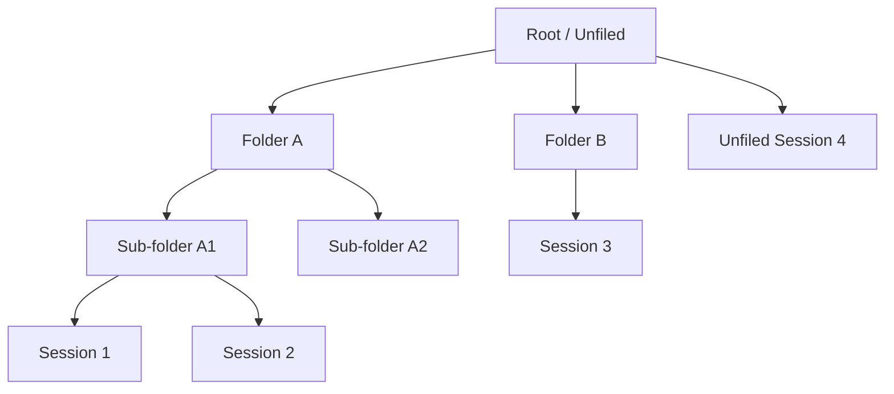

# Folders

**Version:** 1.0.0
**Status:** Stable
**Layer:** concept

## Overview

A personal organisation layer that lets users group chat sessions into named, hierarchical folders. Folders are cosmetic containers — they do not affect session behaviour, access control, or retention. They exist purely to help users navigate and curate their session history. A folder holds sessions; a session belongs to at most one folder at a time (or to none, which is the "root" / unfiled state).

## Related Specifications

- [l2-agent-session.md](l2-agent-session.md) - Sessions are the items organised by folders.
- [l1-workspace-lifecycle.md](l1-workspace-lifecycle.md) - Workspaces are the home/project context; folders organise sessions within a workspace.
- [l1-navigation-model.md](l1-navigation-model.md) - Chat tab in the sidebar renders the folder tree alongside sessions.

## 1. Motivation

A long-running user accumulates hundreds of sessions. Without folders, the session list becomes a flat stream ordered only by recency. Folders let users structure their session history by project, topic, or any personal taxonomy — making it easy to return to previous work without scrolling.

## 2. Constraints & Assumptions

- Folders are strictly personal; they are never shared with other users. A shared folder concept (like a shared workspace) is out of scope.
- Folders organise sessions, not knowledge collections, notes, or other resources. Those subsystems have their own organisation primitives.
- Moving a session to a different folder is always safe and non-destructive.
- Folders support at least one level of nesting (sub-folders); deep recursion beyond two or three levels is optional.

## 3. Core Invariants

Rules every Layer 2 implementation MUST NOT violate:

- **FLD-1 (Personal scope):** a folder belongs to exactly one user; no folder is visible to or shared with another user.
- **FLD-2 (Session ↔ folder cardinality):** a session belongs to at most one folder at a time; moving a session removes it from its current folder and places it in the new one.
- **FLD-3 (Non-destructive delete):** deleting a folder does NOT delete its sessions; sessions are moved to the root (unfiled) state before or atomically with folder deletion.
- **FLD-4 (Shallow hierarchy):** at minimum, one level of nesting (a folder may contain sub-folders) is supported. Maximum nesting depth is implementation-defined but must be at least 2.
- **FLD-5 (Sortable):** folders and the sessions within them may be reordered by user-defined position; a default sort order (creation time or last-used time) applies when no user order is set.
- **FLD-6 (Name uniqueness at level):** folder names must be unique among siblings (same parent). Two top-level folders cannot share a name; two sub-folders of the same parent cannot share a name. Cross-branch name collisions are allowed.

> L2 specs cannot reach RFC status until all invariants here are addressed in their "Invariant Compliance" section.

## 4. Detailed Design

### 4.1 Folder Record

```text
Folder {
  id         : FolderId
  user_id    : UserId
  parent_id  : FolderId?      // null = top-level folder
  name       : string
  position   : f32            // fractional indexing for drag-and-drop order
  created_at : Timestamp
  updated_at : Timestamp
}
```

### 4.2 Session–Folder Relationship

The session record carries an optional `folder_id` field (or a separate join table). Unfiled sessions have `folder_id = null`.

```text
Session.folder_id : FolderId?   // null = unfiled (root)
```

### 4.3 Folder Tree Rendering



### 4.4 Operations

| Operation | Behaviour |
|---|---|
| Create folder | Add a new folder at given parent (or root). |
| Rename folder | Update name; validate uniqueness among siblings. |
| Move folder | Change parent; validate no circular nesting. |
| Delete folder | Move all child sessions to root; delete sub-folders recursively (first moving their sessions). |
| Move session | Set `folder_id` on the session to the target folder. |
| Unfiled session | Set `folder_id = null`. |

## 5. Implementation Notes

1. Use fractional indexing (e.g., float position values with gap management) for user-defined sort order to allow O(1) reorder without renumbering all rows.
2. Validate FLD-6 (sibling uniqueness) in the database with a partial unique index on `(user_id, parent_id, name)`.
3. The max nesting depth check can be enforced at the application layer (count ancestors up to N before allowing a create).

## 7. Drawbacks & Alternatives

- **Tag-based organisation:** tags on sessions instead of folders allow multi-grouping (a session under multiple tags). Folders are simpler to navigate but are mutually exclusive by design. The two can coexist — tags are already supported in the session model separately.
- **No sub-folders (flat):** simpler implementation but limits expressiveness for users with large session libraries.

## Canonical References

| Alias | Path | Purpose |
|---|---|---|
| `[SESSION]` | `.design/main/specifications/l2-agent-session.md` | Session record that carries the folder_id field. |
