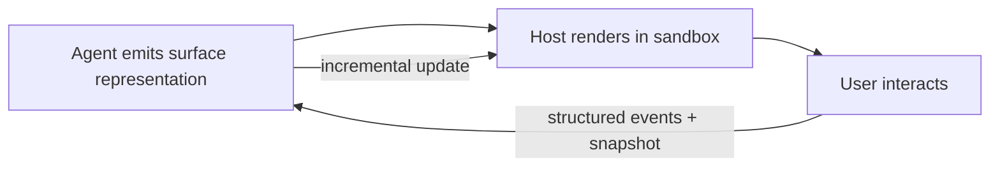

# Generative Surface

**Version:** 1.0.0
**Status:** Stable
**Layer:** concept

## Overview

An interactive visual surface the agent renders as a turn output — a chart, a form, a document preview, a small interactive tool — distinct from chat text and from the product's own fixed screens. The agent generates the surface's content, the host renders it in a confined sandbox, the user interacts with it, and the agent *perceives both the rendered result and the user's interactions* — a two-way loop, not fire-and-forget. It generalizes the automation canvas (one specific, engine-backed agent surface) to arbitrary agent-authored interactive artifacts, while staying a derived projection that never becomes a source of truth.

## Related Specifications

- [l1-automation-canvas.md](l1-automation-canvas.md) - A specific, engine-projection agent surface; this concept is the general agent-rendered-surface contract it is one instance of.
- [l1-office-visualization.md](l1-office-visualization.md) - OVZ projection-not-source / observational-with-interaction pattern this concept reuses.
- [l2-app-ui.md](l2-app-ui.md) - The host application that renders surfaces across frontends.
- [l1-execution-sandbox.md](l1-execution-sandbox.md) - Agent-generated surface content is untrusted and rendered confined.
- [l1-output-contracts.md](l1-output-contracts.md) - A surface is a bounded, structured output; its underlying data follows the output contract.
- [l1-architecture.md](l1-architecture.md) - INV-3 frontend interchangeability; the surface's portable representation degrades across frontends.

## 1. Motivation

Some answers are not text. A comparison wants a table the user can sort; a configuration wants a form; a dataset wants a chart; a generated document wants a live preview the user can tweak. Forcing every response through a chat transcript loses that — the user re-types data into a spreadsheet, or squints at ASCII tables, or cannot manipulate what the agent produced.

Letting the agent render an interactive surface closes that gap, but only if it is safe and useful: the content the agent generates is untrusted, so it must render confined (no host access, no exfiltration); a one-way render is half a feature, so the agent must *perceive* the surface and the user's interactions to react to them; the user — not the agent — must stay in control of attention; and the surface must remain a derived view, never the authoritative copy of its data. Those four constraints are what separate a useful generative surface from an attack surface or a gimmick.

## 2. Constraints & Assumptions

- A surface is a *response artifact*, not a new product screen; the product's fixed UI (dashboard, office view, navigation) is owned by the UI specs, not generated per turn.
- Surface content is generated by the model and therefore untrusted; it never gains ambient host, workspace, or secret access.
- A surface is a projection of data the agent already holds; it does not become a new source of truth.
- The concrete rendering technology is an implementation choice; this concept constrains the contract (sandboxed, perceivable, user-controlled, portable, bounded, recoverable, lifecycle).

## 3. Core Invariants

Rules every Layer 2 implementation MUST NOT violate:

- **GS-1 (Agent-authored response artifact):** the agent MAY emit an interactive visual surface as a turn output, distinct from chat text and from the product's fixed screens. It is one response among others, never a hijack of the whole interface.
- **GS-2 (Sandboxed rendering):** agent-generated surface content is untrusted and rendered in a confinement that grants no ambient access to the host, the workspace filesystem, the network, or secrets (composes with the execution-sandbox model). A generated surface cannot exfiltrate or invoke privileged capability except through the same gated, audited channels any tool call uses.
- **GS-3 (Closed perception loop):** rendering is two-way. The agent can perceive the rendered surface (a snapshot/serialized view) and the user's structured interactions with it (events), so it can react to what the user does — a surface is never fire-and-forget output the agent is blind to.
- **GS-4 (User control):** the user controls, edits, and dismisses the surface; the agent MUST NOT seize attention, block input, or prevent dismissal. The surface is observational-with-interaction, not a mandatory modal (consistent with OVZ-4).
- **GS-5 (Portable, degradable representation):** the surface is described by a declared, portable representation (a UI/data contract), so it renders consistently across the product's interchangeable frontends and degrades gracefully to a text or structured fallback where rich rendering is unavailable (consistent with INV-3).
- **GS-6 (Projection, not source):** a surface is a derived view of data the agent holds; it MUST NOT be the authoritative copy. Edits made on the surface flow back as explicit changes to the underlying data, never as a hidden second source (consistent with OVZ-1).
- **GS-7 (Bounded generation):** surface size and complexity are bounded so generation stays cheap and rendering stays safe; oversized surfaces are truncated or paginated with the limit made explicit (consistent with output-contract size-bounding).
- **GS-8 (Lifecycle & inspectability):** a surface has an explicit lifecycle — create → update (incremental) → dismiss (releases resources). Its source representation is inspectable by the user, and the underlying data is recoverable; a rendered surface is never the only copy of what it shows.

> L2 specs cannot reach RFC status until all invariants here are addressed in their "Invariant Compliance" section.

## 4. Detailed Design

### 4.1 The Render-and-Perceive Loop



The loop (GS-3) is what distinguishes a generative surface from a static artifact: the agent both produces the surface and consumes the user's interaction with it, updating incrementally.

### 4.2 Surface Representation

```text
[REFERENCE]
Surface {
  id          : SurfaceId
  representation : portable UI/data contract   // GS-5 (declarative; renders across frontends)
  data_ref    : ref                            // GS-6 projection of held data, not a copy-of-record
  bounds      : { max_nodes, max_bytes }       // GS-7
  lifecycle   : "open" | "updated" | "dismissed"
}
perceive(surface) -> { snapshot, interaction_events }   // GS-3
```

### 4.3 Confinement & Capability

Rendered content runs sandboxed (GS-2): it has no implicit host access. Any action the surface needs to take (run a tool, read data) is routed through the same authorization and audit path a discrete tool call uses — the surface is not a privilege escape hatch, exactly as code-execution is not (CE-3 parity).

### 4.4 Relation to the Automation Canvas

The automation canvas is one concrete generative surface: an interactive flow-graph projection of the pipeline engine. This concept is the general contract it satisfies — automation canvas adds engine-specific semantics on top of GS-1…GS-8; other surfaces (a chart, a form, a document preview) reuse the same contract without inventing a parallel one.

## 5. Drawbacks & Alternatives

- **Attack surface from generated content:** untrusted model output rendered in a UI is a real risk; mitigated by GS-2 (sandbox, no ambient access) and GS-4 (user control). The safe default is a confined renderer with no host bridge except gated tool calls.
- **Complexity of the perception loop:** GS-3 two-way rendering is more to build than one-way output; justified because one-way artifacts cannot support the manipulate-and-react interactions that make a surface worth more than a screenshot.
- **Alternative — text/markdown only:** rejected for content that is inherently interactive (sortable tables, forms, charts); markdown loses the interaction and forces the user to rebuild it elsewhere.
- **Alternative — let the agent drive the product's real UI:** rejected; that violates GS-1 (a response artifact, not a product screen) and GS-4 (user control), and couples agent output to a specific frontend instead of a portable representation (GS-5).

## Canonical References

| Alias | Path | Purpose |
| --- | --- | --- |
| `[CANVAS]` | `.design/main/specifications/l1-automation-canvas.md` | The concrete engine-backed surface this concept generalizes. |
| `[APP-UI]` | `.design/main/specifications/l2-app-ui.md` | Host that renders surfaces across frontends. |
| `[SANDBOX]` | `.design/main/specifications/l1-execution-sandbox.md` | Confinement model for untrusted generated content. |

## Document History

| Version | Date | Author | Notes |
| --- | --- | --- | --- |
| 1.0.0 | 2026-06-26 | Core Team | Initial spec — generative surface: agent-rendered interactive artifacts as a response output, sandboxed rendering, closed agent-perception loop, user control, portable degradable representation, projection-not-source, bounded generation, explicit lifecycle (GS-1…GS-8); generalizes the automation canvas. |
