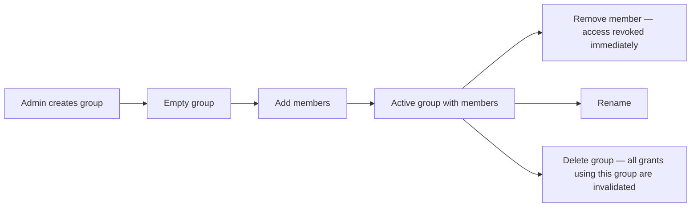

# User Groups

**Version:** 1.0.0
**Status:** Stable
**Layer:** concept

## Overview

Named collections of users that act as a single principal in the resource-sharing model. Instead of granting access to a dozen individual users one by one, an admin creates a group, populates it, and grants the group access once. All group members inherit that access; adding or removing a member adjusts their access immediately without touching any resource's grant list. Groups are flat, admin-managed, and their scope is organisation-wide.

## Related Specifications

- [l1-resource-sharing.md](l1-resource-sharing.md) - Group is a principal type in the resource-sharing model; group access is resolved through this model.
- [l2-multi-user-auth.md](l2-multi-user-auth.md) - User identities, admin/user privilege levels, and authentication.

## 1. Motivation

Fine-grained access control at the user level becomes unwieldy once the user base grows. A team of five working on the same knowledge collection needs a way to share it in one step, not five. Groups give admins a coarse-grained batching mechanism: define the team once as a group, grant the group access to shared resources, and membership changes automatically propagate.

## 2. Constraints & Assumptions

- Groups do not define capabilities or permissions beyond acting as a principal in the resource-sharing model. They carry no autonomy, budget, or agent semantics.
- Groups are flat; they cannot contain other groups. Nested RBAC is out of scope.
- Group management is an admin-level operation; ordinary users can see what groups they belong to but cannot create groups or change membership.
- A user without group membership is equivalent to a group member of the empty set — no group-derived access.

## 3. Core Invariants

Rules every Layer 2 implementation MUST NOT violate:

- **GRP-1 (Flat membership):** a group is a named set of user IDs; groups cannot contain other groups; membership depth is always exactly one.
- **GRP-2 (Admin-only management):** only users with admin privilege may create, rename, delete groups, or change membership.
- **GRP-3 (Additive access):** group membership adds access to all resources where the group holds a grant; removing a user from a group revokes only that group's derived access, leaving any user-direct grants untouched (consistent with RS-6).
- **GRP-4 (Principal in sharing model):** a group acts as a first-class principal in the resource-sharing model alongside individual users and the public wildcard.
- **GRP-5 (Visible to member):** a user can query the groups they belong to; they cannot enumerate all groups unless they have admin privilege.
- **GRP-6 (Audit trail):** group creation, deletion, and all membership changes are append-only audit events.

> L2 specs cannot reach RFC status until all invariants here are addressed in their "Invariant Compliance" section.

## 4. Detailed Design

### 4.1 Group Record

```text
Group {
  id          : GroupId
  name        : string          // unique within the system
  description : string?
  created_by  : UserId
  created_at  : Timestamp
  updated_at  : Timestamp
}

GroupMember {
  group_id    : GroupId
  user_id     : UserId
  added_by    : UserId
  added_at    : Timestamp
}
```

### 4.2 Access Resolution with Groups

When the resource-sharing model evaluates `GRP-4`:

1. For each grant on the target resource where `principal_type = "group"`:
2. Check if the requesting user is a member of that group (query `GroupMember` by `group_id + user_id`).
3. If yes → the user inherits the grant's permission level.

Group membership lookup should be cached per session/request to avoid N+1 queries; the cache must be invalidated on any membership change for the affected user.

### 4.3 Lifecycle



On group deletion: all access grants referencing the deleted `group_id` must be removed or invalidated atomically.

## 5. Implementation Notes

1. Store group membership in a join table indexed by both `group_id` and `user_id` for efficient bi-directional lookup.
2. When a group is deleted, cascade-delete (or mark invalid) all `access_grant` rows where `principal_type = "group"` and `principal_id = deleted_group_id`.
3. Group names should be unique and human-readable (e.g., `engineering`, `docs-team`); impose a naming convention (lowercase, hyphens) to avoid confusion.

## 7. Drawbacks & Alternatives

- **Role-based groups (RBAC roles):** RBAC roles carry semantic meaning (e.g., "editor" vs "viewer") and are typically pre-defined. The group model here is purpose-neutral — groups are just named user sets; the meaning of access is carried by the resource grant, not the group name. This is more flexible for user-generated resources.

## Canonical References

| Alias | Path | Purpose |
| --- | --- | --- |
| `[AUTH]` | `.design/main/specifications/l2-multi-user-auth.md` | User identity and privilege level used in GRP-2. |
| `[SHARING]` | `.design/main/specifications/l1-resource-sharing.md` | Group as principal type in the grant model. |
