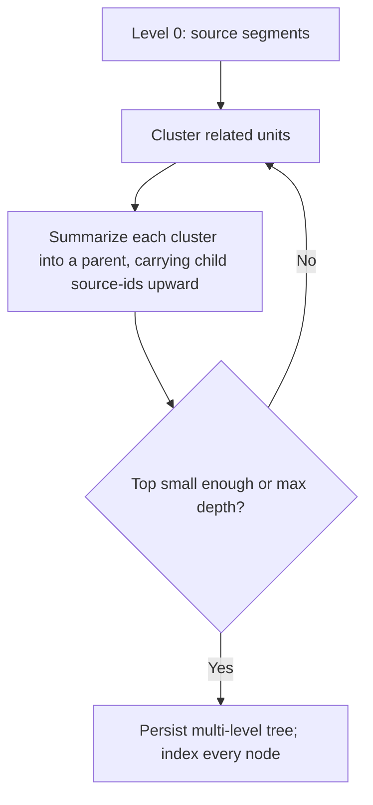

# Hierarchical Summarization

**Version:** 1.0.0
**Status:** Stable
**Layer:** concept

## Overview

Organizing a corpus into a tree of increasingly abstract summaries so retrieval can operate at multiple resolutions. A flat index holds exactly one level of detail — the source segment — and therefore answers detail questions well and gestalt questions poorly: "what does this collection say, overall?" has no chunk to match. Hierarchical summarization builds, above the leaf segments, layer upon layer of summaries: related units are clustered and each cluster is summarized into a parent; parents are clustered and summarized again; and so on until a small top remains. Every summary is retrievable in its own right, tagged with its abstraction level and carrying a provenance trail back to the exact leaves it covers. The tree is a persistent, opt-in retrieval index — distinct from compressing the live context window and from processing an over-window input once — that lets a query enter at the resolution its question needs.

## Related Specifications

- [l1-knowledge-base.md](l1-knowledge-base.md) - The summary tree is an optional representation of a collection (KB-14) and a recall channel in fused retrieval (KB-15).
- [l1-content-segmentation.md](l1-content-segmentation.md) - Segments are the leaves the tree is built over.
- [l1-knowledge-graph.md](l1-knowledge-graph.md) - Community reports are hierarchical summaries applied to graph communities (KG-5).
- [l1-recursive-decomposition.md](l1-recursive-decomposition.md) - Shares the bounded-recursion machinery; that concept processes an over-window input once, this one builds a persistent index.
- [l1-context-compression.md](l1-context-compression.md) - Distinct: compression relieves live context-window budget pressure; this builds a durable multi-resolution retrieval index.
- [l1-claim-verification.md](l1-claim-verification.md) - A summary grounds an answer only as a faithful, verifiable reduction of its sources.
- [l1-data-lineage.md](l1-data-lineage.md) - Summary → source-leaf coverage is the tree's lineage.

## 1. Motivation

Retrieval granularity should match question granularity, but a flat index offers only one granularity. Ask a broad question and you get a scattering of narrow chunks that no reader can assemble into the big picture; the answer that would have been one paragraph of synthesis is instead absent because no chunk contains it. Building a summary tree solves this by *pre-computing* synthesis at every scale: near the leaves, fine detail; near the root, the corpus gestalt; in between, section- and theme-level overviews. Because summaries are indexed as first-class retrievable units, a broad query matches a high-level summary directly, and a narrow query still matches a leaf. And because each summary records the leaves it covers, an abstract answer remains fully citable — the reader can drill from the one-line theme down to the pages that support it.

## 2. Constraints & Assumptions

- The tree is an opt-in enrichment over the mandatory flat index; a collection is fully usable without it.
- A summary is lossy and non-authoritative; the source leaves it reduces remain available and are the ground for verification.
- Construction is a bounded, terminating recursion — never an open-ended loop — and is observable with cost accounted.
- Clustering and summarization run on host-supplied models, on-device by default; construction performs no egress unless the host authorizes it.

## 3. Core Invariants

Rules every Layer 2 implementation MUST NOT violate:

- **HS-1 (Multi-resolution abstraction index):** the corpus (segments, or graph communities) is organized into a tree where leaves are source units and each parent summarizes its children, producing a persistent, multi-resolution retrieval index that answers both detail (near-leaf) and gestalt/global (near-root) questions a single-resolution index cannot.
- **HS-2 (Recursive cluster-then-summarize):** each level is built by grouping semantically-related units and summarizing each group into a parent; the parents become the next level's input, recursively, until the level collapses to a small top. Grouping is by semantic relatedness, not document order.
- **HS-3 (Bounded & terminating):** the recursion declares explicit bounds — a fan-out/cluster cap and a termination condition (top small enough, or a max depth) — and is finite by construction. A level that fails to shrink collapses to a single parent rather than looping forever; exceeding a bound is a fail-fast surfaced error, never a silent blow-up.
- **HS-4 (Provenance carried to the root):** every summary node records the exact set of source leaves it covers — the order-preserving union of its children's source sets — so any summary, however abstract, traces back to its originating segments for citation. A summary that cannot name its source leaves is invalid.
- **HS-5 (Retrievable peers, level-tagged):** summary nodes are indexed alongside the leaves and are directly retrievable; each carries its abstraction level so a consumer can prefer detail or overview, and a retrieved summary is always distinguishable from a source leaf — a summary is never passed off as a primary source.
- **HS-6 (Faithful, non-authoritative reduction):** a summary faithfully reduces its children and asserts nothing beyond them; it is evidence derived from sources, subject to claim verification, and it is a lossy view whose source leaves remain available and are never replaced by it.
- **HS-7 (Deterministic given policy):** for a given input set, clustering/summarization policy, and fixed seeds, the tree is reproducible (same input → same structure), so the index is rebuildable and each summary is attributable to the same leaves (composing deterministic slicing). Where the summarizer is stochastic, that is recorded as the source of any variation.
- **HS-8 (Host-supplied, local-first, opt-in):** clustering and summarization run on host-supplied model seams, on-device by default, with no egress unless the host authorizes it; the summary index is an opt-in layer over flat retrieval — absent the capability the corpus is still fully usable — and its construction is bounded, observable, and cost-rolled-up.

> L2 specs cannot reach RFC status until all invariants here are addressed in their "Invariant Compliance" section.

## 4. Detailed Design

### 4.1 Summary Node Shape

```text
SummaryNode {
  id          : NodeId
  level       : int             // HS-5: 0 = leaf, higher = more abstract
  text        : string          // the summary (or the source text at level 0)
  embedding   : vector          // indexed as a retrievable peer (HS-5)
  children    : NodeId[]         // empty at leaves
  source_ids  : LeafId[]         // HS-4: order-preserving union of covered leaves
}
```

### 4.2 Bottom-Up Construction



Termination is guaranteed: each level must strictly shrink its input; if clustering degenerates and fails to reduce the count, the level collapses into a single parent (HS-3), so the recursion cannot spin.

### 4.3 Provenance Roll-Up

The tree's defining property is that abstraction never severs citation. A parent's `source_ids` is the deduplicated, order-preserving union of its children's `source_ids`; applied bottom-up, every internal node — up to the root — knows the complete leaf set beneath it. A one-line root summary of a thousand-document corpus can therefore still answer "which sources support this?" by naming its covered leaves, and a reader can descend the tree from theme to section to page. This is the lineage discipline applied to a summarization tree.

### 4.4 Multi-Resolution Retrieval

Because summaries are retrievable peers tagged by level (HS-5), a query naturally matches the resolution it needs: a broad query has high similarity to a high-level summary; a specific query matches a leaf. A retrieval policy may prefer a level, blend levels, or start high and drill down. In every case the returned node carries its level (so the reader knows the abstraction) and its `source_ids` (so the answer stays grounded), and summary hits are one channel of the knowledge base's fused retrieval (KB-15).

## 5. Nodus Realization

The tree is the upward-aggregation dual of bounded recursive decomposition, expressed with primitives the workflow language already has: a bounded `~UNTIL MAX` loop wrapping a cluster step and a per-cluster summarize map, terminating on a small top or depth bound. Each summarize is a provenance-tracked model call, and the child→parent source-id union is the language's per-item derivation lineage carried up the tree. No new language construct is required — the reference validates that the existing recursive, looping, and lineage primitives suffice to build a multi-resolution index; the clustering and summarizing models are host-supplied provider seams.

## 6. Drawbacks & Alternatives

- **Flat index only:** cheapest, but offers a single resolution and cannot answer gestalt questions. The tree is opt-in so the flat case pays nothing.
- **Whole-corpus single summary:** one summary loses all mid-level structure and cannot serve section-scale questions; a multi-level tree preserves every scale.
- **Summarize in document order (no clustering):** cheaper grouping but mixes unrelated content into a parent, degrading summary coherence; semantic clustering (HS-2) is the quality-preserving choice.

## Canonical References

| Alias | Path | Purpose |
| --- | --- | --- |
| `[KB]` | `.design/main/specifications/l1-knowledge-base.md` | Owner of the collection; defines the fused retrieval the tree feeds (KB-14/KB-15). |
| `[SEG]` | `.design/main/specifications/l1-content-segmentation.md` | Supplies the leaf units the tree is built over. |
| `[STORE]` | `.design/main/specifications/l2-knowledge-store.md` | Concrete store that will persist and index the tree. |

## Document History

| Version | Date | Author | Notes |
| --- | --- | --- | --- |
| 1.0.0 | 2026-07-22 | Core Team | Initial spec — hierarchical multi-resolution summarization as a persistent retrieval index: recursive cluster-then-summarize, bounded/terminating construction, provenance carried to the root, level-tagged retrievable summary peers, faithful non-authoritative reduction, deterministic-given-policy, host-supplied local-first opt-in (HS-1…HS-8). Distinct from context-compression (window economy) and recursive-decomposition (one-shot over-window processing). Mined from a studied retrieval/document-intelligence engine's recursive-abstractive summarization and graph community-report subsystems; enables gestalt/global answers flat retrieval cannot. Concept-only. |
