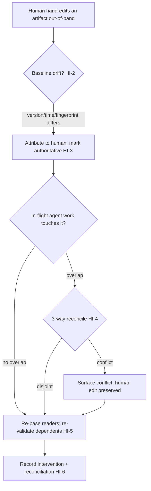

# Human Intervention & Reconciliation

**Version:** 1.0.0
**Status:** Stable
**Layer:** concept

## Overview

The contract for the human stepping *directly into* the office's autonomous work — not
by redirecting a live turn (that is coordination steering, ORC-12/ACP-10), but by
**editing or adding a work artifact by hand, out-of-band**: opening a task, a kanban
card, a plan, a specification, or a document and changing it while agents are running,
without going through the agent's proposal/delta pipeline. Such a hand-edit is a
supported, first-class capability, and it creates a specific hazard: the running work
now believes an artifact says one thing while the human has made it say another. This
concept makes that safe. The system **detects** the out-of-band mutation by comparing
its last-known baseline (version / timestamp / content fingerprint) against the
artifact's current state, **attributes** it to the human and treats the human's edit as
**authoritative intent** (never a conflict an agent may overrule or silently clobber),
**reconciles** in-flight agent work onto the new state, **re-validates** the dependents
the change touched, and **pauses or re-bases** autonomous work the change invalidated —
all with the least disruption and a full audit trail. It is the "the human took the
wheel on this artifact" contract.

## Related Specifications

- [l1-change-merge.md](l1-change-merge.md) — the merge *mechanics* HI-4 composes: base fingerprinting (CM-3), divergence-blocked integration (CM-4), three-way reconciliation (CM-5). Change-merge assumes a change arrives as a reviewable delta with a recorded base; this spec adds the human **hand-edit with no delta** as the first-class event that *moves* the base CM-4 blocks against.
- [l1-orchestration.md](l1-orchestration.md) — ORC-12 intervenable coordination is the *steer-the-live-turn* channel; this is the complementary *edit-the-artifact* channel. Both make the office intervenable; neither subsumes the other.
- [l1-security.md](l1-security.md) — SEC-10 human-principal-write-only authority; HI-3 (the human's edit is authoritative, an agent never overrules it) is that authority applied to work artifacts, not only the control plane.
- [l1-task-graph-model.md](l1-task-graph-model.md) — TG dependency graph + re-plan; HI-5 re-validates the dependents a human edit touched through it.
- [l1-work-liveness.md](l1-work-liveness.md) — WL ownership/recovery; HI-5 pauses or re-bases in-flight work the intervention invalidated through WL's owned-work discipline, not by killing it.
- [l1-intent-resolution.md](l1-intent-resolution.md) — IR-7 (a human correction re-plans dependents); a direct hand-edit is the strongest, most explicit form of correction — this spec is what makes it reconcilable rather than lost.
- [l1-storage-model.md](l1-storage-model.md) — STO-9 versioned state + timestamped pre-write backups is the version/timestamp baseline HI-2 compares against, and the safety net if a reconciliation must be undone.
- [l1-operational-ledger.md](l1-operational-ledger.md) — the provenance/audit record HI-6 writes the intervention and its reconciliation into.
- [l1-kanban-model.md](l1-kanban-model.md) / [l1-work-convergence.md](l1-work-convergence.md) — the board/cards a human most often hand-edits; a manual card move/edit is an HI event that converges through the same board of record.

## 1. Motivation

Autonomy is the office's value, but the human must never be locked out of their own
work. In practice a human *will* reach in and change things directly — bump a task's
priority, rewrite an acceptance criterion, add a card the agents did not plan, fix a
wrong line in a document an agent is mid-way through, move a card to a different column.
They do it out-of-band because that is the fastest, most natural way to express intent —
not by dictating a delta through a pipeline.

The danger is silent and specific. An agent picked up a task, read it, and is acting on
what it read. The human, meanwhile, edited that task. Now the agent finishes and writes
back its result — computed from the *stale* version — silently overwriting the human's
edit. The human's change vanishes with no error; worse, the agent may keep executing a
plan whose premise the human just changed, producing a confidently-wrong result against
an intent that no longer holds. The office looks like it is working; it is corrupting
the human's own contribution.

The existing pieces almost cover it but do not close it. Concurrent-change-merge
reconciles *deltas authored against a base* — but a human hand-edit is not a delta; it
is a direct mutation with no recorded base, so nothing in that machinery is triggered by
it. Coordination steering lets the human redirect a live *turn* — but not edit a *task*.
Authority rules say the human writes the control plane — but not what happens when they
write the *work*. What is missing is the contract that says: a human's out-of-band edit
is a detected, attributed, authoritative event that re-bases the autonomous work around
it, never the other way around.

## 2. Constraints & Assumptions

- This concept governs the human editing **work artifacts** out-of-band (tasks, cards, plans, specs, documents). Redirecting an in-flight turn/coordination is ORC-12/ACP-10; changing the authority/permission plane is SEC-10 — distinct channels this composes with, never duplicates.
- Detection rests on the system holding a **baseline** for each artifact an agent is working against — a recorded version, timestamp, and/or content fingerprint — captured when the agent last read/wrote it. Drift is an objective comparison against that baseline, never a guess that "nothing changed."
- The human's edit is **authoritative intent**: on any collision the human's version is the one preserved; the agent's stale or divergent work is re-based or surfaced, never allowed to win silently.
- Reconciliation is **incremental**: it touches only the work the change actually affects. A hand-edit to one task is not a reason to discard unrelated in-flight work or cold-restart the office.
- The mechanism is presentation-neutral and applies wherever a human can edit a shared artifact — across the product's frontends and the underlying store.

## 3. Core Invariants

Rules every Layer 2 realization MUST NOT violate. They are technology-neutral.

- **HI-1 (Out-of-band intervention is a first-class, always-available action):** the human MAY, at any time, act directly on a shared work artifact — edit or add a task, card, plan, specification, or document — *without* going through the agent's proposal/delta pipeline. This is a supported capability the system anticipates and handles, never an exception it may refuse, ignore, or lose. The office is intervenable by editing, not only by instructing.

- **HI-2 (Out-of-band mutation is detected by baseline comparison, never assumed away):** the system detects that an artifact changed *without a corresponding agent action* — an unattributed mutation — by comparing the agent's last-known **baseline** (recorded version / timestamp / content fingerprint) against the artifact's current state. Drift between what the running work believes an artifact says and what it now actually says MUST be detected **before** the agent acts on the stale belief — never discovered after the agent has already overwritten the human's change. Detection is an objective version/time/fingerprint comparison, not an assumption of stability.

- **HI-3 (Human authorship attributed; the human edit is authoritative):** a detected out-of-band mutation is attributed to the human principal (provenance: human, not agent) and treated as **authoritative intent** — a steering signal expressing what the human wants, not a conflict an agent may overrule. In-flight autonomous work is re-based onto the human's new state; a human's hand-edit is never silently reverted, clobbered, or "corrected" back by an agent's stale or divergent version. (SEC-10 human-principal authority, applied to the work itself.)

- **HI-4 (Reconcile, never clobber — collisions surfaced, both sides preserved):** where a human's out-of-band edit and an agent's in-flight change touch the same unit, the system **reconciles** rather than overwrites: non-overlapping edits merge (composing the concurrent-change three-way merge), and a genuine overlap is surfaced as a conflict for resolution with the human's edit preserved as one side — never resolved by silently dropping either. No agent write proceeds against a baseline the human moved (HI-2) without first reconciling; silent replacement of human-changed content is prohibited (composes change-merge CM-4/CM-5).

- **HI-5 (Dependents re-validated; invalidated work paused or re-based, not run to a wrong result):** a human intervention that changes an artifact's meaning or state re-validates the work that depends on it — a hand-edited task re-checks its downstream task-graph dependents (composing the TG re-plan), and in-flight autonomous work the intervention has invalidated is **paused or re-based** (composing work-liveness ownership) rather than allowed to run to a now-wrong result. The office does not keep executing a plan the human just changed out from under it. Reconciliation is incremental — it adjusts only the affected work, never a blanket restart.

- **HI-6 (Intervention is observable, attributed, and auditable):** every human intervention is recorded as a first-class event in the office's trace — what changed, when, by the human, and what reconciliation it triggered — so the intervention is auditable, its effect on autonomous work is legible, and a later reader can distinguish human-authored state from agent-authored state. A reconciliation that discarded or re-based work names what it touched; the intervention is never an invisible mutation of the record.

> L2 specs cannot reach RFC status until all invariants here are addressed in their "Invariant Compliance" section.

## 4. Detailed Design

### 4.1 The intervention lifecycle



### 4.2 Baseline drift detection (HI-2)

```text
[REFERENCE]
# an agent records a baseline when it reads/claims an artifact to work on
baseline[artifact] := { version, modified_at, fingerprint := hash(content) }

# before the agent writes back (or before it acts on what it read):
current := read(artifact)
if current.version != baseline.version
   or current.modified_at > baseline.modified_at
   or hash(current.content) != baseline.fingerprint:
       INTERVENED → attribute(current, human), reconcile()      # HI-3/HI-4 — do NOT write stale
else:
       safe_to_apply()                                          # no drift, common case, no ceremony
```

Any one of the three signals differing is drift; all three matching is the fast,
no-ceremony common case. Fingerprint catches an edit that preserved the timestamp;
version/timestamp catch a same-content re-save that the office must still treat as a
human touch.

### 4.3 Authority and no-clobber (HI-3, HI-4)

The reconciliation is *asymmetric by principal*: the human's edit is the authoritative
side, the agent's stale work is the side that yields. A non-overlapping agent change
re-bases and proceeds; an overlapping one stops and surfaces a conflict with the human's
version intact. An agent MUST NOT resolve the conflict by preferring its own version —
that is the exact silent-clobber HI exists to prevent.

### 4.4 Re-validation and least disruption (HI-5)

A hand-edit ripples only as far as its dependents: the edited task's downstream
task-graph nodes are re-validated, in-flight work whose premise changed is paused or
re-based, and everything the edit did not touch keeps running. The intervention is
absorbed, not treated as a reason to tear down the board.

## nodus-relevance mapping

A workflow, plan, or macro authored in the workflow DSL is a structured artifact a human
may hand-edit out-of-band, so the same hazard applies at the DSL grain — but it needs
**no new language invariant** (LP-1/LP-2):

| Element | nodus seam | Note |
| --- | --- | --- |
| Baseline drift detection (HI-2) | host-recorded version/fingerprint of the workflow/plan file | The host holds the baseline and detects a hand-edit; core defines no versioning vocabulary. |
| Reconcile a hand-edited workflow (HI-4) | the change-merge nodus tooling candidate (fingerprint a step, block a stale edit, 3-way merge) | Already recorded as a nodus adoption candidate in change-merge §4.6; HI is the trigger. |
| Re-run affected steps only (HI-5) | re-execute the invalidated subgraph from a verified prior step, reusing the pinned-partial seam | An edited step re-plans its dependents; unaffected steps are not re-run. |
| Intervention audit (HI-6) | `AuditProvider` event over the run | The hand-edit + reconciliation ride the existing observability channel; no new event type. |

The host owns detection, authority, and reconciliation; core stays a pure evaluator over
whatever the (now human-edited) artifact says. A host that never surfaces a hand-edit
behaves exactly as today — so the mapping is additive and warrants no new NL invariant.

## 5. Drawbacks & Alternatives

- **Baseline bookkeeping cost.** Every worked artifact must carry a recorded baseline. Accepted: the check is a cheap equality on the common (no-drift) path (§4.2), and the cost it avoids — a silently-clobbered human edit and trust lost — is far larger. STO-9 versioned state already supplies most of the baseline.
- **False drift from benign re-serialization.** A formatting-only re-save can read as drift. Mitigated by fingerprinting a *canonical* serialization (as change-merge CM implementation-notes require) so meaning-preserving reformatting is not treated as a human change.
- **Alternative — forbid out-of-band edits; force all changes through the pipeline.** Rejected: it locks the human out of the fastest, most natural way to steer their own work and makes the office feel adversarial; HI-1 makes direct editing first-class precisely because humans will (and should) do it.
- **Alternative — last-write-wins.** Rejected: it is the silent-clobber failure itself, and it makes the source of truth a function of scheduling luck — the human's edit survives only if it happened to land last.
- **Alternative — fold into `l1-change-merge`.** Rejected: change-merge reconciles *deltas authored through the pipeline against a recorded base*; a human hand-edit has no delta and no author-recorded base, and it carries an *authority asymmetry* (human wins) plus a *re-plan/pause* obligation that change-merge does not model. HI owns the human-intervention lifecycle and *drives* change-merge for the merge step.
- **Alternative — treat it as coordination steering (ORC-12).** Rejected: steering redirects a live turn; it does not detect and reconcile a change to a stored artifact an agent is not currently mid-turn on. Different channel, complementary contract.

## Canonical References

| Alias | Path | Purpose |
| --- | --- | --- |
| `[CHANGE-MERGE]` | `.design/main/specifications/l1-change-merge.md` | The base-fingerprint + three-way reconciliation mechanics HI-4 composes (CM-3/CM-4/CM-5). |
| `[ORCH]` | `.design/main/specifications/l1-orchestration.md` | ORC-12 intervenable coordination — the complementary steer-the-turn channel. |
| `[SECURITY]` | `.design/main/specifications/l1-security.md` | SEC-10 human-principal authority HI-3 applies to work artifacts. |
| `[TASK-GRAPH]` | `.design/main/specifications/l1-task-graph-model.md` | The dependency re-plan HI-5 triggers on a human edit. |
| `[WORK-LIVENESS]` | `.design/main/specifications/l1-work-liveness.md` | The owned-work pause/re-base discipline HI-5 routes invalidated in-flight work through. |

## Document History

| Version | Date | Author | Notes |
| --- | --- | --- | --- |
| 1.0.0 | 2026-07-15 | Core Team | Initial spec — human out-of-band intervention & reconciliation: direct hand-edit of a work artifact (task/card/plan/spec/document) as a first-class always-available action bypassing the agent delta pipeline (HI-1); baseline-comparison drift detection by version/timestamp/content-fingerprint, detected before the agent acts on a stale belief, never assumed away (HI-2); human authorship attributed + the human edit treated as authoritative intent, never silently reverted/clobbered by stale agent work — SEC-10 authority applied to the work itself (HI-3); reconcile-never-clobber with three-way merge for disjoint edits and surfaced conflicts (human side preserved) for overlaps, composing change-merge CM-4/CM-5 (HI-4); dependents re-validated via the task-graph re-plan and invalidated in-flight work paused/re-based via work-liveness rather than run to a wrong result, incrementally not by restart (HI-5); intervention observable/attributed/auditable, human-authored vs agent-authored state distinguishable (HI-6); §4.1 intervention lifecycle, §4.2 baseline-drift pseudocode, §4.3 authority asymmetry, §4.4 least-disruption re-validation; nodus-relevance mapping needing no new NL invariant (host-recorded baseline + change-merge nodus tooling candidate + re-run-invalidated-subgraph + AuditProvider). Complements ORC-12/ACP-10 (steer the live turn) with the edit-the-artifact channel, and drives l1-change-merge for the merge step while owning the human-intervention lifecycle change-merge does not model (no-delta hand-edit, authority asymmetry, re-plan/pause obligation). |
