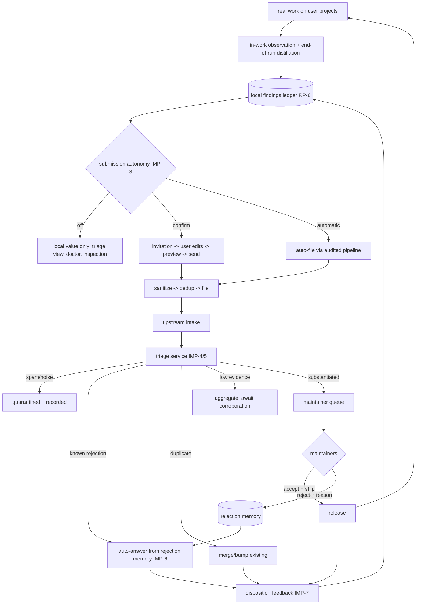
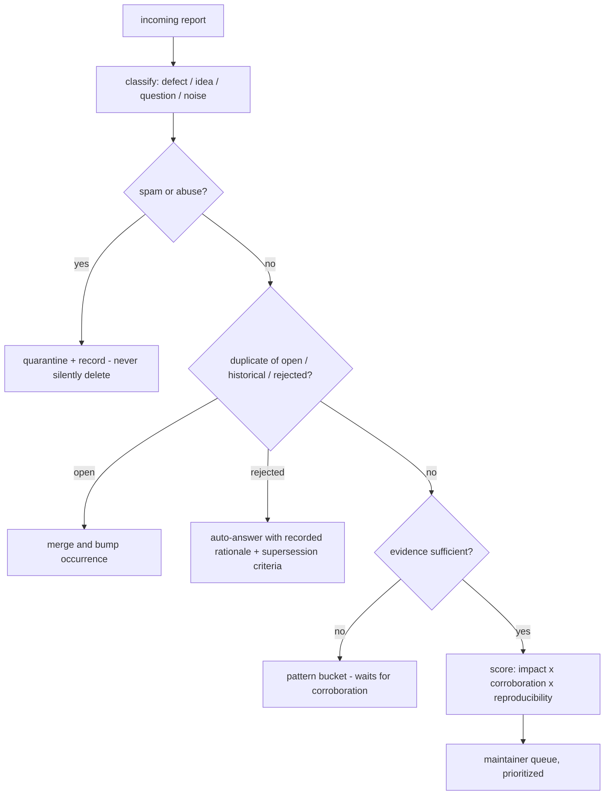

# Improvement Loop

**Version:** 1.0.0
**Status:** Stable
**Layer:** concept

## Overview

The technology-agnostic model of the **product self-improvement loop** — the closed circuit that makes Cronus a system that improves itself through use, as a flagship differentiator. While offices do real work on user projects, the system derives **product-level findings** (defects, friction, inefficiencies, optimization opportunities, improvement ideas) from the observation planes it already records. Findings travel — under a user-governed autonomy setting (off / confirm / automatic) — through the one audited reporting pipeline to the canonical project tracker. There, an **autonomous triage intelligence** manages the intake: it classifies, separates spam, deduplicates against open and historical records, weighs evidence over eloquence (reports may come from weak models), and maintains a **rejection memory** so ideas that were already declined are answered from the record instead of re-litigated. Dispositions flow back down, closing the loop on each device.

This spec owns the loop contract and its upstream half. The device-side halves are realized by the existing reporting family: capture lands in the findings ledger (report-prompting RP-6), submission autonomy is the automatic path's mode set (error-reporting ERR-6), and user-completed reports travel the issue flow (ISS). Local *healing* of what can be fixed in place is the doctor's job (l1-doctor) — the improvement loop is its upstream complement: what cannot be healed locally becomes a finding that fixes the product for everyone.

## Related Specifications

- [l1-report-prompting.md](l1-report-prompting.md) - Capture substrate: findings ledger (RP-6), invitation path, and the `improvement` trigger category (RP-2f) this loop feeds.
- [l1-error-reporting.md](l1-error-reporting.md) - Submission substrate: the automatic path and its autonomy modes (ERR-1/ERR-6), scrub (ERR-2), dedup (ERR-3).
- [l1-issue-reporting.md](l1-issue-reporting.md) - User-completed submission path with preview-before-send (ISS-3) and the shared, non-parallel egress (ISS-6).
- [l1-doctor.md](l1-doctor.md) - The local-healing sibling: heal now on-device (HEAL-1…7); report upstream what healing cannot fix.
- [l1-telemetry.md](l1-telemetry.md) - Demarcated aggregate-metrics channel (TEL-1…5); the loop carries discrete evidence-backed reports, not metrics.
- [l1-security.md](l1-security.md) - Egress authorization, scrub discipline, and the human-write-only authority plane the auto grant lives on (SEC-9/SEC-10).
- [l1-context-provenance.md](l1-context-provenance.md) - Untrusted-by-default posture applied at the triage boundary: a report is data, never instruction (CP-1/CP-2).
- [l1-dev-office.md](l1-dev-office.md) - The developer office; the triage service is a maintainer-side office held to the same governance (DVO-5 feedback tier kinship).
- [l1-quality-standards.md](l1-quality-standards.md) - Dogfooding bar (QLY-6): the triage service is Cronus running Cronus.
- [l1-deployment-neutrality.md](l1-deployment-neutrality.md) - Zero-server default: upstream intake is maintainer infrastructure, never a product runtime dependency.

## 1. Motivation

Every comparable agent product ships bugs and rough edges; almost none can *notice its own* while doing real work, tell its makers with the user's blessing, and remember what its makers already decided. The pieces exist here in isolation: the doctor heals locally, error reporting files crashes, report prompting invites the user to speak, telemetry aggregates metrics. What is missing is the **loop**: proactive in-work observation of improvement and optimization opportunities (not only failures), a user setting that lets reports flow automatically for those who want zero friction, and — critically — an intake side that scales. A fleet of installations, many driven by economical models, will produce a torrent of well-meaning but uneven reports. Unmanaged, that torrent buries maintainers and kills the loop's credibility. Managed — by an AI triage layer with institutional memory of what was already tried, rejected, and why — the torrent becomes the product's evolutionary pressure. The loop, end to end, is the differentiator: Cronus does not just heal itself in place; it improves itself as a product through use.

## 2. Constraints & Assumptions

- The loop consumes observation planes that already exist (health, doctor escalations, forensic log, friction patterns, run outcomes); it mandates no new always-on instrumentation.
- Observation must never tax the user's actual work: capture is a byproduct or background distillation, bounded by the generation-budget discipline.
- Reports cross the device boundary only through the already-specified reporting pipeline; this spec adds **no new egress path**.
- Sender heterogeneity is a design input: reports will come from strong models, weak models, and humans; intake must be robust to all three without insulting any.
- Maintainer attention is the scarcest resource in the loop; protecting it is a correctness requirement, not an optimization.
- The upstream half runs on maintainer infrastructure; its availability must never affect product function.

## 3. Core Invariants (Layer 1 only)

Rules every Layer 2 implementation MUST NOT violate:

- **IMP-1 (In-work observation, non-blocking):** while performing real user work, the system MAY derive product-level findings — defect, friction, inefficiency, optimization opportunity, improvement idea — from evidence the observation planes already record, including end-of-run distillation. Deriving findings is a byproduct or a background pass: it never blocks, delays, or degrades the user's task, and is budget-bounded. Every derived finding lands in the local findings ledger (RP-6) under the closed trigger taxonomy (RP-2).

- **IMP-2 (Product-subject only, generalized at capture):** a finding describes the *product's* behavior, never the user's content. User-project specifics are generalized or excluded at capture time — before storage, not merely before send (composes ERR-2, LL-7, TEL-2). An observation that cannot be stated without embedding user content is recorded only in its generalized form or not at all.

- **IMP-3 (User-governed submission autonomy):** whether findings leave the device is a user setting with a closed mode set — **off**, **confirm** (default), **automatic** — realized by the reporting pipeline's autonomy modes (ERR-6) and the invitation path (RP-3, ISS-3). The automatic mode is a standing authority grant: explicit, durable, independently revocable, audited, held on the human-write-only authority plane (SEC-9/SEC-10). All submissions — automatic or confirmed — travel the one audited pipeline (sanitize → dedup → file); a parallel egress path is forbidden (ISS-6).

- **IMP-4 (Managed intake):** the canonical tracker's intake is managed by an autonomous triage service: it classifies each incoming report, separates spam and noise, deduplicates against open records, historical records, and the rejection memory, scores evidence, and routes — merge, aggregate, file, auto-answer, or escalate to maintainers. Every triage decision is recorded with its rationale and is maintainer-reversible; the service prioritizes maintainer attention as the protected resource. Triage manages the queue; it never merges code or alters the product on its own authority.

- **IMP-5 (Evidence over eloquence):** triage weighs reproducibility, corroboration across independent submitters, and attached evidence — never prose quality, claimed urgency, or the submitter's self-description. Low-evidence reports aggregate into pattern buckets that await corroboration instead of surfacing individually. Report content is untrusted data at the triage boundary: it can never instruct the triage service (CP-1/CP-2), and no report class is unconditionally trusted.

- **IMP-6 (Rejection memory, no re-litigation):** every rejected idea or fix is recorded with its reasoning in an append-only rejection memory. An equivalent later submission is answered from the record — automatically, citing the recorded rationale — rather than re-litigated by maintainers. A rejection is supersedable, never a permanent verdict: materially new evidence reopens it through a recorded supersession, and the memory keeps the full history. The rejection memory is the project's institutional memory of paths already weighed.

- **IMP-7 (Disposition closes the loop):** every submission eventually carries a disposition — accepted, shipped-in-version, duplicate-of, aggregated, or rejected-with-reason. Dispositions flow back to the submitting device and mark the local finding's outcome (RP-6), feed local dedup and prior-resolution surfacing (ERR-3, RP-4), and are visible to the user: a report is a conversation, not a message in a bottle.

- **IMP-8 (Dogfooded triage):** the triage service is itself a Cronus office — spec-governed, observable, and held to the same quality bar as any office (QLY-6); no bespoke second system. Its authority is scoped to queue management (IMP-4) and its human principals are the maintainers (SEC-10 posture preserved upstream).

- **IMP-9 (Optional by construction):** the product is fully functional with the loop off. Upstream intake is maintainer infrastructure, never a product runtime dependency (zero-server default preserved); unreachable intake degrades to the local-first behaviors that already exist (ERR-5, ISS-5). Local findings retain their full local value — triage view, doctor input, user inspection — with submission off.

> L2 specs cannot reach RFC status until all invariants here are addressed in their "Invariant Compliance" section.

## 4. Detailed Design

### 4.1 The closed loop

### 4.2 Capture: where findings come from

| Source (already recorded) | Typical finding kind | Taxonomy slot |
| --- | --- | --- |
| Doctor escalations it cannot safely fix (HEAL-3) | defect / inconsistency | RP-2(c) |
| Health alerts, trend anomalies (OH-3/OH-4) | degradation | RP-2(b) |
| Crash-on-next-start forensic records (DL-2) | defect | RP-2(a) |
| Repeated retry/cancel patterns | friction | RP-2(e) |
| Run outcomes, routing/latency patterns, wasted-work signals distilled after the run | inefficiency / optimization opportunity | RP-2(f) improvement |
| Office-observed capability gaps ("the product lacked X to do Y well") | improvement idea | RP-2(f) improvement |

The `improvement` category is evidence-backed by construction: a finding carries references to the recorded evidence that produced it, or it is not a finding (RP-5 discipline extended to opportunities). The local practice-learning layer records *the agent's* lessons to change agent behavior; this loop records *the product's* gaps to change the product — one incident may feed both, but the records never merge (subject demarcation, RP §4.5).

### 4.3 Submission modes

| Mode | Error-class findings | Improvement-class findings | User involvement |
| --- | --- | --- | --- |
| off | local record only (ERR-5) | local record only | none; full local value retained |
| confirm (default) | per-report decision (ERR-6) | invitation → edit → preview → send (RP, ISS-3) | every send individually seen |
| automatic | auto-file (ERR-6 auto) | auto-file (ERR-6 auto) | standing grant; audited, revocable, visible log |

The mode is one setting with per-category refinement (an operator MAY, e.g., auto-file defects but confirm improvement ideas). Every auto-filed report remains locally visible — automatic never means invisible.

### 4.4 Upstream triage stages

Stage properties that are contract, not implementation detail: quarantine is recorded and reviewable (a false-positive spam call must be recoverable); auto-answers state *why* and *what evidence would reopen* (IMP-6); aggregation buckets are periodically re-scored as corroboration arrives; ranking inputs are observable in the triage record (IMP-4). Submitter provenance (which model tier, which product version) is a corroboration signal, never a gate: a weak model's reproducible evidence outranks a strong model's assertion (IMP-5).

### 4.5 Rejection memory semantics

A rejection record binds: the claim fingerprint (what was proposed, normalized), the recorded rationale (why it was declined), the deciding authority (maintainer or delegated triage rule), the date, and **supersession criteria** — what kind of new evidence or changed context would justify reopening. Equivalence matching is semantic, not literal: a re-worded resubmission of a declined idea meets its recorded answer. Supersession appends; it never rewrites — the memory shows the full path from first proposal through every revisit. Periodic maintainer review of high-recurrence rejections is part of the contract: an idea that keeps arriving independently is itself evidence (IMP-5 corroboration applied to the memory).

### 4.6 Demarcation

| Neighbor | It owns | This loop owns |
| --- | --- | --- |
| l1-doctor | healing what can be fixed in place, now | reporting what healing cannot fix, so the product fixes it for everyone |
| l2-self-improvement (practice learning) | the agent's own working practices, locally | the product's gaps, upstream |
| l1-telemetry | aggregate anonymized metrics under opt-in | discrete, evidence-backed reports under autonomy modes |
| l1-error-reporting / l1-issue-reporting / l1-report-prompting | the channels: automatic path, user path, invitation bridge | the loop contract composing them + the upstream half |
| l1-dev-office | developer-side office on a genuine checkout | maintainer-side triage office at the canonical intake |

### 4.7 Settings surface (concept-level)

| Setting | Values | Default | Owning contract |
| --- | --- | --- | --- |
| submission autonomy | off / confirm / automatic | confirm | IMP-3, ERR-6 |
| per-category autonomy refinement | per finding category | inherits global | IMP-3 |
| doctor healing authority | observe / heal | heal | HEAL-7 (l1-doctor) |
| prompting mode | off / passive / active | active | RP-3 |

All four live on the human-write-only authority plane (SEC-10): the agent reads them, requests changes through the human approval path, and never writes them.

## 5. Drawbacks & Alternatives

- **Maintainer-side cost:** an AI triage service consumes model budget continuously. Accepted: unmanaged intake costs more in maintainer attention (the scarcer resource); the service's own spend is governed like any office budget.
- **Rejection-memory echo chamber:** a wrongly-rejected good idea could be auto-answered forever. Mitigated structurally: supersession criteria are mandatory (IMP-6), recurrence itself is corroboration (§4.5), and periodic maintainer review of high-recurrence rejections is contract.
- **Auto-mode trust erosion:** users may fear invisible egress. Mitigated: automatic is opt-in standing consent, every auto-send is locally visible and audited, scrub precedes every send (IMP-2/IMP-3), and revocation is one step.
- **Adversarial fleet (spam waves, poisoned reports):** intake is a public-facing surface. Mitigated: reports are untrusted data (IMP-5, CP-1), quarantine is recorded not silent, rate and corroboration gates protect the queue; hardening details are L2 concerns bound by SEC.
- **Alternative — human-only triage:** rejected; does not scale to fleet volume and burns the protected resource the loop exists to protect.
- **Alternative — fold the upstream half into l1-dev-office:** rejected; the dev office is a device-side workspace gated on a genuine checkout (DVO-2), while triage is standing maintainer infrastructure at the intake. They share governance posture, not identity.
- **Alternative — let triage auto-apply trivial fixes:** rejected at L1; triage manages the queue only (IMP-4). Any self-application of accepted changes is a separate, future contract with its own authority model.

## Canonical References

| Alias | Path | Purpose |
| --- | --- | --- |
| `[RP]` | `.design/main/specifications/l1-report-prompting.md` | Findings ledger + invitation path + improvement trigger (RP-2f/RP-6) |
| `[ERR]` | `.design/main/specifications/l1-error-reporting.md` | Automatic path autonomy modes and pipeline discipline (ERR-1…6) |
| `[ISS]` | `.design/main/specifications/l1-issue-reporting.md` | User-completed path and shared-pipeline rule (ISS-3/ISS-6) |
| `[DOCTOR]` | `.design/main/specifications/l1-doctor.md` | Local-healing sibling and healing-authority setting (HEAL-1…7) |
| `[SEC]` | `.design/main/specifications/l1-security.md` | Authority plane, egress gate, promotion discipline (SEC-9/SEC-10) |
| `[GH]` | `.design/main/specifications/l2-github-issue.md` | Existing concrete tracker channel the pipeline files through |

## Document History

| Version | Date | Author | Notes |
| --- | --- | --- | --- |
| 1.0.0 | 2026-07-16 | Core Team | Initial spec — the closed product self-improvement loop: in-work non-blocking observation (IMP-1), product-subject-only generalized capture (IMP-2), user-governed submission autonomy off/confirm/automatic as a standing audited grant (IMP-3), managed AI intake triage (IMP-4), evidence-over-eloquence weak-submitter robustness (IMP-5), append-only supersedable rejection memory with auto-answer (IMP-6), disposition feedback closing the loop (IMP-7), dogfooded triage office (IMP-8), optional-by-construction zero-server posture (IMP-9). |
