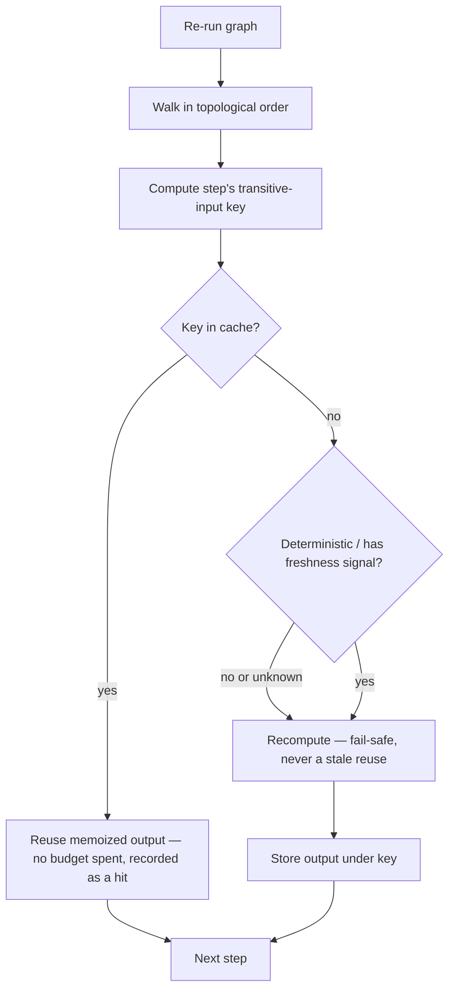

# Incremental Execution

**Version:** 1.0.0
**Status:** Stable
**Layer:** concept

## Overview

Re-running a workflow graph after a small change without redoing the work a change did not touch. When a graph is re-executed — the user tweaked one parameter, an upstream input was corrected, a downstream branch was added — the naïve engine recomputes every step from scratch, paying again for expensive upstream work (model inference, retrieval, tool calls) that produced the *same* result it did last time. Incremental execution refuses that waste: each step's output is memoized under a content-addressed key derived from its transitive input state, and a re-run recomputes only the steps whose inputs actually changed, reusing memoized outputs everywhere else. It is the incremental-build discipline (recompile only what changed) applied to an agent/media workflow graph — a pure cost-and-latency optimization that never changes a result.

## Related Specifications

- [l1-execution-graph.md](l1-execution-graph.md) - The base execution model (typed state channels, topological order, checkpoint/resume) this optimizes; incremental re-execution is distinct from checkpoint-resume (which continues an interrupted run) — it re-runs a whole graph but skips unchanged steps.
- [l1-generation-budget.md](l1-generation-budget.md) - The cost a cache hit saves; reused steps spend no budget, and the saving is accounted.
- [l1-derived-artifact-handoff.md](l1-derived-artifact-handoff.md) - The rebuildable-derived-cache discipline (DAH-1) this reuses: a memoized output is derived and rebuildable, so a lost/cold cache costs recompute time, never data or correctness.
- [l1-inference-cache.md](l1-inference-cache.md) - The inference-side sibling: that caches a model's prompt-prefix computation; this caches a workflow step's whole output. Complementary layers, different grains.
- [l1-attestation.md](l1-attestation.md) - Content-addressing (AT-2) the transitive-input cache key composes.
- [l1-deployment-neutrality.md](l1-deployment-neutrality.md) - The memoization store is a host-supplied seam (durable or in-memory), on-device by default.
- [../../nodus/specifications/l1-nodus-language.md](../../nodus/specifications/l1-nodus-language.md) - Determinism (NL-6) is what makes a step's output a pure function of its inputs, and therefore safely memoizable.

## 1. Motivation

Agent and media workflows are re-run constantly during authoring and iteration: change the prompt and re-run, fix one retrieval source and re-run, add a review step and re-run. Every re-run that recomputes the whole graph pays again for the expensive, unchanged upstream: a 40-second retrieval, a costly generation, a slow tool call — all redone to produce byte-identical outputs, just because a *downstream* node changed. This is the single biggest avoidable cost in iterative workflow authoring. The fix is well-proven in build systems and node-graph engines: memoize each step's output keyed by the identity of everything that feeds it, and on re-run recompute only the steps a change can actually reach. The discipline that makes it *safe* — not just fast — is the interesting part: a cache hit must be indistinguishable from recomputation, only deterministic steps may be memoized on input identity, and anything that can change without a declared-input change must say so or be recomputed. Get that discipline right and iteration becomes cheap without ever becoming wrong.

## 2. Constraints & Assumptions

- Memoization changes **cost**, never **result**: a cache hit must equal what a fresh run would produce.
- Only a step that is a deterministic function of its declared inputs is memoizable on input identity; effectful/external/stochastic steps need an explicit freshness signal or are never cached.
- The cache holds derived, rebuildable outputs; a cold or lost cache is a performance event, never a correctness or data event.
- Incremental execution is an opt-in optimization; a run with the cache off behaves identically and pays full cost.

## 3. Core Invariants

Rules every Layer 2 implementation MUST NOT violate:

- **IE-1 (Output memoization keyed by transitive input identity):** a step's output MAY be memoized under a content-addressed key derived from the step's own inputs **and** the identity of all its transitive upstream inputs (its ancestry signature). The key is over **input identity**, not wall-clock, run-id, or position — so a re-run resolves a step to the same key, and thus the same cached output, whenever nothing that feeds it changed.
- **IE-2 (Incremental re-execution — only the affected cone):** on re-running a graph, a step is recomputed only if its cache key changed or its entry is absent/evicted; every other step reuses its memoized output. A change to one input invalidates **exactly** the downstream cone it can reach — never the whole graph, never less than the reachable cone. Re-running after a small change costs the affected subgraph, not the whole graph.
- **IE-3 (Cache hit ≡ recomputation):** a memoized output MUST be indistinguishable from recomputing the step — same value, same type, same provenance and lineage. A cache that returns anything a fresh run would not is a **correctness defect**, not an optimization. Memoization is transparent by construction.
- **IE-4 (Determinism-gated memoizability):** only a step whose output is a deterministic function of its declared inputs is safely memoizable on input identity (composing the runtime determinism contract). A step that is non-deterministic, effectful, or reads state outside its declared inputs — an external fetch, a model call with hidden sampling, a clock/RNG read, a side-effecting tool — MUST NOT be memoized on input identity alone; it declares a freshness signal (IE-5) or is never cached. Silently memoizing a non-pure step is forbidden.
- **IE-5 (Freshness escape, fail-safe to recompute):** a step whose result can change with **no** declared-input change (a live external source, a stochastic generation the author wants re-rolled) declares an explicit **freshness signal** — a self-reported change token folded into its cache key — so the runtime distinguishes "unchanged, reuse" from "may have changed, recompute" without pretending the step is pure. Absent a declared freshness signal, such a step is treated as **always-changed** (recompute), never as cacheable — the failure direction is recomputation, never stale reuse.
- **IE-6 (Invalidation is identity, not time):** a cache entry is invalidated by a change in its input identity (IE-1), not by age; there is **no time-to-live that silently serves a stale output**. Eviction under a declared size/memory bound is permitted (the cache is bounded), but eviction only forces recomputation — it never serves a wrong answer. Exactly what a changed input can reach is what is invalidated.
- **IE-7 (Opt-in, observable, disable-to-diagnose):** incremental re-execution is an opt-in optimization over full re-execution; a run with the cache disabled behaves identically and pays full cost. Every hit and miss is observable — the trace records which steps were reused vs recomputed and the budget saved (composing observability and the generation budget) — so the speedup is auditable and a suspected stale-cache bug is diagnosed by disabling the cache and comparing outputs.
- **IE-8 (Host-supplied, local-first, rebuildable):** the memoization store is a host-supplied seam (durable or in-memory), on-device by default; it holds only derived, rebuildable outputs, so a lost or cold cache costs recompute time — never data, never correctness. Absent the capability the graph runs full every time — incremental execution is an opt-in deepening, never a runtime dependency.

> L2 specs cannot reach RFC status until all invariants here are addressed in their "Invariant Compliance" section.

## 4. Detailed Design

### 4.1 The Cache Key Is the Transitive Input

```text
[REFERENCE]
signature(step):
    sig := hash(step.declared_inputs)                       // IE-1 own inputs
    for ancestor in ordered_transitive_upstream(step):      // IE-1 ancestry
        sig := hash(sig, signature(ancestor))               // fold upstream identity
    if step.has_freshness_signal:                           // IE-5 escape
        sig := hash(sig, step.freshness_token())            // external/non-deterministic
    return sig
```

Because the key folds in every ancestor's signature, a change *anywhere upstream* changes the key of *everything downstream* — and only downstream. Two nodes with identical transitive inputs share a key and a cached output; the moment an input differs, keys diverge exactly along the affected cone.

### 4.2 Incremental Re-execution



The affected cone recomputes; the rest is reused. A downstream-only edit re-runs a handful of steps; an upstream edit re-runs its whole cone — exactly the work the change necessitated, no more.

### 4.3 The Safety Spine

Speed is the easy half; *safe* speed is the contract. Three invariants carry it: a hit must equal recomputation (IE-3), only pure steps are keyed on input identity (IE-4), and anything that can change silently must say so or be recomputed (IE-5) — with the failure direction always toward recomputation (IE-6), never toward a stale answer. A cache that can be wrong is worse than no cache; this discipline is what keeps "cheap iteration" from becoming "fast wrong answers."

## 5. Nodus Realization

Nodus is a natural host for this: its determinism contract (NL-6) is exactly the IE-4 precondition — a deterministic step's output *is* a pure function of its inputs, so it is memoizable on the transitive `@in` + upstream signature; a model call, deferred/external step (NL-12), or other effectful step is the IE-4/IE-5 case that needs a freshness signal or stays uncached. The existing narrow memoization of a human approval (a workflow does not re-ask a decision it already has) is the special case IE-1/IE-5 generalize to all step outputs. The durable memoization store is the host-supplied StorageProvider seam (LP-15), and cache hits/misses ride the observability trace. Incremental execution therefore needs **no new language primitive** — it composes determinism, the deferred/effect distinction, host-supplied durable state, and the observability trace nodus already provides.

## 6. Drawbacks & Alternatives

- **Cache correctness is subtle.** A wrong cache hit is a silent wrong answer. Mitigated by the safety spine (IE-3/IE-4/IE-5/IE-6) and IE-7 disable-to-diagnose — the cache can always be turned off to prove a bug is or isn't the cache.
- **Keying cost.** Computing a transitive-input signature has its own cost. Justified: the signature is cheap relative to the memoized work (a hash vs a model call), and it is the only way to make reuse provably correct rather than guessed.
- **Alternative — checkpoint/resume only.** Rejected as a substitute: resume continues *one interrupted run* from where it stopped; it does not make a *fresh re-run* skip unchanged steps. They compose (resume within a run, memoize across runs) but solve different problems.
- **Alternative — cache the final artifact only.** Rejected: caching only the whole-graph output means any change recomputes everything; per-step memoization is what makes a downstream edit cheap.

## Canonical References

| Alias | Path | Purpose |
| --- | --- | --- |
| `[EXEC-GRAPH]` | `.design/main/specifications/l1-execution-graph.md` | The base execution model this optimizes; checkpoint-resume demarcation. |
| `[DERIVED]` | `.design/main/specifications/l1-derived-artifact-handoff.md` | Rebuildable-derived-cache discipline (DAH-1) a memoized output obeys. |
| `[BUDGET]` | `.design/main/specifications/l1-generation-budget.md` | The cost a cache hit saves and accounts. |

## Document History

| Version | Date | Author | Notes |
| --- | --- | --- | --- |
| 1.0.0 | 2026-07-23 | Core Team | Initial spec — incremental workflow re-execution via per-step output memoization: content-addressed cache key over transitive input identity (IE-1), recompute-only-the-affected-cone (IE-2), cache-hit-equals-recomputation correctness (IE-3), determinism-gated memoizability (IE-4), fail-safe-to-recompute freshness escape for external/non-deterministic steps (IE-5), invalidation-by-identity-not-time with bounded eviction never serving stale (IE-6), opt-in/observable/disable-to-diagnose (IE-7), host-supplied local-first rebuildable cache (IE-8). Distinct from checkpoint/resume (continues an interrupted run) and inference-cache (prompt-prefix, not step-output). nodus realization composes determinism NL-6 + deferred/effect NL-12 + memoized-approval precursor + StorageProvider LP-15 — no new language primitive. Mined from a studied node-graph generative-pipeline execution engine's input-signature output cache. Concept-only. |
