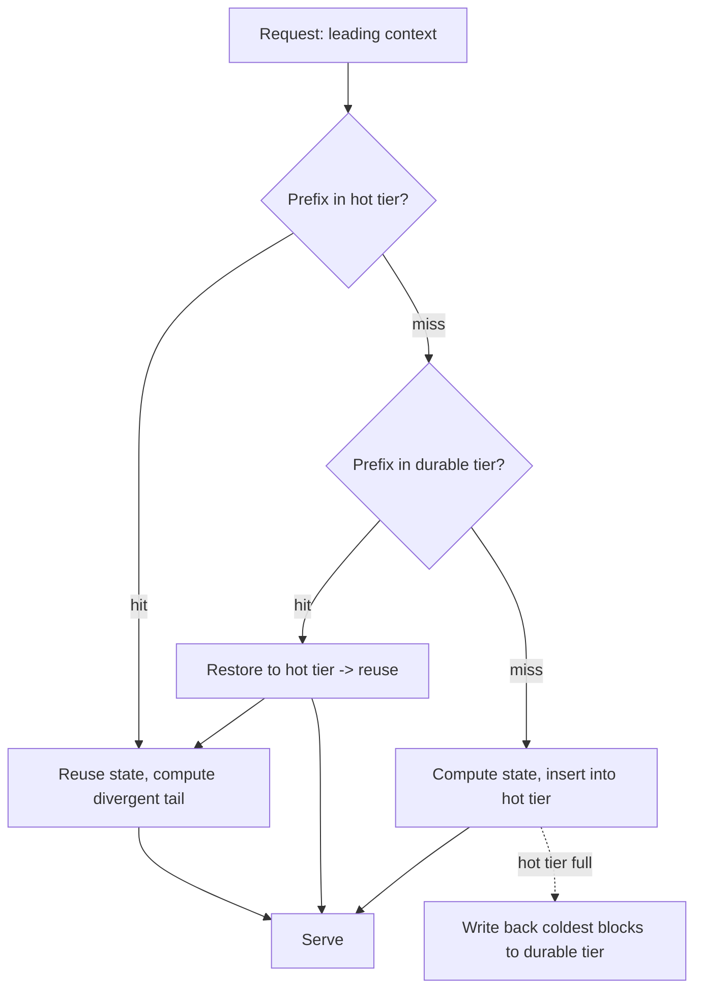

# Inference-State Cache

**Version:** 1.1.0
**Status:** Stable
**Layer:** concept

## Overview

Ingesting a context is the expensive part of local inference: before a model emits its first token it computes an intermediate state over the entire leading context, and for a long, tool-heavy, multi-turn session that same leading context is re-ingested on almost every request. This spec names the discipline that turns that recomputation into a **lookup**: a **durable, tiered, prefix-addressed cache of computed inference state** that the local runtime owns — a fast volatile tier that spills to a durable persistent tier, entries keyed by the context prefix that produced them, shared across requests by copy-on-write, and **surviving process restart** so warmth is an asset rather than a per-process accident.

This is the **storage-side** companion to the authoring-side cache discipline. Keeping a request's prefix byte-stable is what makes a cache *hit*; this spec is about the cache that the hit lands in — how computed state is stored across tiers, shared between overlapping contexts, evicted under a bounded budget, persisted across restarts, and kept honest and confined. For local, on-device models the office owns this cache outright, so its architecture is a first-class concern, not a provider's black box.

## Related Specifications

- [l1-cache-stable-context.md](l1-cache-stable-context.md) — the **authoring** sibling: keeping the leading prefix byte-identical is what makes this cache hit (IC-9). That spec governs *don't mutate the key*; this one governs *the cache the key lands in*.
- [l1-model-runtime.md](l1-model-runtime.md) — the runtime that owns this cache; MR-6 evicts whole **models** under memory pressure, this spec evicts **computed state** — the two residency budgets are siblings, coordinated so caching state never starves model residency.
- [l1-storage-model.md](l1-storage-model.md), [l1-file-management.md](l1-file-management.md) — the durable tier reuses the content-addressed immutable-blob storage pattern (digest-keyed, dedup, reference-tracked) for persisted state blocks (IC-3/IC-4).
- [l1-context-compression.md](l1-context-compression.md) — compression shrinks the volatile live zone; it must not rewrite the stable prefix (or it voids the cache), so the two compose cleanly.
- [l1-security.md](l1-security.md) — cached state is on-device user data: never egressed, confined to the device, and isolation-protected from auxiliary computations (IC-8).
- [l1-generation-budget.md](l1-generation-budget.md) — the cache is a cost/latency lever; a warmth regression inflates both, which IC-7 makes observable.
- [l1-tokenization-boundary.md](l1-tokenization-boundary.md) — TB-2/TB-3: encoding is not composable, so a byte-identical leading context is a *symbol* prefix only when its boundary is a declared stable seam. IC-10 is the composing invariant; without it IC-1's key can match while the state it addresses does not.
- [../../nodus/specifications/l1-nodus-language.md](../../nodus/specifications/l1-nodus-language.md) — NL-15 cache-stable prompt composition is the nodus-workflow realization: rendering a model-facing prompt so its reusable segments form a byte-stable leading prefix a host prefix-cache can reuse. NL-19 anchors that prefix's cut at a stable seam.

## 1. Motivation

For a local model, the first-token latency of a long context is dominated by re-ingesting a prefix the runtime has already ingested before — the same system preamble, tool schemas, and accumulated history, request after request. Recomputing it every time is pure waste the office can eliminate, because unlike a remote provider it *owns* the machine and the cache.

Left unnamed, the cache is improvised badly: it lives only in RAM, so it thrashes the moment the working set exceeds memory and is lost entirely on restart (every session cold-starts after a crash or an update); it duplicates identical shared context across conversations instead of sharing it; it grows unbounded until it triggers the very OOM the model-residency budget was protecting against; or an auxiliary background computation quietly evicts the interactive session's warm state. A disciplined cache fixes each: **tier** it so it degrades to a slower hit instead of a full recompute; **persist** it so warmth survives a restart; **share** overlapping prefixes by copy-on-write so shared context costs its storage once; **bound** it so it never breaks the memory budget; and keep it **honest, observable, and confined**. Naming the contract once makes local inference practical for real long-session work instead of paying the full prefill on every turn.

## 2. Constraints & Assumptions

- The cache is a **performance** mechanism only: a hit must be indistinguishable in result from a full recompute (IC-2); clearing the cache is always safe.
- It is **local and owned**: this concept is about the cache the office runs on its own device, distinct from a remote provider's opaque prompt cache (which l1-cache-stable-context addresses on the billing side).
- Cached inference state is **user data** and never leaves the device; the durable tier lives inside the device's storage/security boundary.
- Technology-agnostic: this L1 names no tensor format, block size, page table, or on-disk encoding. The concrete cache engine is a Layer-2 concern.
- The cache competes with model weights for the same finite memory; its budget is coordinated with, and subordinate to, the model-residency budget so caching never evicts a model out from under a live request.

## 3. Core Invariants

Rules every Layer 2 realization MUST NOT violate. They are technology-neutral.

- **IC-1 (Prefix-addressed reuse):** cached state is keyed by the **context prefix that produced it**, so a request whose leading context matches a cached prefix reuses the stored state and computes only the **divergent tail**. Reuse is by prefix match, not whole-request equality: two requests that share a leading context share its computed state, however they differ afterward.

- **IC-2 (A hit equals a recompute):** a cache hit MUST produce a result **identical** to computing from scratch — the cache is a pure optimization, never a semantic change. Because entries are content-keyed on their producing prefix, a key match guarantees state equivalence; a partial, corrupt, or mismatched entry is discarded and recomputed, never served.

- **IC-3 (Tiered residency with write-back):** cached state spans at least two tiers — a bounded **fast volatile tier** and a slower **durable persistent tier** it spills to under pressure. A block evicted from the fast tier is **written back** to the durable tier, not dropped, so warmth degrades to a *slower hit* rather than being lost to a *full recompute*. Promotion (cold→hot on access) and demotion (hot→cold under pressure) are the normal cache dynamics.

- **IC-4 (Warmth survives restart):** the durable tier **persists across process restarts** — a crash, update, or restart does not cold-start every session. State cached before the restart is restored on the next matching-prefix request. Warmth is a durable asset of the device, not a property of one process lifetime.

- **IC-5 (Copy-on-write prefix sharing):** overlapping prefixes are **shared, never duplicated**. When two contexts share a leading segment they reference the same cached blocks; at the point they diverge, the shared block is **copied on write** so neither corrupts the other. Context common to many conversations (a shared system preamble, a shared document) costs its storage exactly once.

- **IC-6 (Bounded, policy-governed eviction):** each tier has a **hard capacity bound**; when full, entries are evicted by a **declared policy** (recency / frequency / priority), and eviction is admit-by-evict — the tier budget is never exceeded, the cache never grows unbounded into the memory the model-residency budget protects. Hot entries MAY be pinned or prioritized; the budget remains a hard ceiling, not a hint.

- **IC-7 (Honest and observable):** cache hits, misses, the tier a hit served from (hot / cold), evictions, and write-backs are **observable and attributed**. A warmth regression — a fall in hit rate that silently inflates latency and cost while nothing visibly breaks — is diagnosable from the record, and a hit is always distinguishable from a recompute in what the runtime reports.

- **IC-8 (Confined and isolation-safe):** cached inference state is on-device **user data** and obeys the same confinement as any computed state: it is never egressed, its durable tier stays within the storage/security boundary, and an **auxiliary or background computation MUST NOT pollute or evict the primary interactive session's warm state** (an auxiliary lane uses an isolated or lower-priority cache scope). Clearing the cache is always safe — the worst case is a recompute.

- **IC-9 (Reuse requires a stable prefix):** prefix reuse (IC-1) only fires when the leading context is **byte/block-stable across requests**; mutating one byte of the shared prefix changes its key and defeats the cache. This is the storage-side counterpart to the authoring-side stability discipline (l1-cache-stable-context): the cache stores and shares, but only the caller composing context as a **stable prefix + volatile tail** lets it hit. The cache never *forces* stability; it *rewards* it.

- **IC-10 (A shared prefix is a *symbol* prefix, cut at a stable seam):** [ADDED v1.1.0] IC-9's byte-stability is **necessary but not sufficient**. Because encoding is not composable (`l1-tokenization-boundary` TB-2), a byte-identical leading context is a **symbol prefix** of the full request only when its boundary falls on a **declared stable seam** — a cut no continuation can move. A prefix whose final content can merge across the cut with the divergent tail has a stable *key* and an unstable *sequence*: the cache then either misses forever (a warmth regression IC-7 surfaces as a mystery) or, worse, **serves state computed for a symbol sequence the request does not have — a silent IC-2 violation that no key comparison can detect.** Therefore prefix keys are **anchored at stable seams** (a control symbol is one by construction, TB-4), and a boundary whose stability is **unknown is treated as unstable**: the entry is not shareable across that divergence. The cache never infers seam stability from the bytes on either side; the encoder asserts it (TB-3).

> L2 specs cannot reach RFC status until all invariants here are addressed in their "Invariant Compliance" section.

## 4. Detailed Design

### 4.1 Tiers and the flow of a request



A miss in both tiers is a full compute (IC-2 equivalence holds trivially); a durable-tier hit is a slower hit that is still far cheaper than recompute (IC-3); a hot-tier hit is the fast path. Insertion under pressure writes back the coldest blocks rather than discarding them (IC-3), and the durable tier persists so the same diagram warms up again after a restart (IC-4).

### 4.2 Prefix sharing and copy-on-write

```text
[REFERENCE]
conversation A: [ preamble | tools | docX | turn-a1 | turn-a2 ]
conversation B: [ preamble | tools | docX | turn-b1 ]
                  └──────── shared prefix ───────┘   └ divergent tails (per-conversation) ┘
```

The shared leading blocks (`preamble | tools | docX`) are stored once and referenced by both (IC-5); each conversation's divergent tail is its own. When A appends `turn-a3` past a block boundary shared with B, only the affected block is copied on write, so B is never disturbed. Shared context across many conversations therefore costs its storage a single time, and a new conversation that opens on a common prefix starts warm.

Every `|` in that sketch is load-bearing: it is a **stable seam** (IC-10), not merely a position where two byte ranges happen to abut. A divergence point placed anywhere else is not a sharable boundary, because the symbols on the shared side of it depend on what follows. In practice a message/turn frame marker is the natural seam — it is a control symbol, therefore unforgeable and therefore un-mergeable-across, which is exactly the property the cache needs.

### 4.3 Two residency budgets, one memory

Model weights (l1-model-runtime MR-6) and cached state compete for the same finite fast memory. They are **coordinated, subordinate budgets**: the cache's fast tier is bounded so it cannot evict a model out from under a live request, and under global pressure cached state demotes to the durable tier (a slower hit) before a resident model is evicted (a full reload). The device's total-memory ceiling caps the sum, so neither budget can drive the machine into OOM.

## 5. Drawbacks & Alternatives

**Alternative: RAM-only cache.** Rejected by IC-3/IC-4 — it thrashes past the working set and is wholly lost on restart; a durable tier turns an eviction into a slower hit and preserves warmth across restarts.

**Alternative: whole-request cache (no prefix sharing).** Rejected by IC-1/IC-5 — it duplicates shared context per conversation and misses on any tail difference; prefix-addressing with CoW shares the common part and recomputes only the divergence.

**Alternative: unbounded cache.** Rejected by IC-6 — an unbounded cache reintroduces the OOM the residency budget exists to prevent; the tier bound is hard.

**Risk: silent warmth regression.** A busted prefix (IC-9) or an auxiliary lane trampling the primary cache (IC-8) degrades quietly. IC-7 observability plus the isolation rule make it visible and containable.

**Risk: a byte-stable prefix cut at an unstable seam.** The most dangerous failure in this spec, because it *looks* correct: every byte of the prefix is preserved, the key matches, and the cache either mysteriously never hits or hits and serves state for a symbol sequence the request does not have. No key comparison detects it. Rejected by IC-10 — the boundary must be a seam the encoder declares stable, and an unknown boundary counts as unstable.

## Canonical References

| Alias | Path | Purpose |
| --- | --- | --- |
| `[STABLE]` | `.design/main/specifications/l1-cache-stable-context.md` | The authoring-side stability discipline that makes this cache hit (IC-9) |
| `[RUNTIME]` | `.design/main/specifications/l1-model-runtime.md` | The runtime that owns this cache; model-residency budget coordinated with state-residency (§4.3) |
| `[STORE]` | `.design/main/specifications/l1-file-management.md` | The content-addressed immutable-blob pattern the durable tier reuses (IC-3/IC-4) |
| `[TOKEN-BOUNDARY]` | `.design/main/specifications/l1-tokenization-boundary.md` | TB-2/TB-3 — why a byte prefix is not a symbol prefix, and what makes a seam stable (IC-10) |
| `[NODUS]` | `.design/nodus/specifications/l1-nodus-language.md` | The host-neutral realization: NL-15 cache-stable prompt composition + NL-19 seam anchoring |

## Document History

| Version | Date | Author | Notes |
| --- | --- | --- | --- |
| 1.1.0 | 2026-07-10 | Core Team | Added IC-10 a shared prefix is a *symbol* prefix cut at a stable seam — IC-9's byte-stability is necessary but not sufficient, because encoding is not composable (l1-tokenization-boundary TB-2): a byte-identical leading context is a symbol prefix of the full request only when its boundary falls on a declared stable seam a continuation cannot move. A prefix whose final content can merge across the cut with the divergent tail has a stable key and an unstable sequence, so the cache either misses forever (a warmth regression IC-7 surfaces as a mystery) or serves state computed for a symbol sequence the request does not have — a silent IC-2 violation no key comparison can detect. Prefix keys are therefore anchored at stable seams (a control symbol is one by construction, TB-4) and an unknown boundary is treated as unstable; seam stability is asserted by the encoder (TB-3), never inferred from the bytes. §4.2 clarified — the block separators in the CoW sketch are seams, not mere byte abutments; new Drawbacks entry for the byte-stable/seam-unstable failure. Additive: no existing invariant weakened. |
| 1.0.0 | 2026-07-09 | Core Team | Initial stable spec — durable tiered prefix-addressed inference-state cache: prefix-addressed reuse computing only the divergent tail (IC-1), a hit equals a recompute (IC-2), tiered residency with write-back so eviction is a slower hit not a lost recompute (IC-3), warmth survives process restart (IC-4), copy-on-write prefix sharing so common context costs storage once (IC-5), bounded policy-governed eviction that never breaks the memory budget (IC-6), honest observable hits/misses/tiers/evictions (IC-7), on-device confinement + auxiliary-lane isolation (IC-8), reuse requires a stable prefix — the storage-side counterpart to cache-stable authoring (IC-9). Composes l1-cache-stable-context / l1-model-runtime / l1-storage-model / l1-file-management / l1-security. Distilled from an adoption pass over an external local-inference-server reference (tiered hot/cold KV cache with prefix sharing). |
