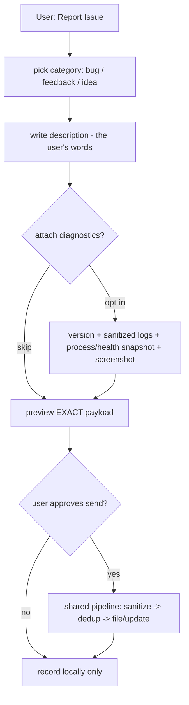

# Issue Reporting

**Version:** 1.0.0
**Status:** Stable
**Layer:** concept

## Overview

The technology-agnostic model of the user-initiated **"Report Issue"** action: a first-class button (and equivalent command) that lets the user file a bug, a piece of feedback, or an idea in their own words — optionally attaching sanitized diagnostics — and send it to the project's tracker after seeing exactly what will leave the device. It is the *human-initiated* complement to error reporting: where error reporting fires automatically when the system fails, issue reporting fires when the **user** decides something is worth telling the makers, whether or not any error occurred.

Issue reporting owns the distinct concerns of a user-authored report — the trigger, the narrative, the category, the opt-in diagnostic bundle, the preview-before-send, and the cross-frontend surface — while deliberately **reusing** the reporting pipeline that error reporting already established (local-first recording, sanitization, de-duplication, the consent-gated egress, and the tracker channel) rather than building a second one.

## Related Specifications

- [l1-error-reporting.md](l1-error-reporting.md) - The sibling, error-triggered path; issue reporting is the user-triggered counterpart and reuses its pipeline (ERR-1 consent, ERR-2 scrub, ERR-3 dedup, ERR-5 local-first) instead of duplicating it.
- [l2-github-issue.md](l2-github-issue.md) - The concrete tracker channel (filing, dedup, fingerprinting) both reporting paths share; issue reports flow through it, not a parallel egress.
- [l1-security.md](l1-security.md) - Sending a report off-device is an authorized outbound egress; attachments are scrubbed of secrets and user content (INV-7, SEC).
- [l1-office-model.md](l1-office-model.md) - Human-in-the-loop consent (OFF-6); the send is an explicit user act, previewed before egress.
- [l1-application-shell.md](l1-application-shell.md) - The "Report Issue" button is a named shell action / render-from-state dialog (AS command system, AS-9 panel).
- [l1-architecture.md](l1-architecture.md) - Command parity (INV-3): the same capability from a graphical button, a CLI verb, or a TUI slash command.
- [l1-operational-health.md](l1-operational-health.md) - The inspectable, exportable health snapshot (OH-8) is one opt-in diagnostic a user may attach to a report.

## 1. Motivation

Automatic error reporting only fires when the system throws. But most of what a user wants to tell the makers never raises an exception: a layout that renders wrong, an agent that did the unhelpful thing, a confusing label, a missing feature, a "this felt slow." Without a deliberate channel, that feedback is lost — the user has nowhere to put it except an external bug tracker they must find, log into, and fill out by hand, reconstructing context the app already has.

A first-class "Report Issue" action closes that gap: one button, always reachable, that captures the user's own description plus (with their explicit opt-in) the diagnostics that make it actionable — app version, recent sanitized logs, the current process/health snapshot — and sends it through the same vetted pipeline that error reports use. The user stays in control: they choose the category, write the narrative, decide what diagnostics to include, and **see the exact payload before it is sent**. Because the machinery for scrubbing, de-duplicating, and filing already exists for error reports, issue reporting is mostly a *surface and a content model* over shared infrastructure — which is exactly how it should be built, not as a second reporting stack.

## 2. Constraints & Assumptions

- The action is user-initiated; it is not raised by an error or by the system autonomously (that is error reporting's job).
- Sending a report off the device is an outbound egress and MUST be authorized and previewed (consistent with SEC-3, OFF-6).
- A user report is free-form narrative plus a category; usefulness comes from the narrative and any attached diagnostics, not from a stack trace.
- Diagnostics are attached only when the user opts in, and are sanitized like any other report content.
- The tracker channel and its configuration (target repository, enablement) are those of the shared reporting pipeline; issue reporting introduces no second channel.
- When external filing is impossible or declined, the report must still be captured locally — a report the user took the time to write is never silently dropped.

## 3. Core Invariants (Layer 1 only)

Rules every Layer 2 implementation MUST NOT violate:

- **ISS-1 (User-initiated, first-class action):** issue reporting is triggered by an explicit user action — a "Report Issue" button or its command equivalent — reachable as a first-class capability. It is distinct from error-triggered auto-reporting (ERR): the initiator is the user, not an exception, and no error need have occurred.
- **ISS-2 (User-authored content + typed category):** a report's payload is the user's own description together with a category drawn from a small closed set — at minimum **bug**, **feedback**, and **idea**. The narrative is the substance; structured fields are optional aids, never a substitute for the user's words.
- **ISS-3 (Preview-before-send consent):** clicking "Report Issue" is intent to report, but nothing leaves the device until the user has **seen and approved the exact payload** — description plus every attached diagnostic — that will be sent. No field is transmitted that the user has not previewed (strengthens ERR-1 consent with mandatory preview, because reports carry user-authored and diagnostic content).
- **ISS-4 (Opt-in, sanitized diagnostics):** any diagnostics attached to a report — version, recent logs, process/health snapshot, screenshots — are **opt-in** and **sanitized**: no secrets and no user content beyond what the user explicitly includes. Attaching diagnostics is never automatic or silent (consistent with ERR-2, SEC).
- **ISS-5 (Local-first, never lost):** every submitted report is recorded locally regardless of external filing. When filing is unavailable, declined, or fails (offline, tracker unconfigured, consent withheld), the report is retained locally — and MAY be queued for later — never silently dropped (consistent with ERR-5).
- **ISS-6 (Shared pipeline & tracker, not a parallel path):** issue reports flow through the **same** reporting pipeline and tracker channel as error reports — sanitize, de-duplicate where meaningful, file or update — reusing that infrastructure rather than opening a second egress path (consistent with ERR-2/ERR-3 and the shared tracker channel).
- **ISS-7 (Frontend parity):** the "Report Issue" capability is available across CLI, TUI, and graphical frontends with equivalent behavior and outcome; the graphical surface presents a button and a compose/preview dialog, the CLI and TUI a command — the same report, filed the same way (consistent with INV-3 command parity).

> L2 specs cannot reach RFC status until all invariants here are addressed in their "Invariant Compliance" section.

## 4. Detailed Design

### 4.1 Two reporting paths, one pipeline

Issue reporting and error reporting differ only at the front — trigger, actor, and content — and converge on the shared pipeline:

| Aspect | Issue reporting (this spec) | Error reporting (ERR) |
| --- | --- | --- |
| Trigger | user clicks "Report Issue" | an error/crash occurs |
| Actor | the user, deliberately | the system, automatically |
| Payload | user narrative + category (+ opt-in diagnostics) | sanitized stack/trace + context |
| Consent | preview-before-send, always (ISS-3) | consent gate / remembered preference (ERR-1) |
| Shared pipeline | sanitize → dedup → file/update → local record | sanitize → dedup → file/update → local record |

### 4.2 Anatomy of a report

The optional diagnostic bundle draws from existing surfaces — the app version, recent sanitized logs, the operational-health snapshot (OH-8), and the process-monitor state — each included only if the user opts in (ISS-4) and each shown in the preview (ISS-3).

### 4.3 Cross-frontend surface

Issue reporting **extends the existing `report` command group** rather than adding a new one — the group already carries error reporting's `report` (last error) and `report consent`. The library method is the source of truth; the CLI and TUI are thin bindings, the graphical dialog a render-from-state surface (INV-3, ISS-7).

| Action | CLI | TUI | Graphical |
| --- | --- | --- | --- |
| report an issue | `cronus report issue [--category bug\|feedback\|idea]` | `/report issue …` | "Report Issue" button → compose + preview dialog |
| (existing) report last error | `cronus report` | `/report` | — |
| (existing) set consent | `cronus report consent <…>` | `/report consent …` | settings toggle |

All surfaces produce the same report and file it through the same pipeline (ISS-6/ISS-7).

### 4.4 Relationship to error reporting

The two specs are deliberately partitioned by *trigger and content*, unified by *pipeline*:

- Issue reporting owns: the user-initiated action, the category and narrative content model, the opt-in diagnostic bundle, and the mandatory preview-before-send.
- Error reporting owns: automatic error capture, stack fingerprinting, and the error-signature de-duplication.
- Both share: sanitization (ERR-2), the tracker channel and its dedup/filing (l2-github-issue), consent-gated egress (ERR-1, tightened here to preview-before-send), and local-first recording (ERR-5).

This keeps a single audited egress path (ISS-6) — there is never a second, unvetted way for content to leave the device.

## 5. Drawbacks & Alternatives

- **Consent friction on every send:** requiring a preview each time adds a step. Accepted deliberately — user reports carry free-text and diagnostics that could contain sensitive material, so preview-before-send (ISS-3) is a privacy floor, not an option. It is one dialog, not a multi-step wizard.
- **Alternative — fold user reports into error reporting:** rejected. Error reporting is scoped to the system reporting its own failures (error-triggered, stack-based). Overloading it with a user-authored, category-based, error-free path would blur its trigger model and its content contract. A sibling spec sharing the pipeline keeps each front focused while avoiding a duplicate egress stack.
- **Alternative — link out to an external tracker form:** rejected. It discards the context the app already has (version, logs, health snapshot), forces the user to authenticate elsewhere, and loses the local-first record (ISS-5).
- **Category taxonomy drift:** a fixed small set (bug/feedback/idea) may feel too coarse. Kept minimal on purpose; sub-categorization can be revisited if real usage demands it. <!-- TBD: revisit category set (e.g. add "question"/"performance") after real-world usage -->
- **Default consent/enablement:** whether issue reporting is enabled and its default egress consent mode inherit from the shared reporting configuration. <!-- TBD: confirm issue-reporting shares error-reporting's consent default or defines its own -->

## Document History

| Version | Date | Change |
| --- | --- | --- |
| 1.0.0 | 2026-07-02 | Initial concept: user-initiated "Report Issue" action (ISS-1…7) — user-authored bug/feedback/idea with opt-in sanitized diagnostics, mandatory preview-before-send, cross-frontend parity; reuses the error-reporting pipeline and tracker channel rather than a parallel egress path. |

## Canonical References

| Alias | Path | Purpose |
| --- | --- | --- |
| `[ERR]` | `.design/main/specifications/l1-error-reporting.md` | The shared reporting pipeline and invariants (ERR-1…5) this reuses |
| `[GH]` | `.design/main/specifications/l2-github-issue.md` | The concrete tracker channel both paths file through |
| `[SECURITY]` | `.design/main/specifications/l1-security.md` | Egress authorization and sanitization of report content/attachments |
| `[SHELL]` | `.design/main/specifications/l1-application-shell.md` | The button as a named shell action / preview dialog surface |
