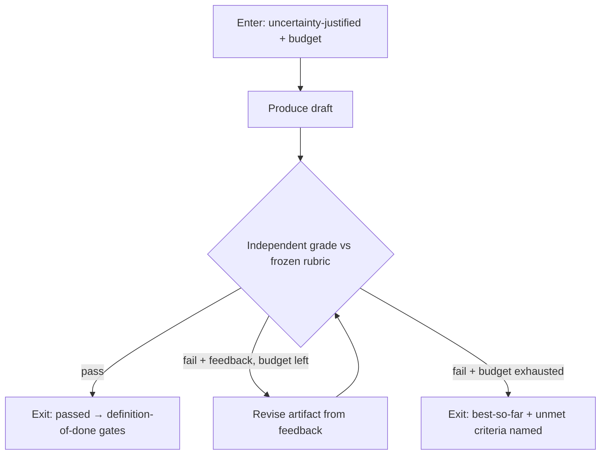

# Iterative Refinement

**Version:** 1.1.0
**Status:** Stable
**Layer:** concept

## Overview

Iterative refinement is the **generate–evaluate–refine** contract: when a single artifact's first-pass quality is genuinely uncertain and the office can afford it, one producer drafts the artifact, an **independent grader** evaluates it against an **explicit rubric**, and the grader's actionable feedback drives a **bounded sequence of revisions** to the *same* artifact until it passes the rubric or the budget is exhausted. It trades **depth** (iterations) for quality, and it is the temporal member of the coordination family.

The three fan-out modes trade **width** for quality — parallel staffing fans disjoint partitions and integrates all of them (throughput), deliberation fans perspectives and synthesizes them (answer diversity), competitive execution fans complete rival attempts and selects one whole winner (outcome selection). Iterative refinement fans **nothing**: it carries one whole artifact through successive graded revisions, deepening it over time. The discriminator is temporal rather than fan-in — *improve one thing repeatedly under an independent judge* — which is why it composes with the others (each competitive attempt, or a deliberation's synthesized draft, MAY itself be refined) rather than competing with them.

## Related Specifications

- [l1-loop-governance.md](l1-loop-governance.md) — a refinement loop is an **execution loop** (a fixed task re-attempted until an oracle says done); LG oracle-ownership is IR-6 (the producer never edits its own pass criteria), LG bounded-loop is IR-5, LG verification-independence is IR-2. This spec names the *pattern*; loop-governance governs the *loop*.
- [l1-competitive-execution.md](l1-competitive-execution.md) — the sibling that **selects** one of N parallel whole attempts; iterative refinement **deepens** one attempt sequentially. Demarcated in §4.4. The two compose: a competitive attempt MAY be internally refined.
- [l1-deliberation.md](l1-deliberation.md) — the sibling that **synthesizes** independent arguments; refinement **revises** one artifact under a grader instead of blending viewpoints.
- [l1-parallel-staffing.md](l1-parallel-staffing.md) — the throughput fan-out; named here to complete the coordination-family demarcation.
- [l1-quality-standards.md](l1-quality-standards.md) — the definition-of-done gates a finished artifact must pass; a rubric refines these into the per-loop criteria, and a *pass* on the rubric is not automatically *done* (IR-3, §4.5).
- [l1-requirement-checklists.md](l1-requirement-checklists.md) — the explicit, itemized criteria form the rubric applies (IR-3).
- [l1-claim-verification.md](l1-claim-verification.md) — grounded checking (IR-4): a criterion checkable against ground truth is actually checked, not judged for plausibility.
- [l1-output-contracts.md](l1-output-contracts.md) — deterministic schema/criteria validators; a rubric item MAY be a deterministic oracle rather than a judge.
- [l1-outcome-confidence.md](l1-outcome-confidence.md) — [ADDED v1.1.0] supplies the first-pass quality signal IR-8 requires before a loop may be entered, and its named contributors become the loop's revision targets (IR-9).
- [l1-orchestration.md](l1-orchestration.md) — the independent-judge machinery (ORC-6) the grader reuses; a refinement loop is a delegation decision (ORC-5 context isolation for the grader).
- [l1-operational-ledger.md](l1-operational-ledger.md) — the append-only record the refinement trace (IR-7) writes to.
- [l1-generation-budget.md](l1-generation-budget.md) — the spend bound (IR-5) and the uncertainty-vs-habit spend discipline (IR-8).
- [../../nodus/specifications/l1-nodus-language.md](../../nodus/specifications/l1-nodus-language.md) — NL-14 `~UNTIL +grade` (grader-gated refinement loop with feedback threading) is the nodus-workflow realization of this contract.

## 1. Motivation

Some artifacts are rarely right on the first attempt: a nuanced piece of writing, a synthesized research brief, a generated query, a design under ambiguous constraints. A single pass is a gamble, and the existing stack has no *named* way to say "draft it, have someone qualified check it against the bar, and revise until it clears." Competitive execution runs rival attempts and picks one, but never revises the chosen one; deliberation blends arguments, but never improves a concrete artifact against explicit criteria; the standing `/goal` loop has an independent judge but uses it only as a stop condition for a running attempt, not as a source of **actionable revision feedback** on a produced artifact.

Left unnamed, an implementation improvises the loop unsafely: the producer grades its **own** work in its **own** context and rationalizes a pass (self-endorsement); the grader emits a bare score with no feedback a reviser can act on; the loop judges plausibility instead of checking groundable facts; the criteria quietly loosen until something passes (goalpost drift); or the loop spins without a budget and without honest reporting when it cannot converge. Naming the contract once keeps refinement **independent, grounded, bounded, and honest**: *an independent grader against a frozen rubric; actionable feedback, not a bare score; grounded checks where truth is checkable; a fixed budget with a best-so-far exit; and criteria the producer can never rewrite to declare victory.*

## 2. Constraints & Assumptions

- **Iterations cost.** Each cycle is a produce + grade round; the decision model assumes the spend is justified by first-pass quality uncertainty (IR-8), not applied reflexively.
- **The grader is independent of the producer.** A producer cannot reliably grade its own output from inside its own context; the grader is a separate evaluation act reading only the artifact and the rubric.
- **The rubric is the contract.** Refinement is only as good as the criteria; a vague or unmechanizable rubric produces vague feedback and no real convergence.
- **Convergence is not guaranteed.** Some artifacts will not clear the bar within budget; the loop must end honestly with the best-so-far and the named unmet criteria, never by relaxing the bar.
- This spec adds a coordination *pattern*; it introduces no new work unit, no new board state, and no new judge subsystem — it composes the orchestration judge, the quality gates, and the loop-governance oracle already defined.

## 3. Core Invariants

Rules every Layer 2 implementation MUST NOT violate. They are technology-neutral.

- **IR-1 (One artifact, improved in place):** refinement carries a **single** evolving artifact through a sequence of revise steps. Each iteration's input is the prior artifact plus the grader's feedback, and its output **supersedes** the prior version. This is sequential single-thread improvement — the deliberate inverse of competitive execution's N parallel whole attempts (CE-2) and deliberation's blend of many arguments (DL). There is no fan-out and no fan-in.

- **IR-2 (Producer/grader independence):** the evaluation that decides continuation is performed by a grader **independent of the producer** — it does not share the producer's working context, hidden state, or rationalizations, and reasons only from the artifact and the rubric (reusing the ORC-6 independent-judge machinery, ORC-5 context isolation). A producer grading its own work inside its own context is **self-endorsement, not refinement**, and does not satisfy this contract.

- **IR-3 (Rubric-driven, actionable feedback):** the grader evaluates against an **explicit rubric** — a stated, itemized set of criteria the artifact must satisfy (composing the quality gates and requirement checklists) — and returns not a bare score but **actionable, localized feedback**: which criterion failed, where in the artifact, and why. A rubric the grader cannot mechanically apply, or feedback the reviser cannot act on, fails this invariant. A rubric *pass* means the loop may stop; it does not by itself mean the artifact is *done* — the standing definition-of-done gates still apply.

- **IR-4 (Grounded verification, not plausibility):** where a criterion is checkable against ground truth — a cited source exists and supports the claim, a test passes, a schema validates, a computation is correct — the grader **actually performs the check** rather than judging that it "looks right." Refinement inherits the anti-fabrication grounding discipline (claim-verification, output-contracts): an ungrounded "looks good" is never a pass on a groundable criterion.

- **IR-5 (Bounded convergence with an honest exit):** the loop declares an explicit **budget** up front (max iterations and/or cost/time) and terminates on exactly one of: **pass** (rubric satisfied) or **budget-exhaustion** (return the **best-so-far** artifact together with the **named unmet criteria**). It never runs open-ended. A loop that stops improving or oscillates between equivalent versions is **detected and halted honestly** rather than spun to the budget wall; non-convergence is a reported outcome, not a hidden failure.

- **IR-6 (Frozen criteria — no goalpost drift):** the rubric and the grader's criteria are **fixed for the lifetime of the loop** and are **not in the producer's mutable set**. The reviser may change the artifact; it may **never** change, weaken, or reinterpret the criteria that judge it. Loosening the rubric to force a pass is **criteria drift** and is forbidden — directly composing the loop-governance oracle-ownership rule (an actor never holds the right to edit the contract that decides its own success).

- **IR-7 (Observable, attributed refinement trace):** every iteration records the artifact version, the grader's verdict and feedback, and what the revision changed, so the convergence — or the failure to converge — is auditable and a human can see *why* the loop stopped. Intermediate versions are retained in the trace (append-only, composing the operational ledger), never silently overwritten; the trace distinguishes a *pass* exit from a *budget-exhausted* exit.

- **IR-8 (Uncertainty-justified, not reflexive):** one pass is the default. Entering a refinement loop is an explicit decision justified by a **first-pass quality-uncertainty** signal — an ambiguous/high-stakes artifact, low producer confidence, a prior gate failure — and is recorded with its budget. A single high-confidence output does not enter a refine loop; refinement is spent where quality uncertainty warrants the extra cycles, mirroring competitive execution's uncertainty-justified rule (CE-1).

- **IR-9 (The entry signal is measured, and its contributors are the revision targets):** [ADDED v1.1.0] the "first-pass quality-uncertainty" IR-8 requires is a **measured estimate, not an impression** — an outcome-confidence assessment produced independently of the producer, with named contributors. Two consequences bind the loop. **Entry**: a loop is entered on a low measured estimate or a failed gate, never on a producer's self-report that it feels unsure — a self-declared uncertainty is a claim, and using it as the trigger lets a producer choose its own budget. **Targeting**: the estimate's named contributors are carried into the loop as the **specific things the revision must address**, so an iteration is aimed rather than a generic retry; a loop that re-attempts the whole artifact without naming what it is fixing burns budget on the parts that were already fine. The estimate informs entry and targeting only — it MUST NOT relax the rubric (IR-6 criteria stay frozen), MUST NOT extend the budget (IR-5's ceiling is independent of any score), and MUST NOT itself decide the pass/continue verdict, which remains the independent grader's (IR-2). A high estimate is likewise never a reason to skip a mandated gate — a rubric pass and a definition-of-done pass remain separate (IR-3, §4.5).

> L2 specs cannot reach RFC status until all invariants here are addressed in their "Invariant Compliance" section.

## 4. Detailed Design

### 4.1 The loop



The producer and the grader are distinct acts (IR-2); the rubric feeding the diamond is frozen (IR-6); the two exits are the only ways out (IR-5), and both are recorded distinctly (IR-7).

### 4.2 The rubric contract

A rubric is an explicit, itemized set of criteria, each ideally paired with **how it is checked**:

```text
[REFERENCE]
rubric := [ criterion ]
criterion := {
  statement   : what must hold (human-legible)
  check       : deterministic-oracle | grounded-check | judged      // IR-3/IR-4
  severity    : must-pass | should-pass                             // gates vs. advisories
}
verdict := { pass: bool, per_criterion: [ {criterion, met, evidence, fix_hint} ] }
```

`deterministic-oracle` criteria (a schema validates, a test passes) are cheap and exact; `grounded-check` criteria (a quote matches its cited source) are verified against real data (IR-4); only genuinely subjective criteria fall to `judged`. Feedback is per-criterion, localized, and carries a `fix_hint` the reviser can act on — a bare aggregate score is not a valid verdict.

### 4.3 Convergence and honest non-convergence

Progress is intended toward the feedback: each revision targets the unmet criteria. The loop watches for **stall** (two successive versions score equivalently with no criterion newly met) and **oscillation** (a criterion toggles met/unmet across iterations); either triggers an honest early exit with best-so-far rather than burning the remaining budget. "Best-so-far" is the version with the most must-pass criteria met (ties broken by should-pass), so a budget-exhausted exit still returns the strongest attempt, clearly labeled as *not passed* with its unmet criteria named (IR-5, IR-7).

### 4.4 Demarcation within the coordination family

| Mode | Shape | Combine at end | Trades |
| --- | --- | --- | --- |
| Parallel staffing | N disjoint sub-tasks, concurrent | integrate **all** partitions | width → throughput |
| Deliberation | N perspectives on one question | **synthesize/blend** into one | width → answer diversity |
| Competitive execution | N whole rival attempts, concurrent | **select one** whole winner, discard rest | width → outcome selection |
| **Iterative refinement** | **1** artifact, sequential revise cycles | the **converged** artifact | **depth → quality under a grader** |

The first three fan out (width); iterative refinement deepens (time). Because it does not fan out, it composes *inside* the others: a competitive attempt or a deliberation's synthesized draft MAY itself be refined before it is selected or shipped. Refinement is not best-of-N — it never runs rival wholes and never selects; it improves one whole under a frozen, independent bar.

## 5. Drawbacks & Alternatives

**Alternative: producer self-grades.** Rejected by IR-2 — self-grading from inside the producer's context rationalizes passes; the independence is the load-bearing property.

**Alternative: bare-score feedback.** Rejected by IR-3 — a scalar tells the reviser nothing to act on; per-criterion localized feedback is required for real convergence.

**Alternative: unbounded "refine until perfect."** Rejected by IR-5 — without a budget and an honest best-so-far exit the loop either never stops or fakes a pass; non-convergence must be reportable.

**Risk: criteria drift.** The subtle failure is loosening the bar to converge. IR-6 forbids it structurally by placing the rubric outside the producer's mutable set (loop-governance oracle-ownership).

**Risk: over-application.** Refining every output wastes budget; IR-8 gates entry on genuine first-pass uncertainty.

## Canonical References

| Alias | Path | Purpose |
| --- | --- | --- |
| `[LOOP-GOV]` | `.design/main/specifications/l1-loop-governance.md` | The execution-loop + oracle-ownership contract IR-5/IR-6 compose |
| `[JUDGE]` | `.design/main/specifications/l1-orchestration.md` | The independent-judge machinery (ORC-6) the grader reuses (IR-2) |
| `[GATES]` | `.design/main/specifications/l1-quality-standards.md` | The definition-of-done the rubric refines and a pass does not replace (IR-3) |
| `[NODUS]` | `.design/nodus/specifications/l1-nodus-language.md` | The host-neutral realization: `~UNTIL +grade` grader-gated refinement loop (NL-14) |

## Document History

| Version | Date | Author | Notes |
| --- | --- | --- | --- |
| 1.1.0 | 2026-07-23 | Core Team | Added IR-9 — the IR-8 entry signal is a **measured** outcome-confidence estimate produced independently of the producer, never a producer's self-report (a self-declared uncertainty is a claim, and letting it trigger the loop lets a producer choose its own budget); and the estimate's **named contributors become the loop's revision targets**, so an iteration is aimed at what was actually weak rather than being a generic whole-artifact retry that spends budget on the parts already fine. The estimate informs entry and targeting only: it may not relax the frozen rubric (IR-6), may not extend the independent budget ceiling (IR-5), may not decide the pass/continue verdict (IR-2, still the grader's), and a high estimate never waives a mandated definition-of-done gate (IR-3). Related Specifications extended with `l1-outcome-confidence`. |
| 1.0.0 | 2026-07-09 | Core Team | Initial stable spec — iterative refinement (generate–evaluate–refine): the temporal coordination-family member trading depth for quality beside the three width fan-outs. One artifact improved in place (IR-1), producer/grader independence (IR-2), rubric-driven actionable feedback (IR-3), grounded verification not plausibility (IR-4), bounded convergence with an honest best-so-far exit (IR-5), frozen criteria / no goalpost drift (IR-6), observable attributed refinement trace (IR-7), uncertainty-justified not reflexive (IR-8). Composes l1-loop-governance / l1-competitive-execution / l1-deliberation / l1-quality-standards / l1-claim-verification. Distilled from an adoption pass over an external agent-recipe reference (evaluator-optimizer / outcome-graded revision). |
