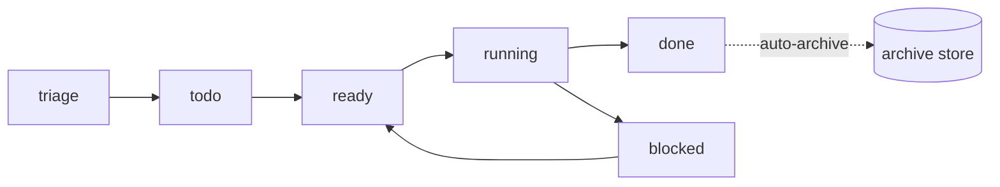

# Kanban Model

**Version:** 1.0.0
**Status:** Stable
**Layer:** concept

## Overview

The technology-agnostic model of the work board through which an office runs its tasks. Each office has exactly one canonical Kanban board with a fixed ordered set of states. Cards (work units) move through the pipeline driven by the office (manager and agents), not by the client. Completed work is archived automatically, keeping the active board lean while preserving history.

## Related Specifications

- [l1-office-model.md](l1-office-model.md) - The managed work lifecycle (OFF-7) this board realizes; client-not-managing (OFF-5).
- [l1-workspace-lifecycle.md](l1-workspace-lifecycle.md) - One board belongs to one workspace (office).
- [l2-kanban-board.md](l2-kanban-board.md) - Concrete board storage, transitions, auto-archival, and commands.

## 1. Motivation

An autonomous office needs a single, legible representation of "what work exists and where it stands," and it must stay readable over a long-running project without the client having to tidy it. A fixed canonical pipeline gives a shared vocabulary across offices; office-driven movement honors maximum automation; automatic archival keeps the board lean while never losing the record of what was done.

## 2. Constraints & Assumptions

- One board per office; boards do not span offices.
- The state set is fixed in this version; arbitrary user-defined boards are out of scope.
- The client may view the board but is not required to manage it.
- Completed work must remain recoverable after it leaves the active board.

## 3. Core Invariants (Layer 1 only)

Rules every Layer 2 implementation MUST NOT violate:

- **KAN-1 (Canonical pipeline):** every office has exactly one board with the fixed, ordered states `triage → todo → ready → running → blocked → done`. The state set is not user-redefinable in this version.
- **KAN-2 (Office-managed, not client-managed):** cards are created and moved by the manager and agents. The client MAY view the board but MUST NOT be required to manage it (consistent with OFF-5).
- **KAN-3 (Auto-archival terminal):** `done` cards are archived automatically by a defined condition (e.g. age, or project closure). Archival is an automatic action, not a manual board column.
- **KAN-4 (Non-destructive archive):** archived cards are retained as durable history; archival MUST NOT destroy the record of completed work.
- **KAN-5 (Card = unit of work):** a card represents one task/work unit; its state reflects progress. A `blocked` card MUST record the reason for the block.
- **KAN-6 (One board per office / isolation):** exactly one board exists per workspace and never spans offices (consistent with OFF-1).
- **KAN-7 (Traceable transitions):** forward flow is the norm; backward moves (e.g. `blocked → ready`) are permitted but explicit, and every state change is traceable (who/when/why).

> L2 specs cannot reach RFC status until all invariants here are addressed in their "Invariant Compliance" section.

## 4. Detailed Design

### 4.1 The pipeline

| State | Meaning |
| --- | --- |
| triage | captured, not yet assessed |
| todo | assessed, queued |
| ready | ready to be picked up |
| running | work in progress (WIP) |
| blocked | halted by an impediment (reason recorded) |
| done | completed |
| (archive) | terminal store for completed cards; reached automatically, not a board column |

### 4.2 Who moves cards

The office manager triages incoming work and routes it; agents pull `ready` work into `running` and push to `done` or `blocked`. The client observes; the system does the managing (KAN-2, OFF-5). Cards originate from the office's plans/tasks (OFF-7).

### 4.3 Archival

When a `done` card meets the archival condition, it is moved out of the active board into the archive store, preserved for history and learning (KAN-3, KAN-4). The active board therefore shows only live and recently-finished work.

## 5. Drawbacks & Alternatives

- **Fixed states reduce flexibility:** mitigated by the fact that the office, not the client, runs the board, so a universal vocabulary is an asset. Custom columns/boards may be revisited later. <!-- TBD: revisit custom columns if a real need emerges post-v0.1.0 -->
- **Alternative — manual archive column:** rejected; it would force the client to tidy the board, violating KAN-2/OFF-5.
- **Alternative — no archive:** rejected; loses the record of completed work needed for learning (OFF-9). <!-- TBD: default auto-archival condition (age threshold vs project-closure) -->

## Canonical References

| Alias | Path | Purpose |
| --- | --- | --- |
| `[OFFICE]` | `.design/main/specifications/l1-office-model.md` | Work lifecycle (OFF-7) and client-not-managing (OFF-5) |
| `[BOARD]` | `.design/main/specifications/l2-kanban-board.md` | Concrete board realization |
