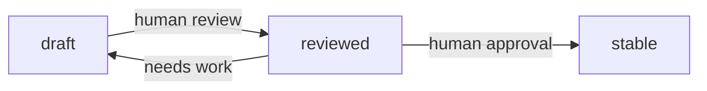

# Knowledge Base

**Version:** 1.1.0
**Status:** Stable
**Layer:** concept

## Overview

Named collections of documents — files, web pages, structured records — organized for semantic retrieval. A knowledge base is an agent-queryable source that enriches generation with grounded, attributed context. It is distinct from the memory model (short-lived conversational context) and from the agent's training (static model weights). Knowledge bases are user-managed, access-controlled, and incrementally indexed.

## Related Specifications

- [l1-memory-model.md](l1-memory-model.md) - Memory is ephemeral conversational context; knowledge base is persistent, user-managed reference material.
- [l1-resource-sharing.md](l1-resource-sharing.md) - Knowledge collections are shareable resources governed by the access grant model.
- [l1-file-management.md](l1-file-management.md) - Files are the source documents for a knowledge collection.
- [l1-extensions.md](l1-extensions.md) - A retrieval skill may query the knowledge base as a tool.
- [l2-knowledge-store.md](l2-knowledge-store.md) - Concrete implementation: schema, indexing pipeline, retrieval.

## 1. Motivation

Agents reason only from what they can see in their context window. Without a structured retrieval layer, agents must load entire documents into context (expensive, often too large) or rely on model training (stale, hallucination-prone). A knowledge base provides a standard path: ingest documents once, retrieve relevant chunks on demand, inject them as cited context. This keeps generation grounded and the context window lean.

## 2. Constraints & Assumptions

- A knowledge base is a retrieval aid; it does not replace authoritative data sources or transactional systems.
- Retrieval does not guarantee factual accuracy — agents must cite sources and note uncertainty when relying on retrieved content.
- Large files are split into chunks; the original file is preserved and retrievable in full.
- Cross-collection retrieval (querying multiple collections simultaneously) is supported but the caller must explicitly select collections; there is no implicit "search everything."

## 3. Core Invariants

Rules every Layer 2 implementation MUST NOT violate:

- **KB-1 (Collection isolation):** each collection is an independently indexed retrieval unit; queries always target an explicit set of one or more collections, never all collections implicitly.
- **KB-2 (Hierarchical organization):** documents within a collection may be arranged in a directory tree for human navigation; directory structure does NOT affect retrieval ranking or chunking.
- **KB-3 (Incremental indexing):** adding, replacing, or removing a document triggers partial re-indexing of only the affected document; full-collection re-index is an explicit admin action.
- **KB-4 (Access control):** a collection obeys the resource-sharing model (RS-1…RS-8); a worker may only query collections to which it holds at least `read` access.
- **KB-5 (Source types):** the system ingests at minimum: uploaded files (text, PDF, Markdown, HTML), web URLs (scraped and cached), and plain-text records. Ingestion normalizes all sources to retrievable, attributed chunks.
- **KB-6 (Source attribution):** every retrieved chunk carries a reference to its source document and, where applicable, its position (page, section, byte offset) within that document.
- **KB-7 (Non-authoritative recall):** the knowledge base stores and retrieves; it does not assert correctness. Agents must treat retrieved content as evidence, not ground truth.
- **KB-8 (Soft deletion):** removing a document from a collection marks it deleted and removes it from retrieval immediately; physical cleanup (storage + index cleanup) is deferred.
- **KB-9 (Authorship zones):** within a collection, documents carry an authorship origin that places them in a zone with a declared agent write-boundary — *human-authored* documents (uploaded sources, human-owned records) are agent-read-only, while *agent-synthesized* documents are agent-read-write. The boundary is enforced mechanically at the storage layer: a write to a read-only zone is refused unless an explicit override is supplied, never merely discouraged by guidance. This authorship boundary is orthogonal to KB-4 — KB-4 governs which *workers* may access a collection (resource-sharing), KB-9 governs whether the *agent* may rewrite human-authored material within a collection it can already access.
- **KB-10 (Curation lifecycle):** every agent-synthesized document carries a curation status advancing `draft → reviewed → stable`. The agent may freely create and revise `draft` documents; advancing to `reviewed` or `stable` requires explicit human action. Downstream consumers MUST treat `draft` content as provisional, and retrieval MAY filter or down-weight by curation status. This editorial-trust lifecycle is distinct from the per-document indexing `status` (pending/indexing/ready/error/deleted), which tracks index state, not trust.

> L2 specs cannot reach RFC status until all invariants here are addressed in their "Invariant Compliance" section.

## 4. Detailed Design

### 4.1 Collection

A collection is a named, access-controlled group of documents:

```text
Collection {
  id          : CollectionId
  owner_id    : UserId
  name        : string
  description : string
  meta        : dict          // arbitrary metadata (tags, language hints, etc.)
}
```

### 4.2 Document and Directory

Documents live in a flat list or an optional directory tree within a collection:

```text
Document {
  id            : DocumentId
  collection_id : CollectionId
  directory_id  : DirectoryId?
  source_file_id: FileId?       // reference to the file subsystem
  source_url    : string?       // web URL when source is remote
  name          : string
  status        : "pending" | "indexing" | "ready" | "error" | "deleted"  // index state
  origin        : "human" | "agent"                                       // authorship zone (KB-9)
  curation      : "draft" | "reviewed" | "stable"?                        // editorial trust (KB-10); agent docs only
}

Directory {
  id            : DirectoryId
  collection_id : CollectionId
  parent_id     : DirectoryId?
  name          : string
}
```

### 4.3 Chunk

Each document is split into chunks for retrieval:

```text
Chunk {
  id          : ChunkId
  document_id : DocumentId
  text        : string
  embedding   : vector<f32>   // dense semantic embedding
  position    : int           // ordinal position within the document
  source_ref  : SourceRef     // page/section/byte reference for attribution
}
```

### 4.4 Ingestion Pipeline


Errors at any stage leave the document in `error` status with a diagnostic message; the collection remains queryable from its prior state.

### 4.5 Retrieval

Query flow for a semantic retrieval request:

1. Caller provides: `{query_text, collection_ids[], top_k, min_score?}`.
2. Embed `query_text` using the same embedding model used at ingestion.
3. ANN (Approximate Nearest Neighbour) search across all `ready` chunks in the targeted collections.
4. Optional keyword filter (BM25 or FTS) fused with the vector results (RRF fusion).
5. Return `top_k` chunks ranked by relevance, each carrying `{text, source_ref, score, document_id, collection_id}`.
6. The caller injects the chunks into the model context with attribution.

### 4.6 Lifecycle Summary

| Action | Effect |
| --- | --- |
| Create collection | Empty collection created; index initialised. |
| Add document | Document queued for ingestion; status `pending → indexing → ready`. |
| Replace document | Old chunks removed from index; new document ingested. |
| Remove document | Document marked `deleted`; chunks excluded from retrieval immediately. |
| Delete collection | All documents and chunks removed; index dropped. |

### 4.7 Authorship Zones & Curation Lifecycle

Two orthogonal dimensions govern how the agent may touch a document, layered on top of the indexing pipeline:

**Authorship zone (KB-9).** Each document's `origin` declares who authored it. The storage layer treats `origin = human` documents as a read-only zone for the agent:

```text
[REFERENCE]
write(document):
    if document.origin == "human" and not override_supplied:
        reject("read-only zone: human-authored material")
    else:
        persist(document)
```

The override exists for explicit, audited operations (e.g. a user-directed correction routed through the agent), never as a silent default. This makes the human/agent boundary an enforced invariant of the store rather than a behavioural request in a prompt — robust against agent drift.

**Curation lifecycle (KB-10).** Agent-synthesized documents advance through editorial-trust states:



The agent owns `draft`; only human action advances `reviewed`/`stable`. Retrieval may expose a `min_curation` filter so high-trust queries exclude provisional `draft` content. A new agent-synthesized document defaults to `draft`.

## 5. Implementation Notes

1. Embedding model selection: use the same model for ingestion and query; a model change requires full re-indexing of the collection.
2. Chunk size and overlap are configurable per collection; sensible defaults (512 tokens / 64-token overlap) are applied when unspecified.
3. Web URL sources are scraped at ingest time and cached; subsequent refreshes are a manual or scheduled action.

## 7. Drawbacks & Alternatives

- **Single global index:** simpler to query but breaks collection isolation (KB-1) and makes access control harder.
- **External vector database:** offloads ANN but adds operational complexity and network dependency. The in-process, file-local approach (sqlite-vec) keeps the system embeddable.

## Canonical References

| Alias | Path | Purpose |
| --- | --- | --- |
| `[IMPL]` | `.design/main/specifications/l2-knowledge-store.md` | Concrete schema, indexing pipeline, and Rust implementation. |
| `[MEMORY]` | `.design/main/specifications/l2-memory-store.md` | Memory store also uses sqlite-vec; share the embedding engine pattern. |

## Document History

| Version | Date | Author | Notes |
| --- | --- | --- | --- |
| 1.1.0 | 2026-06-26 | Core Team | Added KB-9 (authorship zones — storage-enforced human/agent write boundary) and KB-10 (curation lifecycle draft→reviewed→stable); Document model gains `origin` + `curation` fields; new §4.7. |
| 1.0.0 | 2026-06-25 | Core Team | Initial spec — collections, ingestion pipeline, retrieval, KB-1…KB-8. |
