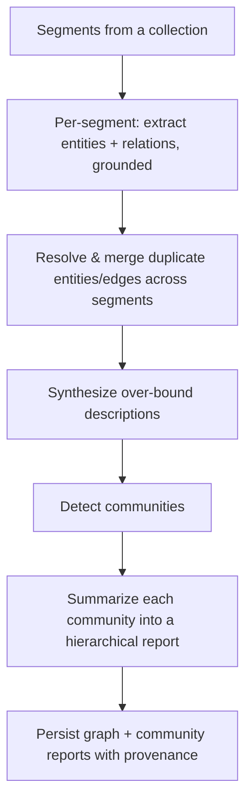
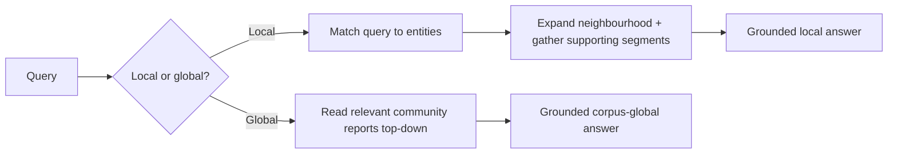

# Knowledge Graph

**Version:** 1.0.0
**Status:** Stable
**Layer:** concept

## Overview

A corpus-derived entity–relation graph that stands beside the chunk/vector index as a complementary retrieval substrate. Flat semantic retrieval excels at local, lookup-style questions ("what does section 3 say about X") but is structurally unable to answer relational and corpus-global questions ("how are A and B connected across these documents", "what are the main themes of this collection") — because the evidence is scattered across many chunks that no single similarity query gathers. A knowledge graph extracts the entities and relations a corpus asserts, resolves the same entity mentioned in many places into one node, and partitions the graph into communities that are summarized top-down. It is an opt-in enrichment over the mandatory flat index — never a replacement — and every node, edge, and summary stays grounded in and attributed to the source segments it came from.

## Related Specifications

- [l1-knowledge-base.md](l1-knowledge-base.md) - The graph is an optional representation of a collection (KB-14), queried through the same access-controlled retrieval surface.
- [l1-content-segmentation.md](l1-content-segmentation.md) - Segments are the grounded extraction units for entities and relations.
- [l1-hierarchical-summarization.md](l1-hierarchical-summarization.md) - Community reports compose the hierarchical-summarization contract over the graph.
- [l1-claim-verification.md](l1-claim-verification.md) - A relation grounds an answer only as evidence, subject to claim verification.
- [l1-recursive-decomposition.md](l1-recursive-decomposition.md) - Construction is a bounded recursive map-reduce over segments.
- [l1-data-lineage.md](l1-data-lineage.md) - Node/edge → source-segment references are the graph's lineage.
- [l1-deployment-neutrality.md](l1-deployment-neutrality.md) - Extraction/synthesis models and durable graph state are host-supplied seams, local-first.
- [l1-code-intelligence.md](l1-code-intelligence.md) - Distinct sibling: that graph models *code* structure; this one models *corpus knowledge* extracted from documents.

## 1. Motivation

Some questions are not answerable by fetching the most similar chunks, no matter how good the embedding. "Which teams depend on the payments service and who owns them?" requires connecting facts stated in separate documents; "summarize what this 500-document collection is fundamentally about" requires a view no single chunk holds. These are graph questions. Building an entity–relation graph from the corpus makes the connective structure explicit and traversable: a *local* query starts from the entities a question mentions and expands their neighbourhood; a *global* query reads down from community-level summaries. Crucially, the graph is not a second source of truth — it is a re-representation of what the sources already say, with every element carrying a reference back to the segments it was extracted from, so a graph-grounded answer is as auditable and citable as a chunk-grounded one.

## 2. Constraints & Assumptions

- The graph is opt-in: a collection is fully usable with the flat index alone. The graph adds capability; it is never a hard dependency of the knowledge base.
- The graph asserts what sources say, not world knowledge; a graph element with no source grounding is invalid.
- Construction is expensive (model calls per segment); it must be bounded, incremental, resumable, and observable, with cost accounted.
- Extraction and description synthesis run on host-supplied models, on-device by default; construction performs no egress unless the host authorizes it.

## 3. Core Invariants

Rules every Layer 2 implementation MUST NOT violate:

- **KG-1 (Complementary substrate, not a replacement):** the entity–relation graph stands *beside* the flat chunk/vector index as an additional retrieval substrate for relational and corpus-global questions; it MUST NOT be presented as a replacement for flat retrieval, and a collection remains fully functional without it.
- **KG-2 (Grounded & attributed extraction):** every entity and relation is extracted from specific source segments and retains a back-reference to them (composing SEG-6 / data-lineage); a graph element with no source grounding is invalid. The graph never asserts free-standing world knowledge.
- **KG-3 (Conservative entity resolution):** the same real-world entity mentioned across segments is resolved to one node; a merge unions the source references and combines descriptions on the strength of evidence — it never fabricates identity. Every merge is recorded so it is auditable and reversible.
- **KG-4 (Bounded description synthesis):** when a node or edge accumulates more descriptive text than a bound allows, its description is *synthesized* (summarized) rather than growing without limit; the synthesis carries provenance (the hierarchical-summarization contract) and the synthesis step is itself bounded.
- **KG-5 (Community structure & hierarchical reports):** the graph MAY be partitioned into communities (densely-connected clusters) and each community summarized into a report; reports compose hierarchically (l1-hierarchical-summarization) to answer corpus-global questions. Community detection is deterministic given the graph and a fixed policy.
- **KG-6 (Dual retrieval modes):** the graph supports at least a **local** mode (start from query-relevant entities, expand their neighbourhood plus supporting segments) and a **global** mode (answer top-down from community reports). Both return results carrying their source grounding for citation.
- **KG-7 (Non-authoritative, evidence not truth):** the graph stores and relates; it does not assert correctness. A relation is evidence from a source, subject to the same claim-verification discipline before it grounds an answer.
- **KG-8 (Incremental, idempotent, resumable):** adding/replacing/removing a document updates only the affected nodes, edges, and communities; construction over an unchanged corpus is idempotent; a long construction is checkpointed so an interruption resumes rather than restarts. Durable checkpoint/graph state is a host-supplied concern (deployment-neutrality), not assumed in-core.
- **KG-9 (Host-supplied capability, local-first, opt-in):** entity/relation extraction and description synthesis run on host-supplied model seams, on-device by default, with no egress unless the host authorizes it. Absent the capability the corpus is still usable via flat retrieval — the graph is an opt-in enrichment, never a hard dependency.
- **KG-10 (Bounded, observable construction):** construction is a bounded recursive map-reduce over segments — extract per-segment, merge across segments, summarize communities — with cost rolled up and the whole process traceable (composing recursive-decomposition, observability, and the generation budget). Unbounded or unattributed construction is a defect.

> L2 specs cannot reach RFC status until all invariants here are addressed in their "Invariant Compliance" section.

## 4. Detailed Design

### 4.1 Graph Shape

```text
Entity (node) {
  id          : EntityId
  name        : string
  type        : string             // open, host/domain-supplied vocabulary
  description : string             // synthesized when over bound (KG-4)
  sources     : SourceRef[]        // KG-2 segments this entity was extracted from
}

Relation (edge) {
  src, dst    : EntityId
  type        : string             // the asserted relation
  description : string
  sources     : SourceRef[]        // KG-2 segments asserting this relation
}

Community {
  id          : CommunityId
  level       : int                // hierarchy level (KG-5)
  members     : EntityId[]
  report      : SummaryRef         // hierarchical-summarization node over the community
}
```

### 4.2 Construction Pipeline



The `EXTRACT` step is the map (independent per segment, boundedly concurrent); `MERGE`/`SYNTH`/`REPORT` are the reduce. Checkpoints between steps make the whole construction resumable (KG-8).

### 4.3 Local vs Global Retrieval



Local mode answers "tell me about X and what it connects to"; global mode answers "what is this whole corpus about / what are its themes". Both feed the multi-channel fused retrieval of the knowledge base (KB-15) and both attach source references so the answer is citable and verifiable.

### 4.4 Grounding & Non-Authority

The graph is a lens on the sources, not an oracle. Because every element carries `sources`, a graph-derived claim is verified against those exact segments by the ordinary claim-verification gate before it is trusted — the graph *proposes* connections; verification *disposes*. A relation the sources do not actually support is a diagnosable extraction error, surfaced through the same non-authoritative discipline the flat knowledge base already obeys.

## 5. Nodus Realization

Graph construction is the corpus-scale realization of bounded recursive decomposition in the workflow language: per-segment extraction is a boundedly-concurrent map (a collection transform), merge/summarize are the reduce, and the depth/breadth bounds keep it finite by construction. Each extraction is a provenance-tracked model call (untrusted model output neutralized-as-data), and every merged node/community summary carries the source lineage of the segments beneath it. The language already expresses this with its recursive-decomposition, map/join, and provenance primitives — the graph introduces no new language construct, only a new host subsystem the workflow drives.

## 6. Drawbacks & Alternatives

- **Flat retrieval only:** simplest and cheapest, but structurally cannot answer relational or corpus-global questions. The graph exists precisely for those; it stays opt-in so the simple case pays nothing.
- **Manual/curated ontology:** higher precision but does not scale to arbitrary corpora and shifts the burden to humans; automatic grounded extraction with conservative resolution is the scalable default, with human correction available (KG-3 auditable/reversible merges).
- **Treating the graph as ground truth:** rejected — it would violate the non-authoritative discipline (KG-7) and bypass claim verification.

## Canonical References

| Alias | Path | Purpose |
| --- | --- | --- |
| `[KB]` | `.design/main/specifications/l1-knowledge-base.md` | Owner of the collection and the retrieval surface the graph plugs into (KB-14/KB-15). |
| `[HS]` | `.design/main/specifications/l1-hierarchical-summarization.md` | The community-report summarization contract. |
| `[STORE]` | `.design/main/specifications/l2-knowledge-store.md` | Concrete store that will persist graph + reports. |

## Document History

| Version | Date | Author | Notes |
| --- | --- | --- | --- |
| 1.0.0 | 2026-07-22 | Core Team | Initial spec — corpus-derived entity–relation graph as a complementary retrieval substrate: grounded/attributed extraction, conservative auditable entity resolution, bounded description synthesis, community structure with hierarchical reports, local + global retrieval modes, non-authoritative evidence discipline, incremental/idempotent/resumable/observable construction, host-supplied local-first opt-in capability (KG-1…KG-10). Mined from a studied retrieval/document-intelligence engine's knowledge-graph subsystem; answers relational/corpus-global questions flat retrieval cannot. Concept-only. |
