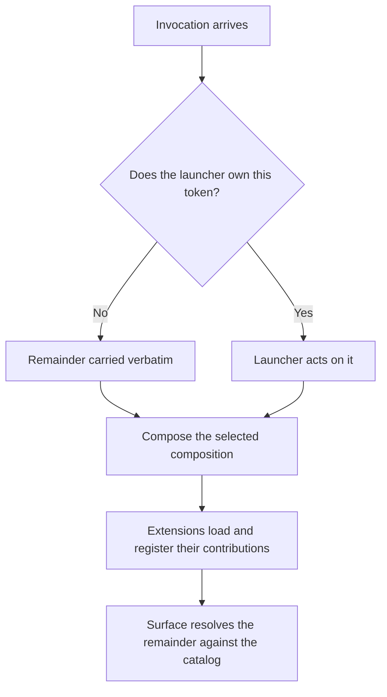

# Launch Handoff

**Version:** 1.0.0
**Status:** Stable
**Layer:** concept

## Overview

The model of **how a process becomes a running surface**, and of the boundary between the part of an invocation the launcher owns and the part it must not read at all.

Every surface of this product starts the same way: a process begins, something decides *which* composition of components to bring up, that composition mounts, and only then does anything exist that could interpret the rest of the invocation. This spec governs that ordering. It answers who parses which arguments, who prints which help, how a surface that has no command line at all (an embedded core inside a desktop shell) takes the same path as one launched from a terminal, and how a command surface that **extensions may extend** is parsed without loading every extension first.

The last question is the one that forces the design. A launcher that resolves a verb must know the verb set; the verb set is not known until extensions load; loading extensions on every invocation is the cost the extension model exists to avoid. The resolution is not a faster loader — it is a **narrower launcher**. A launcher that parses only what it owns never needs a set it cannot have.

## Related Specifications

- [l1-composition-layering.md](l1-composition-layering.md) — owns *what* is assembled (entries, layers, override, reconciliation). This spec owns *when* that assembly happens relative to argument interpretation, and what may be read before it does.
- [l1-surface-parity.md](l1-surface-parity.md) — SP-11's catalog is what a composed surface renders its verbs from; LH-5 is why the launcher may not render it too.
- [l1-extension-points.md](l1-extension-points.md) — EP-9's lazy activation is the constraint LH-5 protects; an eager launcher defeats it before any point is reached.
- [l1-architecture.md](l1-architecture.md) — INV-8/INV-9 place the frontends over one core; this spec is the entry procedure that keeps a fourth frontend from inventing a fourth one.
- [l1-declarative-configuration.md](l1-declarative-configuration.md) — a launcher flag is the most specific configuration layer; LH-2 is what makes it a layer rather than an ambient read.
- [l1-process-integrity.md](l1-process-integrity.md) — LH-8/LH-9 are the entry-side half of orderly startup and bounded shutdown.
- [l1-diagnostic-log.md](l1-diagnostic-log.md) — LH-7's distinction between a usage failure and an application failure is what keeps a misspelled flag out of the incident channel.

## 1. Motivation

**A launcher that knows every verb is a launcher that must load every extension.** The moment the entry point validates an argument against the product's command set, it has taken a dependency on that set being complete — and an extensible product's command set is complete only after every extension has loaded and registered. This turns a `--help` into a full activation of the plugin graph, and it turns every startup into the worst case. The pressure that follows is always toward the same bad fix: cache the verb set, and now there are two answers to *what commands exist*, one of which is stale.

**The alternative that looks obvious is worse.** Keeping a hand-maintained list of extension-contributed verbs in the launcher makes the launcher a place extensions must be registered twice — once where they are implemented, once where they are parsed — and the second registration is the one nobody updates. This is the same defect class [l1-surface-parity.md](l1-surface-parity.md) exists to prevent, relocated into the entry point where it is least visible.

**An embedded core and a launched core must be the same core, and ambient reads are what stop them from being.** A component that reads the process command line directly cannot run inside a host that has no command line — a desktop shell, a test harness, another product embedding this one. It does not fail loudly there; it reads an unrelated process's arguments and behaves plausibly. Every such read is a place where the embedded path and the launched path quietly diverge, and none of them appear in a dependency graph.

**Help is the first thing to fork.** The launcher's usage text and the surface's usage text describe overlapping things, are written months apart, and drift immediately. When the launcher prints help for a surface it does not own, it is restating a catalog it did not compute — and the restatement wins, because it is what the user sees.

**A usage error and an application error are different events wearing the same exit code.** A misspelled flag, an application that failed to start, and an application that started and then failed are three outcomes with three audiences. Collapsing them means the operator cannot tell a typo from an outage, and the diagnostic channel fills with the former.

**Startup can be committed to twice, and the second commitment hides the first failure.** Work scheduled at mount — a watcher, a background sync, an announcement — that runs before startup is known to have succeeded will run during a *failed* startup too, and its own error becomes the reported one. The boot failure is then invisible behind a symptom that has nothing to do with it.

## 2. Constraints & Assumptions

- **Surfaces are plural and will grow.** A command line, a terminal UI, a desktop shell, a headless one-shot runner, and an external-protocol server are all surfaces of one product; each is a composition, not a program.
- **Extensions may contribute to a surface's command set.** This is a requirement, not an incidental capability; the entry procedure may not make it expensive.
- **Some questions must be answered without composing.** Version, usage, and shell completion are asked far more often than the product is actually run, and each must be answerable at a cost that does not scale with the number of installed extensions.
- **The launcher is not a place where product behavior lives.** Its grammar is expected to stay small and to change rarely; anything that grows in it is a sign the boundary was drawn wrongly.
- **A host may embed the composition with no process of its own to speak of.** The entry contract must be satisfiable by a caller that has no command line, no exit code to set, and no standard streams.

## 3. Core Invariants

Rules every Layer 2 implementation MUST NOT violate. They are technology-neutral.

- **LH-1 (The launcher's grammar is closed, small, and self-owned; the first token it does not own ends it):** the launcher parses **only** the arguments it itself acts on — which composition to bring up, which configuration overlays to apply, and its own inspection outputs. Everything from the first unrecognized token onward is **not parsed, not validated, and not rewritten**: it is carried verbatim, in order, to the composed surface. The launcher's grammar is a closed set the launcher's own source declares in full; it never contains a verb whose behavior lives elsewhere. A launcher whose grammar grows whenever the product gains a capability has become the product's command surface by accident, and it will be the stale copy of it.

- **LH-2 (The invocation is a provided fact, never an ambient read):** the arguments, the exit request, and the startup signal reach the composed components as **values supplied to the composition before it mounts** — never read by a component from the process it happens to be running in. **Exactly one component is exempt**: the launcher itself, which is where the ambient facts are converted into supplied ones and is by definition the boundary between them. Everything mounted by the composition is on the far side of that conversion and has no sanctioned way back. A host embedding the composition with no command line of its own supplies an **empty** invocation, and every component behaves identically to a launched run that passed no arguments. This is the one mechanism that makes the embedded path and the launched path the *same* path rather than two paths that agree until one of them is tested. An ambient read is not merely untidy: it is undetectable from the outside, unreachable by a test, and silently wrong in every host that is not a terminal.

- **LH-3 (Whoever owns a grammar owns its help):** the launcher renders usage for its own flags and for nothing else; a composed surface renders usage for its own arguments, including everything extensions contributed to them. A request for help **addressed to a surface** is answered by that surface, not intercepted by the launcher. Restating another owner's usage is forbidden even where the restatement is currently accurate — it is a second description of a set the restater does not compute, and it is precisely the drift the parity discipline names.

- **LH-4 (An invocation naming no composition boots the declared default, and the default is also addressable by name):** the product declares exactly one default composition, brought up when the invocation selects none. That same composition is **additionally** reachable by an explicit name, so that a caller may state what it wants rather than rely on the absence of an argument. Both properties are required and neither substitutes for the other: the default is what makes the product usable by typing its name, and the explicit name is what makes it usable from a script, a test, or a shortcut that must not change meaning the day the default does.

- **LH-5 (The launcher never resolves a contributed name):** no argument the launcher interprets may be a name that an extension can define, extend, or shadow. Resolving such a name requires the extensions to be loaded, which is exactly the eager activation the extension model forbids; the launcher therefore does not attempt it, and resolution of every contributed name happens **after** composition, inside the surface that owns the catalog. This is what dissolves the ordering problem rather than optimizing it: the launcher does not need a set it cannot have, because it never asks a question that set answers.

- **LH-6 (A pre-composition answer is served from a built artifact that declares its own invalidation; its absence composes, never guesses):** where a question must be answered *before* composing — usage, version, completion — the answer comes from an artifact **produced by a prior composition and stored**, never from a hand-maintained copy and never by composing on the spot. The artifact records the conditions under which it ceases to be valid (the composition it was built from, and the presence of any contributor able to change the answer), and an invocation that meets those conditions composes rather than serving a stale answer. **A missing artifact is not an empty one**: the first invocation after installation, or after the store is cleared, has nothing to serve and therefore **composes and builds it**, accepting one slow invocation rather than reporting a command set it has no grounds to claim is complete. This is the distinction between *not yet computed* and *computed as empty*, and it is the one a cache silently loses. An artifact that cannot state when it is wrong is a cache that will be wrong silently.

- **LH-7 (A launcher failure and an application failure are distinguishable outcomes):** a malformed invocation, a composition that failed to come up, and an application that came up and then failed are **three distinct reported outcomes** with distinct exit signals. A usage failure starts no application lifecycle — no transport is opened, no session begins, no work is journaled — so that a misspelled flag leaves no trace resembling a run. Collapsing these denies the operator the one distinction they need first: *did my command reach the product at all?*

- **LH-8 (Startup commits exactly once, and post-startup work runs only after the commit):** successful startup is an explicit, single commitment, and work that must not mask a boot failure — background activity, announcements, anything that can raise its own error — registers to run **after** it. A failed or externally terminated startup never reaches the commitment, so its own failure remains the reported outcome rather than being displaced by the first symptom of work that should never have begun.

- **LH-9 (The application requests exit; the launcher performs it, bounded):** a composed component that wants the process to end **requests** it through the facility the launcher provided, and the launcher tears the composition down and then exits. A component never terminates the process directly. The teardown is **bounded** — it completes or it is reported as having failed to, and it never hangs indefinitely on a component that will not stop. A direct exit skips every unwind the composition owes (open work, flushed state, released resources) and does so from a place with no view of what those are.

- **LH-10 (One entry procedure for every surface; surfaces differ by composition alone):** there is exactly one implementation of *bring the product up*, and every surface reaches it. A surface is distinguished by **which components it composes**, never by having its own bootstrap, its own configuration resolution, or its own argument handling. A second entry procedure is how two surfaces come to load configuration in two orders, and the difference is discovered only when one of them starts respecting a setting the other ignores.

> L2 specs cannot reach RFC status until all invariants here are addressed in their "Invariant Compliance" section.

## 4. Detailed Design

### 4.1 The two grammars

An invocation is read by two parsers that never see each other's tokens.

```text
[REFERENCE]
  <product> [launcher flags...] [everything else, verbatim]
            └── launcher's closed grammar ──┘└── the composed surface's ──┘

  Boundary rule: the first token the launcher does not own begins the
  remainder. The launcher neither validates nor reorders the remainder.

  Consequences the rule is chosen for:
    <product> --composition=alpha --help   → alpha's help, not the launcher's
    <product> --help                       → the launcher's own help
    <product> <contributed-verb> ...       → launcher passes it on untouched
```

The boundary is positional rather than declarative because a declarative one (an explicit separator token) puts the burden on every caller and is forgotten in exactly the invocations that matter. Positional placement costs the launcher's own flags their freedom to appear late; that is the intended trade, and it is why LH-1 requires the launcher's grammar to stay small.

### 4.2 Why the launcher cannot resolve a contributed name (LH-5)



The ordering is forced: contributions exist only after step F, so any resolution attempted before it is either wrong or requires step F to have already happened. A launcher that resolves names must therefore run F on every invocation — including the ones that only wanted a version string.

### 4.3 The provided invocation (LH-2)

```text
[REFERENCE]
Supplied to the composition before any component mounts:
  arguments  — the remainder, in order, immutable; empty for an embedding host
  exit       — request bounded process exit (LH-9)
  ready      — register work that runs only after startup commits (LH-8)

A component obtains all three from the composition. No component reads the
process's own arguments, calls a process-exit primitive, or schedules
post-startup work at mount time.
```

The three are supplied together because they are one fact — *how this run was started and how it may end* — and a host that can supply one can supply all three. An embedding host that has no command line supplies an empty argument list rather than omitting the facility, so that a component's code path does not branch on whether it is embedded.

### 4.4 Pre-composition answers (LH-6)

Three questions are asked far more often than the product runs: usage, version, and shell completion. Composing to answer them makes the cheap operations the expensive ones.

| Question | Served from | Invalidated when |
| --- | --- | --- |
| Version | The build itself | Never within a build |
| Launcher usage | The launcher's own closed grammar | Never within a build |
| Surface usage / completion | An artifact built by a prior composition | The composition changes, or any installed contributor can alter the answer |

The third row is the only one with a real invalidation condition, and LH-6's requirement is that the condition be **recorded in the artifact** rather than assumed. An artifact that merely exists is a cache with no expiry; one that names the composition it was built from can be compared against the current composition cheaply, without composing it.

### 4.5 Distinguishing failures (LH-7)

```text
[REFERENCE]
Usage failure       — the invocation did not parse; no lifecycle began
Composition failure — components could not be brought up; startup never committed
Application failure — the surface ran and reported a failure of its own

A usage failure MUST NOT open a transport, begin a session, or journal a run.
A composition failure is reported as itself, never as the first symptom of
post-startup work (LH-8 is what guarantees no such work ran).
```

## 5. Drawbacks & Alternatives

- **LH-1 costs flag-order freedom.** Launcher flags must precede the remainder, which is mildly surprising the first time. Accepted: the alternative is a launcher that must recognize every token to know whether it is its own, which is LH-5's forbidden dependency in a different shape.
- **LH-6 admits a cache, and caches go stale.** The mitigation is that the artifact must state its own invalidation condition, not that staleness is impossible. A design with no pre-composition answer at all is the honest alternative and it makes shell completion cost a full composition on every keystroke — which means it will be turned off.
- **LH-2 is more ceremony than reading the process arguments.** For a product with one surface it is pure overhead. It is specified because this product has four, one of which has no command line at all, and the ambient read is undetectable rather than merely wrong.
- **LH-10 constrains a surface that genuinely needs a different startup.** Where one is found, the remedy is to express the difference as composition — different components, different layer order — and where it truly cannot be, that is an amendment to this spec rather than a second entry point added quietly.
- **LH-5 closes the launcher's grammar to extensions, and that is a real capability withheld.** An extension cannot contribute a verb that must work *before* composition — its own installer, a repair command that runs when the composition it belongs to will not come up. The trade is deliberate and its reasoning is that the withheld case is the one where a contributed verb is least trustworthy: it would run before the trust, capability, and isolation machinery that governs contributions has been assembled. An extension that needs pre-composition reach is asking to be part of the launcher, and that is a decision about what the product ships, not a contribution the product accepts at runtime.

## Document History

| Version | Date | Change |
| --- | --- | --- |
| 1.0.0 | 2026-09-06 | Initial specification: the launcher/composition boundary (LH-1, LH-5), the provided invocation (LH-2), help ownership (LH-3), default and named compositions (LH-4), pre-composition artifacts (LH-6), failure distinguishability (LH-7), startup commitment and bounded exit (LH-8/LH-9), and the single entry procedure (LH-10). |
