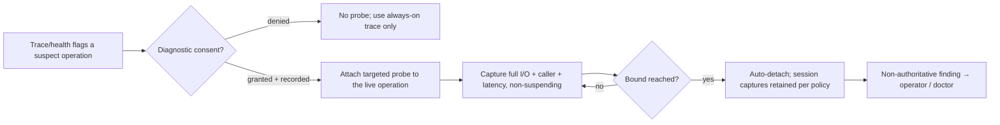

# Live Diagnostics

**Version:** 1.1.0
**Status:** Stable
**Layer:** concept

## Overview

On-demand, targeted, deep, non-suspending diagnosis of a *running* agent or office. The always-on observability plane (l1-telemetry, and the nodus trace) is deliberately low-fidelity — counts and descriptors, never raw content — and uniform across every step: the right trade for continuous cost and privacy, but the wrong tool for diagnosing one misbehaving operation, where an operator needs the *full* inputs, outputs, timing, and call-path of *that* operation, *now*, on the *live* system — because the failure may not reproduce after a restart or in a test environment. Live diagnostics is the active complement: an operator (or the doctor) attaches a focused probe to a specific live operation, captures it at full fidelity within a consent-gated data-safety boundary, observes it without suspending the running system, and detaches. It is a debugger's zoom-in, not a second always-on log.

## Related Specifications

- [l1-telemetry.md](l1-telemetry.md) - The always-on, low-fidelity observation plane this deepens on demand; live diagnostics is its targeted, high-fidelity, opt-in complement.
- [l1-diagnostic-log.md](l1-diagnostic-log.md) - The forensic plane of last resort (post-fault survival); this is the *live* plane (in-situ, while the system runs), a distinct diagnostic mode.
- [l1-doctor.md](l1-doctor.md) - Automated self-healing (HEAL-2/3) acts on diagnostic findings; a probe surfaces the finding, the doctor (or a human) repairs.
- [l1-office-control.md](l1-office-control.md) - Intervention (pause/steer a live office) is the *acting* boundary; diagnosis observes and never intervenes.
- [l1-recursive-decomposition.md](l1-recursive-decomposition.md) - The cost-rolled-up call tree (RD-5) a probe reads for latency attribution.
- [l1-simulation.md](l1-simulation.md) - Modeled play-out with substituted providers; a diagnostic replay re-executes a *real* captured invocation, marked by execution mode (distinct from a simulated run).
- [l1-context-provenance.md](l1-context-provenance.md) - The data-safety boundary a deep capture temporarily, consentfully crosses under audit.
- [../../nodus/specifications/l1-nodus-observability.md](../../nodus/specifications/l1-nodus-observability.md) - Observer neutrality (HO-5), sequence/correlation (HO-7), execution-mode provenance (HO-12), and the replay-based-validation seam a probe reuses.
- [l1-change-attribution.md](l1-change-attribution.md) - [ADDED v1.1.0] Names *which* signals moved during a window; a probe then answers what one implicated operation actually did. Ranking narrows, probing explains.
- [l1-declarative-configuration.md](l1-declarative-configuration.md) - [ADDED v1.1.0] A published introspection routine (LD-10) declares its authority level and timeout through the same declaration-and-registry discipline configuration surfaces use.

## 1. Motivation

The always-on trace answers "what generally happened" cheaply and privately; it cannot answer "what exact arguments did *this* step receive when it failed, and who called it, and where did the 8 seconds go" — because capturing that for every step, always, would be ruinously expensive and a privacy hazard, so the trace deliberately records counts and descriptors, not raw content. Adding more logging is the classic remedy and the classic trap: it requires a redeploy, and the bug may vanish on restart. A forensic log survives a crash but is post-mortem — too late to watch a live hang. What is missing is the ability a debugger gives on a developer's machine but which production denies: attach to the *running* system, zoom in on the *specific* operation under suspicion, capture it at *full* fidelity, watch it without freezing the business, and detach — all without a redeploy the problem would not survive. Live diagnostics is that ability, made safe: targeted, bounded, non-suspending, consent-gated, and non-authoritative.

## 2. Constraints & Assumptions

- Diagnosis **observes**; it never repairs (l1-doctor) and never steers (l1-office-control). Those are separate, acting concerns.
- A deep capture crosses the data-safety floor only under an explicit, recorded consent grant and only within the diagnostic session; secrets are redacted even then.
- A probe is bounded and self-terminating; a forgotten probe cannot accumulate cost or content forever.
- The mechanism is host-supplied and opt-in; the system remains fully observable via the always-on plane without it.

## 3. Core Invariants

Rules every Layer 2 implementation MUST NOT violate:

- **LD-1 (On-demand & targeted, never a second always-on trace):** a diagnostic probe is opened on demand against a **specific** target (a named step/tool/operation, or a specific run) for a bounded window. Absent an open session the system emits only its normal always-on observability; the probe is the scoped exception, never a parallel always-on high-fidelity log.
- **LD-2 (Non-suspending observer):** attaching, observing, and detaching a probe MUST NOT suspend, pause, or perturb the timing or behavior of the diagnosed operation — the system runs as if unobserved (composing observer neutrality, HO-5). A probe that changes what it measures is a defect; diagnosis observes, it does not intervene.
- **LD-3 (Deep fidelity under a consent-gated data-safety boundary):** a probe MAY capture the target's **full** fidelity — actual arguments, return values, exceptions, intermediate values — which the always-on plane deliberately excludes. Because that is raw content, capturing it is **gated**: an explicit, recorded diagnostic-consent grant (who opened it, on what target, when); the captured content lives **only** in the diagnostic session, never promoted into the always-on trace nor persisted beyond the session's declared retention; and secrets are redacted even here. Deep fidelity is a consented, audited, bounded exception to the data-safety floor — never a silent widening of it.
- **LD-4 (No pre-instrumentation, no restart):** a probe attaches to an **already-running** target without pre-declaring it, modifying its definition, or restarting the system. Diagnosing a live operation MUST NOT depend on having anticipated the need — the whole point is to diagnose an *unforeseen* problem in situ, without the restart that would make it vanish.
- **LD-5 (Bounded & self-terminating):** every probe declares a bound — a maximum capture count, a time window, and/or a size cap — and detaches automatically when the bound is reached, so a forgotten probe cannot accumulate cost or content unboundedly. An unbounded probe is forbidden; the bound and the detach reason are recorded.
- **LD-6 (Caller & latency attribution):** a probe MAY answer **"who invoked this"** (the caller chain / call path, composing HO-7 sequence+correlation) and **"where is the time going"** (per-node latency along the sub-tree, composing the cost-rolled-up decomposition tree, RD-5). Latency attribution names the slow sub-operation, not merely the total.
- **LD-7 (Capture-and-replay, deterministic & mode-marked):** a probe MAY capture a specific invocation's full inputs + context so it can be deterministically **re-executed (replayed)** — reproducing a transient failure a restart or a test environment would not, or checking a fix against the exact invocation that failed. A replay carries execution-mode provenance (HO-12) so it is never mistaken for a fresh real invocation, and reuses the always-on plane's replay-based-validation seam rather than a parallel one. Replay is opt-in; a probe that only observes never re-executes.
- **LD-8 (Non-authoritative & traceable):** a diagnostic finding is a **signal** an operator or the doctor acts on; the probe repairs nothing and steers nothing. Every diagnostic session — target, opener, consent grant, bound, captures, detach — is itself traceable, so diagnosis is auditable and its data-safety exception is accountable (composing HEAL-5).
- **LD-9 (Host-supplied, local-first, opt-in):** the probe mechanism is host-supplied and on-device by default; a diagnostic session performs no egress unless the host authorizes it. Absent the capability the system is still fully observable via the always-on plane — live diagnostics is an opt-in deepening, never a runtime dependency.
- **LD-10 (Published introspection routines — the anticipated half):** [ADDED v1.1.0] besides the ad-hoc probe, a component MAY **publish** named, catalogued, on-demand introspection routines — read-only "show me the live state of X" answers (the work items in flight, the open connections, the queue contents, the connected peers) that a caller invokes **by name** and receives as a structured result. A published routine: (a) is **discoverable from a catalogue**, never guessed at; (b) declares the **authority level** it requires, so a sensitive routine is simply unavailable over a lower-trust channel rather than being offered and then refused; (c) declares a **timeout** and is cancellable; (d) returns a **snapshot of live state and mutates nothing** — a routine that writes is not an introspection routine. Where the system spans a supervision hierarchy, catalogues **propagate toward the supervisor**, so a routine may be invoked on a subordinate through the supervising node, and every answer **names the node that produced it**. Published routines are the *anticipated* half of live diagnosis — a stable, permissioned, always-available read surface, cheap enough to be a first move; the probe (LD-1/LD-4) remains the *unanticipated* half, for the question nobody declared in advance. A routine lacking a declared authority level or timeout, or capable of writing, is forbidden.

> L2 specs cannot reach RFC status until all invariants here are addressed in their "Invariant Compliance" section.

## 4. Detailed Design

### 4.1 Two Observation Planes

| Plane | Fidelity | Coverage | Lifetime | Owner |
| --- | --- | --- | --- | --- |
| Always-on trace (l1-telemetry) | Low — counts, descriptors, no raw content | Every step, uniform | Continuous | Always emitted |
| Diagnostic probe (this spec) | High — full raw content, redacted secrets | One target, on demand | Bounded session | Opened by operator/doctor |

The two are complementary: the trace tells you *which* operation to suspect (cheaply, always); the probe tells you *exactly* what that operation did (deeply, briefly, on demand).

[ADDED v1.1.0] A third surface sits between them — the **published introspection routine** (LD-10). It is neither always-on nor ad-hoc: it is a pre-declared, catalogued, permissioned, read-only answer that is *always available* and costs nothing until asked.

| Surface | Declared in advance? | Fidelity | Cost when unused | Typical first question |
| --- | --- | --- | --- | --- |
| Always-on trace | Yes, uniformly | Low — counts and descriptors | Continuous | "Where should I look?" |
| Published routine (LD-10) | Yes, by name | Live state, structured | None | "What is this component doing *right now*?" |
| Diagnostic probe (LD-1/LD-4) | No — attached to an unanticipated target | Full raw content, consent-gated | None | "What exactly did *that* operation do?" |

The escalation order is the cheap-to-expensive order: read the trace, call the routine, and only then open a probe with its consent gate and its retention obligations.

### 4.2 Probe Lifecycle

### 4.3 The Consent Gate (LD-3)

The always-on trace never carries raw user content; a probe deliberately does, for the target under diagnosis. That inversion is exactly why it is gated. Opening a probe records *who* opened it, *what* it targets, and *when*; the captured raw content is confined to the diagnostic session and its declared retention, never leaking into the durable always-on trace; and secret material is redacted even inside the session. The probe is thus a *consented, audited, time-boxed* window through the data-safety floor — the opposite of a silent verbosity dial that would quietly start logging everyone's payloads.

### 4.4 Capture-and-Replay (LD-7)

A captured invocation is a `(inputs, context)` record sufficient to re-run the exact operation. Replaying it re-executes deterministically (given the same component version), reproducing a failure that a fresh environment would not and letting a fix be checked against the very invocation that broke — but the replay is stamped as a replay (HO-12 execution mode), so it never contaminates real-run analytics, and it rides the observability plane's existing replay-based-validation seam rather than inventing a second one.

## 5. Nodus Realization

A diagnostic probe is a host-supplied observer variant: the always-on `AuditProvider` observes every step at trace fidelity, while a probe is a targeted, deep, consent-gated observer the host attaches to one step for a bounded window — the same observer seam (HO-5 neutrality preserved), not a new language primitive. Capture-and-replay reuses the replay-based-validation seam the observability contract already exposes. The workflow language is unchanged; live diagnostics is a host-side observation mode over the existing trace and provider seams.

## 6. Drawbacks & Alternatives

- **Deep capture is a privacy surface.** Mitigated by LD-3: consent-gated, session-confined, secret-redacted, bounded — the opposite of an always-on high-fidelity log.
- **Alternative — just raise the always-on trace fidelity.** Rejected: capturing raw content for every step always is ruinous on cost and a standing privacy hazard (it would gut the data-safety floor); the value is precisely that deep fidelity is *targeted and momentary*, not global and permanent.
- **Alternative — add logging and redeploy.** Rejected as the primary tool: it needs a redeploy the bug may not survive, and it is too slow for a live incident. Live diagnostics needs no pre-instrumentation and no restart (LD-4).
- **Alternative — fold into the forensic diagnostic log.** Rejected: that plane is post-fault survival (dead system); this plane is in-situ observation of a *live* one. Different time, different mechanism.

## Canonical References

| Alias | Path | Purpose |
| --- | --- | --- |
| `[TELEMETRY]` | `.design/main/specifications/l1-telemetry.md` | The always-on plane this deepens on demand. |
| `[DOCTOR]` | `.design/main/specifications/l1-doctor.md` | Consumer of diagnostic findings (self-heal / escalate). |
| `[OBSERVABILITY]` | `.design/nodus/specifications/l1-nodus-observability.md` | Observer neutrality, sequence/correlation, execution-mode, replay-validation seam. |

## Document History

| Version | Date | Author | Notes |
| --- | --- | --- | --- |
| 1.1.0 | 2026-07-23 | Core Team | LD-10 added — **published introspection routines** as the *anticipated* half of live diagnosis, beside the probe's unanticipated half: named, catalogued, discoverable-not-guessed read-only routines returning a live-state snapshot, each declaring the authority level it requires (so a sensitive routine is unavailable rather than offered-then-refused over a lower-trust channel) and a timeout, cancellable, mutating nothing; catalogues propagate toward the supervisor in a supervision hierarchy so a routine can be invoked on a subordinate through its supervisor, with every answer naming the producing node. §4.1 extended with the three-surface escalation table (trace → routine → probe, cheap to expensive). |
| 1.0.0 | 2026-07-22 | Core Team | Initial spec — live diagnostics as the active, on-demand, targeted, non-suspending complement to the always-on observability plane: opened against one target for a bounded window (LD-1), non-suspending observer (LD-2), deep full-fidelity capture under a consent-gated/session-confined/secret-redacted data-safety exception (LD-3), attach-to-a-running-target without pre-instrumentation or restart (LD-4), bounded self-terminating (LD-5), caller + latency attribution composing HO-7/RD-5 (LD-6), deterministic mode-marked capture-and-replay reusing the replay-validation seam (LD-7), non-authoritative + traceable (LD-8), host-supplied local-first opt-in (LD-9). Mined from a studied production runtime-diagnostics tool's live method-observation / trace / time-tunnel commands; the "attach a debugger to production without a restart" capability Cronus's passive planes (telemetry/forensic-log/self-healing) did not cover. Concept-only. |
