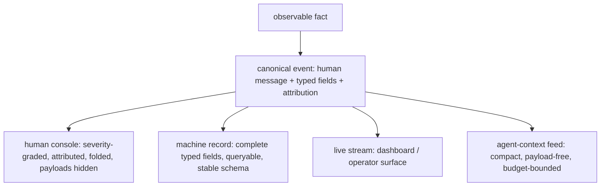
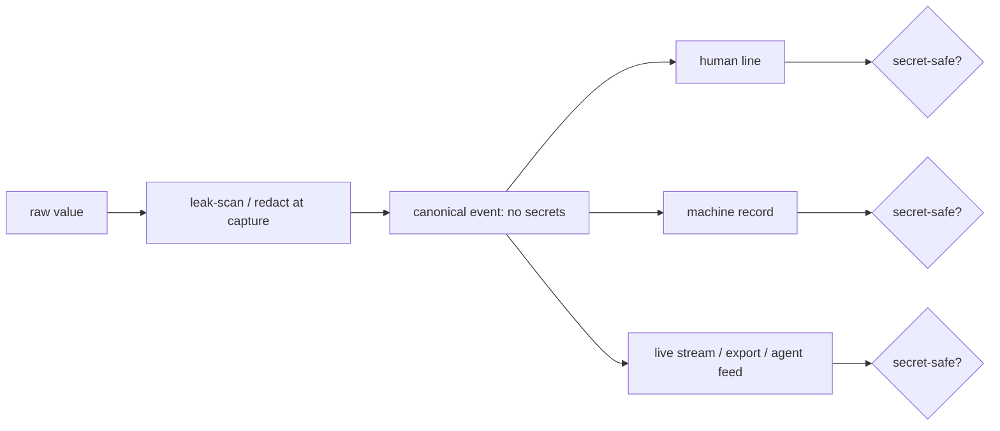

# Log Legibility & Economy

**Version:** 1.0.0
**Status:** Stable
**Layer:** concept

## Overview

A log is only useful if its reader can actually consume it — and Cronus has two
very different readers: a **human** operator who scans for meaning, and an **AI**
agent that parses its own execution record to reflect, self-correct, and hand off.
This spec fixes the contract that makes a single log stream serve both well *and*
keeps it from drowning either one.

The discipline rests on one structural idea: **every observable fact is recorded
once, as one canonical event, and every surface a reader sees is a faithful
projection of that event** — a human console line, a machine-queryable record, a
live stream, an agent-context feed. Projections reshape the event for their reader
but never invent or contradict facts, so a human and an AI never see two divergent
stories. On top of that, **overload is bounded by construction**: what any reader
receives is gated by severity, shaped by an explicit payload policy, and compacted —
with conservative defaults, so full fidelity is always opt-in and never the firehose
a reader gets by accident.

This spec governs *how logs are shaped and bounded for their audiences*. It is not a
new logging channel — it is the legibility-and-economy contract that every channel
(the forensic diagnostic log, the semantic trace, the health snapshot, the live
dashboard) obeys.

## Related Specifications

- [l1-diagnostic-log.md](l1-diagnostic-log.md) - The forensic plane of last resort; this spec is the legibility/economy contract over whatever any plane records, including it.
- [l1-operational-health.md](l1-operational-health.md) - A downstream consumer that aggregates the machine projection into scores; relies on the stable schema (LL-9) and honest reduction (LL-5).
- [l1-dashboard.md](l1-dashboard.md) - The live-stream projection surface; renders the human/operator projection of the canonical event.
- [l1-telemetry.md](l1-telemetry.md) - An outward, opt-in projection; its egress obeys the same secret-safety-per-projection rule (LL-7).
- [l1-security.md](l1-security.md) - Secret isolation the redaction-at-every-projection rule (LL-7) enforces.
- [l1-context-provenance.md](l1-context-provenance.md) - Untrusted content that lands in a log is neutralized before it is rendered back into any model-facing projection (LL-7/LL-8).
- [l1-cache-stable-context.md](l1-cache-stable-context.md) - The AI-context-economy rule (LL-8) composes with prompt-cache stability when a log is fed back into an agent's context.
- [l1-inner-monologue.md](l1-inner-monologue.md) - A primary AI consumer: an agent reading its own recent activity to decide the next move depends on the budget-bounded feed (LL-8).
- [l1-error-reporting.md](l1-error-reporting.md) - Shares the scrub discipline (LL-7) applied before any projection egresses.

## 1. Motivation

Two failure modes make logs useless, and they pull in opposite directions.

**Illegibility.** A log written only as structured records is unreadable by a human
at a glance; a log written only as prose is unqueryable by a machine and unparseable
by an AI. Worse, when a system keeps *separate* human and machine logs, they drift —
the pretty console line and the JSON record disagree, and now a human and an AI
investigating the same incident reach different conclusions. The fix is not "pick
one audience" but "one canonical event, faithfully projected to each."

**Overload.** The opposite failure is a log so voluminous it defeats its own reader.
A human scrolling a firehose sees nothing; an AI that pastes its raw execution log
back into its own context evicts the very working memory it needed and may even lose
the plot. Full tool inputs, entire model prompts, and every repeated retry, all
captured at full fidelity by default, produce a record that is technically complete
and practically worthless — and, for the AI reader, actively harmful because context
is a scarce, costed resource.

The two pressures resolve together only with a deliberate contract: a single source
of truth, projected per reader, bounded by explicit and conservative controls, with
every reduction made honest so no reader mistakes an excerpt for the whole. "Ideal
for a human and for an AI, without overloading either" is not a tuning exercise — it
is this contract.

## 2. Constraints & Assumptions

- There is exactly one canonical record per observable fact; human/machine/stream/
  agent surfaces are projections of it, not parallel logs.
- Context is a scarce, costed resource for the AI reader; economy toward it is a
  correctness concern, not a nicety.
- Conservative defaults are mandatory: the safe, bounded projection is what a reader
  gets unless it explicitly opts into more.
- Redaction is assumed to run at capture and to hold at every projection; this spec
  does not define the detector, only where the guarantee must hold.
- This spec shapes and bounds logs; it does not mandate a specific transport, store,
  or rendering technology.

## 3. Core Invariants

Rules every Layer 2 implementation MUST NOT violate:

- **LL-1 (Single canonical event, faithful projections):** every observable fact is
  recorded once as one canonical structured event. Every surface a reader consumes —
  human console, machine record, live stream, agent-context feed — is a *projection*
  of that event, not an independently authored log. A projection may omit or reshape
  fields for its reader, but MUST NOT introduce a fact absent from the canonical
  event nor contradict it. A human and an AI reading "the same log" therefore read a
  consistent story, never two divergent ones.

- **LL-2 (Dual-audience faithfulness on one record):** the canonical event carries
  both a human-legible message (a stable narrative statement) and machine-legible
  structured fields (stable-keyed, typed) as first-class content on the same record.
  Neither is produced by a lossy reparse of the other; a human reads the message and
  a machine reads the fields, and both describe the same fact.

- **LL-3 (Consumer-shaped projection):** each projection is shaped for how its reader
  reads — the human surface is severity-graded, attribution-tagged, scannable, and
  salient-first with payloads folded; the machine surface is complete, typed, and
  queryable; the agent-context surface is compact and payload-free. The shape is a
  property of the projection; the canonical event stays complete regardless of how
  any projection thins it.

- **LL-4 (Overload bounded by construction):** the volume any reader receives is
  bounded by three composable controls — **severity/verbosity gating** (which levels
  are admitted), **payload policy** (whether a field carries full content, a
  truncated excerpt, or only a descriptor/count), and **compaction** (folding
  repeats into a single "×N" record, windowing a long tail). Defaults are
  conservative: payloads are excerpted or omitted and the highest-cost captures
  (full prompts, full tool bodies) are off unless explicitly enabled. No reader is
  handed an unbounded stream by default.

- **LL-5 (Honest reduction):** every reduction — truncation, folding, omission,
  sampling — is flagged on the record with enough metadata to know that reduction
  happened and its magnitude (e.g. a truncation carries the original size; a fold
  carries the repeat count; a sample carries its rate). A reduced record MUST NOT
  masquerade as complete. This protects the human from a false sense of the whole and
  the AI from reasoning over an excerpt as if it were the full record.

- **LL-6 (Attribution for filterability):** every event carries stable attribution —
  at minimum the emitting component/subsystem, a severity, a category, a
  correlation id for its run, and the acting role/agent when one applies — so any
  reader can narrow to exactly the slice it needs without consuming the whole stream.
  Attribution is the mechanism that makes economy achievable: a reader can always
  filter down rather than drink from the firehose.

- **LL-7 (Secret-safe at every projection):** redaction and secret-safety hold at the
  point each projection is rendered, not only at the underlying sink. A compact human
  line, a structured record, a live stream, an outward export, and an agent-context
  feed each independently must never carry secrets, credentials, or raw sensitive
  payloads. Widening visibility (streaming to a dashboard, feeding an agent, exporting
  a report) never widens secret exposure, and a sensitive source may be denylisted
  from capture entirely.

- **LL-8 (AI-consumer economy):** when a log is fed back into an agent's own context —
  for reflection, self-correction, or hand-off — the feed is budget-aware by
  contract: it is the compact, payload-free, compacted projection (LL-3/LL-4),
  summarized or tail-windowed to a declared budget, never the raw record firehose.
  An agent reading its own logs MUST NOT thereby evict its working context. This is
  the AI half of the dual-audience goal: legible *and* economical to the model,
  composing with the context-budget and prompt-cache disciplines.

- **LL-9 (Stable, self-describing schema):** the canonical event schema is stable,
  versioned, namespaced, and self-describing (named typed fields under a documented
  namespace) so a machine or AI consumer can parse and reason over logs without a
  human explaining the format. A schema change is a versioned migration with a
  defined forward path, never a silent break that strands existing records or a
  consumer parsing them.

> L2 specs cannot reach RFC status until all invariants here are addressed in their
> "Invariant Compliance" section.

## 4. Detailed Design

### 4.1 One Event, Many Projections

The canonical event is authored once at a single emission point and fans out to every
surface. Each surface is a projection — a view, never a second log:



Because all four descend from one event (LL-1), they cannot disagree. Because each is
shaped for its reader (LL-3), none is forced to be legible to a reader it was not
meant for. The machine record is the complete one; the others are deliberate
thinnings of it.

### 4.2 The Three Bounding Controls (LL-4)

Overload is held off by three orthogonal, composable controls. A reader's received
volume is the product of all three:

| Control | Question it answers | Example settings |
| --- | --- | --- |
| Severity / verbosity gating | *Which levels are admitted?* | error-only · info+ · debug+ (opt-in) |
| Payload policy | *How much of a field's content?* | descriptor-only (default off) · truncated excerpt · full (opt-in) |
| Compaction | *How are repeats and long tails handled?* | fold repeats to "×N" · window the tail · sample 1/k |

The defaults sit on the conservative end of every axis: the cheapest projection that
is still faithful. Raising fidelity — full payloads, debug level, no folding — is an
explicit operator or caller choice, never the accidental baseline.

### 4.3 Payload Policy and Honest Reduction (LL-4 + LL-5)

The costliest content — full model prompts and full tool input/output — is gated by
an explicit policy with a safe default, and any reduction is recorded honestly:

```text
[REFERENCE]
payload policy ∈ { descriptor-only, excerpt(cap), full }
  descriptor-only : record shape/size/counts, never the body        (default for prompts)
  excerpt(cap)    : leak-scan, then truncate to cap on a safe boundary (default for tool I/O)
  full            : leak-scan, no truncation                          (explicit opt-in)

on reduction, the record carries:
  reduced = true, original_size = N, reason = truncated | folded | sampled | omitted
```

A record that was excerpted, folded, or sampled says so and says by how much (LL-5).
The reader — human or AI — is never left to assume an excerpt is the whole.

### 4.4 Redaction Holds at Every Projection (LL-7)

Redaction is applied at capture, before the value enters the canonical event, and the
guarantee is re-asserted at each projection boundary rather than trusted to the sink:



A sensitive source (a credential-bearing tool, a personal-memory recall) may be
denylisted from capture entirely — its I/O never reaches any projection. Widening who
can see a projection never widens what secrets a projection may contain.

### 4.5 The AI Reader (LL-8)

The AI consumer is special because its context is a scarce, costed, cache-sensitive
resource. A log fed back to an agent is always the compact projection: the
human/agent-facing message and descriptors, never full payloads, compacted and
tail-windowed to a declared token budget. Feeding an agent its own raw trace would
evict working memory and defeat the purpose; the contract forbids it. This is where
"ideal for the AI" and "without overloading" become the same requirement.

## 5. Drawbacks & Alternatives

- **Alternative — separate human and machine logs.** Rejected: they drift (LL-1), so a
  human and an AI investigating one incident reach different conclusions. One
  canonical event with projections is strictly safer.
- **Alternative — log everything at full fidelity, filter on read.** Rejected: defeats
  LL-4/LL-8. For the AI reader, cost and context-eviction are incurred at *capture and
  feed* time, not deferred to a query; and a full-fidelity default is a standing
  secret-exposure and volume liability.
- **Alternative — silent truncation to save space.** Rejected: violates LL-5. A
  silently truncated record is worse than a short one, because the reader trusts it as
  complete. Honest reduction is mandatory.
- **Projection-shaping cost.** Accepted: shaping per reader adds work at emission.
  Mitigated by making the machine record the complete one and the others cheap
  thinnings, and by gating expensive captures off by default so the common path is
  the cheap path.

## Canonical References

| Alias | Path | Purpose |
| --- | --- | --- |
| `[DIAG-LOG]` | `.design/main/specifications/l1-diagnostic-log.md` | The forensic plane this legibility/economy contract shapes; boundary of what a projection may thin. |
| `[OP-HEALTH]` | `.design/main/specifications/l1-operational-health.md` | Downstream consumer of the machine projection; depends on stable schema (LL-9) and honest reduction (LL-5). |
| `[SECURITY]` | `.design/main/specifications/l1-security.md` | Secret isolation the per-projection redaction rule (LL-7) enforces. |
| `[DASHBOARD]` | `.design/main/specifications/l1-dashboard.md` | The live-stream projection surface (LL-3). |

## Document History

| Version | Date | Author | Notes |
| --- | --- | --- | --- |
| 1.0.0 | 2026-07-07 | Core Team | Initial spec — dual-audience log legibility & economy: one canonical event faithfully projected to human/machine/stream/agent surfaces with no divergence (LL-1), human message + machine fields both first-class on one record (LL-2), consumer-shaped projections over a complete canonical event (LL-3), overload bounded by severity × payload-policy × compaction with conservative defaults (LL-4), honest reduction — every truncation/fold/omission/sample flagged with magnitude (LL-5), stable attribution for filterability (LL-6), secret-safety re-asserted at every projection with source denylisting (LL-7), AI-consumer context economy — compact budget-bounded feed, never the raw firehose (LL-8), stable self-describing versioned schema with a migration path (LL-9). The legibility/economy contract over every observation channel (forensic diagnostic log, semantic trace, health, dashboard, telemetry); nodus realization of the single-canonical-event / dual-audience core = l1-nodus-observability HO-11. |
