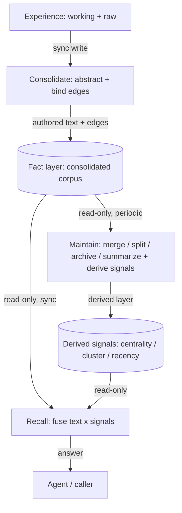

# Memory Consolidation

**Version:** 0.1.0
**Status:** RFC
**Layer:** concept

## Overview

The technology-agnostic model of **how the durable memory corpus evolves and stays healthy over time**. Where `l1-memory-model` defines *what* is remembered (scopes, item shape, recall fusion, curation ownership) and `l1-memory-intelligence` defines the *active query surface* (grounded answers, temporal modes, conflict surfacing), this spec defines the **maintenance and consolidation cognitive layer** that sits between them: how raw capture sediments into durable abstraction, how consolidation runs off the hot path, how relationships are bound at write time, how the corpus is actively maintained against the pathologies it accumulates, and how derived ranking signals are kept strictly separate from authored fact.

The organizing idea is a three-timescale loop, borrowed by analogy from how a mind consolidates experience: a **synchronous write** that turns experience into an abstraction and binds its relationships; an **asynchronous, scheduled consolidation** that reorganizes the accumulated corpus without polluting it; and a **synchronous recall** that fuses the authored graph with cheaply-precomputed signals into an answer. Each timescale differs by orders of magnitude, so each takes a different shape (sync / periodic / sync), and any one may degrade or fail without collapsing the others.

## Related Specifications

- [l1-memory-model.md](l1-memory-model.md) - The substrate this layer maintains (scopes MEM-1, recall fusion MEM-3, text-as-truth MEM-4, decay/prune MEM-5, compounding curation MEM-6, ownership split MEM-7, provenance MEM-9). This spec refines the curator (MEM-7) and compounding (MEM-6) into an explicit consolidation + maintenance model.
- [l1-memory-intelligence.md](l1-memory-intelligence.md) - The active query surface above the substrate; consumes the ranking signals and lifecycle states this layer maintains (MI-2 temporal modes, MI-4 conflict surfacing, MI-9 lifecycle states).
- [l1-storage-model.md](l1-storage-model.md) - Refines STO-4 (multi-level memory) along a new processing-depth axis, and STO-8 (human-inspectable, editable state) into the co-edit safety contract.
- [l2-memory-store.md](l2-memory-store.md) - Concrete store carrying entity links (§4.7), graph-proximity boost (§4.16), two-phase consolidation (§4.12), and the bi-temporal record this layer's actions operate on.
- [l1-scheduler-model.md](l1-scheduler-model.md) - Fires the periodic consolidation and maintenance passes.
- [l1-inner-monologue.md](l1-inner-monologue.md) - The proactivity layer that decides whether/when/how to surface the interest topics this layer extracts (MC-10).
- [l1-doctor.md](l1-doctor.md) - System-level self-healing; this spec is its corpus-level analogue (health of the memory graph, not of the process).

## 1. Motivation

A memory substrate that only accepts writes and returns ranked reads is correct but not *durable-quality*: left alone, an accumulating corpus rots in predictable ways. The same fact gets recorded twice under drifting terminology. A single node swells until it mixes five topics and retrieval returns an undifferentiated blob. Relationships that should exist were never drawn because the write moment missed them. Long-untouched nodes crowd the recall set with dead weight. And the corpus stays a flat pile of atoms with no "topic overview" layer to answer a broad question.

The naive fix — do all of this at read time, or push it onto every caller — is wrong twice over. Read-time reorganization makes recall slow and non-deterministic; per-caller maintenance produces inconsistent, un-auditable corpus mutations. This spec lifts corpus evolution into a dedicated, off-hot-path layer with three properties the substrate alone cannot guarantee: relationships are bound **once, at write time** (never reconstructed by expensive read-time inference); maintenance is a **scheduled, incremental, idempotent** background labor with confidence gates and audit trails; and every statistical signal that guides ranking is **derived, versioned, and disposable** — never confused with the authored facts it summarizes.

## 2. Constraints & Assumptions

- Local-first: every operation here must function with no network and no remote model. Consolidation and maintenance that *require* a generator degrade to a no-op (deferred, retried later), never to corruption.
- Recall stays on the hot path (MEM-2/MEM-3): this layer's contribution to recall is **precomputed offline**, so a plain recall pays no model call and no graph re-scan for the signals defined here.
- This layer owns **no new storage engine** and defines **no new scheduling or visualization engine** — it composes the curator (MEM-7), the scheduler, and the store's bi-temporal record.
- Durable memory is small, curated text plus rebuildable indices (MEM-4/STO-8), and is **co-editable by both human and agent** — the safety model must assume concurrent, out-of-band edits to the same items.
- Consolidation is asynchronous by construction: freshly written memory is recall-visible immediately (MI-3); this layer never gates visibility on consolidation completing.

## 3. Core Invariants (Layer 1 only)

Rules every Layer 2 implementation MUST NOT violate:

- **MC-1 (Processing-depth tiers):** durable memory is organized along a **processing-depth axis** — **raw** (verbatim captured evidence: transcripts, source documents), **working** (recent, lightly-processed notes organized by occurrence), and **consolidated** (durable, reusable abstractions) — orthogonal to and composable with the scope axis (MEM-1). Refinement flows one way, raw → working → consolidated; consolidation **never rewrites raw evidence** (evidence is immutable, so any consolidated claim can be checked against what actually happened). A consolidated item is an abstraction, not a copy of its source.
- **MC-2 (Scheduled, incremental, idempotent consolidation):** promotion from working to consolidated runs as an **asynchronous scheduled pass** off the hot path (composing the curator MEM-7 and the scheduler). It is **incremental** — it processes only inputs that changed since its last checkpoint — and **idempotent under failure**: an input whose consolidation fails is **not** checkpointed, so it is reprocessed on the next pass. Success is never silently dropped; partial failure never marks unfinished work as done. A consolidation pass that finds no changed input, or has no generator available, completes as a successful no-op.
- **MC-3 (Write-time relationship binding, additive-only):** relationships between durable memories are established **at the moment of the consolidation write**, not reconstructed by later read-time inference. A relationship is part of the memory's authored content (there is no independent edge store to drift out of sync), carries an **open typed predicate** (e.g. *derived-from*, *relates-to*, *depends-on*), and every consolidated item that makes a durable claim MUST carry a **provenance edge** back to the working/raw source that grounds it. Updates are **additive with respect to edges**: an update may rewrite prose, but MUST NOT drop an existing provenance edge or relationship edge — the edge set only grows, so downstream traversal and recall never lose a connection.
- **MC-4 (Consolidation action algebra):** when a new unit of memory meets the existing corpus, the write resolves to exactly one action from a closed set — **create** (no equivalent abstraction exists), **corroborate** (the same abstraction recurs → attach the new source, strengthen the statement), **refine** (new material extends scope, steps, preconditions, or boundary conditions), or **correct** (new material fixes an error or resolves a stale claim). This is the routine same-abstraction write decision and is a finer taxonomy of MEM-6 supersession; it is distinct from and upstream of MI-4's conflict *adjudication* (which governs only genuine, ambiguous semantic disagreement). *Corroborate* and *refine* are additive; *correct* records the correction non-destructively (MEM-6). The action taken is recorded on the item.
- **MC-5 (Fact layer vs derived-signal layer):** the durable corpus — authored text plus authored edges (MC-3) — is the **fact layer**. Every statistical or algorithmic signal computed *from* it (node centrality, topic-cluster membership, recency/activity scores, archived flags) lives in a separate **derived layer** and MUST NOT be treated as, mixed into, or persisted as authored fact. Each derived signal is **independently versioned** and **independently optional**: a missing, stale, or version-incompatible signal degrades ranking or maintenance **gracefully to a neutral default**, never blocks a read or a write. A cold corpus with no derived signals yet computed is a fully supported operating state.
- **MC-6 (Corpus-maintenance action set):** the consolidated corpus is actively maintained against a **closed set of accumulation pathologies**, each with a dedicated action and its own cadence: **redundancy → merge**, **overload → split**, **staleness → archive**, and **abstraction-gap → summarize** (MC-7). A lossy or high-blast-radius action (merge, which rewrites references and discards a duplicate) requires an **elevated confidence gate** (e.g. multi-sample agreement) and, when the gate is not met, surfaces to adjudication rather than acting; a reversible or purely-additive action (summarize, archive) MAY auto-apply under a lower gate. Maintenance is **anti-cycle guarded** — a cooldown prevents a node from oscillating between opposing actions (split then merge then split). Every maintenance action is **audited** (action, targets, actor, instant) and, where it mutates the fact layer, obeys the write-safety protocol (MC-9).
- **MC-7 (Emergent topic-cluster abstraction):** periodically, the corpus graph is clustered into topics; a cluster that is **stable, active, sufficiently large, sufficiently diverse, and lacks an existing hub** gains a synthesized **summary node** — an abstraction over its members. The summary is **grounded strictly in its members** (every claim it makes carries an edge to the member it rests on; it invents nothing beyond them), is **size-bounded** so it does not immediately re-trigger split (MC-6), and is thereafter an **ordinary memory with no privileged type** — it evolves through MC-4 and MC-6 exactly like any other node and is reclaimed by archive if it goes stale. This gives recall a genuine "topic overview" answer instead of scattered atoms, without a parallel summary-only store.
- **MC-8 (Multi-signal, offline-precomputed ranking):** recall ranking fuses independent signals **multiplicatively** — text relevance × node authority (centrality) × topic-cluster affinity to the query's seed hits × recency — so that a near-zero weak signal **vetoes** a hit rather than being averaged away, and factors of differing magnitude combine without hand-tuned normalization. All non-text factors are **precomputed by the offline maintenance pass** (MC-5), so the default recall path adds no model call and no graph re-scan; any missing factor degrades to a neutral multiplier of one (MC-5). This sharpens MEM-3's multi-signal requirement into a specific composition discipline; the exact factor formulas are an L2 concern.
- **MC-9 (Co-edit write safety):** because the durable corpus is human-and-agent co-editable (STO-8), every fact-layer write uses **optimistic concurrency** — it stamps the version it read, and on commit re-checks that the target has not changed underneath it, re-planning against the latest content if it has — and passes a **mechanical conservation check** (the post-write edge set satisfies the additive/conservation rule of the action per MC-3/MC-6) *before* commit. A multi-item action (merge, split) commits **transactionally or rolls back whole**. A failed conservation check or an exhausted retry **refuses the write and surfaces it**, never partially corrupts the corpus.
- **MC-10 (Interest extraction is advisory, not interruptive):** consolidation MAY emit a small, bounded set of **current interest topics** — what in the recent window is worth proactive attention — each carrying its rationale and evidence, and **deduplicated against a recent diversity window** so the same topic is not resurfaced repeatedly. This layer decides only **what** is interesting and exposes it as a pure, read-only, generator-free surface; the decision of **whether, when, and how** to surface it to the user belongs entirely to the proactivity layer (`l1-inner-monologue`). The memory layer never itself interrupts the user.

> L2 specs cannot reach RFC status until all invariants here are addressed in their "Invariant Compliance" section.

## 4. Detailed Design

### 4.1 The three-timescale loop



| Timescale | Stage | Cadence | Writes fact layer? | Writes derived layer? |
| --- | --- | --- | --- | --- |
| Synchronous (on ingest) | **Consolidate-write** (MC-3, MC-4) | per salient input | yes (the authoring stage) | no |
| Periodic / idle | **Maintain** (MC-6, MC-7, MC-8-signals) | inline / daily / weekly per action | only merge/split/summarize, under MC-9 | yes (all ranking signals) |
| Synchronous (on query) | **Recall** (MC-8) | per query | no | no (read-only; may append usage counters as derived) |

The asymmetry is deliberate: **writing and reading are synchronous** (a caller waits), so they must be cheap and never block on heavy reorganization; **maintenance is offline** (idle / scheduled), so it may afford graph-wide algorithms and multi-sample confidence gates. Because the three differ by orders of magnitude in frequency and latency budget, they are designed as three different shapes rather than one uniform pipeline.

### 4.2 Processing-depth tiers (MC-1)

The scope axis (MEM-1: global / workspace / employee / session) answers *who a memory is about*. The processing-depth axis answers *how refined it is*:

```text
raw          -> verbatim evidence, immutable        (transcripts, source docs)
working      -> recent lightly-processed notes      (organized by occurrence, shallow)
consolidated -> durable reusable abstractions       (the recallable long-term corpus)
```

The two axes are orthogonal: an *employee-scope consolidated* skill and a *workspace-scope working* note both exist. Raw is kept so any consolidated claim is checkable against what actually happened (this is the ground under MC-3's provenance edges). Working is the shallow buffer that captures "what happened recently" before it is worth abstracting; it is the input MC-2 consolidates. Consolidation reads working (and raw for grounding) and writes consolidated — it **never** edits raw, and by default does not rewrite working prose either (working is the occurrence record; consolidated is the abstraction). This complements MEM-6's session→durable promotion by giving the intermediate "working" tier an explicit home rather than an implicit one.

### 4.3 Write-time relationship binding (MC-3)

The single most important design stance: **the write moment is the only trusted time to establish a relationship.** A relationship missed at write time is *not* patched by a later background scan — that would be rework, and worse, would require read-time inference the recall path cannot afford. So the consolidation write does the recall-for-linking itself: before writing a unit it retrieves node-level candidates from the consolidated corpus, classifies each as *same-abstraction* (→ an MC-4 update target), *related* (→ draw a relationship edge), or *unrelated* (→ ignore), and only then writes.

Edges are authored **in the memory's own content**, not in a side table — there is no independent edge store that can drift out of sync with the text. Two edge classes are load-bearing:

- **Provenance edges** (*derived-from*) point a consolidated node back to the working/raw material that grounds it. These are the audit trail MC-1 makes possible and MUST survive every subsequent edit.
- **Relationship edges** (open typed predicates: *relates-to*, *depends-on*, *contrasts-with*, …) connect consolidated nodes to each other.

The additive-only rule (MC-3) is what makes the graph trustworthy over time: an agent may freely *rewrite the prose* of a node, but the edit is only allowed to **add** edges, never silently drop one. Losing an edge loses a recall path and an audit link; prose can always be regenerated, edges cannot.

### 4.4 Consolidation action algebra (MC-4) vs conflict adjudication (MI-4)

These are two different decisions and must not be conflated:

| | MC-4 (this spec) | MI-4 (`l1-memory-intelligence`) |
| --- | --- | --- |
| When | routine consolidation write, same abstraction recurs | genuine semantic disagreement detected |
| Question | create / corroborate / refine / correct? | auto-supersede, or surface for adjudication? |
| Default | act (mostly additive) | auto-supersede only when unambiguous; else surface |
| Output | an updated or new consolidated node | a conflict report with a bounded recommendation set |

MC-4 is the common case — a fact seen again, a procedure gaining a step — and resolves to a mostly-additive write. MI-4 is the exceptional case — two durable claims that actually contradict where recency does not settle truth — and resolves to a surfaced, human-or-agent-adjudicated decision. A *correct* action (MC-4) that is clean and unambiguous stays here; one that is genuinely contested escalates into MI-4's report.

### 4.5 Fact vs derived layer, and graceful degradation (MC-5)

```text
FACT LAYER  (authored, checkable, the source of truth)
  consolidated nodes  = text + provenance edges + relationship edges

DERIVED LAYER  (computed, versioned, disposable — never authored fact)
  centrality        <- graph in-degree over the fact layer
  topic clusters    <- community detection over the fact layer
  recency/activity  <- usage counters + age decay
  archived set      <- threshold over recency
```

The boundary is a hard invariant because the two have different truth status: fact-layer edges were *authored* (a write decided them); derived signals are *probabilistic inferences* that will be recomputed and may change. Mixing them would let a statistical guess masquerade as a decision. Every derived signal file carries a version and a computed-at stamp; recall checks the version on load and, on mismatch or absence, **drops that one factor to a neutral multiplier** (MC-8) and logs a warning rather than failing. This is what makes cold-start work: an empty derived layer yields base text-relevance ranking, which is weaker but never broken.

### 4.6 Corpus maintenance (MC-6) and emergent abstraction (MC-7)

Each pathology, its action, cadence, gate, and reversibility:

| Pathology | Action | Cadence | Confidence gate | Fact-layer effect |
| --- | --- | --- | --- | --- |
| Redundancy (same concept, two nodes) | **merge** | periodic batch | **elevated** (multi-sample agreement); miss → surface | lossy: rewrite inbound references, drop duplicate — transactional (MC-9) |
| Overload (node mixes many topics / too long) | **split** | inline, right after a write crosses a size/dispersion threshold | model-based dispersion judgment | additive: one overview + N children, edges conserved (MC-9) |
| Staleness (long-untouched, low utility) | **archive** | frequent batch | threshold on a recency score | soft, reversible: excluded from default recall, not deleted (composes MI-9 `archived`, prune-protective) |
| Abstraction-gap (a topic has atoms but no overview) | **summarize** | periodic batch | cluster stability + size + diversity + no-existing-hub | additive: a grounded, size-bounded summary node (MC-7) |

Two design notes carry weight:

- **Confidence proportional to blast radius.** *Summarize* and *archive* are additive/reversible, so they may auto-apply; *merge* is lossy and rewrites other nodes' references, so it demands multi-sample agreement and otherwise defers to a surfaced report. This mirrors risk-proportional autonomy elsewhere in the office model.
- **Emergent hubs, not a hub type.** A summary node created by MC-7 and an overview node produced by a split are recognized *structurally* — by whether a node's edges cover most of a cluster — not by a special marker. So a split's overview is naturally seen as an existing hub and MC-7 does not create a redundant one; and a summary that later goes stale is archived like anything else. There is no privileged "summary" class to special-case in recall or maintenance.

Archive uses a continuous recency score that decays with age but is **cushioned by centrality** (a highly-connected hub is not archived just for being old) and is **auto-thawed** the instant anything touches the node (a recall hit, a consolidation update). Archive is the one maintenance action that needs no clustering, so it can run on a faster cadence than the graph-wide actions.

### 4.7 Recall signal fusion (MC-8)

```text
final_score(hit) = base_text_relevance          # from lexical + semantic recall (MEM-3)
                 x centrality_factor(node)       # authority: more inbound edges -> higher, dampened
                 x cluster_factor(node, seeds)   # affinity: same topic cluster as the top hits -> boost
                 x recency_factor(node)          # freshness: decays with time-since-touch
```

Multiplicative, not additive, for three reasons: the factors are on incomparable scales (a text score and a centrality count) and multiplication needs no normalization; a genuinely weak factor (an ice-cold or wholly-isolated node) should *veto* rather than be diluted; and default parameters keep each factor in a bounded band so no single factor drowns the base relevance. Crucially, every non-text factor is read from the precomputed derived layer (MC-5) — the recall path itself runs **no model call and no graph walk** to rank, which is what keeps it hot-path-cheap (MEM-2).

Recall additionally deduplicates at the **node** level (not the raw-fragment level) and surfaces each node with its short authored summary alongside the matching fragment, so the caller sees "which memory matched" rather than an orphan fragment. On-demand relationship expansion — showing a hit's neighbors from the authored graph — is a **bounded, opt-in** enrichment, kept distinct from the ranked recall itself so recall stays short and predictable.

### 4.8 Interest extraction (MC-10)

Consolidation, having just processed the recent window, is the cheapest place to notice "what is worth attention." It emits at most a few interest topics (each: a title, a one-line rationale, supporting evidence), deduplicated against the topics it emitted over a recent diversity window so it does not nag about the same thread every day. This is a **pure hand-off**: the memory layer produces the material and stops. The proactivity layer (`l1-inner-monologue`) reads it and applies its own thresholds and suppression to decide whether to raise anything at all. The separation is the point — deciding *what is interesting* is a memory concern; deciding *whether to interrupt a human* is not.

## 5. Ideas-to-Adopt Mapping (No-Duplication Ledger)

Disposition of every mechanic observed in the surveyed external memory-agent reference, against what this project already owns. Restated in plain language; the reference is not a source of authority — these invariants stand on their own. Mechanics already dispositioned by the `l1-memory-intelligence` ledger are not repeated here.

| Observed mechanic | Disposition | Home |
| --- | --- | --- |
| Human-readable, directly co-editable file corpus as the memory itself (not a mirror) | Already owned; sharpened | STO-8 + MEM-4; MC-9 adds the co-edit safety contract this stance requires |
| Processing-depth tiers: raw → working → consolidated | **Adopt → MC-1** | §4.2 (a new axis orthogonal to MEM-1 scopes) |
| Long-term buckets (procedure / personal / knowledge) | Already owned | MEM-8 typed kinds, `l2-memory-store` §4.15 `MemoryKind` — the bucket idea is the closed kind taxonomy |
| Scheduled off-hours consolidation ("sleep-time" batch) | **Adopt → MC-2** | §4.1 (refines the MEM-7 curator into a scheduled pass) |
| Incremental change-detection + failed-not-checkpointed retry | **Adopt → MC-2** | §4.1 (idempotent-under-failure discipline) |
| Relationships bound at write time, never back-filled by a scan | **Adopt → MC-3** | §4.3 |
| Edges authored in-text (no independent edge store) + open typed predicates | **Adopt → MC-3** | §4.3; sharpens `l2-memory-store` §4.7 entity links |
| Provenance edge back to source, preserved across every edit (additive-only) | **Adopt → MC-3** | §4.3 (extends MEM-9 provenance into a traversable, conserved edge) |
| create / corroborate / refine / correct write algebra | **Adopt → MC-4** | §4.4 (finer taxonomy of MEM-6; distinct from MI-4 adjudication) |
| Fact layer vs derived-signal layer, hard separation | **Adopt → MC-5** | §4.5 (elevates MEM-4 into a per-signal boundary) |
| Per-signal versioning + graceful degradation + cold-start | **Adopt → MC-5** | §4.5 |
| Corpus-maintenance action set (merge / split / archive / summarize) | **Adopt → MC-6** | §4.6 (the corpus-level analogue of `l1-doctor`) |
| Confidence proportional to blast radius (multi-sample vote for lossy merge) | **Adopt → MC-6** | §4.6 (mirrors risk-proportional autonomy) |
| Anti-cycle cooldowns between opposing maintenance actions | **Adopt → MC-6** | §4.6 |
| Emergent topic-cluster abstraction → grounded summary hub nodes | **Adopt → MC-7** | §4.6 (graph-clustering-driven abstraction; no privileged node type) |
| Structural hub recognition (edge coverage), not a hub marker | **Adopt → MC-7** | §4.6 |
| Multiplicative multi-signal recall ranking (text × centrality × cluster × recency) | **Adopt → MC-8** | §4.7 (sharpens MEM-3 fusion) |
| Ranking signals precomputed offline → zero model calls on the recall path | **Adopt → MC-8** | §4.7 (composes MC-5) |
| Optimistic-concurrency + conservation-check write protocol; transactional multi-item writes | **Adopt → MC-9** | §4.5/§4.6 realize it; §3 states it |
| Diversity-windowed interest extraction feeding a proactive surface | **Adopt → MC-10** | §4.8 (memory decides *what*; `l1-inner-monologue` decides *whether/when*) |
| Recency score with centrality cushion + auto-thaw on touch | Refinement candidate | L2 detail under MC-6 archive + MI-9; formula deferred to `l2-memory-store` |
| Structure-preserving segmentation (keep headings/tables/relationships intact per fragment) | Refinement candidate | L2 retrieval quality — `l2-memory-store` chunking + `l1-retrieval-evaluation`; principle noted, formula deferred |
| Node-level vs fragment-level retrieval granularity (summary recall for linking vs QA) | Refinement candidate | recall fusion (`l2-memory-store` §4.2); the linking-recall granularity is the MC-3 write-time retrieval |
| Corpus health checks (dangling edge, broken provenance) | Refinement candidate | corpus-level composition of `l1-doctor`; a maintenance-pass sweep |
| Runtime assembly (config-driven jobs: request / stream / background / scheduled) | Out of scope here | host/runtime concern — `l1-automation-pipeline` trigger taxonomy + `l1-workflow-language`; see §6 |

## 6. Nodus Relevance

The workflow runtime carries pending storage/policy extension seams (`l1-nodus-portability` LP-3; `l2-nodus-portability` StorageProvider/PolicyProvider) and a memory error category. This layer shapes those seams without expanding the DSL, and only where `l1-memory-intelligence` §6 has not already mapped the ground:

- **Maintenance is a host job a workflow triggers, not DSL syntax.** The scheduled/incremental consolidation and maintenance passes (MC-2, MC-6) map onto the runtime's existing background/scheduled job shapes (`l1-automation-pipeline` trigger types `schedule` / `state_change`) — a workflow may *fire* a consolidation pass or *react* to its completion, but the pass itself is host labor. No new construct is needed.
- **Derived signals live behind the StorageProvider, not in the workflow.** Centrality, cluster membership, and recency (MC-5/MC-8) are computed host-side and exposed to a workflow only as already-ranked results with confidence/provenance. A step consumes ranked memory; it never computes a ranking signal. This keeps the pending StorageProvider contract a *query* surface, consistent with `l1-memory-intelligence`'s MI-1/MI-2 shaping of it.
- **The write algebra and additive-only guarantee are a StorageProvider write-mode contract.** MC-4's action set and MC-3/MC-9's additive-edge + optimistic-concurrency guarantees are properties the memory provider promises on its write path — a backend-agnostic contract, not workflow syntax. The verbatim-vs-inferred write mode already noted for MI-12 is the sibling knob on the same write operation.
- **Emergent summary nodes are a candidate macro-learning source.** MC-7's cluster-driven summary is a natural-language analogue of what a `@macro` is by hand, and a stronger generator than per-run distillation (MI-7): a stable topic cluster is evidence that a reusable abstraction exists. A summary node is *not* executable nodus — it is a candidate a human or agent may promote into an authored `@macro` under the harness-engineering evidence-backed amendment protocol (`l1-harness-engineering` HE-4). The DSL gains no new syntax.
- **Fact-vs-derived degradation aligns with the error taxonomy and observability.** MC-5's "missing signal → neutral default, never fail" maps onto the runtime's memory-category codes (`MEMORY_FAILED`, `CONFIDENCE_LOW`) as *degrade-not-throw* outcomes, and a derived signal's freshness stamp is exactly the kind of provenance the observability contract (`l1-nodus-observability` HO-6) surfaces in a trace.

## Document History

| Version | Change |
| --- | --- |
| 0.1.0 | Initial RFC — memory consolidation & corpus-maintenance layer (MC-1…MC-10): processing-depth tiers, scheduled incremental idempotent consolidation, write-time additive-only relationship binding, consolidation action algebra, fact-vs-derived-signal separation, corpus-maintenance action set, emergent topic-cluster abstraction, multiplicative offline-precomputed recall ranking, co-edit write safety, and advisory interest extraction; Ideas-to-Adopt ledger and Nodus Relevance |

## 7. Drawbacks & Alternatives

- **Maintenance cost/quality tradeoff:** graph-wide clustering and multi-sample merge votes cost budget. Mitigated by putting all of it off the hot path (§4.1), on cadences proportional to blast radius (archive frequent, clustering periodic), and by making every action degrade to a deferred no-op when no generator is available (MC-2).
- **Wrong-merge is lossy:** a mistaken merge discards a distinct memory. Mitigated by the elevated confidence gate (multi-sample agreement), transactional rollback (MC-9), and surfacing to adjudication rather than acting when the gate is unmet — plus a cooldown so a bad merge cannot immediately be re-attempted.
- **Derived-signal staleness:** ranking may lag the fact layer between maintenance passes. Accepted: MC-5's neutral-default degradation means stale-or-missing signals only soften ranking, never break recall, and any freshly-written memory is already recall-visible (MI-3) independent of signal recomputation.
- **Two axes (scope × depth) add conceptual load:** callers must think about both *who* and *how-refined*. Mitigated by making depth mostly automatic — capture lands in working, consolidation promotes to consolidated — so a typical caller interacts with scopes (MEM-1) and lets this layer move items along the depth axis.
- **Alternative — read-time reorganization (no offline layer):** rejected; it makes recall slow and non-deterministic and forfeits multi-sample confidence gates and audit trails that only an offline pass can afford.
- **Alternative — a single flat corpus with no maintenance:** rejected; it rots predictably (redundancy, overload, staleness, missing abstraction) — the exact pathologies MC-6 exists to bound.
- **Alternative — fold this into `l1-memory-model`:** rejected to keep the Stable substrate spec small and stable; this layer refines MEM-6/MEM-7 the same way `l1-memory-intelligence` refines the query surface, rather than swelling the substrate invariants.

## Canonical References

| Alias | Path | Purpose |
| --- | --- | --- |
| `[MODEL]` | `.design/main/specifications/l1-memory-model.md` | Substrate invariants (scopes, recall, curation) this layer maintains |
| `[INTEL]` | `.design/main/specifications/l1-memory-intelligence.md` | Active query surface that consumes this layer's signals and states |
| `[STORAGE]` | `.design/main/specifications/l1-storage-model.md` | Multi-level memory (STO-4) and human-inspectable state (STO-8) refined here |
| `[STORE]` | `.design/main/specifications/l2-memory-store.md` | Concrete store carrying entity links, graph boost, and the bi-temporal record |
| `[MONOLOGUE]` | `.design/main/specifications/l1-inner-monologue.md` | Proactivity layer that consumes MC-10 interest topics |
