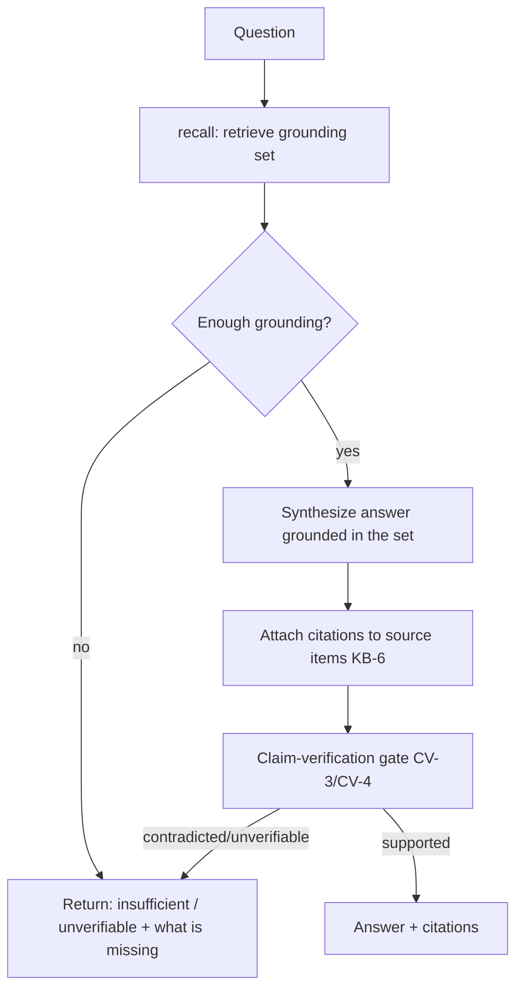
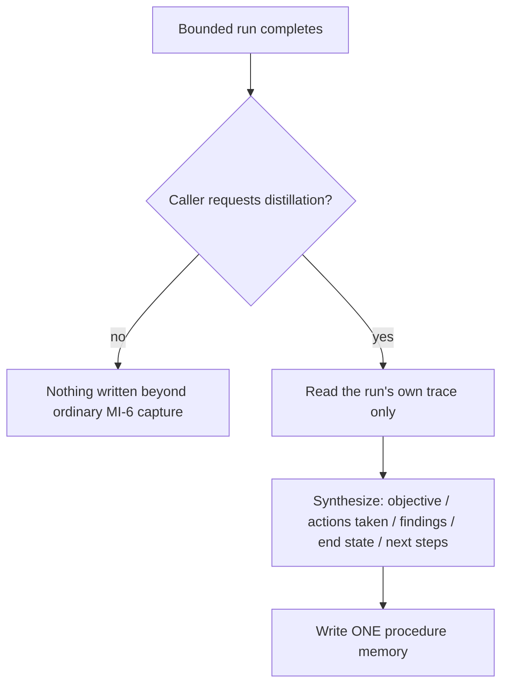
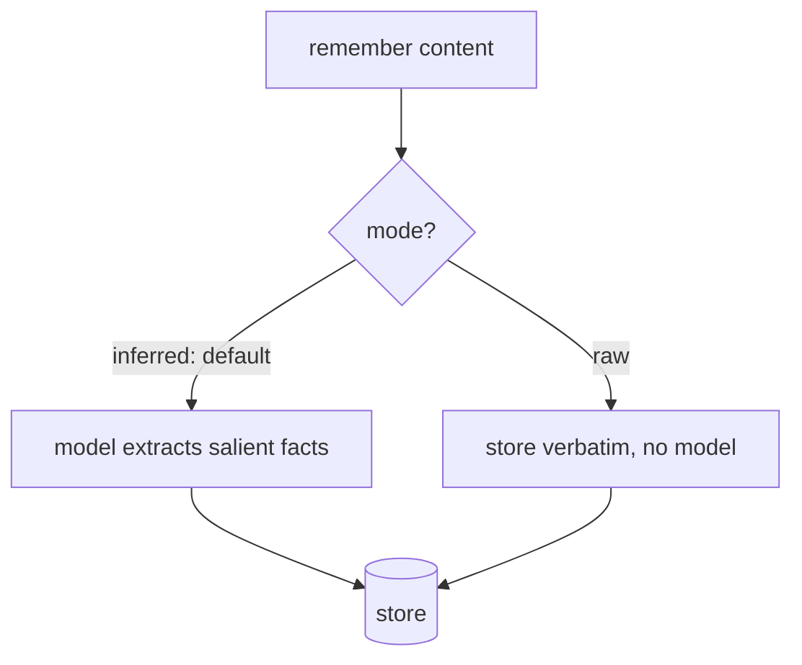

# Memory Intelligence

**Version:** 0.3.0
**Status:** RFC
**Layer:** concept

## Overview

The technology-agnostic model of the **active query and intelligence surface** that sits above the passive memory substrate. Where `l1-memory-model` defines *what* is remembered (scopes, item shape, recall fusion, curation) and `l2-memory-store` realizes *where* it lives, this spec defines the small set of **active operations** that turn a store into a memory *agent*: a grounded-answer projection over remembered items, temporal recall modes over the bi-temporal record, non-silent conflict surfacing, a periodic intelligence digest, a salience-honest capture policy, reversible lifecycle states that mute or shelve knowledge without deleting it, and capture-shaping directives that steer what is remembered.

The distinction it encodes is the difference between *passive infrastructure* — which the caller must query, parse, and act on — and an *active memory layer* that answers questions, exposes change over time, surfaces its own contradictions, and periodically distills what it learned. Every operation here is deliberately defined to **compose** existing engines (knowledge-base grounding, claim verification, the scheduler, the dashboard, the archivist) rather than duplicate them.

## Related Specifications

- [l1-memory-model.md](l1-memory-model.md) - The substrate this surface sits on (scopes, recall, curation, MEM-1…MEM-9).
- [l2-memory-store.md](l2-memory-store.md) - Concrete store carrying the bi-temporal record, typed kinds, confidence, and trust this surface queries.
- [l1-knowledge-base.md](l1-knowledge-base.md) - Source-attribution contract (KB-6) reused by the grounded-answer projection (MI-1).
- [l1-claim-verification.md](l1-claim-verification.md) - Ternary-verdict grounding gate (CV-3/CV-4) reused to keep answers honest (MI-1).
- [l1-scheduler-model.md](l1-scheduler-model.md) - Fires the periodic intelligence digest (MI-5).
- [l1-dashboard.md](l1-dashboard.md) - Read-only projection host for digest analytics (MI-5).
- [l1-retrieval-evaluation.md](l1-retrieval-evaluation.md) - Measures whether temporal/answer recall quality regresses (MI-2).
- [l1-intent-resolution.md](l1-intent-resolution.md) - Consumes grounded answers when grounding-before-asking (IR-1).
- [l1-harness-engineering.md](l1-harness-engineering.md) - Artifact-extraction discipline (HE-8) the procedural-distillation operation composes with (MI-7).

## 1. Motivation

A store that only accepts writes and returns ranked items pushes all the intelligence onto the caller: it must phrase a query, parse the hits, reconcile stale-versus-current, notice contradictions, and reconstruct "what changed since last session." Each of those is a recurring, generalizable operation, and leaving them to every caller produces inconsistent behavior and silent errors — contradictions that quietly coexist, stale facts injected as if current, and no honest "I don't have enough to answer that."

This spec lifts those recurring operations into the memory layer as a bounded, uniform contract, so that:

- a caller can ask a **question** and get a grounded, cited answer (or an honest refusal) instead of raw hits;
- a caller can ask **as of a past instant**, or **what changed since** a checkpoint, without re-deriving temporal logic;
- a **contradiction** is never resolved by a silent overwrite — it is either unambiguously superseded (recorded) or surfaced for adjudication;
- the layer **periodically reports on itself** so accumulated knowledge stays legible;
- and **capture stays selective and confidence-honest**, so signal is not drowned in noise.

## 2. Constraints & Assumptions

- Local-first: every operation here must function with no network and no remote model (a grounded answer degrades to attributed extractive recall when no generator is available).
- Recall stays on the hot path (MEM-2/MEM-3); temporal modes and the answer projection MUST NOT add unbounded cost to a plain recall.
- This surface owns **no storage** — it reads and annotates through the memory-model core contract (MEM-7); it never bypasses the store.
- It defines **no new grounding, verification, scheduling, or visualization engine** — it composes the ones already specified.
- All generation is budget-bounded and consent-respecting; digests and answers carry no secret or raw-transcript egress beyond what the source items already permit.

## 3. Core Invariants (Layer 1 only)

Rules every Layer 2 implementation MUST NOT violate:

- **MI-1 (Grounded answer, composed not reinvented):** the layer exposes an `answer` projection distinct from `recall` — it retrieves memory items, then synthesizes a response **grounded only in what it retrieved**, citing the specific items it rests on (reusing the knowledge-base source-attribution contract) and passing the claim-verification gate. When retrieved memory is insufficient it returns an honest "unverifiable/insufficient" outcome — it MUST NOT assert beyond retrieved memory, and MUST NOT silently fall back to model priors.
- **MI-2 (Temporal recall modes):** recall exposes first-class temporal modes over the bi-temporal record — **point-in-time** ("as of instant T"), **delta** ("changed since checkpoint C"), and **recency** ("the newest N") — resolving against valid-time and transaction-time without conflating them. A temporal mode composes with the existing type/scope/tag filters; a plain recall (no temporal mode) is unchanged.
- **MI-3 (Immediate recall-visibility):** a successfully written memory is recall-visible immediately. Any heavy enrichment (model-based extraction, embedding, distillation, consolidation) is strictly asynchronous and MUST NOT gate visibility or block the write hot path. Missing enrichment degrades ranking quality, never availability.
- **MI-4 (Conflict surfacing, never silent overwrite):** contradictions are detected and classified into a closed set (`contradiction` / `update` / `duplicate` / `conflict`). An **unambiguous** contradiction is resolved by non-destructive supersession (recording the change, per MEM-6). An **ambiguous** one is surfaced as a structured, inspectable report carrying a closed recommendation set (`keep-new` / `keep-old` / `merge` / `drop`) for human-or-agent adjudication. No path silently overwrites or silently drops durable knowledge.
- **MI-5 (Periodic intelligence digest):** on a schedule, the layer produces a bounded, **read-only** digest of a time window — a narrative summary plus structured analytics (activity over time, type distribution, confidence/trust distribution) — derived **only** from stored memory, budget-bounded, and itself recordable as a memory event. The digest never mutates the memories it summarizes.
- **MI-6 (Salience-gated, confidence-honest capture):** durable capture is selective — content below a salience/confidence floor is not durably stored (or is stored provisionally, not as fact). Every durable item records an honest write-time confidence and its provenance-kind, and capture de-duplicates against existing memory before writing. Volume is never a proxy for value. Capture additionally records, when applicable: **actor attribution** distinct from scope ownership (who said it, inside a multi-party exchange, as opposed to which scope owns the record — an MEM-9 extension); an optional **caller-declared explicit expiry** as a narrow complement to MEM-5's inferred decay (a hard "void after date X" fact, not a decay rate); and a small set of **capture-time cross-references** — the writing operation may name which existing items the new one relates to, giving cheap forward connectivity ahead of the archivist's full reconcile pass (MI-4). None of these three is mandatory per write; their absence degrades gracefully to baseline MEM-9/MEM-5/MI-4 behavior.
- **MI-7 (Procedural distillation):** a bounded agentic run (a harness-engineering iteration, an orchestrated task, a long tool-use session) may be distilled, as an explicit end-of-run operation distinct from per-turn capture, into **one** structured procedure memory — objective, the action sequence taken, key findings, end state, and open next steps. It is written once, grounded only in the run's own trace (no invention beyond what happened), and is recallable like any other memory item. This is a sibling to `remember`, not a replacement — ordinary per-turn capture (MI-6) continues throughout the run; distillation happens once, on completion, at the caller's request.
- **MI-8 (Structured filter predicate):** recall exposes a small, closed structured-comparison vocabulary — equals/not-equals, ordering (greater/less, inclusive variants), set membership, and text containment — combinable with AND/OR/NOT, as a query axis distinct from and composable with the fuzzy multi-signal fusion (MEM-3) and the temporal modes (MI-2). The vocabulary is fixed at this layer; each storage backend translates it into its own query form. This gives a caller (including a workflow-DSL step) a backend-agnostic way to express an exact structured constraint ("priority >= 5 AND category = X") without re-deriving comparison semantics per backend.
- **MI-9 (Reversible lifecycle states):** a durable item carries a user-or-agent-controllable lifecycle state beyond the exists/forgotten binary — **active** (in the default recall set), **paused** (temporarily and reversibly excluded from recall with no data loss), **archived** (retained but out of the default recall set, opt-in to include), and **deleted** (the existing targeted forget). Every transition is non-destructive and audited (actor, instant, old→new state), composing MEM-6's supersede-not-destroy discipline. This state axis **constrains** MEM-5's automatic utility-driven decay/prune: decay may still lower an item's ranking within any state, but it MUST NOT prune (delete) an explicitly `paused` or `archived` item — a deliberate shelving is a value signal that overrides automatic pruning. The state is a reversible choice, not an aged-out one. Recall defaults to `active` only; temporal and structured modes may opt into paused/archived explicitly.
- **MI-10 (Capture-time temporal normalization):** at capture, relative temporal expressions in the *content* ("yesterday", "last week", "recently") are resolved to absolute dates against the **observation instant** — when the statement was made — never against wall-clock read time, so a memory stays meaningful indefinitely. This normalizes the remembered text (the MEM-4 source of truth) and is distinct from, and composes with, the bi-temporal *metadata* (valid-time / transaction-time). It degrades gracefully: with no known observation instant it falls back to capture time; with no generator available it stores the expression verbatim rather than guessing a date.
- **MI-11 (Caller capture directives):** capture accepts optional, caller-supplied directives that steer *what* is extracted — an **include** set (topics to prioritize), an **exclude** set (topics to drop), and free-form **custom instructions** (highest-priority rules) — scoped per office/worker/session and recorded as capture provenance. Directives shape extraction emphasis only; they MUST NOT override the MI-6 salience/confidence-honesty floor nor silently suppress a safety-relevant fact. Absent directives, baseline MI-6 capture behavior holds unchanged.
- **MI-12 (Raw vs inferred capture):** capture exposes two declared modes — **inferred** (a model extracts salient, self-contained facts; the default) and **raw** (the content is stored verbatim, no model in the loop). Raw mode is the local-first / audit-exact / no-generator escape hatch and MUST function with no network and no model bound. The mode is explicit per write; recall, lifecycle, and every other operation treat raw and inferred items uniformly. This complements MI-3 (which makes enrichment *asynchronous*): MI-12 makes enrichment *optional*.

> L2 specs cannot reach RFC status until all invariants here are addressed in their "Invariant Compliance" section.

## 4. Detailed Design

### 4.1 The three operations (remember / recall / answer)

The substrate already provides `remember` (write, MEM-7) and `recall` (multi-signal ranked read, MEM-3). This surface adds **`answer`** as a sibling — the operation callers actually want when the goal is a decision, not a document list.



`answer` is a *projection*, not an engine: retrieval is `recall`; grounding/attribution is the knowledge-base contract; the honesty gate is claim verification. Its only novel obligation is to bind those three to the memory store as the grounding source and to refuse rather than hallucinate (MI-1). With no generator available it degrades to returning the top attributed items verbatim (extractive answer).

### 4.2 Temporal recall modes (MI-2)

The bi-temporal record (valid-time / transaction-time, supersession) already exists in the store. This surface exposes it as three query modes so callers never re-derive temporal logic:

| Mode | Question it answers | Resolves against |
| --- | --- | --- |
| `as-of T` | "What did we hold true at instant T?" | valid-time window containing T, current-at-T records |
| `changed-since C` | "What is new or changed since checkpoint C?" | transaction-time > C |
| `recent N` | "What are the newest N, regardless of age?" | transaction-time descending |

Modes compose with type/scope/tag filters (e.g. *decisions changed since last session*). A checkpoint is a caller-held opaque instant (commonly "last session start"), enabling cheap session-restoration: *changed-since(last_session)* yields exactly the delta to re-inject. Modes are read-only and add no cost to the plain-recall path.

### 4.3 Conflict surfacing and bounded resolution (MI-4)

The archivist's `reconcile` stage detects contradictions; this surface governs **what happens next**. Detection classifies each finding and each finding is routed:

```text
[REFERENCE] conflict finding (conceptual shape)
{
  kind:            contradiction | update | duplicate | conflict,
  old_ref, new_ref,                      // the two items in tension (never the same item)
  summary,                               // one-line description
  recommendation:  keep-new | keep-old | merge | drop,
  status:          auto-resolved | awaiting-adjudication | resolved,
}
```

Routing rule:

- **Unambiguous** (a strict newer statement of the same fact, or an exact duplicate) → auto-supersede/de-dupe, recorded non-destructively (MEM-6), `status = auto-resolved`.
- **Ambiguous** (a genuine semantic disagreement where recency does not settle truth) → emit to a structured, inspectable **conflict report** with its recommendation; `status = awaiting-adjudication`. A human or a delegated agent picks from the closed recommendation set; the pick is then applied through the normal supersede path.

The report is produced on the same cadence as the digest (§4.4) and only compares **new-versus-existing** knowledge — it never reports old-versus-old churn. <!-- TBD: the ambiguity threshold that splits auto-supersede from surfaced-for-adjudication (confidence gap? trust gap? explicit recency dominance?) -->

### 4.4 Periodic intelligence digest (MI-5)

A scheduled, read-only job (fired by the scheduler model) distills a window of memory into a legible report:

- **Narrative** — a concise natural-language summary of the window's themes, decisions, and outcomes, grounded in the window's items (reuses the `answer` projection over a time-filtered set).
- **Analytics** — structured, chart-ready aggregates rendered by the dashboard: activity over time, memory-type distribution, and confidence/trust distribution across the window.
- **Conflict report** — the §4.3 findings for the window.

The digest is budget-bounded, derived only from stored memory, and may itself be stored as a `context`/`event` memory so future recall can find "what happened that week." It mutates nothing it reads. <!-- TBD: default cadence (daily vs per-session-close vs office-idle) and whether the digest is opt-in per office -->

### 4.5 Capture discipline (MI-6)

The store carries write-time `confidence` and typed provenance; this surface makes the **policy** that governs them explicit, so capture behavior is consistent across callers rather than per-agent folklore:

- **Selective** — store what will matter beyond this turn (decisions, standing instructions, durable facts, learnings-from-error, commitments); do not store trivia, ephemeral state, or what already lives in code/docs.
- **Confidence-honest** — record an honest write-time confidence; content below a floor is either not stored or stored provisionally (never as settled fact). Explicit statements outrank inferred patterns, and provenance-kind records which it is.
- **De-duplicated** — check for an existing memory before writing; refine or supersede it rather than accreting near-duplicates (composes the store's semantic-dedup write path).
- **Actor-attributed** — when the source is a multi-party exchange (a deliberation round, a multi-agent session), record which participant said or produced the captured content, distinct from which scope owns the record (an extension of MEM-9's provenance, not a new field family).
- **Explicitly expirable, optionally** — a caller may declare a hard expiry at write time ("void after date X") as a narrow complement to MEM-5's inferred decay; absent an explicit expiry, MEM-5 decay applies as before.
- **Cross-referenced at capture time** — the writing operation may name related existing item ids directly, ahead of and independent from the archivist's reconcile pass (MI-4); this is a cheap forward link, not a substitute for reconciliation.
- **Subject-attributed, optionally** — the extraction lens distinguishes *about-user* facts from *about-the-agent-itself* facts (an agent's own capabilities, standing approach, or configured persona), a subject dimension distinct from actor attribution's *who-said-it*. Absent the distinction it degrades to a single user-subject lens.

This is a policy invariant, not a new mechanism — it constrains how `remember` is used so that recall stays high-signal and the trust/confidence signals mean something.

### 4.6 Structured filter predicate (MI-8)

| Operator class | Members |
| --- | --- |
| Equality | `equals`, `not-equals` |
| Ordering | `greater-than`, `greater-or-equal`, `less-than`, `less-or-equal` |
| Set membership | `in`, `not-in` |
| Text containment | `contains`, `case-insensitive-contains` |
| Combinators | `AND`, `OR`, `NOT` (each over a list of sub-predicates) |

The predicate composes with — never replaces — the existing type/scope/tag filters and the MI-2 temporal modes: a caller narrows first by structured predicate, then ranks the remainder by the fuzzy multi-signal fusion (MEM-3). The vocabulary is closed at this layer precisely so it stays backend-agnostic; a storage backend that cannot express a given combinator natively degrades by evaluating it post-fetch, never by silently dropping the constraint.

### 4.7 Procedural distillation (MI-7)



Distillation is opt-in and end-of-run, never per-turn — it does not compete with or replace ordinary capture (MI-6), which continues throughout the run. It is grounded only in the run's own trace (same discipline as MI-1's `answer`: no invention beyond what was retrieved/observed). The resulting item is an ordinary memory item — recallable, subject to the same trust/confidence/decay treatment as any other — tagged so callers can distinguish "a distilled procedure" from "a captured fact." A harness-engineering iteration's mandatory artifact extraction (HE-8) is a natural trigger for this operation, but the two remain distinct: HE-8 extracts amendment evidence for the harness itself, MI-7 distills a reusable memory of how a specific run went.

### 4.8 Lifecycle states (MI-9)

A small closed state machine layered over the store, orthogonal to decay:

| State | In default recall? | Reversible? | Set by |
| --- | --- | --- | --- |
| `active` | yes | — | default on write |
| `paused` | no | yes → active | user/agent — mute without deleting |
| `archived` | no (opt-in include) | yes → active | user/agent or a retention policy |
| `deleted` | no | no | targeted forget (existing) |

Transitions are recorded as an append-only audit (actor, instant, old→new) so "who shelved this and when" is answerable. `paused` is the reversible mute the user-facing memory surface needs; `archived` shelves long-tail knowledge out of the hot recall set without destroying it. Supersession (MEM-6) operates independently. Decay (MEM-5) also continues, but an explicit `paused`/`archived` state is **prune-protective**: decay may lower ranking, never delete a deliberately shelved item. A state is a value signal; decay is automatic utility management — and on the prune decision the explicit signal wins.

### 4.9 Capture-time temporal normalization (MI-10)

The capture step is given an observation instant (defaulting to write time). Relative expressions in the content are rewritten to absolute dates against that instant, not against read time: *"went to Paris last week"* captured on 2025-05-22 becomes *"went to Paris the week of 2025-05-12"* — meaningful forever. This is a content-quality rule on the MEM-4 source-of-truth text; the bi-temporal metadata is unchanged and complementary. With no generator available, store the expression verbatim (never fabricate a date).

### 4.10 Capture directives (MI-11)

Three optional, caller-scoped inputs shape extraction:

- **include** — topics to prioritize (e.g. "deployment endpoints, credential locations").
- **exclude** — topics to drop (e.g. "casual small talk").
- **custom instructions** — free-form, highest-priority rules ("record every decision with its rationale").

The active directive set is recorded as capture provenance, so a later reader knows why a memory was (or was not) taken. Directives bias emphasis; they never lower the MI-6 honesty floor or suppress a safety-relevant fact. This is the seam through which an office encodes its standing capture policy instead of relying on per-agent folklore.

### 4.11 Raw vs inferred capture (MI-12)



Inferred is the default; raw is the escape hatch for deterministic/audit-exact captures and for local-first operation with no model bound. Both produce ordinary items — same recall, lifecycle, trust, and decay treatment. Raw complements MI-3: where MI-3 makes enrichment asynchronous, MI-12 makes it optional.

## 5. Ideas-to-Adopt Mapping (No-Duplication Ledger)

Disposition of every mechanic observed in the surveyed external memory-agent reference, against what this project already owns. Restated in plain language; the reference is not the source of authority — these invariants stand on their own.

| Observed mechanic | Disposition | Home |
| --- | --- | --- |
| `remember` / `recall` (write + ranked read) | Already owned | MEM-7, `l2-memory-store` write path + recall fusion |
| Typed memory taxonomy | Already owned | `l2-memory-store` §4.15 (structured `MemoryKind`), MEM-8 |
| Write-time confidence field | Already owned | `l2-memory-store` §4.15 (`confidence`, distinct from trust) |
| Typed provenance (explicit / inferred / code / conversation / external) | Already owned | `l2-memory-store` §4.15 (`MemorySource`), MEM-9 |
| Trust / feedback accrual over time | Already owned | `l2-memory-store` §4.6 (`trust_score`, asymmetric feedback) |
| Bi-temporal validity + non-destructive supersession | Already owned | `l2-memory-store` §4.14, MEM-6 |
| Human-readable memory projection + index sync | Already owned | `l2-memory-store` §4.11–4.13 (quick memory + index) |
| Transcript → memory extraction | Already owned | `l2-memory-store` §4.12 (two-phase consolidation) |
| Targeted `forget` | Already owned | `l2-memory-store` §4.13 (forget operation) |
| Entity linking / shallow graph recall | Already owned | `l2-memory-store` §4.7 |
| **`answer` — grounded, cited QA over memory** | **Adopt → MI-1** | this spec §4.1 (composes KB-6 + CV-3/CV-4) |
| **Temporal query modes (as-of / changed-since / recent)** | **Adopt → MI-2** | this spec §4.2 (exposes the §4.14 record) |
| **Immediate recall-visibility / no ingestion gate** | **Adopt → MI-3** | this spec (tightens MEM-4 + hot-path constraint) |
| **Conflict report + bounded interactive resolution** | **Adopt → MI-4** | this spec §4.3 (extends MEM-6 reconcile) |
| **Periodic intelligence digest + analytics** | **Adopt → MI-5** | this spec §4.4 (composes scheduler + dashboard) |
| **Selective, confidence-honest capture policy** | **Adopt → MI-6** | this spec §4.5 (policy over §4.15 fields) |
| Document upload → ingest files into memory | Out of scope here | `l1-knowledge-base` (collections) + `l1-file-management` |
| Agent = namespace, time-bounded session tokens | Out of scope here | `l2-agent-session`, `l2-multi-user-auth` |
| "Connect" — be a memory provider to external hosts | Out of scope here | `l1-extensions`, `l1-acp` |
| Single-call, ADD-biased capture decoupled from consolidation | Confirms existing direction, not novel | MI-3 (async enrichment) + MI-6 (capture discipline) already specify this split |
| Entity/relationship linking fused into ranking, no separate graph backend | Already owned | `l2-memory-store` §4.7 + §4.16 (entity links + graph-proximity boost); popularity-dampened boost weighting noted as a refinement candidate, not actioned this pass |
| **Capture-time direct memory-to-memory cross-reference** | **Adopt → MI-6** | this spec §4.5 (cross-referenced at capture time) |
| **Actor attribution distinct from scope ownership** | **Adopt → MI-6** | this spec §4.5 (actor-attributed), extends MEM-9 |
| **Caller-declared explicit per-item expiry** | **Adopt → MI-6** | this spec §4.5 (explicitly expirable), complements MEM-5 |
| **Structured comparison-operator filter DSL (AND/OR/NOT over eq/ne/ordering/membership/containment)** | **Adopt → MI-8** | this spec §4.6 |
| Pluggable post-retrieval reranking stage, opt-in, fail-open | Refinement candidate | `l2-memory-store` recall fusion (§4.2), not actioned this pass |
| **End-of-run distillation of an agent trajectory into one structured procedure memory** | **Adopt → MI-7** | this spec §4.7; composes with `l1-harness-engineering` HE-8 |
| Structured schema-fill export | Not evaluated — platform-only, no local algorithm to inspect | — |
| Custom weighted-criteria retrieval scoring | Not evaluated — platform-only, no local algorithm to inspect | — |
| **Reversible lifecycle states — active/paused/archived distinct from delete, audited transitions** | **Adopt → MI-9** | this spec §4.8 (composes MEM-6 supersede; orthogonal to MEM-5 decay) |
| **Capture-time normalization of relative→absolute time against the observation instant** | **Adopt → MI-10** | this spec §4.9 (content-level; complements the bi-temporal metadata) |
| **Caller capture directives — include/exclude/custom-instruction steering of extraction** | **Adopt → MI-11** | this spec §4.10 (shapes MI-6 without changing the closed policy) |
| **Raw (verbatim) vs inferred (LLM-extracted) capture modes** | **Adopt → MI-12** | this spec §4.11 (local-first escape hatch; complements MI-3 async enrichment) |
| **Subject-of-memory extraction lens — about-user vs about-agent-self** | **Adopt → MI-6 extension** | this spec §4.5 (subject dimension, distinct from actor "who-said-it" attribution) |
| ADD/UPDATE/DELETE/NONE memory-manager reconcile decision | Already owned | MEM-6 supersession + MI-4 conflict classification |
| Cross-app / cross-agent access control (allow-deny grants) + per-read access log | Refinement candidate (security/substrate) | `l1-memory-model` scopes (MEM-1) + `l1-security`; coarse scope ownership already owned, fine-grained per-item inter-agent grants a candidate gap — a substrate/security concern, not a query-surface concern, so not adopted here |
| Open-vocabulary auto-categories (LLM-assigned, many-to-many) + faceted browse | Refinement candidate | over MEM-8 closed `MemoryKind` + the Memory tab (`l1-navigation-model` NV-1); the closed kind stays authoritative, open categories an additive browse facet |
| Declarative retention policy — criteria + days-to-archive batch transition | Refinement candidate | composes MEM-5 decay + MI-9 `archived` state; a policy layer batch-shelving matching items after N days |
| Per-read access/usage log as ranking + audit substrate | Refinement candidate | the substrate under the already-noted popularity-dampened boost; composes `l1-telemetry` / AuditProvider |

## 6. Nodus Relevance

The workflow-language runtime carries a pending storage/knowledge extension seam and a memory error category; this surface shapes that seam's contract without expanding the DSL:

- **StorageProvider contract (pending LP-3 interface).** MI-1/MI-2 give the memory/recall provider its shape: a host-neutral query returning ranked items with confidence and provenance, plus the three temporal query modifiers (as-of / changed-since / recent) as optional parameters. A workflow step binds to this provider rather than to any concrete store.
- **Grounded answer as a step + validator.** The `answer` projection maps onto a grounded-retrieval step whose output is gated by claim-verification-as-`^validator` (already noted in `l1-claim-verification`): a `supported` answer passes, an insufficient one emits the memory/confidence error code rather than fabricating.
- **Error-taxonomy alignment.** MI-1's honest-refusal and MI-6's capture floor align with the runtime's existing memory-category codes (`CONFIDENCE_LOW`, `KB_UNAVAILABLE`, `MEMORY_FAILED`): a below-floor capture or an under-grounded answer is a first-class typed outcome, not a silent pass.
- **Out of scope for the DSL.** The periodic digest (MI-5) and the conflict-adjudication surface (MI-4) are host concerns — a workflow may *trigger* a digest or *consume* a conflict report, but neither belongs inside the language runtime.
- **Structured filter predicate maps directly onto the pending operator gap.** `l1-nodus-language` §4.6 already records an upstream parity gap for operators (`MATCHES`/`?.`/`??`/`WHERE`/`FIRST`/`LAST`). MI-8's closed comparison-operator vocabulary (eq/ne/ordering/membership/containment + AND/OR/NOT) is a ready-made, backend-agnostic candidate contract for whatever `WHERE`-style filtering the language eventually adopts — the DSL operator and the StorageProvider query predicate would be the same closed vocabulary, not two independently invented ones.
- **Procedural distillation as a candidate macro-learning source.** MI-7's end-of-run distillation of a bounded agentic trajectory is a plain-language analogue of what a nodus `@macro` already is by hand: a named, reusable procedure. A distilled procedure memory is not itself executable nodus — it is a natural-language candidate that a human or agent may promote into an authored `@macro` (harness-engineering's evidence-backed amendment protocol, HE-4, already governs that promotion path); the DSL gains no new syntax from this.
- **Capture directives map onto the policy-config harness component.** MI-11's include/exclude/custom-instruction directives are exactly the "policy config" component of the six-component harness taxonomy (`l1-harness-engineering`): an office's standing "always capture X / never capture Y" is policy the StorageProvider consumes, not new DSL syntax — the same PolicyProvider seam noted for LP-3 graduation.
- **Raw-vs-inferred is a StorageProvider write-mode flag.** MI-12's mode is a single backend-agnostic parameter on the pending memory provider's write operation — verbatim vs extracted — with the verbatim path guaranteed to function with no model bound, satisfying the local-first constraint without a language change.
- **Lifecycle-state transitions extend the StorageProvider verb set.** MI-9 adds `pause`/`archive`/`restore` state transitions beside write/recall/forget — a small closed verb extension a workflow step can invoke. This is memory-item state and is deliberately distinct from the runtime's own execution `Status` (e.g. a paused *run*); conflating the two would be a category error.
- **Observation-time normalization is a capture-step parameter, not new syntax.** MI-10 adds an optional observation-instant argument to a `remember` step so relative expressions ground to absolute dates at write time; the language gains no operator and no reserved variable.

## Document History

| Version | Change |
| --- | --- |
| 0.3.0 | Added MI-9 (reversible lifecycle states active/paused/archived), MI-10 (capture-time temporal normalization), MI-11 (caller capture directives include/exclude/custom-instructions), and MI-12 (raw vs inferred capture modes); extended MI-6 with a subject-of-memory lens (about-user vs about-agent-self); added design §4.8–§4.11; extended the Ideas-to-Adopt ledger (lifecycle/normalization/directives/raw-mode adopted; cross-agent ACL + access log, open-vocabulary auto-categories, and declarative retention policy dispositioned as refinement candidates with their correct substrate/security home) and Nodus Relevance |
| 0.2.0 | Added MI-7 (procedural distillation — end-of-run trajectory-to-memory) and MI-8 (structured filter predicate); extended MI-6 with actor attribution, caller-declared explicit expiry, and capture-time cross-reference; extended the Ideas-to-Adopt ledger and Nodus Relevance with the newly evaluated mechanics |
| 0.1.0 | Initial RFC — active query/intelligence surface over the memory substrate (MI-1…MI-6) and its Ideas-to-Adopt ledger |

## 7. Drawbacks & Alternatives

- **Answer latency:** grounded synthesis + verification costs more than a raw recall. Mitigated by making `answer` an explicit sibling operation — callers who only need hits still call `recall`; the extractive-degrade path keeps `answer` usable with no generator.
- **Digest cost:** periodic generation consumes budget. Mitigated by the scheduler's existing budgeting and by making the digest opt-in per office. <!-- TBD: cadence default (see §4.4) -->
- **Surfacing fatigue:** if the ambiguity threshold (§4.3) is too low, every minor update becomes an adjudication prompt. Mitigated by biasing toward auto-supersede for recency-dominated updates and reserving surfacing for genuine semantic disagreement.
- **Alternative — leave `answer` to each caller:** rejected; it reproduces grounding/refusal logic inconsistently and is the exact "passive infrastructure" failure this spec exists to remove.
- **Alternative — a separate memory-intelligence engine:** rejected; every operation here composes an existing engine, and a parallel engine would fork grounding/verification/scheduling logic.
- **Procedural distillation cost/quality tradeoff:** a poorly-bounded run produces a vague or overlong distillation. Mitigated by keeping it opt-in and end-of-run only (never per-turn), and by grounding strictly in the run's own trace (no invention).
- **Filter-DSL backend coverage variance:** not every storage backend can express every combinator natively (e.g. deep `NOT`/`OR` nesting). Mitigated by the closed-vocabulary contract requiring post-fetch evaluation as a fallback rather than silently dropping a constraint.
- **Lifecycle-state / decay confusion:** four states risk being conflated with automatic decay. Mitigated by MI-9 defining `paused`/`archived` as strictly reversible, user-driven, and **prune-protective**: decay may still lower ranking within any state but never deletes a deliberately shelved item — the explicit state overrides automatic prune, so a user's shelving is never silently discarded.
- **Capture-directive starvation:** an over-aggressive `exclude` set (MI-11) could silently starve memory of useful signal. Mitigated by directives shaping extraction *emphasis* only — never lowering the MI-6 honesty floor nor suppressing a safety-relevant fact — and by recording the active directive set as capture provenance so the omission is auditable.
- **Access-control layering temptation:** cross-agent memory ACL is tempting to add here, but belongs to the substrate scopes and the security spec, not the query surface. Kept as a refinement candidate against `l1-memory-model` / `l1-security` to preserve this layer's purity (it reads and annotates; it owns no authorization policy).

## Canonical References

| Alias | Path | Purpose |
| --- | --- | --- |
| `[MODEL]` | `.design/main/specifications/l1-memory-model.md` | Substrate invariants (scopes, recall, curation) this surface sits on |
| `[STORE]` | `.design/main/specifications/l2-memory-store.md` | Bi-temporal record, typed kinds, confidence, trust queried here |
| `[KB]` | `.design/main/specifications/l1-knowledge-base.md` | Source-attribution contract reused by MI-1 |
| `[VERIFY]` | `.design/main/specifications/l1-claim-verification.md` | Ternary grounding gate reused by MI-1 |
| `[HARNESS]` | `.design/main/specifications/l1-harness-engineering.md` | Artifact-extraction discipline (HE-8) MI-7 composes with |
