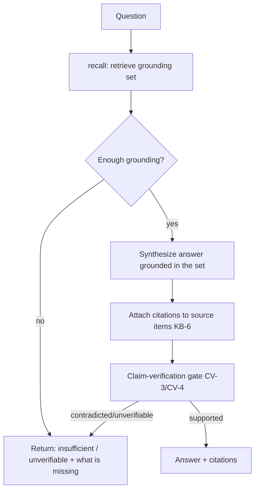

# Memory Intelligence

**Version:** 0.1.0
**Status:** RFC
**Layer:** concept

## Overview

The technology-agnostic model of the **active query and intelligence surface** that sits above the passive memory substrate. Where `l1-memory-model` defines *what* is remembered (scopes, item shape, recall fusion, curation) and `l2-memory-store` realizes *where* it lives, this spec defines the small set of **active operations** that turn a store into a memory *agent*: a grounded-answer projection over remembered items, temporal recall modes over the bi-temporal record, non-silent conflict surfacing, a periodic intelligence digest, and a salience-honest capture policy.

The distinction it encodes is the difference between *passive infrastructure* — which the caller must query, parse, and act on — and an *active memory layer* that answers questions, exposes change over time, surfaces its own contradictions, and periodically distills what it learned. Every operation here is deliberately defined to **compose** existing engines (knowledge-base grounding, claim verification, the scheduler, the dashboard, the archivist) rather than duplicate them.

## Related Specifications

- [l1-memory-model.md](l1-memory-model.md) - The substrate this surface sits on (scopes, recall, curation, MEM-1…MEM-9).
- [l2-memory-store.md](l2-memory-store.md) - Concrete store carrying the bi-temporal record, typed kinds, confidence, and trust this surface queries.
- [l1-knowledge-base.md](l1-knowledge-base.md) - Source-attribution contract (KB-6) reused by the grounded-answer projection (MI-1).
- [l1-claim-verification.md](l1-claim-verification.md) - Ternary-verdict grounding gate (CV-3/CV-4) reused to keep answers honest (MI-1).
- [l1-scheduler-model.md](l1-scheduler-model.md) - Fires the periodic intelligence digest (MI-5).
- [l1-dashboard.md](l1-dashboard.md) - Read-only projection host for digest analytics (MI-5).
- [l1-retrieval-evaluation.md](l1-retrieval-evaluation.md) - Measures whether temporal/answer recall quality regresses (MI-2).
- [l1-intent-resolution.md](l1-intent-resolution.md) - Consumes grounded answers when grounding-before-asking (IR-1).

## 1. Motivation

A store that only accepts writes and returns ranked items pushes all the intelligence onto the caller: it must phrase a query, parse the hits, reconcile stale-versus-current, notice contradictions, and reconstruct "what changed since last session." Each of those is a recurring, generalizable operation, and leaving them to every caller produces inconsistent behavior and silent errors — contradictions that quietly coexist, stale facts injected as if current, and no honest "I don't have enough to answer that."

This spec lifts those recurring operations into the memory layer as a bounded, uniform contract, so that:

- a caller can ask a **question** and get a grounded, cited answer (or an honest refusal) instead of raw hits;
- a caller can ask **as of a past instant**, or **what changed since** a checkpoint, without re-deriving temporal logic;
- a **contradiction** is never resolved by a silent overwrite — it is either unambiguously superseded (recorded) or surfaced for adjudication;
- the layer **periodically reports on itself** so accumulated knowledge stays legible;
- and **capture stays selective and confidence-honest**, so signal is not drowned in noise.

## 2. Constraints & Assumptions

- Local-first: every operation here must function with no network and no remote model (a grounded answer degrades to attributed extractive recall when no generator is available).
- Recall stays on the hot path (MEM-2/MEM-3); temporal modes and the answer projection MUST NOT add unbounded cost to a plain recall.
- This surface owns **no storage** — it reads and annotates through the memory-model core contract (MEM-7); it never bypasses the store.
- It defines **no new grounding, verification, scheduling, or visualization engine** — it composes the ones already specified.
- All generation is budget-bounded and consent-respecting; digests and answers carry no secret or raw-transcript egress beyond what the source items already permit.

## 3. Core Invariants (Layer 1 only)

Rules every Layer 2 implementation MUST NOT violate:

- **MI-1 (Grounded answer, composed not reinvented):** the layer exposes an `answer` projection distinct from `recall` — it retrieves memory items, then synthesizes a response **grounded only in what it retrieved**, citing the specific items it rests on (reusing the knowledge-base source-attribution contract) and passing the claim-verification gate. When retrieved memory is insufficient it returns an honest "unverifiable/insufficient" outcome — it MUST NOT assert beyond retrieved memory, and MUST NOT silently fall back to model priors.
- **MI-2 (Temporal recall modes):** recall exposes first-class temporal modes over the bi-temporal record — **point-in-time** ("as of instant T"), **delta** ("changed since checkpoint C"), and **recency** ("the newest N") — resolving against valid-time and transaction-time without conflating them. A temporal mode composes with the existing type/scope/tag filters; a plain recall (no temporal mode) is unchanged.
- **MI-3 (Immediate recall-visibility):** a successfully written memory is recall-visible immediately. Any heavy enrichment (model-based extraction, embedding, distillation, consolidation) is strictly asynchronous and MUST NOT gate visibility or block the write hot path. Missing enrichment degrades ranking quality, never availability.
- **MI-4 (Conflict surfacing, never silent overwrite):** contradictions are detected and classified into a closed set (`contradiction` / `update` / `duplicate` / `conflict`). An **unambiguous** contradiction is resolved by non-destructive supersession (recording the change, per MEM-6). An **ambiguous** one is surfaced as a structured, inspectable report carrying a closed recommendation set (`keep-new` / `keep-old` / `merge` / `drop`) for human-or-agent adjudication. No path silently overwrites or silently drops durable knowledge.
- **MI-5 (Periodic intelligence digest):** on a schedule, the layer produces a bounded, **read-only** digest of a time window — a narrative summary plus structured analytics (activity over time, type distribution, confidence/trust distribution) — derived **only** from stored memory, budget-bounded, and itself recordable as a memory event. The digest never mutates the memories it summarizes.
- **MI-6 (Salience-gated, confidence-honest capture):** durable capture is selective — content below a salience/confidence floor is not durably stored (or is stored provisionally, not as fact). Every durable item records an honest write-time confidence and its provenance-kind, and capture de-duplicates against existing memory before writing. Volume is never a proxy for value.

> L2 specs cannot reach RFC status until all invariants here are addressed in their "Invariant Compliance" section.

## 4. Detailed Design

### 4.1 The three operations (remember / recall / answer)

The substrate already provides `remember` (write, MEM-7) and `recall` (multi-signal ranked read, MEM-3). This surface adds **`answer`** as a sibling — the operation callers actually want when the goal is a decision, not a document list.



`answer` is a *projection*, not an engine: retrieval is `recall`; grounding/attribution is the knowledge-base contract; the honesty gate is claim verification. Its only novel obligation is to bind those three to the memory store as the grounding source and to refuse rather than hallucinate (MI-1). With no generator available it degrades to returning the top attributed items verbatim (extractive answer).

### 4.2 Temporal recall modes (MI-2)

The bi-temporal record (valid-time / transaction-time, supersession) already exists in the store. This surface exposes it as three query modes so callers never re-derive temporal logic:

| Mode | Question it answers | Resolves against |
| --- | --- | --- |
| `as-of T` | "What did we hold true at instant T?" | valid-time window containing T, current-at-T records |
| `changed-since C` | "What is new or changed since checkpoint C?" | transaction-time > C |
| `recent N` | "What are the newest N, regardless of age?" | transaction-time descending |

Modes compose with type/scope/tag filters (e.g. *decisions changed since last session*). A checkpoint is a caller-held opaque instant (commonly "last session start"), enabling cheap session-restoration: *changed-since(last_session)* yields exactly the delta to re-inject. Modes are read-only and add no cost to the plain-recall path.

### 4.3 Conflict surfacing and bounded resolution (MI-4)

The archivist's `reconcile` stage detects contradictions; this surface governs **what happens next**. Detection classifies each finding and each finding is routed:

```text
[REFERENCE] conflict finding (conceptual shape)
{
  kind:            contradiction | update | duplicate | conflict,
  old_ref, new_ref,                      // the two items in tension (never the same item)
  summary,                               // one-line description
  recommendation:  keep-new | keep-old | merge | drop,
  status:          auto-resolved | awaiting-adjudication | resolved,
}
```

Routing rule:

- **Unambiguous** (a strict newer statement of the same fact, or an exact duplicate) → auto-supersede/de-dupe, recorded non-destructively (MEM-6), `status = auto-resolved`.
- **Ambiguous** (a genuine semantic disagreement where recency does not settle truth) → emit to a structured, inspectable **conflict report** with its recommendation; `status = awaiting-adjudication`. A human or a delegated agent picks from the closed recommendation set; the pick is then applied through the normal supersede path.

The report is produced on the same cadence as the digest (§4.4) and only compares **new-versus-existing** knowledge — it never reports old-versus-old churn. <!-- TBD: the ambiguity threshold that splits auto-supersede from surfaced-for-adjudication (confidence gap? trust gap? explicit recency dominance?) -->

### 4.4 Periodic intelligence digest (MI-5)

A scheduled, read-only job (fired by the scheduler model) distills a window of memory into a legible report:

- **Narrative** — a concise natural-language summary of the window's themes, decisions, and outcomes, grounded in the window's items (reuses the `answer` projection over a time-filtered set).
- **Analytics** — structured, chart-ready aggregates rendered by the dashboard: activity over time, memory-type distribution, and confidence/trust distribution across the window.
- **Conflict report** — the §4.3 findings for the window.

The digest is budget-bounded, derived only from stored memory, and may itself be stored as a `context`/`event` memory so future recall can find "what happened that week." It mutates nothing it reads. <!-- TBD: default cadence (daily vs per-session-close vs office-idle) and whether the digest is opt-in per office -->

### 4.5 Capture discipline (MI-6)

The store carries write-time `confidence` and typed provenance; this surface makes the **policy** that governs them explicit, so capture behavior is consistent across callers rather than per-agent folklore:

- **Selective** — store what will matter beyond this turn (decisions, standing instructions, durable facts, learnings-from-error, commitments); do not store trivia, ephemeral state, or what already lives in code/docs.
- **Confidence-honest** — record an honest write-time confidence; content below a floor is either not stored or stored provisionally (never as settled fact). Explicit statements outrank inferred patterns, and provenance-kind records which it is.
- **De-duplicated** — check for an existing memory before writing; refine or supersede it rather than accreting near-duplicates (composes the store's semantic-dedup write path).

This is a policy invariant, not a new mechanism — it constrains how `remember` is used so that recall stays high-signal and the trust/confidence signals mean something.

## 5. Ideas-to-Adopt Mapping (No-Duplication Ledger)

Disposition of every mechanic observed in the surveyed external memory-agent reference, against what this project already owns. Restated in plain language; the reference is not the source of authority — these invariants stand on their own.

| Observed mechanic | Disposition | Home |
| --- | --- | --- |
| `remember` / `recall` (write + ranked read) | Already owned | MEM-7, `l2-memory-store` write path + recall fusion |
| Typed memory taxonomy | Already owned | `l2-memory-store` §4.15 (structured `MemoryKind`), MEM-8 |
| Write-time confidence field | Already owned | `l2-memory-store` §4.15 (`confidence`, distinct from trust) |
| Typed provenance (explicit / inferred / code / conversation / external) | Already owned | `l2-memory-store` §4.15 (`MemorySource`), MEM-9 |
| Trust / feedback accrual over time | Already owned | `l2-memory-store` §4.6 (`trust_score`, asymmetric feedback) |
| Bi-temporal validity + non-destructive supersession | Already owned | `l2-memory-store` §4.14, MEM-6 |
| Human-readable memory projection + index sync | Already owned | `l2-memory-store` §4.11–4.13 (quick memory + index) |
| Transcript → memory extraction | Already owned | `l2-memory-store` §4.12 (two-phase consolidation) |
| Targeted `forget` | Already owned | `l2-memory-store` §4.13 (forget operation) |
| Entity linking / shallow graph recall | Already owned | `l2-memory-store` §4.7 |
| **`answer` — grounded, cited QA over memory** | **Adopt → MI-1** | this spec §4.1 (composes KB-6 + CV-3/CV-4) |
| **Temporal query modes (as-of / changed-since / recent)** | **Adopt → MI-2** | this spec §4.2 (exposes the §4.14 record) |
| **Immediate recall-visibility / no ingestion gate** | **Adopt → MI-3** | this spec (tightens MEM-4 + hot-path constraint) |
| **Conflict report + bounded interactive resolution** | **Adopt → MI-4** | this spec §4.3 (extends MEM-6 reconcile) |
| **Periodic intelligence digest + analytics** | **Adopt → MI-5** | this spec §4.4 (composes scheduler + dashboard) |
| **Selective, confidence-honest capture policy** | **Adopt → MI-6** | this spec §4.5 (policy over §4.15 fields) |
| Document upload → ingest files into memory | Out of scope here | `l1-knowledge-base` (collections) + `l1-file-management` |
| Agent = namespace, time-bounded session tokens | Out of scope here | `l2-agent-session`, `l2-multi-user-auth` |
| "Connect" — be a memory provider to external hosts | Out of scope here | `l1-extensions`, `l1-acp` |

## 6. Nodus Relevance

The workflow-language runtime carries a pending storage/knowledge extension seam and a memory error category; this surface shapes that seam's contract without expanding the DSL:

- **StorageProvider contract (pending LP-3 interface).** MI-1/MI-2 give the memory/recall provider its shape: a host-neutral query returning ranked items with confidence and provenance, plus the three temporal query modifiers (as-of / changed-since / recent) as optional parameters. A workflow step binds to this provider rather than to any concrete store.
- **Grounded answer as a step + validator.** The `answer` projection maps onto a grounded-retrieval step whose output is gated by claim-verification-as-`^validator` (already noted in `l1-claim-verification`): a `supported` answer passes, an insufficient one emits the memory/confidence error code rather than fabricating.
- **Error-taxonomy alignment.** MI-1's honest-refusal and MI-6's capture floor align with the runtime's existing memory-category codes (`CONFIDENCE_LOW`, `KB_UNAVAILABLE`, `MEMORY_FAILED`): a below-floor capture or an under-grounded answer is a first-class typed outcome, not a silent pass.
- **Out of scope for the DSL.** The periodic digest (MI-5) and the conflict-adjudication surface (MI-4) are host concerns — a workflow may *trigger* a digest or *consume* a conflict report, but neither belongs inside the language runtime.

## 7. Drawbacks & Alternatives

- **Answer latency:** grounded synthesis + verification costs more than a raw recall. Mitigated by making `answer` an explicit sibling operation — callers who only need hits still call `recall`; the extractive-degrade path keeps `answer` usable with no generator.
- **Digest cost:** periodic generation consumes budget. Mitigated by the scheduler's existing budgeting and by making the digest opt-in per office. <!-- TBD: cadence default (see §4.4) -->
- **Surfacing fatigue:** if the ambiguity threshold (§4.3) is too low, every minor update becomes an adjudication prompt. Mitigated by biasing toward auto-supersede for recency-dominated updates and reserving surfacing for genuine semantic disagreement.
- **Alternative — leave `answer` to each caller:** rejected; it reproduces grounding/refusal logic inconsistently and is the exact "passive infrastructure" failure this spec exists to remove.
- **Alternative — a separate memory-intelligence engine:** rejected; every operation here composes an existing engine, and a parallel engine would fork grounding/verification/scheduling logic.

## Canonical References

| Alias | Path | Purpose |
| --- | --- | --- |
| `[MODEL]` | `.design/main/specifications/l1-memory-model.md` | Substrate invariants (scopes, recall, curation) this surface sits on |
| `[STORE]` | `.design/main/specifications/l2-memory-store.md` | Bi-temporal record, typed kinds, confidence, trust queried here |
| `[KB]` | `.design/main/specifications/l1-knowledge-base.md` | Source-attribution contract reused by MI-1 |
| `[VERIFY]` | `.design/main/specifications/l1-claim-verification.md` | Ternary grounding gate reused by MI-1 |
