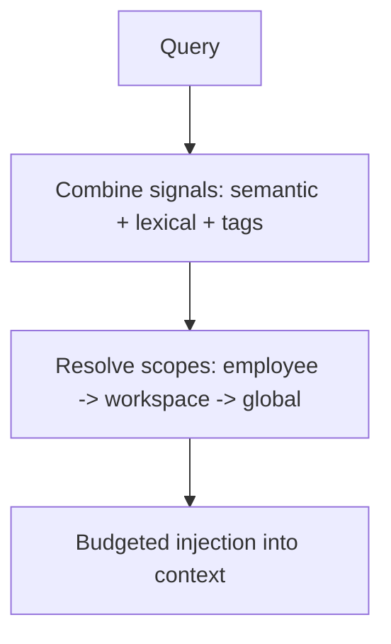
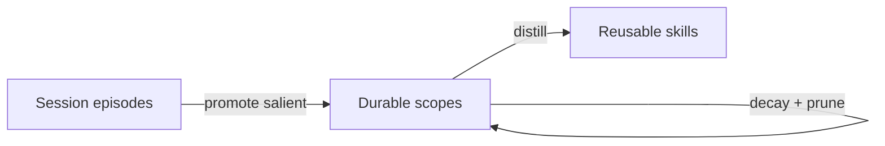

# Memory Model

**Version:** 1.1.0
**Status:** Stable
**Layer:** concept

## Overview

The technology-agnostic model of how Cronus remembers. It defines the **four memory scopes** (global / workspace / employee / session), the shape of a memory item, how recall resolves across scopes, how memory is owned (a synchronous core service plus an asynchronous curator role), and how memory compounds and forgets over time. It is the conceptual realization of the storage model's multi-level memory invariant and of the office model's persistent-learning invariant.

## Related Specifications

- [l1-storage-model.md](l1-storage-model.md) - Refines STO-4 (multi-level memory) and STO-5 (scope lifecycle).
- [l1-office-model.md](l1-office-model.md) - Realizes OFF-9 (persistent, compounding capability).
- [l2-memory-store.md](l2-memory-store.md) - Concrete store (vector + lexical + tags) and the curator role.
- [l2-filesystem-layout.md](l2-filesystem-layout.md) - Where each scope's memory lives on disk.
- [l1-workflow-language.md](l1-workflow-language.md) - A distilled reusable skill (MEM-6) leaves memory as a *workflow* in this language, owned by the skill system — it is not a memory item and not a prose note (MEM-4).

## 1. Motivation

A capable autonomous office must remember at the right granularity — about the human, about a project, about a role, about a single conversation — and forget cleanly when a scope ends. It must recall reliably (not by a single fragile signal), keep its human-authored memory inspectable and editable, and get better the longer it runs without silently corrupting what it knew. This model encodes those properties so implementations cannot drift from them.

## 2. Constraints & Assumptions

- Memory is local-first and works without any network or remote service.
- Recall must stay cheap enough to run on the hot path of every agent turn.
- Durable memory is curated, never an ever-growing raw log: the **authored tier** is small human-readable text; the **learned tier** is a curated structured store with derived indices (MEM-4).
- The knowledge graph is an enrichment that may be added incrementally; core recall must function without it.

## 3. Core Invariants (Layer 1 only)

Rules every Layer 2 implementation MUST NOT violate:

- **MEM-1 (Four scopes):** every memory item belongs to exactly one scope — global, workspace, employee, or session.
- **MEM-2 (Most-specific-first recall):** recall resolves employee → workspace → global; a more specific memory overrides a more general one. Recalled memory is injected under a bounded budget, never wholesale.
- **MEM-3 (Multi-signal recall):** recall combines more than one signal — at minimum semantic similarity, lexical match, and explicit tags. It MUST NOT depend on a single signal. (A relationship graph is an additional signal that MAY be added incrementally.)
- **MEM-4 (Source of truth by memory kind):** durable memory keeps its authoritative copy where inspectability is *practical and valuable* — the "where practical" clause of STO-8, not a blanket text mandate. Two tiers, two truths:
  - **Authored knowledge** (small, human-touched — facts the human states about themselves, hand-written rules and preferences): the **human-readable text is authoritative**; a human inspects and edits it directly.
  - **Learned memory** (high-volume, machine-generated — episodic events, distilled and promoted knowledge): the **structured persistent store is authoritative**; a human-readable rendering of it is a derived, on-demand projection, never a parallel authoritative copy. Machine indices (vector, lexical, graph) remain derived and rebuildable from that store.

  Recoverability of the learned tier comes from **backups of the store**, not from a duplicate text copy — so there is no dual-write to keep in sync. A distilled reusable **skill** (MEM-6) is procedural, not a memory record: it leaves the memory store as a **workflow** in the workflow language, owned by the skill system — never a memory item and never a prose note.
- **MEM-5 (Scope-aware decay & prune):** each item carries a validity scope governing how fast it decays; expired low-utility items are pruned; session memory is ephemeral and auto-pruned.
- **MEM-6 (Compounding, non-destructive):** consolidation promotes salient memories to broader scopes and distills reusable skills so capability is non-decreasing (OFF-9). Contradictions supersede prior memory (recording the change); knowledge is never silently destroyed.
- **MEM-7 (Ownership split):** the core provides synchronous read / write / recall; a dedicated curator role owns asynchronous consolidation and curation. Agents access memory only through the core contract — never by editing stores directly.
- **MEM-8 (Classified & tagged):** every item has a type and is taggable, enabling deterministic sorting and filtering.
- **MEM-9 (Provenance):** every item records its origin (the producing session or source) for traceability.

> L2 specs cannot reach RFC status until all invariants here are addressed in their "Invariant Compliance" section.

## 4. Detailed Design

### 4.1 Memory item (conceptual shape)

```text
[REFERENCE]
{
  id, scope,            // MEM-1: global | workspace | employee | session
  type, content,        // classification + the remembered text (MEM-4 source of truth)
  tags[],               // MEM-8: sorting / filtering ("on shelves")
  validity_scope,       // MEM-5: Forever | Domain | Project | Workaround -> decay rate
  verification,         // Untested -> Tested -> Confirmed -> Stable (raises recall weight)
  utility,              // learned helpfulness; rises/falls with feedback
  created_at, valid_at, invalid_at,  // supersede-not-delete (MEM-6)
  provenance            // MEM-9: producing session / source
}
```

### 4.2 Scopes

| Scope | Remembers | Lifecycle |
| --- | --- | --- |
| Global | the human client; cross-project lessons; shared skills | long-lived |
| Workspace | office/project facts, decisions, artifacts | lives with the office |
| Employee | a role's expertise and calibration | grows with the role (OFF-9) |
| Session | episodic dialogue/run events | ephemeral; auto-pruned |

### 4.3 Recall



Most specific wins (MEM-2); fusion of signals (MEM-3); only as much as the token budget allows is injected.

### 4.4 Write path and the memory router

On a new fact the core classifies its scope (about the human → global, about the project → workspace, about the role → employee, about this conversation only → session), assigns type and tags (MEM-8), de-duplicates against existing memory, and writes to the owning scope. This routing is the "smart memory router."

### 4.5 Lifecycle and ownership (MEM-6, MEM-7)



- **Core service (synchronous):** read, write, recall on the hot path.
- **Curator role (asynchronous):** owns the consolidation cycle — verify, decay, promote, distill skills, detect contradictions, prune low-utility and stale sessions — run periodically under a cost budget.

### 4.6 Source of truth by memory kind (MEM-4)

The blanket "text is source of truth" rule is refined to match STO-8's *where practical* clause: text stays authoritative where a human authors or edits it; at machine scale the store is authoritative and any text is a projection.

| Memory kind | Example | Source of truth | Human-readable copy |
| --- | --- | --- | --- |
| **Authored knowledge** | user-stated facts about themselves; hand-written rules / preferences | human-readable text | yes — authoritative |
| **Learned memory** | episodic run events; distilled / promoted facts | structured persistent store | derived, on-demand projection only |
| **Distilled skill** (MEM-6) | a reusable procedure the office learned | a workflow in the workflow language (skill system, not the memory store) | via the workflow's human rendering |

Rationale for making the learned tier store-authoritative: at thousands-to-millions of items a non-technical client never hand-curates it, so human-readability is not *practical* there (STO-8); a single write path keeps hot-path recall fast and removes the dual-write divergence a parallel text copy would incur; recovery is a backup concern, not a reason to duplicate the corpus as text. The **content** of each learned item is retained in the store itself, so vector/lexical indices remain rebuildable from it without any external note file. Skills are excluded from both tiers on purpose — a procedure is expressed as a workflow, not stored as a declarative memory record (data ≠ procedure).

## 5. Drawbacks & Alternatives

- **Curation lag:** asynchronous consolidation means freshly learned facts may not be promoted instantly; acceptable since the hot path still reads session scope.
- **Store-authoritative learned memory (MEM-4):** making the structured store — not a parallel text copy — authoritative for the high-volume tier removes dual-write divergence and keeps hot-path recall single-write; the cost is relying on backups rather than a duplicate human-readable copy for recovery, an acceptable trade since a non-technical client never hand-curates that tier.
- **Alternative — all memory as human-readable text:** the original blanket rule; rejected because at machine scale the text copy is an unread duplicate of the store's own content, adding dual-write cost and divergence risk for a client who never edits it. Text-truth is retained only for the authored tier, where editing has real value (MEM-4).
- **Alternative — single global memory:** simpler but breaks isolation (OFF-1) and clean forgetting (MEM-5); rejected.
- **Alternative — graph-first recall:** richer relational queries but heavier and slower to build; deferred — recall must work on vector+lexical+tags first. <!-- TBD: criteria/trigger for introducing the relationship-graph signal -->

## Canonical References

| Alias | Path | Purpose |
| --- | --- | --- |
| `[STORAGE]` | `.design/main/specifications/l1-storage-model.md` | Multi-level memory and lifecycle invariants refined here; STO-8 "where practical" clause MEM-4 leans on |
| `[OFFICE]` | `.design/main/specifications/l1-office-model.md` | Persistent-learning invariant (OFF-9) |
| `[STORE]` | `.design/main/specifications/l2-memory-store.md` | Concrete implementation of this model |
| `[WORKFLOW]` | `.design/main/specifications/l1-workflow-language.md` | The language a distilled skill (MEM-6) becomes — procedure, not memory record (MEM-4) |

## Document History

| Version | Date | Author | Notes |
| --- | --- | --- | --- |
| 1.0.0 | 2026-06-24 | Core Team | Initial spec — MEM-1…MEM-9, four scopes, hybrid recall, supersede-not-delete, service+curator ownership. |
| 1.1.0 | 2026-07-15 | Core Team | MEM-4 refined from blanket "text is source of truth" to **source-of-truth by memory kind**: authored tier stays human-readable-authoritative; high-volume learned tier is store-authoritative with text a derived projection (leans on STO-8 "where practical"; removes dual-write). Clarified a distilled skill (MEM-6) is a workflow owned by the skill system, not a memory record — resolving the "store memory as the workflow format" category error (data ≠ procedure). Added §4.6 kind→truth table; new Related/Canonical link to l1-workflow-language; updated §2 constraint and Drawbacks. |
