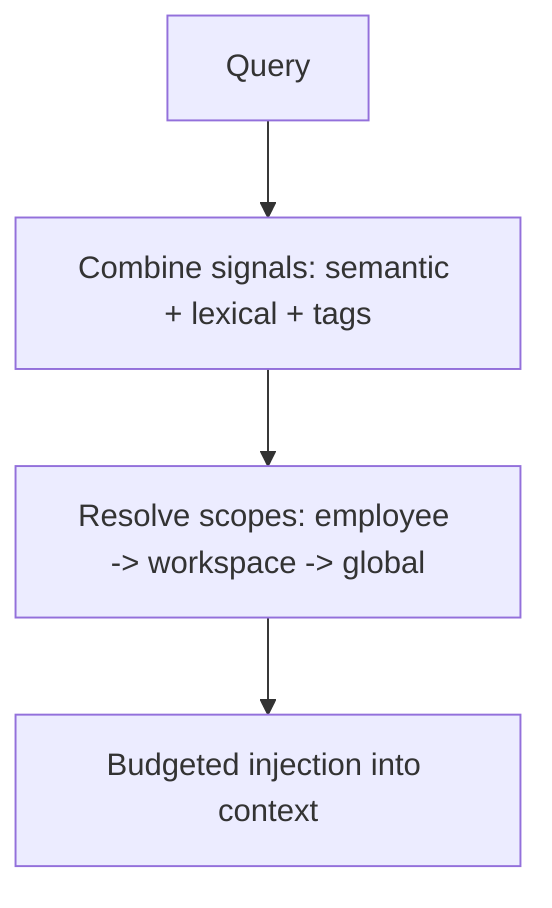
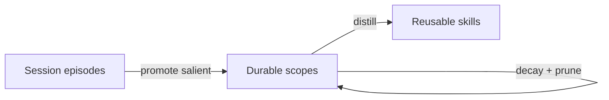

# Memory Model

**Version:** 1.0.0
**Status:** Stable
**Layer:** concept

## Overview

The technology-agnostic model of how Cronus remembers. It defines the **four memory scopes** (global / workspace / employee / session), the shape of a memory item, how recall resolves across scopes, how memory is owned (a synchronous core service plus an asynchronous curator role), and how memory compounds and forgets over time. It is the conceptual realization of the storage model's multi-level memory invariant and of the office model's persistent-learning invariant.

## Related Specifications

- [l1-storage-model.md](l1-storage-model.md) - Refines STO-4 (multi-level memory) and STO-5 (scope lifecycle).
- [l1-office-model.md](l1-office-model.md) - Realizes OFF-9 (persistent, compounding capability).
- [l2-memory-store.md](l2-memory-store.md) - Concrete store (vector + lexical + tags) and the curator role.
- [l2-filesystem-layout.md](l2-filesystem-layout.md) - Where each scope's memory lives on disk.

## 1. Motivation

A capable autonomous office must remember at the right granularity — about the human, about a project, about a role, about a single conversation — and forget cleanly when a scope ends. It must recall reliably (not by a single fragile signal), keep its memory inspectable and editable, and get better the longer it runs without silently corrupting what it knew. This model encodes those properties so implementations cannot drift from them.

## 2. Constraints & Assumptions

- Memory is local-first and works without any network or remote service.
- Recall must stay cheap enough to run on the hot path of every agent turn.
- Durable memory is small, curated text plus derived indices — not an ever-growing raw log.
- The knowledge graph is an enrichment that may be added incrementally; core recall must function without it.

## 3. Core Invariants (Layer 1 only)

Rules every Layer 2 implementation MUST NOT violate:

- **MEM-1 (Four scopes):** every memory item belongs to exactly one scope — global, workspace, employee, or session.
- **MEM-2 (Most-specific-first recall):** recall resolves employee → workspace → global; a more specific memory overrides a more general one. Recalled memory is injected under a bounded budget, never wholesale.
- **MEM-3 (Multi-signal recall):** recall combines more than one signal — at minimum semantic similarity, lexical match, and explicit tags. It MUST NOT depend on a single signal. (A relationship graph is an additional signal that MAY be added incrementally.)
- **MEM-4 (Text is source of truth):** durable memory is human-readable text; machine indices (vectors, lexical, graph) are derived and rebuildable from that text (consistent with STO-8).
- **MEM-5 (Scope-aware decay & prune):** each item carries a validity scope governing how fast it decays; expired low-utility items are pruned; session memory is ephemeral and auto-pruned.
- **MEM-6 (Compounding, non-destructive):** consolidation promotes salient memories to broader scopes and distills reusable skills so capability is non-decreasing (OFF-9). Contradictions supersede prior memory (recording the change); knowledge is never silently destroyed.
- **MEM-7 (Ownership split):** the core provides synchronous read / write / recall; a dedicated curator role owns asynchronous consolidation and curation. Agents access memory only through the core contract — never by editing stores directly.
- **MEM-8 (Classified & tagged):** every item has a type and is taggable, enabling deterministic sorting and filtering.
- **MEM-9 (Provenance):** every item records its origin (the producing session or source) for traceability.

> L2 specs cannot reach RFC status until all invariants here are addressed in their "Invariant Compliance" section.

## 4. Detailed Design

### 4.1 Memory item (conceptual shape)

```text
[REFERENCE]
{
  id, scope,            // MEM-1: global | workspace | employee | session
  type, content,        // classification + the remembered text (MEM-4 source of truth)
  tags[],               // MEM-8: sorting / filtering ("on shelves")
  validity_scope,       // MEM-5: Forever | Domain | Project | Workaround -> decay rate
  verification,         // Untested -> Tested -> Confirmed -> Stable (raises recall weight)
  utility,              // learned helpfulness; rises/falls with feedback
  created_at, valid_at, invalid_at,  // supersede-not-delete (MEM-6)
  provenance            // MEM-9: producing session / source
}
```

### 4.2 Scopes

| Scope | Remembers | Lifecycle |
| --- | --- | --- |
| Global | the human client; cross-project lessons; shared skills | long-lived |
| Workspace | office/project facts, decisions, artifacts | lives with the office |
| Employee | a role's expertise and calibration | grows with the role (OFF-9) |
| Session | episodic dialogue/run events | ephemeral; auto-pruned |

### 4.3 Recall



Most specific wins (MEM-2); fusion of signals (MEM-3); only as much as the token budget allows is injected.

### 4.4 Write path and the memory router

On a new fact the core classifies its scope (about the human → global, about the project → workspace, about the role → employee, about this conversation only → session), assigns type and tags (MEM-8), de-duplicates against existing memory, and writes to the owning scope. This routing is the "smart memory router."

### 4.5 Lifecycle and ownership (MEM-6, MEM-7)



- **Core service (synchronous):** read, write, recall on the hot path.
- **Curator role (asynchronous):** owns the consolidation cycle — verify, decay, promote, distill skills, detect contradictions, prune low-utility and stale sessions — run periodically under a cost budget.

## 5. Drawbacks & Alternatives

- **Curation lag:** asynchronous consolidation means freshly learned facts may not be promoted instantly; acceptable since the hot path still reads session scope.
- **Alternative — single global memory:** simpler but breaks isolation (OFF-1) and clean forgetting (MEM-5); rejected.
- **Alternative — graph-first recall:** richer relational queries but heavier and slower to build; deferred — recall must work on vector+lexical+tags first. <!-- TBD: criteria/trigger for introducing the relationship-graph signal -->

## Canonical References

| Alias | Path | Purpose |
| --- | --- | --- |
| `[STORAGE]` | `.design/main/specifications/l1-storage-model.md` | Multi-level memory and lifecycle invariants refined here |
| `[OFFICE]` | `.design/main/specifications/l1-office-model.md` | Persistent-learning invariant (OFF-9) |
| `[STORE]` | `.design/main/specifications/l2-memory-store.md` | Concrete implementation of this model |
