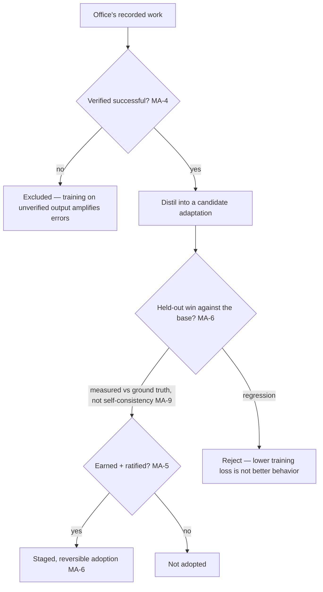

# Model Adaptation

**Version:** 1.0.0
**Status:** Stable
**Layer:** concept

## Overview

The office's **second plane of learning**: specializing the local model itself to the office's domain, as the deep complement to the improvement it already does in the context plane (rules, skills, prompts, harness).

Every existing improvement mechanism changes *what surrounds the model* — the instructions it reads, the tools it holds, the examples it sees. This plane changes *how the model itself responds*, by distilling the office's own recorded successful work into a **small, separable adaptation over a frozen base model** — an adapter attached at load, reversible by detaching, never a mutation of the base.

The two planes are complementary and the distinction is load-bearing: a context-plane change is instant, inspectable, and reversible by editing text; a model-plane change is distilled, opaque, and reversible by detaching a delta. An office with only the context plane cannot make its model natively fluent in its domain; an office that mutated its base in place would have an irreversible, un-composable, un-attributable model it could never roll back.

This spec owns the *contract* of that adaptation — frozen base, separable reversible adapter, distilled from the office's own experience, gated, evaluated, and staged — not the training mechanics, which are a technology-stack concern.

## Related Specifications

- [l1-model-runtime.md](l1-model-runtime.md) - MR-5 already names a model definition as base + optional adapters built *without copying base weights*; this spec owns the adapter's **lifecycle** (produce, evaluate, attach, detach, version), and MR-6 load/unload realizes attach/detach.
- [l1-pattern-codification.md](l1-pattern-codification.md) - The context-plane sibling: it distils observed patterns into *rules* (earned, ratified, reversible — PC-1/PC-2); this distils experience into a *weight adaptation* under the same earned-and-ratified discipline (MA-5).
- [l1-harness-optimization.md](l1-harness-optimization.md) - Its held-out, regression-bounded acceptance (HX-8) is the gate an adaptation passes before adoption (MA-6); offline acceptance is necessary, never sufficient (HX-12).
- [l1-staged-rollout.md](l1-staged-rollout.md) - An adopted adaptation reaches live work through the staged, reversible, holdout-backed release discipline (MA-6), never flipped to default on a training number.
- [l1-reproduction-recipe.md](l1-reproduction-recipe.md) - An adapter is a **component** of any run that used it (RR-3, by content identity); a run reproduced against the bare base behaves differently, so the adapter is part of the recipe.
- [l1-knowledge-horizon.md](l1-knowledge-horizon.md) - MA-9's boundary: an adaptation changes *dispositions*, not the model's knowledge horizon; it never licenses asserting unverified facts.
- [l1-claim-verification.md](l1-claim-verification.md) - An adaptation never relaxes a verification gate (MA-9); a more-fluent model is not a more-correct one.
- [l1-memory-consolidation.md](l1-memory-consolidation.md) - The context-plane experience-distillation sibling (memory); model adaptation is the weight-plane analogue, drawing on the same recorded experience.
- [l1-attestation.md](l1-attestation.md) - An adapter crossing a trust boundary carries a verifiable witness (MA-7); an adapter of unknown provenance is an unverified capability.
- [l1-security.md](l1-security.md) - Local-first: training data and the produced adapter stay on-device (MA-10); egress is a separate authorized decision.
- [l1-telemetry.md](l1-telemetry.md) - The office's own transcripts are the training substrate (MA-4) and never leave the device to produce an adaptation.

## 1. Motivation

An office that does the same *kind* of work for months accumulates a great deal of evidence about how that work should be done — which phrasings land, which formats are wanted, which domain conventions hold, which mistakes recur. Cronus already turns some of that evidence into improvement: repeated patterns become rules, successful skills evolve, the harness is tuned. All of that lives in the *context* around the model.

But there is a ceiling on what the context plane can do, and it is reached exactly where the office is most specialized. No amount of prompt engineering makes a general model natively fluent in a niche domain's conventions; no rule makes it stop reaching for the wrong idiom by reflex; no example set fits in the context window that a month of the office's own work would teach. Past that ceiling, the only remaining lever is the model itself — and the general model was never trained on *this office's* domain, because nobody outside it has that data.

The naive way to pull that lever is ruinous, and naming why is the whole point of this spec.

**Mutating the base in place destroys everything that made the model manageable.** Retraining the base weights directly gives an irreversible change (there is no "undo" once the weights moved), an un-composable one (two domains cannot both live in one mutated base without interfering), and an un-attributable one (nobody can say what the change was or roll back just the bad part). It also breaks the shared-base storage economy — every specialized copy is now a full model. The frozen-base-plus-separable-adapter shape avoids all four: the base never moves, the adaptation is a small delta, and detaching it returns *exactly* to the base.

**Training on your own output is how a system quietly poisons itself.** An office that distils its experience into its model is training on data it generated. If it trains on *everything* it produced, it amplifies its own errors and idiosyncrasies until the model collapses toward its own worst habits — confidently, because the loss went down. The safeguard is not to skip the adaptation but to distil only from *verified* successful work, and to measure the result against *ground truth*, never against the model's own consistency. A lower training loss is not evidence of better behavior; it is evidence of a better fit to the data it was shown, which may be the office's mistakes.

**A model-plane change is higher-consequence than a context-plane change, so it needs a stricter gate, not a looser one.** A rule is text a human can read and revert in a second; an adapter is an opaque tensor that changes the model's dispositions in ways no one can fully inspect. It is tempting to treat "the office fine-tuned itself overnight" as a convenience feature. It is the opposite: it is the single most consequential thing the office can do to its own behavior, and it must be earned by evidence, gated by the same authority the context plane answers to, evaluated against a held-out set before it touches real work, and rolled out reversibly.

## 2. Constraints & Assumptions

- **Local-first by construction**: the training substrate (the office's own transcripts) and the produced adapter both stay on-device; producing an adaptation performs no egress, and sharing one is a separate authorized decision.
- The spec is **technology-agnostic**: it names no training method, adapter format, quantization scheme, or optimizer. It constrains the *lifecycle and honesty* of an adaptation, not how the weights are computed.
- The whole plane is **opt-in**: an office is fully functional with only the frozen base and the context plane. Adaptation is a deepening, never a runtime dependency.
- An "adaptation" is a separable delta over one named, frozen base — an attachable specialization, not a new model.
- Model-plane and context-plane improvement are **distinct and composed**, never substituted for one another.

## 3. Core Invariants

Rules every Layer 2 implementation MUST NOT violate:

- **MA-1 (Two planes of learning, never conflated):** the office improves in two distinct planes — the **context plane** (rules, skills, prompts, harness) and the **model plane** (a weight-level adaptation of the local base). They are complementary and MUST NOT be conflated: a context-plane change is instant, human-readable, and reversible by editing; a model-plane change is distilled, opaque, and reversible by detaching. A design that routes model-plane specialization through the context plane (or vice versa) mislabels an opaque change as an inspectable one, or an inspectable one as needing distillation.
- **MA-2 (Frozen base, separable delta — never a base mutation):** model-layer specialization is a **small, separable adaptation over a frozen base model**; the base weights are never mutated in place. Four properties follow and all four are the point: the adaptation is cheap to produce and store, attachable and detachable at load, reversible by detaching (returning *exactly* to the base), and composable with other adaptations. Mutating the base in place is forbidden — it is irreversible, un-composable, un-attributable, and destroys shared-base deduplication.
- **MA-3 (Composable, per-task attachable, conflicts declared not silently blended):** multiple adaptations MAY specialize one base to different domains, each **attached when its domain is active and detached otherwise**; where two are combined, the combination and its precedence are **declared**, never implicit, and a combination whose effects **conflict** is either resolved by the declared precedence or **refused** — never silently averaged into a blend belonging to neither domain. An office running many kinds of work needs one base and many small adapters, not many base copies; but two adapters stacked without a declared resolution produce a model that is confidently wrong in a third way neither was trained for.
- **MA-4 (Distilled from the office's own verified experience, provenance-preserved):** an adaptation is produced by distilling the office's **own recorded, verified successful work** — not external data by default — and it records **which experience it was distilled from** (which runs, which verified outcomes, over what period), so its behavior is attributable and its basis reconstructable. Training on *unverified* output is forbidden: it is the path by which an office amplifies its own errors into its model.
- **MA-5 (Earned and ratified, never automatic, never self-adopted):** producing and **adopting** a model-plane adaptation is **earned by evidence and gated by human ratification** (or the same authority the context-plane improvement answers to), never triggered automatically by mere repetition, and never self-adopted by the agent. Because a model-plane change is higher-consequence than a context-plane one (opaque, harder to inspect), its gate is **at least as strict** as pattern-codification's, never laxer. An agent MUST NOT specialize its own model without the authority the office reserves for it. (Composes PC-1/PC-2, SEC-10.)
- **MA-6 (Evaluated against the base before adoption; regression-gated; staged):** an adaptation is **measured against the frozen base on a held-out evaluation** before it augments or replaces the base for real work — the same held-out-honest, regression-bounded acceptance an accepted candidate passes — and it reaches live work through the **staged, reversible, holdout-backed** release discipline, never flipped to default on a training-loss number. A lower training loss is not evidence of better real behavior; only a held-out win against the base is, and even that is necessary, not sufficient.
- **MA-7 (Content-addressed, versioned, attested like any model artifact):** an adaptation is stored **content-addressed and versioned**, and where it crosses a trust boundary carries a **verifiable witness** of its content and origin — the same identity and integrity discipline as a base model. An adapter of unknown provenance attached to a base is an **unverified capability**, default-denied where integrity matters.
- **MA-8 (Reversible and non-destructive):** adopting an adaptation **never destroys** the base or a prior adaptation; **detaching returns exactly to the prior state**; a bad adaptation is removed by detaching, not by training back. Every model-plane improvement is undoable in one step, because the improvement is a separable delta, not an overwrite.
- **MA-9 (Changes dispositions, not knowledge or correctness — and never a safety relaxation):** an adaptation changes the model's **dispositions** — domain fluency, style, format adherence, idiom — not its **knowledge horizon** and not its **correctness guarantees**. It MUST NOT be presented as having taught the model facts it cannot verify (a more-fluent model is not a more-knowledgeable one), and it **never relaxes** a verification, grounding, or safety gate. Distilling from the office's own outputs risks amplifying the office's own errors, so an adaptation is measured against **ground truth**, never against its own consistency.
- **MA-10 (Optional, local-first, never a dependency):** the model-adaptation plane is **opt-in**; the office is fully functional with only the frozen base and the context plane. Training and the produced adapter stay **on-device** by default; sharing an adapter beyond the device is a separate authorized decision under the egress gate. Adaptation is a deepening the office may choose, never a runtime requirement it depends on.

> L2 specs cannot reach RFC status until all invariants here are addressed in their "Invariant Compliance" section.

## 4. Detailed Design

### 4.1 The two planes

| | Context plane | Model plane (this spec) |
| --- | --- | --- |
| Changes | What surrounds the model (rules, skills, prompts, harness) | How the model itself responds |
| Unit | A rule, a skill, a harness setting | A separable adapter over a frozen base |
| Change is | Instant, human-readable | Distilled, opaque |
| Reversible by | Editing / removing text | Detaching the delta |
| Ceiling | Cannot make a general model natively fluent in a niche domain | Specializes the model where the context plane runs out |
| Owned by | Pattern-codification, self-improvement, harness-optimization | **This spec** |

The planes are not ranked — they are complementary. The context plane is where most improvement happens because it is cheap and legible; the model plane is the deeper lever reserved for the specialization no amount of surrounding context can achieve.

### 4.2 Why frozen-base-plus-adapter (MA-2)

```text
[REFERENCE]
base            : frozen, never mutated, shared across all adaptations
adaptation      : a small separable delta { base_ref, distilled_from, content_digest, version }
attached model  : base + adaptation, composed at load (MR-6), decomposed on detach
detach          : returns EXACTLY to base — the improvement is undoable in one step
```

| Property | Frozen base + adapter | Mutated base |
| --- | --- | --- |
| Reversible | Yes — detach | No — weights moved |
| Composable (many domains) | Yes — many adapters, one base | No — domains interfere |
| Attributable | Yes — adapter records its basis (MA-4) | No — change is diffused into the base |
| Storage | One base + small deltas | One full model per specialization |

### 4.3 The self-training trap (MA-4 / MA-9)



The trap is subtle because it is invisible from the inside: an office trained on all of its own output gets a *lower training loss* and a model that agrees with its past self more — which looks like improvement and is often the opposite, because the past self's errors are now baked in. Two safeguards make the difference: distil only from **verified** work (MA-4), and judge the result against **ground truth**, never against the model's agreement with itself (MA-9).

### 4.4 Boundary with neighbouring layers

| Concern | Owner |
| --- | --- |
| Specializing the model itself via a reversible adapter distilled from experience | **This spec** |
| Promoting an observed pattern to an inspectable *rule* | Pattern-codification (the context-plane sibling) |
| Evolving skills / the harness from experience | Self-improvement / harness-optimization (context plane) |
| Content-addressed model storage, load/unload, adapter as a definition field | Model runtime (MR-3/MR-5/MR-6) |
| The held-out, regression-bounded acceptance gate | Harness-optimization (HX-8) |
| Reaching live work reversibly, behind a holdout | Staged rollout |
| Recording which base+adapter produced a given output | Reproduction recipe (the adapter is a component, RR-3) |
| Consolidating experience into *memory* (context) | Memory-consolidation (the context-plane distillation sibling) |

## 5. Drawbacks & Alternatives

- **Producing an adaptation is expensive and skilled.** Accepted, and bounded by MA-10 (opt-in) and MA-5 (earned, not automatic): the office does not adapt its model casually, and most improvement stays in the cheap context plane. The model plane is reserved for the specialization that pays for the cost.
- **An opaque adapter is harder to audit than a rule.** True, and the reason MA-5 makes its gate *stricter* rather than looser, MA-6 requires held-out evaluation, and MA-4/MA-7 preserve its provenance and identity — the opacity is compensated by discipline around it, never waved through.
- **Self-training risks model collapse.** The central risk, addressed head-on by MA-4 (verified experience only) and MA-9 (measured against ground truth, not self-consistency). An adaptation that improves self-agreement while regressing against ground truth is rejected by MA-6.
- **Alternative — mutate the base directly.** Rejected by MA-2: irreversible, un-composable, un-attributable, and it destroys the storage economy. The separable delta gives every benefit of specialization with none of these.
- **Alternative — stay entirely in the context plane.** Rejected as a *ceiling*, not a mechanism: no amount of surrounding context makes a general model natively fluent in a niche domain. The context plane remains where most improvement happens (MA-1); the model plane exists for what it cannot reach.
- **Alternative — adapt automatically from all output.** Rejected by MA-4/MA-5/MA-9: it trains on unverified data, self-adopts an opaque high-consequence change, and amplifies the office's own errors — the exact failure this spec is built to prevent.
- **Alternative — treat a training-loss drop as adoption evidence.** Rejected by MA-6: a lower loss measures fit to the shown data, which may be the office's mistakes; only a held-out win against the base counts, and even that is not sufficient without the staged, reversible rollout.

## Canonical References

| Alias | Path | Purpose |
| --- | --- | --- |
| `[RUNTIME]` | `.design/main/specifications/l1-model-runtime.md` | Adapter as a model-definition field (MR-5), content-addressed store (MR-3), load/unload as attach/detach (MR-6). |
| `[CODIFY]` | `.design/main/specifications/l1-pattern-codification.md` | The context-plane sibling whose earned-and-ratified discipline (PC-1/PC-2) MA-5 reuses at higher consequence. |
| `[OPTIMIZE]` | `.design/main/specifications/l1-harness-optimization.md` | The held-out, regression-bounded acceptance gate (HX-8) MA-6 passes an adaptation through. |
| `[ROLLOUT]` | `.design/main/specifications/l1-staged-rollout.md` | The staged, reversible, holdout-backed release an adopted adaptation reaches live work through. |

## Document History

| Version | Date | Author | Notes |
| --- | --- | --- | --- |
| 1.0.0 | 2026-07-23 | Core Team | Initial spec — model-layer specialization as the office's second plane of learning, the deep complement to context-plane improvement (rules/skills/prompts/harness): two distinct planes never conflated, context-plane change instant/inspectable/edit-reversible and model-plane change distilled/opaque/detach-reversible (MA-1); a **small separable adaptation over a frozen base, never a base mutation**, giving cheap-reversible-composable-attributable specialization where mutation gives none of the four (MA-2); composable and per-task attachable so one base serves many domains (MA-3); distilled from the office's **own verified** experience with provenance preserved, since training on unverified output amplifies the office's errors into its model (MA-4); earned and ratified, never automatic and never self-adopted, with a gate *at least as strict* as the context plane's because a model-plane change is higher-consequence (MA-5); measured against the base on a held-out set and staged reversibly, since a lower training loss is not evidence of better behavior (MA-6); content-addressed, versioned, and attested like any model artifact, an unknown adapter being an unverified capability (MA-7); reversible and non-destructive — detach returns exactly to the prior state (MA-8); changes dispositions not knowledge or correctness and never relaxes a safety gate, measured against ground truth not self-consistency (MA-9); optional, local-first, and never a runtime dependency (MA-10). Concept-only. |
