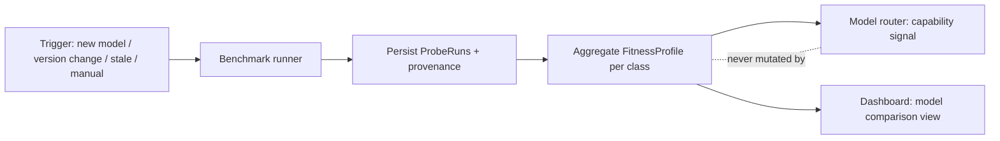

# Model Benchmarking

**Version:** 1.0.0
**Status:** Stable
**Layer:** concept

## Overview

Model benchmarking is the measurement subsystem for **base-model fitness per task class**. It runs a small, hardcoded, version-controlled set of probe tasks against a candidate model and scores every run on three separate dimensions — output quality, wall-clock time, and token/cost consumption — producing a per-model, per-task-class **fitness profile** that the model router consumes as one objective signal among several when deciding *which model to use for which task*.

The probe set is deliberately tiny and fixed: three probe classes (a **code probe** graded by mechanical verification, a **content probe** graded against a reference checklist, and an **instruction-compliance probe** graded by exact structural match), each small enough to complete in seconds-to-minutes within a hard token budget. Fixed probes trade breadth for comparability: the same task, run against every candidate model through the same minimal harness, yields deltas attributable to the model alone.

This closes a measurement gap the evaluation family leaves open: [l1-evaluations.md](l1-evaluations.md) captures *subjective human feedback* post-delivery, [l1-evaluation-suites.md](l1-evaluation-suites.md) measures a *customization's* marginal effect (explicitly not the base model), [l1-agent-coevaluation.md](l1-agent-coevaluation.md) diagnoses *(model, harness) pairs*, and [l1-retrieval-evaluation.md](l1-retrieval-evaluation.md) scores *ranked recall*. None of them answers "is this model objectively good, fast, and cheap enough for this class of task?" — this spec does.

## Related Specifications

- [l1-routing.md](l1-routing.md) - The consumer pattern: fitness profiles are a multi-signal input (RTG-1), weighted by configurable policy (RTG-5); auxiliary-role bindings (RTG-9) are calibrated by the same profiles.
- [l2-model-router.md](l2-model-router.md) - Concrete consumer: the "capability match" and difficulty-tier signals gain a measured, per-task-class data source.
- [l1-evaluation-suites.md](l1-evaluation-suites.md) - Grader machinery reused, never redefined (ES-3 discipline); demarcation: suites test customizations, this spec tests the base model.
- [l1-agent-coevaluation.md](l1-agent-coevaluation.md) - Demarcation and discipline: co-evaluation diagnoses (model, harness) pairs; this spec holds the harness fixed and minimal so deltas attribute to the model (ACE-5 comparability precedent).
- [l1-evaluations.md](l1-evaluations.md) - The subjective complement: human per-message feedback; both feed the router as signals, never overrides (EVL-5 pattern).
- [l1-retrieval-evaluation.md](l1-retrieval-evaluation.md) - Sibling measurement discipline: fixture as ground truth, baseline persistence, delta reporting, no opaque single score (RE-1/RE-3/RE-5 precedents).
- [l1-security.md](l1-security.md) - Probes contain no user data; benchmark traffic respects secret isolation and no-exfiltration (INV-7, SEC-2).
- [l2-budget-engine.md](l2-budget-engine.md) - Budget caps that bound benchmark runs on metered credentials (MB-8).

## 1. Motivation

The model router selects a model using difficulty estimates, cost, latency, and "capability match" — but the capability data behind that match is *asserted*, not *measured*: it comes from catalog metadata and vendor claims. User evaluations (l1-evaluations) tie quality to human judgment, but they are subjective, sparse, arrive only after a model is already routed to users, and never measure cost or speed. Meanwhile the model landscape churns: new models appear, providers silently revise deployed versions, and local models vary with quantization and host hardware. Every such change lands in the catalog with zero objective evidence about what the model is actually good at, how fast it is *here*, and what it costs per unit of useful output.

A hardcoded micro-benchmark answers this cheaply. Three fixed probe tasks — one per task class the router distinguishes — take minutes and a bounded token spend, yet yield an objective, repeatable, three-dimensional reading: *quality* (did the output pass fixed checks), *time* (how long did it take), *tokens/cost* (what did it consume). Persisted per model and per task class, these readings give the router measured ground to route code tasks to the model that verifiably writes working code, content chores to the model with the best quality-per-cost ratio, and structured internal chores (RTG-9 auxiliary roles) to the cheapest model that reliably follows instructions.

The deliberate smallness is the point: this is not a leaderboard or a research benchmark. It is a *fitness instrument* — like a hardware fit check, but for capability — run on registration, on version change, and on demand.

## 2. Constraints & Assumptions

- **Probes are small and cheap.** Each probe completes within a hard per-probe budget (tokens and wall time); a full benchmark run over all classes stays within a configured run budget. Minutes and cents, not hours and dollars.
- **Probes contain no user data.** Probe inputs are authored fixtures shipped with the product; nothing from user sessions, memory, or workspaces enters a probe (SEC-2, INV-7). The only egress is the probe call itself to the model's own serving endpoint.
- **Results are indicative, not authoritative.** A handful of probes cannot rank models globally; they measure *fitness for a task class* with honest variance reporting. Model output is nondeterministic — repeated trials and variance disclosure are part of the design, not an afterthought.
- **Benchmark ≠ production measurement.** The benchmark harness is minimal and fixed; it does not reproduce the production agent harness. Production behavior of the full (model, harness) pair is the domain of agent co-evaluation.
- **Local models depend on hardware.** For on-device models, latency and feasibility readings are valid only for the host that produced them; profiles carry a hardware fingerprint.

## 3. Core Invariants

Rules every Layer 2 implementation MUST NOT violate. They are technology-neutral.

- **MB-1 (Hardcoded probe set as ground truth):** benchmarking is driven by a small, version-controlled set of human-authored probe tasks with declared inputs, expected outcomes, and graders. Probes are fixed artifacts: each has a stable identity, the set is versioned as a whole, and no probe is ever generated, selected, or modified by any model under test. Results are comparable across models and across time only within the same probe-set version.

- **MB-2 (Closed probe-class taxonomy):** every probe belongs to exactly one of three classes — **code** (produce or repair a small program artifact, mechanically verifiable), **content** (produce prose from a fixed source, reference-checkable), and **instruction-compliance** (produce exactly-specified structured output, schema/match-checkable). Each class corresponds to a task class the model router distinguishes when routing. Adding or removing a class is a versioned amendment to this specification, not a runtime option.

- **MB-3 (Three-dimensional scorecard, never one number):** every probe run reports three dimensions separately — **quality** (graded score with per-check breakdown), **time** (total wall-clock latency, plus time-to-first-output where the serving mode streams), and **tokens/cost** (input, output, and total token counts with derived monetary cost from catalog pricing). The system never collapses the dimensions into a single opaque score; consumers weigh them by configurable policy (RTG-5).

- **MB-4 (Deterministic-first grading):** quality grading is mechanical and deterministic wherever the probe class permits — verification checks pass/fail, schema validates, reference items match. An LLM judge is complementary only, under a hybrid floor: a judge MAY lower a mechanically-passing score, it MUST NOT rescue a mechanically-failed probe. A model never grades its own output. Graders compose the typed grader taxonomy of evaluation suites; benchmarking MUST NOT define a parallel validation engine (ES-3 discipline).

- **MB-5 (Model under test, fixed minimal harness):** the unit under test is the base model — identified by model identity, serving lane, and configuration (including quantization for local models). Every probe executes through a fixed, minimal, versioned benchmark harness that is identical for every candidate model, so score deltas attribute to the model alone (ACE-5 comparability discipline). Customization effects are the domain of evaluation suites; (model, harness) interaction is the domain of agent co-evaluation; this spec measures neither.

- **MB-6 (Fitness profile as routing signal, not override):** probe results aggregate into a per-(model, probe-class) fitness profile that the model router consumes as *one* signal among several (RTG-1). Benchmarking never directly mutates routing policy, never rewrites the model catalog, and never overrides privacy, cost, budget, or availability signals. A model with no profile routes under a neutral default — an absent measurement is never fabricated.

- **MB-7 (Provenance, baseline, and staleness):** every benchmark run persists with full provenance — model identity/version/lane, probe-set version, harness version, hardware fingerprint for local models, timestamp, trial count, and per-probe raw metrics. Results are reported as signed deltas against the model's previous baseline. Profiles carry explicit staleness: a profile older than a configured age, or produced under an older probe-set or harness version, degrades to *indicative*, is flagged for re-measurement, and is never silently treated as fresh.

- **MB-8 (Bounded, isolated, off the hot path):** benchmark execution is budget-capped per probe and per run (tokens and wall time), runs in isolation with no access to production state, and never executes on the routing hot path. Runs against metered credentials occur only under an explicitly configured budget or an explicit user action — benchmarking is never a silent background cost.

- **MB-9 (Honest failure accounting):** timeout, refusal, malformed output, and provider error are first-class typed outcomes, recorded with their reason and counted against the quality dimension — never dropped, never silently retried until they pass. Nondeterminism is handled by a declared trial count with variance reported alongside the mean; an unstable result is marked unstable, not averaged into false confidence. A fault in the grader or benchmark harness itself invalidates the probe run — no score is recorded against the model and the fault is surfaced — it is never counted as a model failure.

> L2 specs cannot reach RFC status until all invariants here are addressed in their "Invariant Compliance" section.

## 4. Detailed Design

### 4.1 Probe anatomy

A probe is declarative data, not code (mirroring the evaluation-suite task shape):

```text
Probe {
  id                : ProbeId            // stable, e.g. "code-01"
  class             : "code" | "content" | "instruction-compliance"
  prompt            : Text               // the task given to the model
  fixtures          : Fixture[]          // authored input files/sources, no user data
  graders           : GraderRef[]        // composed from the ES-3 taxonomy
  budget            : { max_tokens, max_wall_time }
  trials            : u8                 // default small (e.g. 3)
}

ProbeSet {
  version           : SemVer             // bump invalidates cross-version comparison
  probes            : Probe[]            // small: one to a few probes per class
}
```

### 4.2 The three probe mechanisms

**Code probe (mechanical verification).** A small, self-contained programming task — implement a tiny well-specified function, or repair a seeded defect in a short fixture. Grading is fully mechanical: does the produced artifact parse, do the hidden fixed checks pass, are declared constraints honored. Quality is the weighted fraction of checks passed. This measures fitness for the code-generation task class with zero judge subjectivity.

**Content probe (reference checklist).** A fixed source text plus a production task — summarize, restructure, or draft against the source. Grading is reference-based: a mandatory-fact checklist (items the output must contain), fabrication checks (claims that must NOT appear because the source does not support them), and structural requirements (length bounds, required sections). An optional judge grades coherence under the MB-4 hybrid floor. This measures fitness for content/writing task classes.

**Instruction-compliance probe (exact structural match).** A task whose output is exactly specified — emit an object valid against a fixed schema, perform a constrained transformation, follow a precise formatting rule. Grading is schema validation and exact/pattern match. This measures instruction-following reliability — precisely the capability that internal chores (titling, triage, decomposition; RTG-9 auxiliary roles) depend on, making it the calibration source for economical auxiliary-role bindings.

### 4.3 Scorecard and fitness profile

```text
ProbeRun {
  probe_id, probe_set_version, harness_version
  model             : { model_id, model_version, lane, quantization?, hardware_fingerprint? }
  outcome           : completed | timeout | refusal | malformed | provider_error
  quality           : { score: 0..1, checks: CheckResult[], variance }
  time              : { total_wall_time, time_to_first_output? }
  tokens            : { input, output, total, derived_cost }
  trials            : u8
  measured_at       : Timestamp
}

FitnessProfile {                          // aggregate, per (model, class)
  model             : ModelIdentity
  class             : ProbeClass
  quality_mean      : 0..1
  quality_variance  : f32
  latency_median    : Duration
  cost_per_probe    : Money
  sample_count      : u32
  probe_set_version : SemVer
  measured_at       : Timestamp
  staleness         : fresh | indicative | stale
}
```

### 4.4 Routing integration



The router reads the fitness profile as its measured capability-match input, weighted per policy (RTG-5) alongside difficulty, cost, availability, privacy, and evaluation sentiment. Guards:

- **Minimum-sample guard:** a profile below a configured sample count does not significantly shift routing weight (mirrors the evaluation aggregate guard).
- **Staleness discount:** `indicative` and `stale` profiles carry reduced weight; `stale` triggers a re-measurement flag, never an automatic silent run on metered lanes (MB-8).
- **Absent profile:** neutral default weight — never a fabricated score (MB-6).

### 4.5 Benchmark lifecycle

Triggers (all resolve to a scheduled, budget-checked run — never inline on the routing hot path):

1. **Model registered** — a new catalog entry schedules a first benchmark.
2. **Model changed** — version, lane, or quantization change invalidates the profile and schedules a re-run.
3. **Probe-set or harness version bump** — all profiles degrade to `indicative` and queue for refresh.
4. **Staleness refresh** — a configured age threshold re-queues measurement.
5. **Manual run** — the user invokes benchmarking on demand for any model, with frontend parity across CLI/TUI/GUI (INV-3 command parity; verb-first command grammar).

For metered (paid) lanes, triggers 1–4 execute only within an explicitly configured benchmark budget; absent a budget they surface as a pending recommendation the user confirms (MB-8).

### 4.6 Demarcation within the evaluation family

| Spec | Subject under test | Signal type | Primary consumer |
| --- | --- | --- | --- |
| **This spec** | Base model, per task class | Objective probes: quality + time + tokens | Model router |
| l1-evaluations | Delivered responses | Subjective human feedback | Router weights, analytics |
| l1-evaluation-suites | A customization (skill/role/workflow) | Golden tasks + typed graders | Quality gates, skill evolution |
| l1-agent-coevaluation | (Model, harness) pair | Sliced diagnostic matrix | Harness engineering |
| l1-retrieval-evaluation | Ranked-recall surfaces | IR metrics vs labeled fixture | Regression gates |
| l1-practice-analytics | Session conduct | Rule-engine findings | Coaching, dashboard |

None substitutes for another; this spec is the only member that measures the model itself, in isolation, with cost and latency as first-class dimensions.

## 5. Implementation Notes

1. **Probe set + graders first** — author the three probe classes as declarative data, composing existing typed graders (ES-3); no new validation engine.
2. **Runner** — budget-capped, isolated execution off the hot path; persists `ProbeRun` records with full provenance.
3. **Profile store + aggregation** — per-(model, class) fitness profiles with staleness tracking.
4. **Router wiring** — expose the profile as the capability-match signal in routing policy, with minimum-sample and staleness guards.
5. **Frontend surface** — on-demand run + profile/comparison view with CLI/TUI/GUI parity, following the verb-first command grammar.

## 6. Drawbacks & Alternatives

- **Public leaderboards instead:** rejected as the primary source — public benchmarks measure neither this host's latency, this lane's real cost, nor these task classes; they are contamination-prone and say nothing about a local quantized build. Catalog metadata may still record them as advisory context.
- **Implicit scoring from production traffic:** attractive (no probe cost) but noisy, slow to converge, confounded by the production harness, and it spends *user* interactions to learn — the benchmark spends a bounded probe budget instead. Production signals remain the domain of l1-evaluations.
- **LLM-judge-only grading:** rejected as the base — judge bias and drift would make profiles incomparable over time; MB-4 keeps grading deterministic-first with the judge as a bounded complement.
- **Large probe sets for statistical power:** deliberately declined — the instrument's value is being cheap enough to run on every model change; variance disclosure (MB-9) keeps the honesty that a small N costs. <!-- TBD: revisit per-class probe counts once field data shows whether 1–3 probes per class discriminate models adequately -->
- **Contamination risk:** hardcoded probes shipped with the product can leak into training corpora over time, inflating scores. Mitigated by probe-set versioning (MB-1) — refreshing probes is a normal versioned amendment; cross-version comparison is already forbidden.

## Document History

| Version | Date | Change |
| --- | --- | --- |
| 1.0.0 | 2026-07-02 | Initial concept: hardcoded three-class micro-benchmark (code / content / instruction-compliance probes) measuring base-model fitness per task class on quality + time + tokens/cost (MB-1…MB-9); fitness profiles feed the model router as a signal, never an override; deterministic-first grading composing the evaluation-suite grader taxonomy. |

## Canonical References

| Alias | Path | Purpose |
| --- | --- | --- |
| `[ROUTING]` | `.design/main/specifications/l1-routing.md` | The signal model (RTG-1/RTG-5/RTG-9) fitness profiles plug into |
| `[ROUTER]` | `.design/main/specifications/l2-model-router.md` | Concrete consumer: capability-match signal wiring and routing policy |
| `[SUITES]` | `.design/main/specifications/l1-evaluation-suites.md` | Typed grader taxonomy that probe graders compose (ES-3) |
| `[COEVAL]` | `.design/main/specifications/l1-agent-coevaluation.md` | Comparability contract and failure-attribution discipline (ACE-5) |
