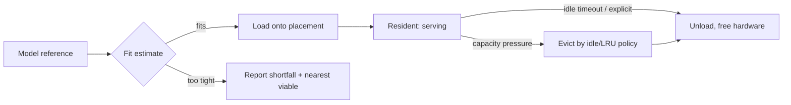

# Model Runtime

**Version:** 1.0.0
**Status:** Stable
**Layer:** concept

## Overview

A paradigm-neutral model for the **local model runtime** — the subsystem that acquires,
stores, describes, loads, schedules, serves, and unloads inference models behind a stable
local interface. It names the skeleton that local-model serving tools converge on:
a provider-abstracted backend contract, a content-addressed model store fed by named
registry acquisition, a portable declarative model definition, an explicit load/unload
lifecycle with hardware-fit scheduling, a streaming inference contract with an
industry-compatible surface, and a managed background server that thin clients drive.

This spec is a **model-spec** (sibling to [l1-storage-model.md](l1-storage-model.md) and
[l1-routing.md](l1-routing.md)). It does not pick engines, quant formats, or accelerators,
and it does not decide *which* model to use for a request — that is routing. This document
owns what the existing model specs do not yet name as one coherent concept: the **runtime
lifecycle** a model passes through on-device — how it is fetched and stored, how it is
described and customized, how it is loaded onto hardware and freed, and how it is served —
the substrate that routing schedules onto and that the provider catalog implements.

## Related Specifications

- [l1-routing.md](l1-routing.md) - Smart-router model selection; routing decides *which* model, this runtime *hosts and serves* it. Strict complement.
- [l1-file-management.md](l1-file-management.md) - Content-addressed immutable-blob storage (SHA-256, metadata decoupled, reference-tracked GC); the model store (MR-3) reuses this exact pattern for model layers.
- [l1-storage-model.md](l1-storage-model.md) - Two-tier immutable-program / mutable-state model; model weights are the immutable "program" tier, runtime state the mutable tier.
- [l1-office-control.md](l1-office-control.md) - Pause/resume, hibernation, quota-driven model substitution; the server lifecycle (MR-10) composes with office control.
- [l1-doctor.md](l1-doctor.md) - Health checks and safe repair; runtime status and loaded-model state (MR-10) are doctor probes.
- [l1-security.md](l1-security.md) - Secret isolation and egress gate; remote-backend credentials and the on-device-first boundary (MR-1) are governed there.
- [l1-architecture.md](l1-architecture.md) - Layered core + frontends; the runtime is a core subsystem fronted by thin clients (MR-11).

## 1. Motivation

An office that reasons primarily with on-device models needs a runtime that turns a model
name into a loaded, serving, hardware-scheduled engine — and frees it again — without each
caller managing weights, formats, ports, or memory. Studied local-model serving tools
converge on a shared anatomy, and naming it buys four things:

1. **Privacy by default.** A local serving boundary keeps weights, prompts, and inference
   on-device; reaching a remote backend becomes a deliberate, auditable opt-in rather than
   an accident.
2. **Backend independence.** One model contract over many engines, quantizations, and
   remote APIs means the rest of the system targets a stable interface; swapping or adding a
   backend never ripples into callers.
3. **Honest resource use.** Explicit load/unload with fit estimation means models occupy
   hardware only while needed and never load into a guaranteed out-of-memory failure — the
   runtime reports the shortfall and the nearest viable option instead.
4. **Reproducibility.** Content-addressed storage and digest-pinned references make "which
   exact weights answered this" a recorded fact, not a guess.

The cost of *not* modeling this is a model layer that leaks: weights silently sent to
remote services, each backend wired in bespoke, models pinned in memory or thrashing,
storage duplicated across near-identical models, and results untraceable to the weights and
parameters that produced them.

## 2. Constraints & Assumptions

- **Technology-agnostic.** This is a Layer 1 concept. It names no inference engine, quant
  format, accelerator API, registry protocol, or API vendor. The concrete provider catalog,
  quantization hierarchy, and accelerator backends live in the technology-stack Layer 2
  spec.
- **Defers where a concern is owned.** *Which* model to pick (multi-signal scoring,
  fit-level ranking, mode packs) defers to the routing concept and the model-router L2;
  error taxonomy and retry/rotate/fallback defer to the model-error-recovery L2; the
  concrete engine/format/GPU catalog defers to the technology-stack L2. This model wins only
  on the runtime lifecycle contract (§3).
- **On-device-first.** Local serving is the default; remote/hosted backends are explicit
  opt-ins behind the security egress gate.
- **Routing sits above, not inside.** The runtime exposes capability and fit information and
  loads/serves on command; it does not itself choose between candidate models for a task.
- **Reuses existing storage patterns.** The model store is not a new storage paradigm — it
  is the content-addressed immutable-blob model already defined for files, specialized to
  model layers.

## 3. Core Invariants

Layer 2 realizations and concrete backends MUST NOT violate these.

- **MR-1 Local-first serving.** Models run on-device by default behind a local server the
  office owns; weights, prompts, and inference never leave the device unless the user
  authorizes a remote backend. A remote/hosted backend is an explicit opt-in, never a silent
  fallback.
- **MR-2 Provider-abstracted backends.** Every inference backend — local engines, quantized
  formats, remote APIs — sits behind one uniform **model contract** (load, generate-stream,
  embed, describe, unload). Calling code targets the contract, not a specific engine; adding
  a backend does not change callers.
- **MR-3 Content-addressed model store.** Acquired models are stored as immutable,
  content-addressed blobs keyed by cryptographic digest and referenced by manifests;
  identical layers deduplicate and are shared across models; a model reference resolves to a
  manifest that pins exact blob digests.
- **MR-4 Verifiable named acquisition.** A model is acquired by name from a registry,
  resumably and digest-verified; the same mechanism supports publishing/exporting. Running a
  not-yet-present model acquires it first; acquisition is explicit and progress-reported,
  never a hidden blocking stall.
- **MR-5 Portable model definition.** A model is described by a declarative, portable
  definition — a base reference plus inference parameters, a prompt/chat template, a system
  preamble, optional adapters, and licensing/metadata — from which a customized model is
  built **without copying base weights**. The definition is the unit of import,
  customization, and reproduction.
- **MR-6 Explicit load/unload lifecycle.** A model occupies hardware only while loaded;
  loading is explicit or implicit-on-first-use, unloading is explicit or automatic after an
  idle timeout. Resident models are introspectable (what is loaded, on which device, memory
  used). Capacity pressure evicts by a declared policy (idle / least-recently-used) rather
  than failing the request.
- **MR-7 Fit-gated hardware scheduling.** Before load, the runtime estimates the model's fit
  against available resources (memory, accelerator, context budget) and selects a placement
  (full-accelerator / partial-offload / CPU). A model that cannot fit is reported with the
  shortfall and the nearest viable alternative — never loaded into a guaranteed failure.
  Detailed scoring is delegated to routing; the runtime owns only the feasibility gate.
- **MR-8 Streaming inference contract.** Generation, chat, and embedding are exposed through
  a stable request/response contract with first-class **streaming** (incremental output) and
  **cancellation**. A compatibility surface mirrors the prevailing industry API so external
  clients interoperate without bespoke adapters.
- **MR-9 Catalog management.** The local catalog is fully manageable through the same
  contract clients use — list installed, show details (definition, size, digest,
  parameters), copy/rename, and remove with garbage-collection of now-unreferenced blobs.
  No manual file surgery is required to manage models.
- **MR-10 Managed server with observability.** The serving runtime is a managed background
  process with explicit start / stop / status; it streams structured logs and exposes health
  and resident-model state. Its lifecycle composes with the office's pause/resume and
  self-healing subsystems rather than being an opaque black box.
- **MR-11 Thin clients over the server.** Human (command-line / UI) and programmatic (SDK)
  clients are thin surfaces over the local server's interface — the runtime is the single
  source of truth for model state. Clients hold no authoritative model state and degrade
  gracefully when the server is offline.
- **MR-12 Versioned, reproducible references.** A model reference may be loose (a name/tag)
  or exact (a digest); the exact digest is what guarantees reproducibility. The runtime
  records which digest actually served each request, so any result is traceable to the
  precise weights and parameters that produced it.

> A Layer 2 spec cannot reach RFC status until every MR-n invariant above is addressed in
> its "Invariant Compliance" section.

## 5. Detailed Design

### 5.1 Primitive model

| Primitive | Purpose |
| --- | --- |
| Model reference | A loose name/tag or an exact digest identifying a model (MR-12). Resolves to a manifest. |
| Manifest | The list of blob digests (layers) plus the model definition that together constitute a model (MR-3). |
| Blob | An immutable, content-addressed layer (weights, template, params), shared across models by digest (MR-3). |
| Model definition | The portable declarative description used to build/import/customize a model (MR-5). |
| Backend | A concrete inference engine behind the uniform model contract (MR-2). |
| Runtime server | The managed background process that owns storage, loading, scheduling, and serving (MR-10). |

### 5.2 Acquisition and content-addressed storage

Models are acquired by name from a registry and stored as content-addressed blobs (MR-3,
MR-4): a pull resolves a name/tag to a manifest, fetches each referenced blob the store does
not already hold (resumable, digest-verified), and records the manifest. Because blobs are
keyed by digest, layers shared between models (a common base, a shared template) are stored
once. The reverse direction — publishing/exporting — uses the same manifest+blob mechanism.
Removal decrements references and garbage-collects blobs that no manifest still points to.
This is the file-management content-addressed-blob pattern (immutable blobs, metadata
decoupled, reference-tracked GC) specialized to model layers — not a second storage design.

### 5.3 Portable model definition

A model is built from a declarative definition (MR-5) rather than a copied weight bundle:

| Definition part | Role |
| --- | --- |
| Base reference | The parent model the definition extends (by reference, weights not copied). |
| Inference parameters | Defaults for sampling, context length, stop conditions, etc. |
| Prompt / chat template | How messages and roles are rendered into the model's expected input. |
| System preamble | A default system instruction baked into the model. |
| Adapters | Optional fine-tune/LoRA layers applied over the base. |
| Metadata / license | Provenance, licensing, and descriptive fields. |

Building a customized model composes the base reference with overrides into a new manifest;
the base blobs are shared, so customization is cheap and reproducible. The definition is the
single unit of import, customization, and reproduction.

### 5.4 Load / unload lifecycle and introspection

A model is loaded explicitly or on first use, occupies hardware only while resident, and is
freed by explicit unload or idle timeout (MR-6). Resident models are introspectable — what
is loaded, on which device, and how much memory it uses — through the same contract clients
use (MR-9, MR-11). Under capacity pressure the runtime evicts by a declared policy rather
than failing the request.

### 5.5 Fit-gated hardware scheduling

Before loading, the runtime estimates the model's footprint (parameter size at its
quantization, context/KV budget, overhead) against available memory and accelerators and
chooses a placement (MR-7): full-accelerator, partial-offload across accelerator and CPU, or
CPU-only. A model that cannot fit any placement is reported with the concrete shortfall and
the nearest viable alternative — it is never loaded into a guaranteed failure. The runtime
owns only this **feasibility gate**; the comparative scoring that picks among feasible models
for a task belongs to routing.

### 5.6 Serving contract and compatibility surface

Inference is exposed through a stable contract (MR-8) covering generation, chat, and
embedding, with streaming (incremental output) and cancellation as first-class concerns. A
**compatibility surface** mirrors the prevailing industry request/response shape so that
external clients and agent frameworks built against that standard interoperate with the
local runtime unchanged. The native contract and the compatibility surface are two
projections of the same underlying serving capability.

### 5.7 Server lifecycle, thin clients, and observability

The runtime is a managed background process with explicit start / stop / status (MR-10); it
streams structured logs and exposes health plus resident-model state. Human and programmatic
clients are thin surfaces over its interface (MR-11): a command-line/UI client for people, an
SDK for code, both holding no authoritative model state and degrading gracefully when the
server is down. This lifecycle composes with the office's own pause/resume and self-healing
subsystems — the runtime is a cooperating subsystem, not an opaque dependency.

### 5.8 Ideas-to-adopt mapping

What the studied local-model serving tools contribute, and where each lands. Sources are
named by structural idea, not by product.

| Source idea | Worth adopting | Where it lands |
| --- | --- | --- |
| One model server behind a stable local API | Local-first serving boundary; remote backends as explicit opt-in. | **New** as MR-1 / §5.7; tightens the technology-stack provider catalog into a runtime concept. |
| Uniform contract over many backends | Load/generate/embed/describe/unload abstraction; callers backend-agnostic. | **New** as MR-2 / §5.1; the L1 contract the provider catalog implements. |
| Content-addressed model store (manifests + blobs) | Digest-keyed immutable layers, dedup, reference GC. | **New** as MR-3 / §5.2; reuses the file-management blob pattern for model layers. |
| Named, verifiable registry pull/push | Resumable digest-checked acquisition; acquire-on-run; export. | **New** as MR-4 / §5.2. |
| Declarative portable model definition | Base + params + template + system + adapters built without copying weights. | **New** as MR-5 / §5.3. |
| Explicit load/unload + resident-model introspection | Hardware held only while loaded; idle/LRU eviction; "what's resident". | **New** as MR-6 / §5.4; complements office-control's quota-driven substitution. |
| Fit estimation before load | Feasibility gate with shortfall + nearest-viable; placement selection. | MR-7 / §5.5; the gate side of the model-router's hardware-fit scoring. |
| Streaming contract + industry-compatible surface | First-class streaming/cancellation; drop-in compatibility for external clients. | **New** as MR-8 / §5.6. |
| Thin CLI/SDK over the daemon | Single source of truth in the server; clients degrade when offline. | MR-11 / §5.7; the CLI-grammar/library-source-of-truth stance applied to models. |

## 7. Drawbacks & Alternatives

- **Overlap with the model L2 specs.** The technology-stack, model-router, and
  error-recovery specs already touch models heavily. Mitigation: this model states only the
  *runtime lifecycle* — acquire/store/define/load/schedule/serve/unload behind a provider
  contract — and explicitly delegates provider catalog, scoring, and recovery to those
  specs, earning its place as the L1 they implement against.
- **Routing/runtime boundary.** "Pick a model" and "host a model" can blur. Mitigation: the
  runtime owns only the feasibility gate (MR-7) and serving; comparative selection stays in
  routing — a clean seam that lets each evolve independently.
- **Reproducibility vs convenience.** Loose tags are convenient but mutable. Mitigation:
  MR-12 keeps both — loose references for ergonomics, recorded digests for traceability — so
  convenience never costs reproducibility.
- **Alternative — call backends directly per feature.** Let each subsystem talk to whatever
  engine it wants. Rejected: it is exactly how weights leak to remote services, backends
  fragment, memory thrashes, storage duplicates, and results become untraceable — the
  failures this model prevents.

## Canonical References

| Alias | Path | Purpose |
| --- | --- | --- |
| `[ROUTING]` | `.design/main/specifications/l1-routing.md` | Authoritative model-selection concept this runtime serves beneath (the routing/runtime seam). |
| `[FILES]` | `.design/main/specifications/l1-file-management.md` | Authoritative content-addressed immutable-blob storage pattern reused by the model store (MR-3). |
| `[STACK]` | `.design/main/specifications/l2-technology-stack.md` | Authoritative concrete provider catalog, quantization hierarchy, and accelerator backends realizing this runtime. |
| `[ROUTER]` | `.design/main/specifications/l2-model-router.md` | Authoritative hardware-fit scoring and selection that sits above the MR-7 feasibility gate. |
| `[SECURITY]` | `.design/main/specifications/l1-security.md` | Authoritative secret isolation and egress gate governing remote-backend opt-in (MR-1). |

## Document History

| Version | Date | Change |
| --- | --- | --- |
| 1.0.0 | 2026-06-25 | Initial model: local-first provider-abstracted serving runtime — content-addressed model store with verifiable registry acquisition, portable declarative model definition, explicit load/unload lifecycle with fit-gated hardware scheduling, streaming inference contract with an industry-compatible surface, managed observable server, thin clients, and digest-reproducible references (MR-1…MR-12). |
