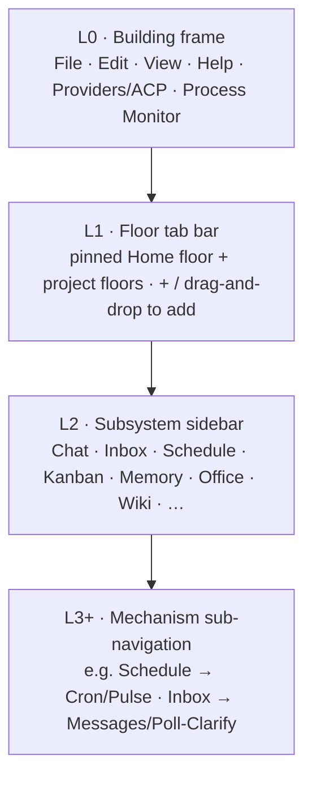

# Navigation Model

**Version:** 1.2.0
**Status:** Stable
**Layer:** concept

## Overview

The navigation model defines the application as a **strictly nested "building/corporation" of navigation layers**, where each inner layer is a child scoped to exactly one instance of the layer that contains it. Four layers nest, outermost to innermost:

- **L0 — Building** (the corporation frame): the application-global chrome and command groups (File / Edit / View / Help, Providers/ACP, Process Monitor) that act on the whole application.
- **L1 — Floors** (horizontal tab bar): each tab is a floor = one workspace (office/project). The first floor is a pinned, non-closable **home** workspace; further floors are added on demand.
- **L2 — Subsystems** (per-floor vertical sidebar): the function-labelled tabs (Chat, Inbox, Schedule, Kanban, Memory, Office, Wiki, …) that expose the active floor's capabilities.
- **L3+ — Mechanisms** (recursive sub-navigation): a subsystem that needs internal structure grows its own nested sub-tabs or sub-menu (e.g. Schedule → Cron/Pulse; Inbox → Messages/Poll-Clarify).

Every primary capability is reachable through this containment tree; no capability is buried more than one navigation step deep within its layer. The model also defines the two-tier settings hierarchy (global application settings vs per-floor local settings) and the IDE integration entry point accessible from a floor's tab.

> **Scope boundary.** This model owns the concrete navigation **topology and catalog** — layers, tab sets, and the affordances that switch and create them. The frontend **runtime shape** it is composed on (state authority, action dispatch, workbench parts) belongs to [l1-application-shell.md](l1-application-shell.md); the lifecycle of the floors themselves (home vs project, creation, deletion, staffing) belongs to [l1-workspace-lifecycle.md](l1-workspace-lifecycle.md). This spec pins *what the navigation is*, not *how it is rendered* or *how a workspace lives*.

## Related Specifications

- [l1-application-shell.md](l1-application-shell.md) — the frontend runtime shape (state authority, action dispatch, workbench composition) these navigation surfaces are composed on; this model supplies the concrete tab catalog the shell hosts (AS-9)
- [l1-workspace-lifecycle.md](l1-workspace-lifecycle.md) — home vs project workspaces, creation/deletion, and the default manager; the lifecycle of the L1 floors this model lays out (WSL-1…WSL-8)
- [l1-office-model.md](l1-office-model.md) — the office concept a floor exposes (floor = workspace = office, 1:1)
- [l1-office-control.md](l1-office-control.md) — OfficeState taxonomy driving the floor tab status icons
- [l1-storage-model.md](l1-storage-model.md) — the mutable state tier where the home floor's files live (NV-9), as opposed to a project floor's bound disk folder
- [l1-process-monitor.md](l1-process-monitor.md) — the application-own process view surfaced at the Building layer (NV-7) and as a candidate sidebar subsystem
- [l1-project-wiki.md](l1-project-wiki.md) — client-facing living project documentation surfaced through the Wiki tab
- [l2-workspace-management.md](l2-workspace-management.md) — office creation, naming, and lifecycle
- [l2-app-ui.md](l2-app-ui.md) — rendering implementation of this model

## 1. Motivation

A multi-subsystem application with 10+ distinct capabilities needs a consistent, memorable navigation structure. Without a formal model, tab placement drifts arbitrarily across UI iterations and different platform builds. The navigation model guarantees that any user, on any platform, sees the same canonical structure and can locate any capability without exploration.

## 2. Constraints & Assumptions

- **Strict containment.** The four layers form a containment tree (Building ⊃ Floor ⊃ Subsystem ⊃ Mechanism). A surface at any layer is scoped to exactly one instance of its parent and addresses only its own subtree; there is no lateral navigation into a sibling's interior.
- The sidebar is scoped to the currently selected floor (office); every tab shows data for that floor only.
- The floor (office) tab bar is scoped to the whole application (building); it lists all known floors.
- The Building layer (L0) is the only navigation scoped to the whole application rather than to one floor; its command groups act across all floors.
- Exactly one home floor exists and is always loaded (it is the permanent lobby, WSL-1); project floors are lazily loaded (NV-2).
- A project floor is bound 1:1 to a folder on disk; the home floor is bound to the managed state tier, not to a user project folder.
- Navigation is read-only with respect to system state — mutations happen within each subsystem surface, not from navigation controls themselves. (Floor **creation/deletion** affordances are a lifecycle concern owned by workspace-lifecycle; the tab bar only surfaces the entry points.)
- The navigation model is platform-neutral (applies equally to desktop, web, and mobile); the "desktop building" is the reference framing but the nesting invariants are platform-agnostic. Platform-specific adaptations (e.g. how L0 menus render on a platform without a menu bar) are L2 concerns.

## 3. Core Invariants

- **NV-1 Canonical sidebar order**: the sidebar presents exactly the defined set of primary tabs in a fixed order. No tab may be hidden, reordered, or removed at the application level. A user or office may PIN additional shortcut tabs above the canonical set; the canonical set remains intact below.
- **NV-2 Office tab lazy loading**: an office tab is loaded into memory only when the user activates it, or when it holds an actively running task that requires monitoring. An inactive office with no running tasks MUST NOT consume foreground resources.
- **NV-3 Live status indicator**: each office tab displays a status icon drawn from the OfficeState taxonomy (from `l1-office-control.md`). The icon MUST reflect live engine state, not a cached snapshot older than one event cycle.
- **NV-4 Two-tier settings**: the Settings tab exposes global settings (affect the whole application) and local settings (affect only the active office). Both tiers are reachable from the same tab; they are visually separated with a clear tier label.
- **NV-5 IDE integration**: every office exposes an "Open in IDE" action reachable from its tab's settings dropdown. The action shell-spawns the user's configured editor against the office's workspace root path.
- **NV-6 Strict layer nesting (parent-child containment)**: navigation is a strict containment tree of four layers — **Building** (L0, application frame) ⊃ **Floor** (L1, one workspace/office per horizontal tab) ⊃ **Subsystem** (L2, one sidebar surface) ⊃ **Mechanism** (L3+, a subsystem's own sub-navigation). Each inner layer is a child scoped to exactly one instance of its parent and inherits that parent's scope; a surface addresses only its own subtree and never reaches into a sibling's interior. Opening or focusing a child never detaches it from its parent context, and scope always narrows downward, never sideways.
- **NV-7 Building frame & application menu (L0)**: the outermost layer is the building frame carrying the application-global command groups **File / Edit / View / Help**, plus building-wide facilities **Providers/ACP** (model-provider and agent-client-protocol connections) and **Process Monitor**. These act on the whole application (all floors) and are the only navigation not scoped to a single floor. The concrete contents of each menu group are settled at the UX stage. <!-- TBD: final per-menu item lists for File/Edit/View/Help and which building-wide facilities beyond Providers/ACP + Process Monitor live at L0 -->
- **NV-8 Floor = disk-bound workspace tab**: each horizontal tab is a floor representing exactly one workspace (office); the floor↔workspace binding is 1:1. A **project** floor binds to a folder on disk at creation and the binding is stable for the floor's life. A floor is created by any of three equivalent affordances: the **File** menu ("New / Add project"), the **"+" / Add** control on the tab bar, or **drag-and-drop** of a project folder onto the tab bar (which creates a workspace bound to the dropped folder). (Consistent with WSL-3/WSL-4/WSL-7; the tab bar surfaces entry points, lifecycle is owned by workspace-lifecycle.)
- **NV-9 Default pinned home floor**: the first floor is **pinned, non-closable, and loaded on application start**. It is the single permanent **home** workspace (WSL-1) — the personal organizer / life-planner — and is **not** bound to an external disk project: its files live in the managed mutable **state tier** (per l1-storage-model), not a user project folder. It hosts the building-level boss (the building's steward / default manager, WSL-2) with cross-workspace oversight. Every other floor follows it in the tab order and is user-closable.
- **NV-10 Recursive sub-navigation (L3+)**: a subsystem that has internal structure grows its own **nested sub-navigation** — a horizontal sub-tab strip or a sub-menu — that is itself a child layer scoped to that subsystem and obeys NV-6 recursively. A subsystem with no internal structure has no L3 layer; navigation depth is added only where the capability earns it, never uniformly.

## 4. Detailed Design

### 4.0 The Four-Layer Building Model

Navigation is a strict containment tree. Each layer hosts the next and narrows scope; nothing addresses a sibling's interior (NV-6).



| Layer | Surface | Scope | Owns |
| --- | --- | --- | --- |
| L0 Building | Application menu / frame chrome | Whole application | File/Edit/View/Help, Providers/ACP, Process Monitor (NV-7) |
| L1 Floor | Horizontal tab bar | One workspace (office) per tab | Floor switching + creation affordances; pinned Home floor (NV-8, NV-9) |
| L2 Subsystem | Vertical sidebar of the active floor | One subsystem surface within that floor | The canonical sidebar catalog (§4.1, NV-1) |
| L3+ Mechanism | Sub-tabs / sub-menu within a subsystem | One mechanism within that subsystem | Recursive sub-navigation, added only where earned (NV-10) |

**Building layer (L0).** The building frame is the corporation shell. It carries the application-global command groups — **File**, **Edit**, **View**, **Help** — and building-wide facilities that are not tied to any one floor: **Providers/ACP** (managing model-provider connections and agent-client-protocol links) and **Process Monitor** (the application's own read-only OS-process view, per l1-process-monitor). These are the only navigation controls that act across all floors at once. Their concrete per-menu contents are a UX-stage concern (NV-7 TBD).

### 4.1 Sidebar Tab Catalog

Fixed order; badge shows live pending-item count where applicable.

| # | Tab | Subsystem | Badge |
| --- | --- | --- | --- |
| 1 | Chat | Conversation with the active office orchestrator | Unread messages |
| 2 | Notifications / Inbox | Incoming events: messages, alerts, approval requests | Unread count |
| 3 | Channels | Persistent topic threads; deliberation logs; inter-role communication | Active threads |
| 4 | Sessions | Current and historical agent sessions | Running sessions |
| 5 | Schedule | Recurring jobs, one-shot schedules, cron entries | Jobs due today |
| 6 | Pulse | Heartbeat activity: background routine and inner-monologue log | Active pulses |
| 7 | Memory | Office memory store: facts, skills, knowledge items | — |
| 8 | Office | Automation canvas + agent interaction graph | — |
| 9 | Kanban | Work board: triage → todo → ready → running → blocked → done | Active + blocked cards |
| 10 | Security | Sandbox policies, secret vault status, audit log | Policy alerts |
| 11 | Wiki | Client-facing living project documentation: overview, areas, decisions, how-to, changelog (read-only, office-maintained) | Updated since last visit |
| 12 | Settings | Two-tier configuration: global + per-office | — |

**Candidate additions (UX-stage, additive under NV-1).** The following subsystems are recognized capabilities not yet placed in the canonical order above; they extend the set additively (as the Wiki tab did in v1.1.0) once the UX pass fixes their position. The canonical set (NV-1) stays intact and the newcomers slot in without reordering the existing members. <!-- TBD: final position/order and whether any fold into an existing tab as an L3 mechanism rather than a new L2 tab -->

| Candidate | Subsystem | Note |
| --- | --- | --- |
| Discover | Discovery / research surface for the active floor | placement TBD |
| Graph | Knowledge / spec / relationship graph view | may overlap Memory or Office; placement TBD |
| Process Monitor | Per-floor projection of the application's process view (also surfaced building-wide at L0, NV-7) | placement TBD |

### 4.2 Floor (Workspace) Tab Bar

The horizontal tab bar is the L1 floor layer: it lists all floors in the building, one floor per workspace (office). Each entry:

- **Floor name** — display label (from workspace config, kebab-case slug underneath)
- **Status icon** — live OfficeState: Active / Idle / Paused / Hibernating / Error / Offline (NV-3)
- **Settings dropdown** — per-floor quick actions: rename, open in IDE, pause/resume, close tab, delete workspace

**Pinned home floor (NV-9).** The first floor is pinned to the head of the bar, is non-closable, and has no "delete workspace" action in its dropdown. It is the permanent home workspace — the organizer/life-planner whose files live in the state tier — and it loads on application start regardless of last-active state. Its dropdown still offers rename/settings, but not close/delete.

**Creating a floor (NV-8).** A new project floor is added by any of three equivalent affordances, all resolving to workspace creation (workspace-lifecycle WSL-4):

1. **File menu** → "New / Add project" (the L0 entry point).
2. **"+" / Add** control at the trailing end of the tab bar.
3. **Drag-and-drop** a project folder onto the tab bar — the dropped folder becomes the new floor's bound `workspace_root`.

Affordances 1–2 collect the name/description/path (or prompt for a folder); affordance 3 pre-fills the path from the drop and derives an initial name from the folder. All three then follow the workspace-lifecycle creation flow (normalize → instantiate → default manager appears).

**Lazy loading (NV-2).** On application start, the home floor is loaded (always) plus the most recently active project floor. Switching activates the target floor on demand. A project floor is eligible for unloading when its tab is closed and it has no running background tasks; the home floor is never a candidate for unloading (NV-9).

### 4.3 Settings Two-Tier Structure

```text
[REFERENCE]
Global Settings (affect the whole application — all offices)
  ├── Appearance: theme (system/light/dark), language, density, configured IDE
  ├── Models: default provider, global cost limits, API key management
  ├── Security: sandbox defaults, secret storage backend, audit retention
  ├── Notifications: delivery targets, quiet hours, escalation rules
  └── Updates: release channel, update policy

Local Settings (affect only the active office)
  ├── Office identity: name, description, icon, workspace root path
  ├── Model overrides: per-role model assignment
  ├── Automation: office-level automation rules and pipeline toggles
  ├── Git: repository path, default remote, branch strategy declaration
  └── Integrations: office-specific MCP server endpoints
```

Global settings are stored in the application's global config file. Local settings travel with the office workspace (stored in the office's local config), enabling portability.

### 4.4 IDE Integration

The "Open in IDE" action (NV-5):

1. Reads the office's `workspace_root` path from Local Settings
2. Reads the `configured_ide` command from Global Settings → Appearance
3. Shell-spawns: `{configured_ide} {workspace_root}`

The editor is not embedded; the application is the launcher only. The configured IDE is any program that accepts a path as its first CLI argument. Default: the system's `$EDITOR` variable, falling back to a platform-appropriate default (VS Code on desktop).

### 4.5 Recursive Sub-Navigation (L3+)

A subsystem grows an internal navigation layer only when its function has distinct facets; that layer is itself a child scoped to the subsystem (NV-6, NV-10). Two canonical examples fix the pattern; the full per-subsystem breakdown is a UX-stage concern.

```plaintext
[REFERENCE]  Layered nesting, illustrated
L2 Subsystem: Schedule
  └── L3 sub-tabs
        ├── Cron    — recurring / one-shot schedule entries
        └── Pulse   — heartbeat activity: background routine + inner-monologue log

L2 Subsystem: Inbox / Notifications
  └── L3 sub-menu
        ├── Messages / Logs   — ordinary incoming events and activity log
        └── Poll / Clarify    — approval & clarification requests: the office asking
                                 the client to decide or disambiguate (see intent-resolution)
```

- **Schedule → { Cron, Pulse }.** Cron holds recurring and one-shot entries; Pulse is the heartbeat/inner-monologue stream. <!-- TBD: whether Pulse stays a top-level sidebar tab (#6) or folds under Schedule as an L3 sub-tab — settled at the UX stage; both readings satisfy NV-10 -->
- **Inbox → { Messages/Logs, Poll/Clarify }.** The "Poll/Clarify" facet is where the office surfaces its questions to the client (decision requests, disambiguation) as distinct from ordinary notifications — the navigational home of the ask-when-blocking interactions (l1-intent-resolution IR-2).
- **General rule.** Any subsystem MAY declare an L3 layer; one with a single flat surface declares none. Depth is earned per-subsystem, never imposed uniformly (NV-10). The exhaustive mapping of which subsystems carry sub-navigation, and their facet lists, is deferred to the UX design pass. <!-- TBD: per-subsystem L3 facet catalog -->

## 5. Implementation Notes

1. Office tab lazy loading (NV-2) requires the engine to expose a per-office `is_loaded` predicate and a `load`/`unload` command.
2. Status icons (NV-3) subscribe to the OfficeState event bus from `l1-office-control.md`; no polling.
3. Local settings files must be excluded from the office's git repository by default (`.gitignore` entry) — they may contain local paths and model keys that are machine-specific.

## 6. Drawbacks & Alternatives

**Alternative: fully customizable sidebar** — let users reorder, hide, or rename any tab. Rejected: NV-1 ensures consistency across users, platforms, and documentation; customization fragments the mental model.

**Alternative: no office tab bar, use a list or picker dialog** — a dropdown or modal replaces the tab bar. Loses the glanceability of NV-3 live status icons across all offices simultaneously.

## Canonical References

| Alias | Path | Purpose |
| --- | --- | --- |
| `[OFFICE-CTRL]` | `.design/main/specifications/l1-office-control.md` | OfficeState taxonomy for NV-3 status icons |
| `[APP-SHELL]` | `.design/main/specifications/l1-application-shell.md` | Frontend runtime shape these layers are composed on (AS-9 workbench) |
| `[WSL]` | `.design/main/specifications/l1-workspace-lifecycle.md` | Home vs project floors, creation flow, default manager (NV-8, NV-9) |
| `[STORAGE]` | `.design/main/specifications/l1-storage-model.md` | State tier backing the home floor's files (NV-9) |
| `[PROC-MON]` | `.design/main/specifications/l1-process-monitor.md` | Building-level and candidate-sidebar Process Monitor (NV-7) |
| `[WORKSPACE-MGMT]` | `.design/main/specifications/l2-workspace-management.md` | Office naming and root path |
| `[APP-UI]` | `.design/main/specifications/l2-app-ui.md` | Rendering host |

## Document History

| Version | Date | Author | Notes |
| --- | --- | --- | --- |
| 1.0.0 | 2026-06-24 | Core Team | Initial spec — NV-1…NV-5, 11-tab catalog, office tab bar, two-tier settings, IDE integration |
| 1.1.0 | 2026-06-26 | Core Team | Added the Wiki tab (now #11, Settings → #12) — client-facing living project documentation surface (see l1-project-wiki.md). Additive extension of the canonical set; NV-1 unchanged. |
| 1.2.0 | 2026-07-02 | Core Team | Added the four-layer nested "building/corporation" model (§4.0) and invariants NV-6…NV-10: strict parent-child layer containment (NV-6), the L0 Building frame + application menu incl. Providers/ACP + Process Monitor (NV-7), floor = disk-bound workspace tab with File-menu / "+" / drag-and-drop creation affordances (NV-8), the pinned non-closable default home floor backed by the state tier (NV-9), and recursive per-subsystem L3+ sub-navigation with Schedule→Cron/Pulse and Inbox→Messages/Poll-Clarify examples (NV-10). Additive: NV-1…NV-5 and the canonical sidebar order unchanged; new subsystem candidates (Discover/Graph/Process Monitor) and per-menu/per-subsystem leaf placement carried as UX-stage TBD markers. |
