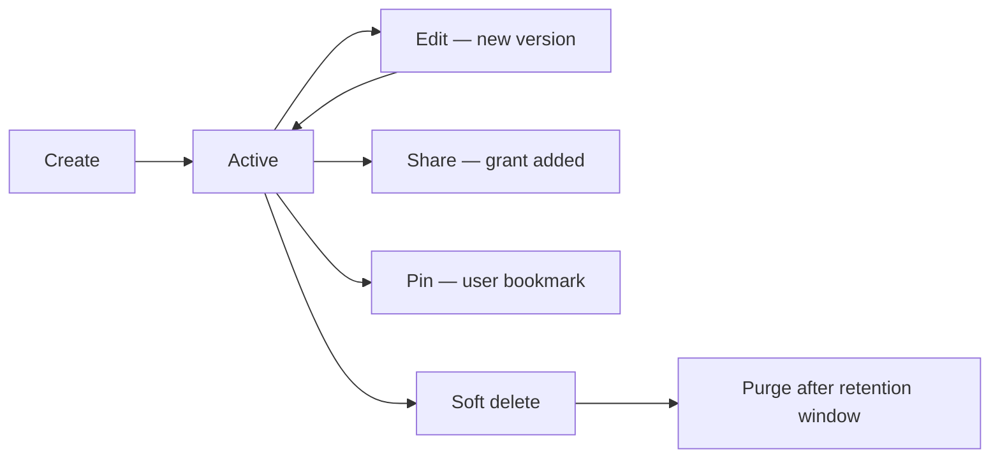

# Notes

**Version:** 1.0.0
**Status:** Stable
**Layer:** concept

## Overview

Persistent, structured documents — notes — that users and agents create, read, update, pin, and share as standalone artifacts. Notes differ from memory entries (ephemeral conversational context), from chat sessions (turn-by-turn exchange), and from knowledge base documents (read-only reference material). A note is a living, editable artifact: a plan, a report, a knowledge article, a scratchpad. It has identity, version history, rich content, and optional collaborative access.

## Related Specifications

- [l1-resource-sharing.md](l1-resource-sharing.md) - Notes are shareable resources governed by the access grant model.
- [l1-file-management.md](l1-file-management.md) - Notes may embed or reference files (images, attachments).
- [l1-memory-model.md](l1-memory-model.md) - Memory is conversational and ephemeral; notes are intentional and persistent.
- [l1-knowledge-base.md](l1-knowledge-base.md) - Notes may be added to a knowledge collection for retrieval.
- [l2-notes.md](l2-notes.md) - Concrete implementation: storage, CRDT sync, pinning.

## 1. Motivation

Agents and users often need a durable place to capture output that is not a chat turn: a structured plan after a brainstorming session, a report after a research task, a reference guide to share with the team. Without notes, all of this ends up either discarded, duplicated across chats, or forced into the memory model where it decays. Notes give artifacts a proper home with identity, persistence, and access control.

## 2. Constraints & Assumptions

- Notes are not real-time collaborative by default; they support concurrent editing via CRDT-based merge, but real-time presence (cursor sharing, live co-authoring) is optional.
- Note content is rich text (structured document tree); plain-text and Markdown are valid subsets.
- Notes are not automatically indexed for retrieval; adding a note to a knowledge collection is an explicit user action.
- Agent-authored notes carry agent provenance and are flagged as machine-generated until reviewed.

## 3. Core Invariants

Rules every Layer 2 implementation MUST NOT violate:

- **NOT-1 (Artifact, not conversation):** a note has a stable ID, creation timestamp, and edit history; it is not ephemeral and does not expire with a session.
- **NOT-2 (Rich structured content):** note content is a structured document tree supporting at minimum: headings, paragraphs, code blocks, lists, inline images (via file reference), and tables.
- **NOT-3 (Access control):** notes follow the resource-sharing model (RS-1…RS-8); a note is private to its owner unless explicitly shared. Read access allows viewing; write access allows editing.
- **NOT-4 (Pin / star):** any principal with read access may pin a note as a personal bookmark; pinning is per-user and does not affect the note's content, access, or visibility to others.
- **NOT-5 (Agent authorship):** when an agent creates a note, the note carries an `author_type = agent` flag and the agent's identity; the note is surfaced with provenance in the UI.
- **NOT-6 (Edit history):** every save of substantive content changes is versioned; the current content is always the canonical version; previous versions are auditable. Typo-level patches (single character) may be coalesced.
- **NOT-7 (Concurrent merge):** when multiple authors edit simultaneously, changes are merged using a conflict-free structure (CRDT); no edit is silently lost. The result is deterministic and the same for all parties.
- **NOT-8 (Soft deletion):** deleting a note marks it deleted and removes it from the active list; data is retained for a retention window before physical deletion to allow recovery.

> L2 specs cannot reach RFC status until all invariants here are addressed in their "Invariant Compliance" section.

## 4. Detailed Design

### 4.1 Note Record

```text
Note {
  id          : NoteId
  owner_id    : UserId
  title       : string
  content     : DocumentTree      // structured rich-text tree
  author_type : "user" | "agent"
  agent_id    : AgentId?          // set when author_type = agent
  meta        : dict
  is_deleted  : bool
  created_at  : Timestamp
  updated_at  : Timestamp
}
```

### 4.2 Pinning

```text
PinnedNote {
  user_id    : UserId
  note_id    : NoteId
  pinned_at  : Timestamp
}
```

Pinning is a personal bookmark stored separately from the note; deleting a note removes all pins for it.

### 4.3 Lifecycle



### 4.4 Agent-Authored Notes

An agent may create a note as part of its output (e.g., after a research task). The note is:

1. Created with `author_type = agent` and the agent's `agent_id`.
2. Placed in the owning user's note list with a visual "machine-generated" indicator.
3. Shared with the user with `write` access so the user can review and edit.
4. Optionally flagged for human review before being shared further.

### 4.5 Rich Content Structure

The content tree supports these node types at minimum:

| Node Type | Notes |
|---|---|
| `heading` (h1–h6) | Section structure. |
| `paragraph` | Body text with inline formatting. |
| `code_block` | Monospaced, optional language hint. |
| `ordered_list` / `bullet_list` | Nested up to 3 levels. |
| `table` | Rows and columns with optional headers. |
| `image` | Reference to a `FileId` (FM-3); rendered inline. |
| `divider` | Visual section break. |

## 5. Implementation Notes

1. Use a CRDT library (e.g., Yjs/Automerge for TS layer, or a Rust CRDT crate) for the document tree to implement NOT-7.
2. Version history is an append-only log; store diffs or full snapshots at configurable intervals.
3. File references in note content (images, attachments) must follow FM-4 access control: a reader of the note who does not hold separate file read access should receive the file content inline (embedded) via the note's access grant, not via a separate file permission check.

## 7. Drawbacks & Alternatives

- **Plain-text notes:** simpler but limits expressiveness for agent-authored structured reports.
- **Notes as chat messages:** embedding notes in sessions ties their lifecycle to session retention policies and makes sharing complex. Standalone note entities are more flexible.

## Canonical References

| Alias | Path | Purpose |
|---|---|---|
| `[IMPL]` | `.design/main/specifications/l2-notes.md` | Concrete storage, CRDT sync, and Rust/TS implementation. |
| `[SHARING]` | `.design/main/specifications/l1-resource-sharing.md` | Access grant model governing note visibility. |
