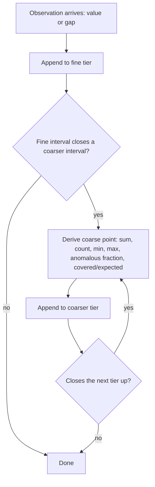

# Observation Retention

**Version:** 1.0.0
**Status:** Stable
**Layer:** concept

## Overview

The retention contract for the operational record: how a continuously-growing stream of observations (health signals, per-step measurements, cost and token counts, resource samples) stays answerable at **every** horizon — the last minute and the last year — while consuming a **bounded, declared** amount of local storage.

The answer is neither "keep everything" (unbounded) nor "delete old data" (the long horizon disappears exactly when a trend question needs it). It is **multi-resolution retention**: the same logical series is retained simultaneously at a full-resolution recent tier and at progressively coarser derived tiers, where a coarse point carries *enough* structure (sum, count, minimum, maximum, anomalous fraction) that averages, extremes, and anomaly rates over long ranges remain **exact**, and only intra-interval shape is lost.

This spec owns the *shape and honesty* of the retained record. What is measured is owned by the health layer, what a verdict means by the anomaly layer, and where bytes physically live by the storage model.

## Related Specifications

- [l1-operational-health.md](l1-operational-health.md) - The producer and primary consumer of the retained record; its trend windows (OH-4) and cost accounting (OH-6) are answered from these tiers.
- [l1-anomaly-consensus.md](l1-anomaly-consensus.md) - Supplies the per-sample anomalous flag whose fraction a coarse point must preserve (OR-2/AC-3).
- [l1-change-attribution.md](l1-change-attribution.md) - Ranks change over a window; depends on OR-7 resolution honesty to refuse a question the retained resolution cannot answer.
- [l1-storage-model.md](l1-storage-model.md) - Where the record physically lives, its durability tier, and its encryption posture.
- [l1-operational-ledger.md](l1-operational-ledger.md) - The accounting record whose long-horizon totals must survive rotation of the fine tier.
- [l1-diagnostic-log.md](l1-diagnostic-log.md) - The forensic plane with its own lifecycle; it is not tiered and is not governed here.
- [../../nodus/specifications/l1-nodus-observability.md](../../nodus/specifications/l1-nodus-observability.md) - Source-side event contract: append-only immutability (HO-3), cost classes (HO-8), completeness honesty (HO-10), and the aggregation-safe measurement guarantee (HO-14) this layer rolls up.

## 1. Motivation

A long-running local system produces observations forever. Three naive policies each fail in a specific way:

- **Keep everything at full resolution.** Storage grows without bound; the machine that hosts the user's work eventually loses to the machine's own bookkeeping.
- **Delete beyond a fixed horizon.** The questions that most need history — "is spend drifting?", "was this office always this slow?", "what did last quarter look like?" — become unanswerable precisely because they are long-horizon questions.
- **Downsample to averages.** Cheap and popular, and it destroys the two facts that matter most in an operational record: the *extremes* (a mean of 40% hides a 100% spike) and the *rate of unusual behaviour*. A record that cannot show a spike cannot explain an incident.

There is a fourth policy that fails all three ways at once and is the most common defect: **treating a missing measurement as zero**. A collection that did not happen, averaged with real values, silently drags every aggregate toward zero and makes an outage look like calm. Absence must be recorded as absence.

Multi-resolution retention resolves all four. Coarse points are derived (never separately collected), retain enough to answer exactly the questions that matter at range, mark gaps explicitly, and are bounded by a storage budget the operator declares rather than by a horizon the system promises and cannot keep.

## 2. Constraints & Assumptions

- The record is local and on-device by default; no tier egresses (consistent with the local-first, no-exfiltration posture).
- Observations arrive as an append-only stream from the runtime; this layer stores and serves them, it never produces them and never re-collects.
- Tier count, per-tier coarsening factor, and per-tier storage budget are configurable; the values named in this spec are shape, not contract.
- The record is not a general-purpose database: it answers range queries over named series and nothing else. Point deletion, mid-history edits, and back-dated inserts are out of scope by design (OR-5).
- A "series" is a named, uniformly-sampled numeric quantity attributed to a monitored unit. Non-numeric observations (events, log lines, traces) have their own lifecycle and are not tiered here.

## 3. Core Invariants

Rules every Layer 2 implementation MUST NOT violate:

- **OR-1 (One logical series, several resolutions):** every retained series exists simultaneously at a full-resolution tier and at one or more progressively coarser derived tiers. All tiers describe the *same* series. A consumer asks for a time range and the resolution it needs; the layer selects the coarsest tier that satisfies the request. A consumer MUST NOT address a tier by name, and MUST NOT be required to know how many tiers exist.
- **OR-2 (Aggregate sufficiency — a coarse point is not a mean):** a coarse-tier point retains, for the interval it covers: the **sum** and **count** of the finer points aggregated, their **minimum**, their **maximum**, their **anomalous fraction**, and the interval's start and end. Consequence: average, minimum, maximum, and anomaly rate over any range are computed **exactly** from a coarse tier; only intra-interval shape is lost. A tier that stores only a mean (or only a mean and a count) is forbidden — it makes extremes unrecoverable and systematically understates spikes.
- **OR-3 (A gap is a value, not an absence):** an interval in which a measurement could not be taken records an explicit **gap marker**, distinguishable from every real value and in particular from zero. Coarse points carry both the expected and the actually-covered sample counts, so a consumer can distinguish "quiet" from "not observed". Substituting zero, carrying the previous value forward, and silently omitting the interval are each forbidden — all three convert unavailability into a false statement.
- **OR-4 (Budget-bounded, not horizon-promised):** retention is derived from a declared **storage budget** per tier, not from a fixed time horizon. The layer continuously reports the *actual* retained horizon per tier as an observable fact, and never advertises a horizon it cannot hold. Reclamation happens by rotating out the **oldest whole segment**, never by thinning or rewriting the interior.
- **OR-5 (Append-only, immutable history):** the record is append-only. A point already written is never mutated, back-dated, or deleted in place; a corrected observation is a *new* observation, never an edit of an old one. The only erasure is whole-oldest-segment rotation (OR-4). (Composes the append-only trace contract, HO-3.)
- **OR-6 (Coarse tiers are derived and backfilled, never independently collected):** a coarse point is derived from the finer points it covers, updated as those points are recorded. When a coarse tier is introduced, widened, or found short, it is **backfilled** from the finest tier that still holds the interval, so a newly-available tier is accurate rather than partially empty. Collecting the same quantity twice at two rates is forbidden — two independent collections can disagree, and then neither can be trusted.
- **OR-7 (Every answer states its own resolution and coverage):** a query result declares the resolution actually used and the interval actually covered. A request whose range exceeds the retained horizon returns what exists plus an explicit **truncation marker**. Silently returning a shorter range, and upsampling a coarse tier so it *looks* fine-grained, are both forbidden: an answer must never appear more precise or more complete than it is.
- **OR-8 (Bounded working set):** the memory required to serve the record is a function of the number of **actively-recorded** series and the tier count — not of the retained horizon and not of a query's range. A long-range query streams; it MUST NOT require its range to be resident, and a single query MUST NOT be able to exhaust the host's memory.
- **OR-9 (Retention is local and inspectable):** all tiers stay on-device; the retained horizon, per-tier budget, current utilisation, and rotation events are inspectable by the operator and exportable as part of a health snapshot (composing OH-8). Retention policy is never silent.

> L2 specs cannot reach RFC status until all invariants here are addressed in their "Invariant Compliance" section.

## 4. Detailed Design

### 4.1 The tier ladder

| Tier | Resolution | Point contents | Answers |
| --- | --- | --- | --- |
| Fine | The collection interval itself | One value (or a gap marker) + one anomalous flag | "What exactly happened in the last hours?" — incident forensics, live charts |
| Mid | A fixed multiple of fine | sum, count, min, max, anomalous fraction, covered interval | "What did this week look like?" — trends, weekly comparisons |
| Coarse | A fixed multiple of mid | Same structure as mid | "Is spend drifting over months?" — long-horizon baselines, capacity |

The multiple between adjacent tiers is a configuration value, not a contract. What *is* contract is that every non-fine point carries the OR-2 structure, so the ladder is lossy only in intra-interval shape.

### 4.2 Write path



Derivation is incremental and happens as observations arrive (OR-6); there is no separate compaction job whose failure would leave the coarse tiers stale.

### 4.3 Query planning

```text
[REFERENCE]
plan(series, from, to, required_points):
    needed_resolution := (to − from) / required_points
    tier := coarsest tier whose resolution ≤ needed_resolution
            and whose retained horizon covers `from`
    if no such tier:
        tier := finest tier whose horizon covers any part of [from, to]
        mark result TRUNCATED with the interval actually covered   // OR-7
    result := stream points of `tier` over [from, to]              // OR-8
    result.resolution_used := tier.resolution                      // OR-7
    return result
```

Two properties follow. A range query never over-reads: asking for a year does not touch the fine tier. And a query never lies about precision: the resolution used travels with the answer.

### 4.4 Aggregating across tiers

Because a coarse point carries sum and count rather than a mean, aggregation composes without error accumulation:

```text
[REFERENCE]
average(points) := Σ point.sum / Σ point.count          // exact
minimum(points) := min over point.min                    // exact
maximum(points) := max over point.max                    // exact
anomaly_rate(points) := Σ (point.anomalous_fraction × point.count) / Σ point.count   // exact
coverage(points) := Σ point.covered / Σ point.expected   // OR-3: how much was actually observed
```

`coverage` is what makes OR-3 operational: a consumer that sees `average = 0` also sees whether `coverage = 1` (genuinely idle) or `coverage = 0` (nothing was observed). The two are never conflated.

### 4.5 Rotation and the reported horizon

Each tier owns a storage budget. When a tier reaches its budget, the **oldest whole segment** is dropped and a new one is opened (OR-4/OR-5); nothing in the interior is thinned or rewritten. The retained horizon is therefore an *emergent, measured* property — it moves with data density — and is reported as such. A tier holding sparse series retains longer than one holding dense series, and the layer states which it is rather than promising a nominal number.

### 4.6 Boundary with neighbouring layers

| Concern | Owner |
| --- | --- |
| Which quantities are worth recording, thresholds, scores | Operational health |
| Whether a sample is anomalous | Anomaly consensus (this layer only *stores* the flag and preserves its fraction) |
| Which series changed during a window | Change attribution (a *reader* of these tiers) |
| Where bytes live, durability, encryption | Storage model |
| Post-fault forensic survival | Diagnostic log — a separate, untiered plane |

## 5. Drawbacks & Alternatives

- **Intra-interval shape is genuinely lost at range.** Accepted, and named: OR-7 forces every answer to state its resolution, so a consumer knows when it is looking at a summary. When shape matters, the query must fall within the fine tier's horizon — which is exactly the incident-forensics case the fine tier is sized for.
- **Several tiers mean several writes per observation.** Accepted: derivation is incremental and bounded (OR-6), and the write amplification is small relative to what a second full-resolution copy would cost.
- **Alternative — a single tier with a long horizon.** Rejected: storage grows with the horizon, and the long-horizon question is the one that gets cut first when the budget binds.
- **Alternative — downsample to a mean.** Rejected by OR-2: it destroys extremes and anomaly rates, which are the two things an operational record exists to preserve.
- **Alternative — recompute coarse views on demand from the fine tier.** Rejected: it requires keeping the fine tier for the whole horizon, which is the unbounded policy under a different name.
- **Alternative — treat gaps as zero for simplicity.** Rejected by OR-3: it makes an outage indistinguishable from calm, which is the single most damaging error an operational record can make.

## Canonical References

| Alias | Path | Purpose |
| --- | --- | --- |
| `[HEALTH]` | `.design/main/specifications/l1-operational-health.md` | Producer/consumer of the retained record; defines the signals being retained. |
| `[ANOMALY]` | `.design/main/specifications/l1-anomaly-consensus.md` | Defines the per-sample flag whose fraction OR-2 must preserve. |
| `[STORAGE]` | `.design/main/specifications/l1-storage-model.md` | Physical placement, durability tier, encryption posture of the record. |
| `[OBSERVABILITY]` | `.design/nodus/specifications/l1-nodus-observability.md` | Source-side guarantees the tiers depend on: append-only (HO-3), cost classes (HO-8), aggregation-safe measurements (HO-14). |

## Document History

| Version | Date | Author | Notes |
| --- | --- | --- | --- |
| 1.0.0 | 2026-07-23 | Core Team | Initial spec — multi-resolution retention of the operational record: one logical series at several resolutions with automatic tier selection (OR-1), aggregate sufficiency so coarse tiers answer avg/min/max/anomaly-rate exactly rather than storing a mean (OR-2), gaps recorded as distinguishable values with covered-vs-expected counts so absence is never read as zero (OR-3), budget-bounded retention with a measured-and-reported horizon (OR-4), append-only immutable history with whole-segment rotation (OR-5), derived-and-backfilled coarse tiers never independently collected (OR-6), resolution + truncation honesty on every answer (OR-7), working set bounded by active series not by horizon or query range (OR-8), local and inspectable retention policy (OR-9). Concept-only. |
