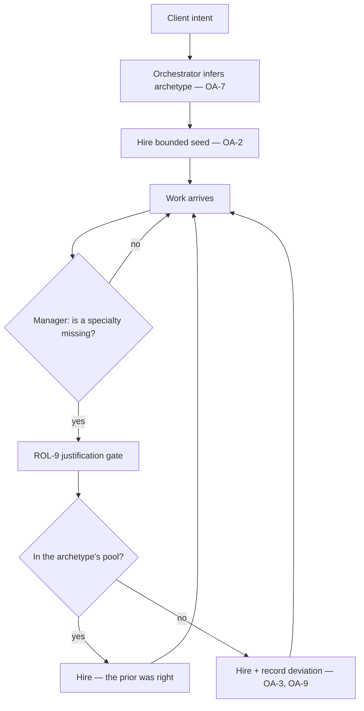

# Office Archetype

**Version:** 1.0.0
**Status:** Stable
**Layer:** concept

## Overview

An **office archetype** is a named, domain-scoped starting point for an office: software engineering, an advertising agency, a finance department. It carries the knowledge a competent operator would bring on day one — which specialties this kind of work draws on, how such an office is shaped when it grows, the vocabulary and quality bar of the trade, and the handful of people you would actually seat before the first conversation.

The word to hold onto is **starting point**. An archetype is a *prior on hiring*, never a hired roster. It narrows and informs the manager's search space; it does not populate an org chart. This distinction is not a nicety — `l1-office-model.md` OFF-4 makes adaptive staffing an invariant and its §5 explicitly rejects the fixed up-front org chart. An archetype that seated a full staff at office creation would be that rejected design under a new name. An archetype that supplies priors, a bounded seed, and a shape-if-grown is the same adaptive mechanism, better informed.

## Related Specifications

- [l1-office-model.md](l1-office-model.md) - OFF-4 adaptive staffing, which OA-1 refines rather than replaces; OFF-5/OFF-6 govern how an archetype is selected without interrogating the client.
- [l1-roles.md](l1-roles.md) - The specialties an archetype references (ROL-1), preset/custom duality (ROL-2), catalog integrity (ROL-7), and the ROL-9 anti-sprawl gate every hire still clears.
- [l1-workspace-lifecycle.md](l1-workspace-lifecycle.md) - WSL-4 blueprint instantiation (a directory skeleton, distinct from an archetype) and WSL-5 manager bootstrap, the existing precedent for hiring before work exists.
- [l1-orchestration.md](l1-orchestration.md) - The hierarchy an archetype's shape describes; the manager that consumes the prior.
- [l1-security.md](l1-security.md) - SEC-10 authority self-containment: OA-4's rule that an archetype carries no authority.
- [l1-component-scanning.md](l1-component-scanning.md) - Admission vetting of an archetype's natural-language content (OA-5).
- [l1-extensions.md](l1-extensions.md) - The default-deny governance a distributed archetype rides.
- [l1-extension-marketplace.md](l1-extension-marketplace.md) - XM-7 bundle-or-curate: the distribution shape a third-party archetype takes.
- [l1-specialty-exemplars.md](l1-specialty-exemplars.md) - Per-specialty competency, which staffing consults when seating a model in a role an archetype names.
- [l1-pattern-codification.md](l1-pattern-codification.md) - A repeatedly-deviating archetype is a codification signal (OA-9).
- [l1-storage-model.md](l1-storage-model.md) - STO-3 catalog-vs-instance, which OA-6 mirrors.
- [l1-dev-office.md](l1-dev-office.md) - A specially-gated office, not an archetype instance; §4.7 draws the line.
- [l2-archetype-catalog.md](l2-archetype-catalog.md) - The Layer 2 realization: shipped archetypes, their role requirements, and the coverage gap.

## 1. Motivation

An office opens empty. Its manager knows nothing about the trade it is about to practise, so it learns the shape of the work by doing the work — which is correct, adaptive, and slow. The first hour of an advertising office is spent discovering that advertising has copywriters, and the first hour of a finance office discovering that finance has a controller. That knowledge is not project-specific. It is knowledge about a *kind of work*, stable across every office that does it, and there is no reason each office should rediscover it.

The naive fix is to ship a staffed office per domain: open the advertising office and find four people already at their desks. It is the obvious design and it is wrong, for reasons the project has already committed to.

**It contradicts a Stable invariant.** OFF-4 requires the roster to be adaptive and never complete up front; §5 of the same spec records that the fixed org chart was considered and rejected on evidence. A prepopulated staff is exactly that org chart.

**It pays for people who never work.** Every seated role costs context, memory, and — once a model is bound to its seat — budget. An office that hires a media planner because its archetype said so, for a client who wanted a single billboard, has spent real resources on an org chart's aesthetics. ROL-9 already refuses this at the level of one role; an archetype should not be a loophole that admits five at once.

**It converts a helpful default into a cage.** If the archetype names the staff, the natural next step is for the archetype to *bound* the staff, and an office that cannot hire outside its domain's expectations is worse than one that started empty. Real work crosses domains: an advertising office needs someone who can read a contract, and a finance office eventually needs a data pipeline.

What is genuinely valuable about a domain, then, is not its roster but everything around it: which specialties are *plausible*, what the org looks like *if* the work grows, what the trade's standards are, and the two or three people you actually need before the first sentence is spoken. That is what an archetype carries.

## 2. Constraints & Assumptions

- The client may be non-technical (OFF-5) and does not manage staffing. Selecting an archetype must therefore not read as a staffing decision, and must not require the client to know what a role is.
- An archetype is content, not code and not authority. It cannot execute, and it cannot grant.
- Archetypes may be authored by third parties. Their text becomes agent instruction, so it is untrusted until vetted.
- The concept names no file format, manifest schema, directory, or command. Those are Layer 2.
- An office with no archetype is the ordinary case and must remain fully functional; the archetype is an optimization of the first hour, not a prerequisite for the product.

## 3. Core Invariants (Layer 1 only)

Rules every Layer 2 implementation MUST NOT violate.

- **OA-1 (An archetype is a prior, not a roster):** an archetype declares a **candidate pool** (specialties this domain plausibly draws on), an **org shape** (the department and sub-manager structure the office adopts *if and when* the work grows into it), a **seed** (OA-2), and **domain norms** (vocabulary, quality bar, conventions, default skills). It MUST NOT pre-populate a complete org chart. Every hire beyond the seed remains adaptive, manager-driven, and justified exactly as it is without an archetype (OFF-4, WSL-6, ROL-5, ROL-9). An archetype changes what the manager *expects*, never how it *decides*.

- **OA-2 (Bounded, justified seed):** an archetype MAY name a small **seed** of roles hired at office instantiation, beyond the manager WSL-5 already bootstraps. Every seeded role MUST be justified by work the office performs before it can learn anything about the project — not by the shape of a typical org. The seed is bounded, and the bound is small enough that a wrong archetype is cheap. The seed is a **floor, never a ceiling**: it is where the office starts, not what it is allowed to become.

- **OA-3 (The pool is a prior, not a cage):** the manager MAY hire a role outside the archetype's candidate pool. Such a hire clears the same justification gate as any other (ROL-9) and is recorded as a **deviation** (OA-9) — it is never refused on the grounds that the archetype did not anticipate it. An archetype has no power to forbid a hire, and an implementation that lets it acquire one has rebuilt the fixed org chart.

- **OA-4 (An archetype carries no authority):** an archetype declares specialties, structure, and norms. It MUST NOT declare, widen, or imply **permissions, autonomy level, budget, trust, egress, or reachability**. Those descend only from the human principal through the authority plane (SEC-10). Installing an archetype gives an office a better guess about who it needs; it gives the agent nothing it may newly *do*. A downloaded archetype that appeared to raise an autonomy level would be an agent authoring its own authority by proxy, and the seam must make that unrepresentable rather than merely discouraged.

- **OA-5 (Archetype content is untrusted until vetted):** an archetype's personas, briefs, and norms are natural language that becomes agent instruction. Content from any source other than the first-party program tier MUST pass admission vetting before any of its text can reach an agent's context (composing `l1-component-scanning`), and it carries untrusted provenance thereafter. A persona is a prompt; a shipped persona from an unknown author is an injection surface with a friendly name.

- **OA-6 (Preset + custom, with catalog integrity):** first-party archetypes are read-only blueprints in the immutable program tier. Adapting one produces a **custom copy**; the original is never edited in place (mirroring ROL-7 / STO-3). Custom archetypes live in mutable state and use the same contract as presets, so the office treats them uniformly.

- **OA-7 (Selection is inferred; the client is asked only on genuine ambiguity):** the orchestrator infers the archetype from the client's stated intent. It MAY ask the client to choose **only** when intent is genuinely ambiguous between archetypes and the choice would materially change the work (OFF-6). The question, when asked, is about the *kind of work* — never about roles, staffing, or structure, which OFF-5 places outside the client's concern.

- **OA-8 (One active archetype, revisable, non-destructively):** an office has **at most one** active archetype at a time, and it MAY be changed as understanding of the work matures. Changing it re-scopes the pool, shape, and norms for **future** decisions. It MUST NOT retroactively release staff, discard memory, or invalidate work already done — a re-scope is a change of expectation, not a reorganization (consistent with ROL-4's non-destructive release).

- **OA-9 (Archetypes are falsifiable and observable):** the office records where reality departed from the prior — roles hired outside the pool, seeded roles that never received work, a shape that never grew. Deviations are attributable and inspectable. A consistently mis-predicting archetype is a **signal to codify** (`l1-pattern-codification`), never a silent tax on every office that adopts it. An archetype whose predictions are never checked is a guess wearing the authority of a default.

- **OA-10 (An archetype composes the role catalog; it never forks it):** an archetype references roles by their catalog identity. It MUST NOT embed a divergent copy of a preset role, nor define a specialty inline. A domain specialty the catalog lacks is first added as a role — clearing ROL-9 on its own merits — and then referenced. This keeps one definition per specialty, so a role improved in the catalog improves in every archetype that names it.

- **OA-11 (The archetype-free office is complete):** an office with no archetype is the default and is fully functional. It staffs adaptively from the whole catalog, exactly as it does today. No capability, invariant, or lifecycle stage may be reachable only through an archetype.

> L2 specs cannot reach RFC status until all invariants here are addressed in their "Invariant Compliance" section.

## 4. Detailed Design

### 4.1 What an archetype contains

| Part | What it supplies | What it must not do |
| --- | --- | --- |
| Candidate pool | the specialties this domain plausibly draws on, by catalog identity | forbid a hire outside it (OA-3) |
| Org shape | the departments and sub-manager layers adopted *if* the work grows into them | instantiate them up front (OA-1) |
| Seed | the small set hired at instantiation, each justified by first-contact work | stand in for a full roster (OA-2) |
| Domain norms | vocabulary, conventions, quality bar, default skills, applicable exemplar suites | encode permissions, budget, or autonomy (OA-4) |

The four parts differ in *when* they take effect. The seed acts at instantiation. The pool and norms act continuously, as priors on every subsequent decision. The shape acts only on growth — it is a plan for a building the office may never need to construct.

### 4.2 An archetype is a prior on a decision the manager still makes



The gate sits **before** the pool check, not after it, and this ordering is the whole design. A role must earn its existence on the merits (ROL-9) whether or not the archetype expected it. The pool never authorizes a hire that the gate would refuse, and never refuses one the gate would allow — it only records which side of the prediction the hire fell on.

Read the diagram for what is absent: there is no edge from the archetype to a hire. The archetype informs; the manager decides.

### 4.3 The seed, and why it is small

WSL-5 already establishes that hiring before work exists is legitimate — every office bootstraps its manager. OA-2 extends that precedent by exactly as much as first-contact work requires, and no further.

A seeded role must answer: *what does this office do before it knows anything about the project?* It intakes intent, it plans, it asks the rare clarifying question. In most domains that is the manager alone, and the correct seed is empty. In a domain whose very first act is specialized — a trade where intake is itself expert work — the seed holds the one or two roles that act before understanding exists.

The bound is what makes a wrong archetype cheap. If a mis-inferred archetype seats five people, the cost of OA-7 guessing wrong is five idle specialists, their contexts, and their budgets. If it seats zero or one, the cost of guessing wrong is a prior that gets corrected on the first real hire. This is the same reasoning ROL-9 applies to one role, applied to the moment when nobody is present to justify anything.

### 4.4 The archetype is not the authority plane

OA-4 is the invariant most likely to be eroded, because the erosion looks helpful. An advertising archetype "obviously" wants network egress for media research; a finance archetype "obviously" wants a higher budget for long analyses. Both would be an archetype — potentially a third-party one — writing into the plane that governs what the agent may do.

`l1-security` SEC-10 places that plane beyond the agent's reach entirely: *a model-produced action can never elevate its own autonomy, grant itself a credential, relax a trust rule, or open a new ingress path.* An archetype is content the agent consumes. If installing content could widen authority, the agent's route to more authority becomes "arrange for the right content to be installed" — and content is precisely what an agent can be steered to fetch by untrusted input.

So the archetype **describes and requests, never grants**. It may declare that this domain's work typically needs a capability; that declaration is data the human resolves through the ordinary approval path, identical in kind to an agent asking for a permission. The archetype states a need. The human grants it. Nothing about the archetype's origin, popularity, or first-party status changes that ordering.

### 4.5 Third-party archetypes are prompts

An archetype's substance is prose: a persona telling an agent who it is, a brief telling it what good work looks like, a norm telling it which conventions bind. When that prose is authored elsewhere and installed here, it enters agent context as instruction.

OA-5 therefore treats a non-first-party archetype the way the system treats any imported artifact whose content will be read by a model: it is vetted for content safety before it can be admitted, and it carries untrusted provenance afterward. The distribution machinery — addressable identity, pinned versions, trust tiers, the publishing gate — already exists for extensions and bundles; an archetype is a bundle of content and rides it rather than inventing a parallel channel.

The distinction OA-4 and OA-5 draw together is worth stating plainly: **an archetype can lie about a trade, but it cannot lie its way into a permission.** Vetting addresses the first. The authority plane addresses the second. Neither substitutes for the other.

### 4.6 Falsifiability

An archetype is a claim about a kind of work, and OA-9 requires the office to notice when the claim is wrong.

```text
[REFERENCE] Deviation signals, recorded per office
  hired_outside_pool  : the trade needed a specialty the archetype did not anticipate
  seeded_never_worked : the archetype seated someone the first-contact work did not need
  shape_never_grown   : the department structure was planned and never populated
```

Each signal is attributable to the archetype, not to the office that adopted it. Aggregated across offices, a persistent signal is exactly the input `l1-pattern-codification` consumes: a specialty repeatedly hired outside the pool belongs in the pool; a role repeatedly seeded and idle belongs out of the seed.

The alternative — an archetype whose predictions are never compared against outcomes — is worse than no archetype, because it carries the authority of a shipped default while being unfalsifiable. Every office pays its cost and no office corrects it.

### 4.7 What an archetype is not

| | Archetype | The thing it is confused with |
| --- | --- | --- |
| Workspace blueprint (WSL-4) | a staffing prior | a directory skeleton materialized into state; one blueprint serves every archetype |
| Role preset (ROL-2) | a set of references to specialties | the definition of one specialty; an archetype composes them (OA-10) |
| The developer office (`l1-dev-office`) | domain knowledge, no authority | a specially-gated office whose elevated capability rests on identity admission, not on its domain |
| Competency profile (`l1-specialty-exemplars`) | which specialties this *work* needs | which models are competent in a *specialty*; consulted when seating a model in a role the archetype named |

The developer office row is the sharpest. It is tempting to model it as "the archetype for maintaining this product", and the model fails on OA-4: the dev office's defining property is elevated capability over the product's own source, gated by an admitted human identity. An archetype can never confer that, because an archetype confers no authority at all. The dev office is a special office that happens to have a domain; it is not a domain that happens to be special.

## 5. Drawbacks & Alternatives

**Drawback — an archetype is a guess, and a shipped guess carries undue weight.** A default nudges harder than an equally-good suggestion offered by a peer. Mitigated by OA-3 (the pool cannot refuse a hire), OA-2 (a wrong guess costs little because the seed is small), and OA-9 (the guess is checked against outcomes rather than trusted indefinitely).

**Drawback — curation cost.** `l1-roles` §5 already names this for the role catalog, and archetypes multiply it: each is a claim about a trade that someone must author and maintain. Offset by the fact that an archetype is thin — it references roles rather than defining them (OA-10) — so most of the maintenance burden stays in the catalog where it was already paid.

**Alternative — ship offices with their staff already hired.** This is the request in its most direct form, and it is rejected by OA-1 and, upstream, by OFF-4 and `l1-office-model` §5, which recorded the fixed org chart as considered and rejected on evidence. The practical objection is independent of the invariant: a prepopulated office spends context, memory, and budget on specialists the project has not asked for, and converts a helpful prior into a boundary the manager cannot cross. What the request actually wants — an office that feels like it already understands the trade — is delivered by the pool, the norms, and the shape, none of which requires hiring anyone.

**Alternative — let the archetype bound the pool (hires outside it are refused).** Rejected by OA-3. A domain boundary is a prediction, and real work crosses domains: an advertising office needs to read a contract; a finance office needs a data pipeline. An archetype that could refuse would fail exactly on the projects most worth doing.

**Alternative — let archetypes carry capability grants, so a domain "just works" out of the box.** Rejected by OA-4/SEC-10. It would make installing content a path to widening authority, which is the attack the authority plane exists to close. The archetype may declare a need; the human grants it.

**Alternative — one archetype per office, fixed at creation, never changed.** Rejected by OA-8. Understanding of the work matures, and an office that discovers at week three that it is really doing content production rather than advertising should be able to re-scope its priors without firing anyone or losing memory.

**Risk — archetypes become a marketing surface rather than an engineering one.** A catalog of impressive-sounding domains, each thinly researched, would degrade the manager's priors while appearing to enrich them. Mitigation: OA-9 makes each archetype's predictive quality measurable, and OA-10 forces every specialty it names through the role catalog's own quality gate.

## Canonical References

| Alias | Path | Purpose |
| --- | --- | --- |
| `[OFFICE]` | `.design/main/specifications/l1-office-model.md` | OFF-4 adaptive staffing and the §5 rejection of the fixed org chart, which OA-1 honors |
| `[ROLES]` | `.design/main/specifications/l1-roles.md` | ROL-2/ROL-7 preset integrity and the ROL-9 gate every hire clears |
| `[LIFECYCLE]` | `.design/main/specifications/l1-workspace-lifecycle.md` | WSL-4 blueprint (distinct from an archetype) and WSL-5 manager bootstrap (the seed's precedent) |
| `[SECURITY]` | `.design/main/specifications/l1-security.md` | SEC-10 authority self-containment, the basis of OA-4 |
| `[SCANNING]` | `.design/main/specifications/l1-component-scanning.md` | Admission vetting of imported archetype content (OA-5) |
| `[IMPL]` | `.design/main/specifications/l2-archetype-catalog.md` | Shipped archetypes, their role requirements, and the current coverage gap |

## Document History

| Version | Date | Notes |
| --- | --- | --- |
| 1.0.0 | 2026-07-10 | Initial spec. Reconciles domain-scoped staffing presets with `l1-office-model` OFF-4 and its §5 rejection of the fixed org chart by defining an archetype as a **prior on hiring** — candidate pool, org shape, bounded seed, domain norms — rather than a roster (OA-1/OA-2). Establishes OA-3 (the pool cannot refuse a hire), OA-4 (an archetype carries no authority; SEC-10), OA-5 (third-party archetype text is an injection surface, vetted before admission), OA-9 (archetypes are falsifiable and their deviations recorded), OA-10 (composes the role catalog, never forks it), and OA-11 (the archetype-free office is complete). §4.7 separates the archetype from the workspace blueprint, the role preset, the developer office, and the competency profile. |
