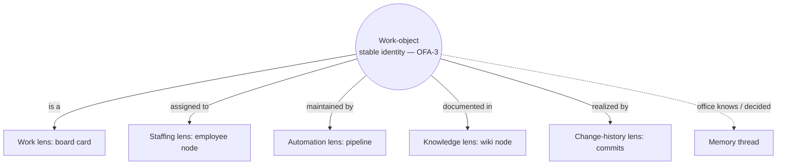

# Office Fabric

**Version:** 1.0.0
**Status:** Stable
**Layer:** concept

## Overview

The technology-agnostic model that binds the office's several representation subsystems into **one coherent whole seen through many coordinated lenses**. An office already exposes a work board, a staffing/interaction graph, an automation canvas, a client-facing knowledge wiki, and a change-history timeline — today each is an isolated subsystem tab with its own projection. The office fabric is the concept that these are not five disconnected views but **coordinated lenses over one office substrate**, tied together by a **stable cross-lens object identity**: the same work-object is the same thing whether it appears as a board card, a node on the staffing graph, an automation output, a documented item in the wiki, or the subject of a commit — and the client can follow it from any lens to the corresponding entities in the others.

The fabric adds *correspondence and navigation between lenses*; it is **not** a new source of truth. Each lens keeps its own authoritative substrate (the board owns work-state, the roster owns staffing, the pipeline engine owns automations, the wiki owns client documentation, the version-control system owns change history). The fabric composes their projections and threads the office's memory through them, so a person perceives one legible, navigable office rather than a pile of unrelated screens. This is the "logical binding *and* the visual representation of the office's work" as a single model.

## Related Specifications

- [l1-office-visualization.md](l1-office-visualization.md) - The staffing/interaction-graph and spatial-floor lens; supplies the projection-not-source (OVZ-1), live (OVZ-2), and two-representations-of-one-state (OVZ-3) pattern the fabric generalizes across all lenses.
- [l1-work-convergence.md](l1-work-convergence.md) - "One legible surface, no shadow work" for *activity* (CONV-1) and aggregate-views-project-from-boards (CONV-8); the fabric extends legibility from the single board to the whole lens set without displacing the board as work-state ground truth.
- [l1-kanban-model.md](l1-kanban-model.md) - The work lens; the card as the unit of work (KAN-5) and one-board-per-office isolation (KAN-6) the fabric assigns cross-lens identity to.
- [l1-automation-canvas.md](l1-automation-canvas.md) - The reactive-wiring lens; a projection of the pipeline engine (AC-1) the fabric coordinates with the other lenses.
- [l1-project-wiki.md](l1-project-wiki.md) - The knowledge lens; office-maintained client-facing documentation (PW-2/PW-3) the fabric makes navigable from the entities each page documents.
- [l1-version-control.md](l1-version-control.md) - The change-history lens; card-aligned commits (VC-3) the fabric links back to the cards and work they realized.
- [l1-memory-model.md](l1-memory-model.md) - The memory store threaded through every lens (OFA-6); the fabric addresses it, it does not copy it (MEM-4 source-of-truth by kind stands).
- [l1-perspective-model.md](l1-perspective-model.md) - The user/agent knowledge model surfaced alongside memory when a lens shows what the office knows or believes about an entity.
- [l1-navigation-model.md](l1-navigation-model.md) - The subsystem/tab topology the lenses are hosted in; the fabric owns cross-lens *object* traversal, not tab switching, and gives the candidate "Graph" subsystem its conceptual backing.
- [l1-global-orchestration.md](l1-global-orchestration.md) - Building-level unified visibility (GO-4) is the cross-office roll-up of these per-office fabrics, read-only and projection-only.
- [l1-directability.md](l1-directability.md) - Steering rides on the fabric: a client steer on any lens lands on the shared substrate and its effect re-projects coherently across every lens (OFA-5).

## 1. Motivation

The product's premise is a corporation the client can *grasp*: a manager, specialists, work moving through a pipeline. But an office's understanding of itself is spread across several representations — what work exists (the board), who does it (the staffing graph), what reactions are wired (the automation canvas), what the project *is* in plain language (the wiki), and how it changed over time (the version history). Presented as five unrelated tabs, these fragment the very legibility they were meant to provide. The client sees a card but cannot get from it to the worker doing it; reads a wiki page but cannot reach the work it documents; watches an automation fire but cannot see which cards it touched.

Two failures follow from the fragmentation:

- **No logical binding.** Each subsystem defines "projection, not source" *for itself*, but nothing states that they are projections of *one office*, or how an entity in one relates to the same entity in another. Without a cross-lens identity, "the office's work" is not a single navigable object — it is five parallel stories the client must reconcile by hand.
- **No unified picture.** The corporation-made-visible promise (OVZ) is delivered one lens at a time. The whole — work + staffing + wiring + knowledge + history + memory as one coherent, navigable office — is exactly what no single spec owns.

The resolving idea is a **fabric**: keep every lens's own authority intact, add a stable identity that spans lenses, maintain the correspondence between entities as a *derived* relation (so it cannot drift from the substrates), and let the client traverse from any entity to its counterparts anywhere. The office becomes one thing seen many ways, not many things the client must stitch together.

## 2. Constraints & Assumptions

- The fabric introduces **no new authoritative data**. Every lens projects a substrate that already exists and remains that substrate's sole owner; the fabric holds only correspondence, which is derived.
- Cross-lens correspondence must be **derivable from the substrates** (assignment records, commit-to-card links, automation-to-card materialization, wiki grounding), never a separate hand-maintained mapping that can silently diverge.
- Lenses must stay **coherent within one event cycle**: a substrate change re-projects everywhere it is visible; no lens shows a settled contradiction of another.
- The model is **per-office**; cross-office aggregation is the building-level read-only roll-up owned by global-orchestration (GO-4) / office-visualization (OVZ-5), not a second fabric.
- The client may be **non-technical** (OFF-5); following a work-object across lenses must never require understanding the subsystem boundaries underneath.
- The fabric is a **representation/coordination** concept. *How the client edits through a lens* is owned by [l1-directability.md](l1-directability.md); this spec owns only that the edit's effect appears coherently across lenses.

## 3. Core Invariants (Layer 1 only)

Rules every Layer 2 implementation MUST NOT violate:

- **OFA-1 (One office, many coordinated lenses):** an office is presented through a coordinated set of lenses — the **work** board, the **staffing** interaction graph, the **automation** canvas, the **knowledge** wiki, and the **change-history** timeline — each a projection of an existing authoritative substrate. The fabric is their coordination layer; it MUST NOT hold state that contradicts any lens's own substrate, and it MUST NOT become a source of truth of its own.

- **OFA-2 (Per-lens source authority — no second source):** each lens has exactly one authoritative substrate (board→work-state, roster→staffing, pipeline engine→automations, wiki→client documentation, version-control→change history). A lens MUST NOT be authoritative for another lens's substrate, and the fabric composes their projections (OVZ-1, PW-3, AC-1, CONV-8) — it never overrides or duplicates them.

- **OFA-3 (Stable cross-lens object identity):** every office entity that can appear in more than one lens carries a single stable identity independent of any lens's rendering. The same task is one identity whether drawn as a board card, a node on the staffing graph, a documented item in the wiki, or the subject of a commit. Identity MUST NOT be lens-local; a lens renders an identity, it does not own or mint a competing one.

- **OFA-4 (Correspondence is derived and traversable):** the fabric maintains explicit correspondence between entities across lenses — assignment (card ↔ employee), realization (card ↔ commits), maintenance (automation ↔ the cards it materializes or drives), documentation (wiki node ↔ the work and decisions it describes), and memory (any entity ↔ what the office knows about it). From any entity in any lens the client can navigate to its corresponding entities in the other lenses. A correspondence MUST be derivable from the substrates (assignment records, VC-3 card-aligned commits, CONV-6 automation materialization, PW-4 wiki grounding); it MUST NOT be an independent mapping that can silently drift from them.

- **OFA-5 (Live coherence across lenses):** all lenses reflect the same underlying state within one event cycle (composing OVZ-2). A change to any substrate re-projects into every lens that shows an affected entity; after the event settles, no lens presents a stale contradiction of another. Lenses may differ in *emphasis and idiom*, never in *the facts they agree on*.

- **OFA-6 (Memory woven through every lens):** the office's memory — facts, skills, decisions, and the perspective/user model — is addressable from any entity in any lens: what the office knows, has learned, or has decided about a card, an employee, an automation, or a wiki topic is reachable in that entity's context. Memory remains its own store under its own ownership (MEM-4, MEM-7); the fabric threads *access* to it and MUST NOT copy memory into a lens as a second, divergent record.

- **OFA-7 (Lens completeness — nothing invisible to all lenses):** every kind of office activity and artifact is representable on at least one lens; nothing the office does is invisible to the entire lens set at once. This extends "no shadow work" (CONV-1) from the single board to the whole fabric: the client can always find *where* an activity or artifact lives. Absence from one lens is normal (a lens shows its own slice); absence from every lens is a violation.

- **OFA-8 (Legible to a non-technical client):** each lens, and every cross-lens navigation between them, is comprehensible to a non-technical client (OFF-5). The fabric MUST NOT require the client to understand the underlying subsystem boundaries to follow a work-object across lenses; the corporation-of-lenses is a mental aid, not a systems diagram the client must decode. Underlying identifiers and substrate mechanics stay beneath the presentation.

> L2 specs cannot reach RFC status until all invariants here are addressed in their "Invariant Compliance" section.

## 4. Detailed Design

### 4.1 The lens set

Each lens is an existing subsystem seen as one facet of a single office. The fabric names them as a set and fixes what each is authoritative for.

| Lens | Renders | Authoritative substrate (owner spec) | Authoritative for |
| --- | --- | --- | --- |
| **Work** | board cards flowing `triage → … → done` | the Kanban board ([l1-kanban-model.md](l1-kanban-model.md)) | work existence and state |
| **Staffing** | employees, reporting, collaboration, assignment; spatial floor | the roster / interaction graph ([l1-office-visualization.md](l1-office-visualization.md)) | who exists and who does what |
| **Automation** | flow-graph of triggers → actions | the pipeline engine ([l1-automation-canvas.md](l1-automation-canvas.md)) | wired reactive behavior |
| **Knowledge** | client-facing pages/graph: overview, areas, decisions, how-to | the project wiki ([l1-project-wiki.md](l1-project-wiki.md)) | plain-language project documentation |
| **Change-history** | branches and commits over time | the version-control system ([l1-version-control.md](l1-version-control.md)) | how the work changed |
| *(cross-cutting)* **Memory thread** | what the office knows/decided about an entity | the memory store ([l1-memory-model.md](l1-memory-model.md)) + perspective model | recall, not a lens of its own |

The Memory thread is deliberately *not* a sixth peer lens: it is addressable *from within* every lens (OFA-6), so a card, a worker, or a wiki topic can surface what the office remembers about it in place.

### 4.2 Cross-lens identity and correspondence

One work-object, seen through the lenses, is one identity (OFA-3) with derived correspondence edges to the entities that realize, staff, automate, document, and remember it (OFA-4).



Every edge is *derived* from a substrate the office already keeps — assignment from the roster, `realized by` from VC-3 card-aligned commits, `maintained by` from CONV-6 automation materialization, `documented in` from PW-4 grounding, `office knows` from memory provenance (MEM-9). Because they are derived, they cannot drift from the substrates the way a hand-kept mapping would (OFA-4).

### 4.3 Navigation between lenses

The client follows a single object across lenses without leaving the mental frame of "one office." A representative traversal:

```text
[REFERENCE]
On a board card (Work lens):
  → "who is doing this?"        → the employee node on the Staffing lens (assignment edge)
  → "what changed for this?"    → the commits on the Change-history lens (realization edge, VC-3)
  → "what keeps this moving?"   → the pipeline on the Automation lens (maintenance edge, CONV-6)
  → "what is this, in plain terms?" → the page on the Knowledge lens (documentation edge, PW-4)
  → "what does the office know about this?" → the Memory thread (OFA-6)
Each hop lands on the *same* identity in the target lens (OFA-3); no hop invents a new object.
```

Navigation is over *objects*, not tabs: switching tabs is the navigation model's concern (NV-6 layer nesting), while following an identity across lenses is the fabric's (OFA-4). The two compose — the fabric decides *which* entity to reveal, the navigation model decides *how the surface hosting it is reached*.

### 4.4 Memory as a cross-cutting thread

Memory is not a place the client visits separately to reconcile against the work; it is reachable in context (OFA-6). Standing on any entity, the office can surface the facts, past decisions, and learned skills bound to it, plus the relevant perspective slice (what the office believes the client knows about it, PM-5). The store stays authoritative and singular (MEM-4/MEM-7); the fabric provides *addressed access*, never a copy that could contradict the store.

### 4.5 Relationship to work-convergence and the building level

Work-convergence guarantees a single legible surface for *activity* — the board, with no shadow work (CONV-1) and aggregate views projecting from it (CONV-8). The fabric does not compete with that: the board remains the work-state ground truth and the Work lens *is* that board. The fabric generalizes the *legibility* principle from "one board for activity" to "one coherent lens set for the whole office," and adds the cross-lens identity CONV never needed (its scope was activity-on-the-board, not object-across-representations).

At the building level, the home floor's cross-office overview (OVZ-5, GO-4) is the read-only roll-up *of* per-office fabrics — it aggregates, it is not a second fabric and holds no authoritative state (consistent with OFA-2).

## 5. Drawbacks & Alternatives

- **Correspondence coherence cost.** Keeping edges derivable and lenses coherent within an event cycle (OFA-4/OFA-5) is real work. Mitigated by deriving every edge from a substrate the office already maintains — no new authoritative data is introduced, so there is nothing extra to keep in sync beyond re-projection.
- **Lens overload.** Five lenses plus a memory thread can overwhelm. Mitigated by OFA-8 (legibility for a non-technical client) and by memory being an in-context thread rather than a sixth peer lens; large graphs still need clustering/zoom. <!-- TBD: clustering/level-of-detail behavior for large per-office fabrics and their cross-lens edges (tracks the OVZ §5 clutter TBD) -->
- **Alternative — leave each subsystem independent.** Rejected: it is the status quo that produces five disconnected tabs and forces the client to reconcile the office's story by hand — the exact fragmentation OFA-3/OFA-4 exist to remove.
- **Alternative — one merged mega-view replacing the lenses.** Rejected: collapsing distinct authorities into a single surface would violate OFA-2 (each substrate is authoritative for its own slice) and lose the idiom each lens is best at (a board for flow, a graph for structure, a timeline for history). Coordinated lenses, not a melted one, is the design.
- **Alternative — a hand-maintained cross-reference index.** Rejected: an independent mapping drifts from the substrates the moment either changes; OFA-4 requires derivation precisely so correspondence cannot lie.

## nodus-relevance mapping

Primarily a main-workspace host concept (UI representation and cross-subsystem coordination). The portable runtime participates only as a substrate feeder.

| Element | nodus seam | Note |
| --- | --- | --- |
| Change-history / work correspondence (OFA-4) | executor audit stream + run/step correlation (HO-7) | Commit- and run-level events the host derives realization edges from; nodus emits them, it does not own the lens. |
| Live coherence (OFA-5) | deterministic step/event emission (NL-6) | Same substrate change yields the same projected event, so lenses agree. |
| Memory thread (OFA-6) | `StorageProvider` reads (LP-15) | The host reads memory through its own plane; nodus supplies no memory of its own. |

## Canonical References

| Alias | Path | Purpose |
| --- | --- | --- |
| `[OVZ]` | `.design/main/specifications/l1-office-visualization.md` | Projection-not-source, live, two-representations pattern the fabric generalizes (OFA-1/2/5) |
| `[WORK-CONV]` | `.design/main/specifications/l1-work-convergence.md` | Single-legible-surface / no-shadow-work the fabric extends to the lens set (OFA-7) |
| `[KANBAN]` | `.design/main/specifications/l1-kanban-model.md` | The work lens and the card identity (OFA-3) |
| `[WIKI]` | `.design/main/specifications/l1-project-wiki.md` | The knowledge lens and grounding for the documentation edge (OFA-4) |
| `[VERSION]` | `.design/main/specifications/l1-version-control.md` | Card-aligned commits for the realization edge (OFA-4, VC-3) |
| `[MEMORY]` | `.design/main/specifications/l1-memory-model.md` | The store threaded through the lenses, kept singular (OFA-6) |
| `[DIRECT]` | `.design/main/specifications/l1-directability.md` | Steering that rides on the fabric and re-projects across lenses |

## Document History

| Version | Date | Author | Notes |
| --- | --- | --- | --- |
| 1.0.0 | 2026-07-24 | Core Team | Initial spec — the office fabric: one office through coordinated lenses (work / staffing / automation / knowledge / change-history) each projecting its own authoritative substrate (OFA-1/OFA-2); stable cross-lens object identity (OFA-3); derived, traversable correspondence between lenses (OFA-4); live coherence within one event cycle (OFA-5); memory woven through every lens as a cross-cutting thread (OFA-6); lens completeness extending no-shadow-work to the whole set (OFA-7); legibility for a non-technical client (OFA-8). Composes office-visualization / work-convergence / kanban / automation-canvas / project-wiki / version-control / memory-model; the representation half of the office-integration pair, with steering owned by l1-directability. Main-only host concept. |
