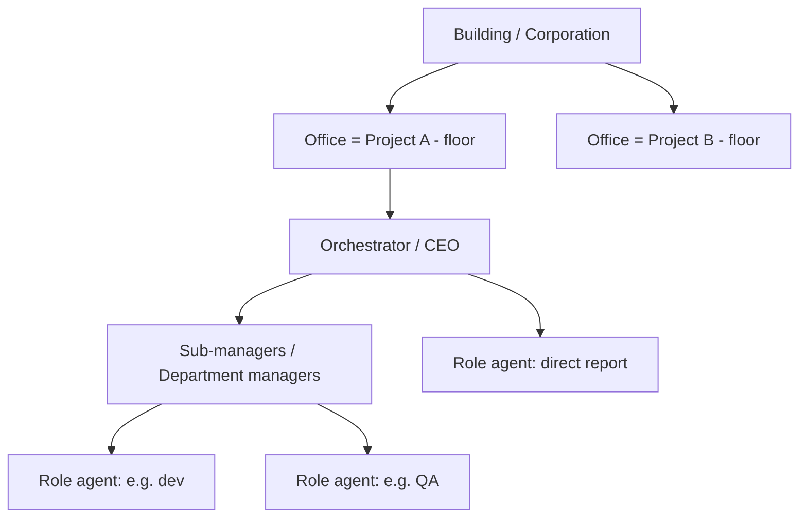
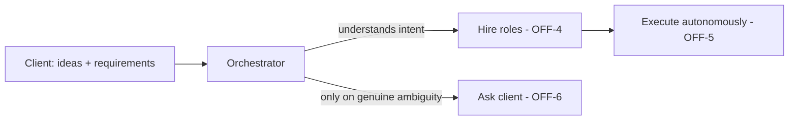

# Agent Office Model

**Version:** 1.0.1
**Status:** Stable
**Layer:** concept

## Overview

The domain concept of Cronus: an AI agent system organized like a real-world **corporation**. The whole installation is a *building/corporation*; each project is an *office* occupying a *floor*. Every office has one top manager (CEO / orchestrator / dispatcher) and subordinate staff (sub-managers, department managers, specialized role agents). The human is a **client** who brings ideas and requirements; the office does all the technical work autonomously, under the hood, and gets more capable the longer it operates.

This specification is technology-agnostic. Its concepts are realized by the core library (orchestration, memory, scheduling) defined in the implementation layer.

## Related Specifications

- [l1-architecture.md](l1-architecture.md) - Layering and hub-and-spoke topology that hosts this office model.
- [l2-core-library.md](l2-core-library.md) - Where the orchestrator, roles, memory, and board are implemented.
- [l1-office-archetype.md](l1-office-archetype.md) - Domain-scoped staffing **priors** (candidate pool, org shape, bounded seed, norms). Refines OFF-4 without weakening it: an archetype informs what the manager expects, never what it hires — the fixed org chart §5 rejects stays rejected.

## 1. Motivation

Most AI tools demand that the user co-drive the work. Cronus inverts this: the client states *what* they want; the office figures out *who* and *how*. Modeling the system as a corporation gives an intuitive mental model (manager delegates to specialists), a natural unit of isolation (one office per project), and a clear automation goal — the client should not have to participate in execution. Autonomy plus persistent learning means the office compounds in value over time rather than starting cold each session.

## 2. Constraints & Assumptions

- The client may be **non-technical**; the system must not depend on the client's technical competence.
- Maximum automation: the office performs work without continuous human involvement.
- One office is scoped to one project; offices coexist in a "building" without cross-contaminating state.
- The office runs on a host the user controls (local machine, remote node, or via ssh tunnel) and operates unattended.
- Staffing (which roles exist) emerges from the work, not from a fixed up-front org chart.

## 3. Core Invariants (Layer 1 only)

Rules every Layer 2 implementation MUST NOT violate:

- **OFF-1 (Office-per-project isolation):** each project is an isolated office (a "floor" in the building). An office MUST NOT read or mutate another office's state implicitly.
- **OFF-2 (Single orchestrator, delegation-only):** each office has exactly one top manager (orchestrator). It coordinates and delegates; it MUST NOT perform specialist work itself.
- **OFF-3 (Role specialization):** work is executed by specialized role agents, each with a defined specialty. The orchestrator MAY introduce intermediate layers (sub-managers / department managers).
- **OFF-4 (Adaptive staffing):** the office instantiates ("hires") the roles a project needs on demand as understanding of the client's intent grows; the roster is adaptive, never required to be complete up front.
- **OFF-5 (Client-as-client / minimal intrusion):** the client supplies ideas and requirements only. The system performs all technical work autonomously and MUST NOT require the client to participate in execution.
- **OFF-6 (Clarify only on genuine ambiguity):** the orchestrator MUST NOT pose unnecessary or technical questions to the client. It MAY ask the client ONLY to resolve a genuine ambiguity, contradiction, or missing requirement that would otherwise block correct work.
- **OFF-7 (Managed work lifecycle):** the orchestrator translates client intent into a managed pipeline — plans, tasks, and a Kanban board (`triage → todo → ready → running → blocked → done → archive`, extensible) — and drives it toward completion.
- **OFF-8 (Autonomous, location-flexible operation):** the office operates autonomously on its host (local, remote, or ssh-tunnelled) without continuous supervision.
- **OFF-9 (Persistent, compounding capability):** the office persists what it learns; its capability MUST be non-decreasing across sessions — it improves over time and MUST NOT reset acquired knowledge on restart.

> L2 specs cannot reach RFC status until all invariants here are addressed in their "Invariant Compliance" section.

## 4. Detailed Design

### 4.1 Organizational topology

The hierarchy is elastic: small projects may be CEO → a few agents; larger projects grow department managers between the CEO and the workers (OFF-3).

### 4.2 Client interaction model

The client "throws in" ideas; the orchestrator forms understanding incrementally and acts. Questions back to the client are the exception (OFF-6), reserved for blocking ambiguity or conflicting desires — never technical detail the client need not know.

### 4.3 Work lifecycle (OFF-7)

1. **Intake** — capture client ideas/requirements as intent.
2. **Staffing** — hire/instantiate competent roles for the project (OFF-4).
3. **Planning** — orchestrator generates plans and decomposes them into tasks.
4. **Board** — tasks flow on a Kanban board: `triage → todo → ready → running → blocked → done → archive` (custom columns allowed).
5. **Execution** — role agents perform tasks; orchestrator monitors and re-delegates.
6. **Synchronization** — office/department briefings keep the work coherent.

### 4.4 Autonomy and learning

- **Where it lives (OFF-8):** the office is a long-running tenant of a host the user controls; it keeps working between user visits.
- **What it remembers (OFF-9):** decisions, outcomes, and acquired skills persist; the office reuses them, so capability compounds. Memory and learning are durable across restarts.

### 4.5 Role taxonomy (illustrative)

Specialties an office may staff (not exhaustive; staffing is adaptive per OFF-4): finance, hr, marketing, support, and project-specific specialties (e.g. game-dev). Roles are domain concepts here; their concrete prompts/skills live in the implementation layer.

## 5. Drawbacks & Alternatives

- **Over-delegation overhead:** a strict delegation-only orchestrator (OFF-2) can add coordination cost on trivial tasks; mitigated by letting the orchestrator staff a minimal roster (OFF-4) rather than a full org for small work.
- **Risk of acting on misread intent (OFF-5 vs OFF-6 tension):** acting autonomously while rarely asking risks building the wrong thing; mitigated by the OFF-6 escape hatch for genuine ambiguity and by synchronization briefings (§4.3).
- **Alternative — fixed org chart:** assigning all roles up front was rejected; research indicates adaptive, on-demand staffing outperforms rigid hierarchies. <!-- TBD: define the orchestration scheme — single top manager vs. top manager + department sub-managers — as the default for v0.1.0 -->

## Canonical References

| Alias | Path | Purpose |
| --- | --- | --- |
| `[ARCH]` | `.design/main/specifications/l1-architecture.md` | Architecture that hosts this office model |
| `[CORE]` | `.design/main/specifications/l2-core-library.md` | Implementation of orchestrator, roles, memory, board |
| `[ARCHETYPE]` | `.design/main/specifications/l1-office-archetype.md` | Domain staffing priors that refine OFF-4 |

## Document History

| Version | Date | Notes |
| --- | --- | --- |
| 1.0.1 | 2026-07-10 | Cross-reference only: linked `l1-office-archetype.md`, which supplies domain-scoped staffing priors while preserving OFF-4 and the §5 rejection of the fixed org chart. No invariant or design change. History table added with this entry. |
| 1.0.0 | 2026-06-24 | Initial stable spec — OFF-1…OFF-9: office-per-project isolation, single delegating orchestrator, role specialization, adaptive staffing, client-as-client, managed work lifecycle, autonomous operation, compounding capability. |
