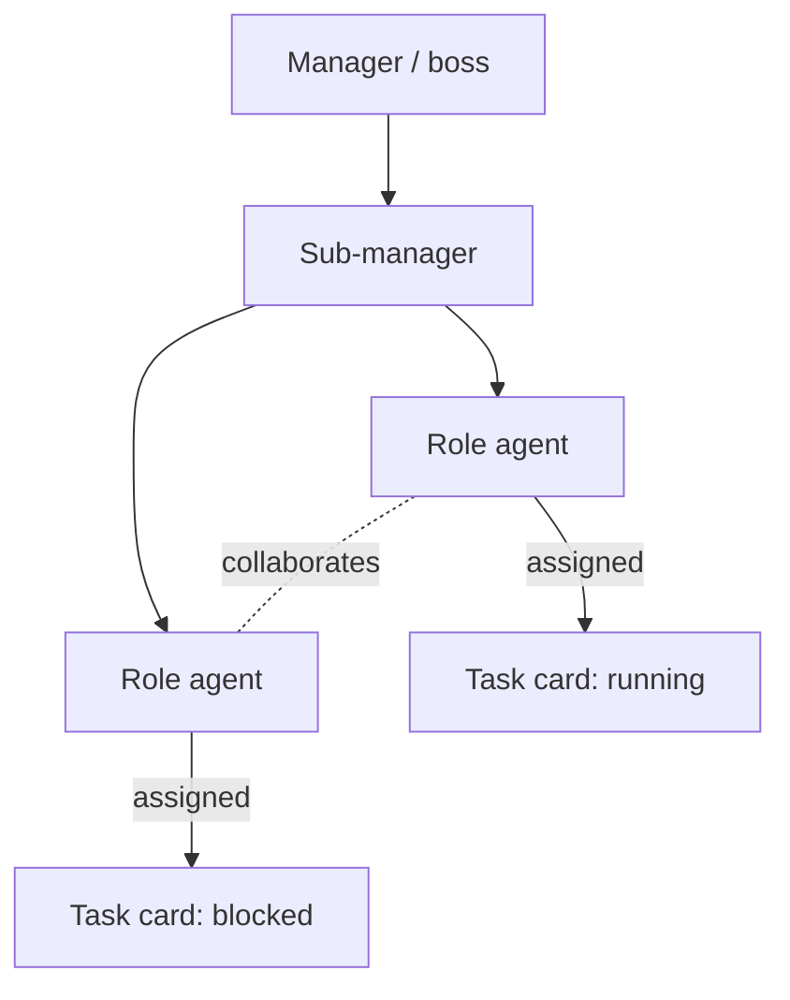
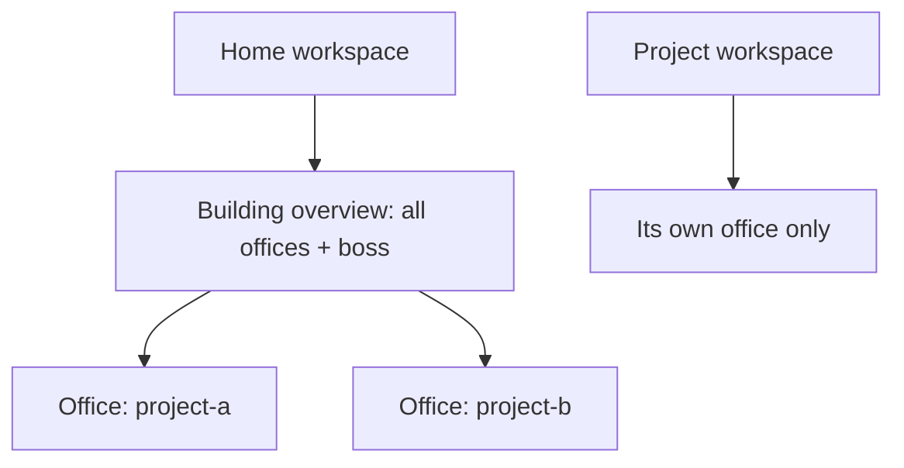

# Office Visualization

**Version:** 1.0.0
**Status:** Stable
**Layer:** concept

## Overview

The technology-agnostic model of the office as a live picture: a representation of agents, their relationships, and their interaction with tasks. The office is renderable two complementary ways — an **interaction graph** (agents and tasks as nodes; reporting, collaboration, and assignment as edges) and a **spatial floor** (rooms and seats with employees placed). Both render the same underlying state. Each workspace shows its own office; the home workspace additionally shows a building-level overview of all offices.

## Related Specifications

- [l1-office-model.md](l1-office-model.md) - The manager/roles topology this visualizes; observational, not client-managed (OFF-5, OFF-1).
- [l1-workspace-lifecycle.md](l1-workspace-lifecycle.md) - Home as building boss (WSL-1/2); the building overview lives there.
- [l1-kanban-model.md](l1-kanban-model.md) - Task/card assignment shown as agent→task edges.
- [l2-office-view.md](l2-office-view.md) - Concrete rendering, data sources, layout storage, and commands.

## 1. Motivation

The product's mental model is a corporation of offices; making that visible turns an abstract multi-agent system into something a person can grasp at a glance — who reports to whom, who is working on what, where work is stuck. Seeing the office also reinforces "the system does the work" (the client watches the office run) without inviting micromanagement.

## 2. Constraints & Assumptions

- The view derives entirely from state that already exists (roster, board, activity); it introduces no new authoritative data.
- It must reflect the live office, not a stale snapshot.
- The client observes; operating the view is never required to get work done.
- Spatial placement is cosmetic and must not influence behavior.

## 3. Core Invariants (Layer 1 only)

Rules every Layer 2 implementation MUST NOT violate:

- **OVZ-1 (Projection, not source):** the office view is a derived projection of existing state (roster, board, activity). It MUST NOT be an independent source of truth and MUST stay consistent with those sources.
- **OVZ-2 (Live):** the view reflects current state in near-real-time — reporting lines, who works on what, and card states.
- **OVZ-3 (Two complementary representations):** the office is representable both as an **interaction graph** and as a **spatial floor**; both render the same underlying state and must agree.
- **OVZ-4 (Observational with inspection):** the view is observational (consistent with OFF-5). It MAY offer drill-down inspection of an agent or task but MUST NOT require the client to operate it.
- **OVZ-5 (Per-office + building overview):** each workspace presents its own office. The home workspace additionally presents a building-level overview of all offices and the building boss (WSL-1/2). Project workspaces do not show the building overview.
- **OVZ-6 (Isolation):** an office view shows only its own office's agents and tasks (consistent with OFF-1). Only the home building-overview aggregates across offices, and it is read-only.
- **OVZ-7 (Cosmetic, persistent layout):** spatial placement/layout is persisted so the floor stays stable across sessions, but it is presentation only and never affects behavior.

> L2 specs cannot reach RFC status until all invariants here are addressed in their "Invariant Compliance" section.

## 4. Detailed Design

### 4.1 What the view shows

Nodes: agents (manager, sub-managers, roles) and tasks (board cards). Edges: reporting (manager→report), collaboration (agent↔agent), assignment (agent→task). Card state is reflected on the task node.

### 4.2 Two representations of one model

| Representation | Form | Best for |
| --- | --- | --- |
| Interaction graph | nodes + edges (network diagram) | seeing structure and flow at a glance |
| Spatial floor | rooms / seats / placed employees | the building metaphor, immersive overview |

Both are views over the same office state (OVZ-3); switching representation never changes the data.

### 4.3 Office vs building scope

A project workspace shows only its own office (OVZ-6). The home workspace also shows the building overview — every office as a floor, plus the building boss (OVZ-5).

## 5. Drawbacks & Alternatives

- **Two representations to keep in sync:** mitigated by OVZ-1/OVZ-3 — both are pure projections of one state, so they cannot diverge if rebuilt from source.
- **Visual clutter at scale:** large offices/buildings need grouping/zoom. <!-- TBD: clustering/zoom behavior for large offices and many-floor buildings -->
- **Alternative — text-only office status:** rejected; the graphical office is a defining product feature (the corporation made visible).

## Canonical References

| Alias | Path | Purpose |
| --- | --- | --- |
| `[OFFICE]` | `.design/main/specifications/l1-office-model.md` | Topology and observational stance this visualizes |
| `[WORKSPACE]` | `.design/main/specifications/l1-workspace-lifecycle.md` | Home/building scope for the overview |
| `[VIEW]` | `.design/main/specifications/l2-office-view.md` | Concrete rendering, data sources, commands |
