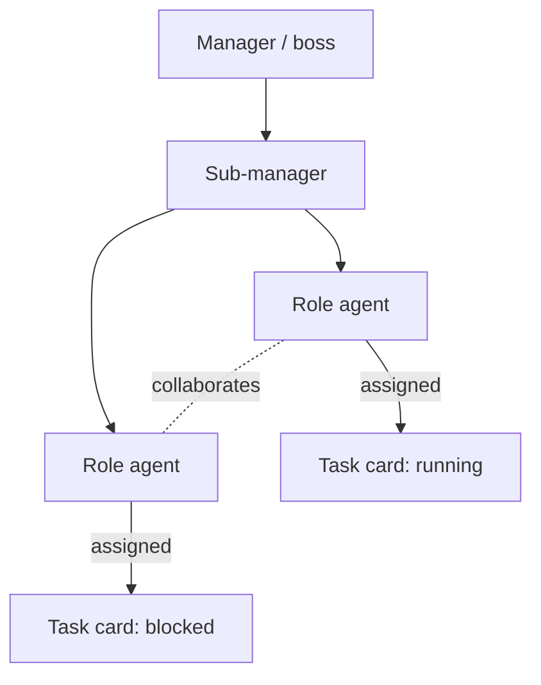
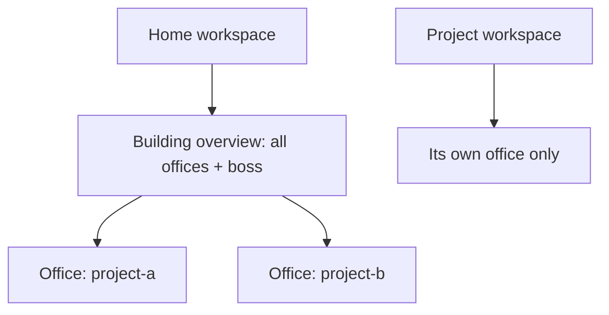

# Office Visualization

**Version:** 2.0.0
**Status:** Stable
**Layer:** concept

## Overview

The technology-agnostic model of the office as a live picture. The core renders the office **one way — as an interaction graph (block-diagram)**: agents and tasks are nodes; reporting, collaboration, and assignment are edges. The graph is clickable — selecting a node or an edge drills into the underlying record it projects, so an edge between two agents reveals the actual **correspondence** (their deliberation threads and briefings) and a node reveals that agent's activity. Any *alternative* rendering of the office — a spatial floor, an immersive or 3D view — is deliberately **not** part of the core; it may exist only as a user-added extension. Each workspace shows its own office; the home workspace additionally shows a building-level overview of all offices.

This is a deliberate narrowing from the earlier two-representation model: the block-diagram is the single canonical office view because it is the representation that makes structure, flow, and communication legible at a glance, degrades cleanly across frontends, and needs no spatial-scene machinery. Immersive/3D representations are optional taste, not core capability, so they are relocated to the extension surface where a user who wants one adds it themselves.

## Related Specifications

- [l1-office-model.md](l1-office-model.md) - The manager/roles topology this visualizes; observational, not client-managed (OFF-5, OFF-1).
- [l1-office-fabric.md](l1-office-fabric.md) - This graph is the fabric's **staffing lens**; cross-lens identity lets a node link to the same work-object on other lenses (OFA-3/OFA-4).
- [l1-workspace-lifecycle.md](l1-workspace-lifecycle.md) - Home as building boss (WSL-1/2); the building overview lives there.
- [l1-kanban-model.md](l1-kanban-model.md) - Task/card assignment shown as agent→task edges.
- [l1-deliberation.md](l1-deliberation.md) - The inter-agent correspondence an edge drills into (OVZ-8); the graph projects it, it is not a new source.
- [l1-inner-monologue.md](l1-inner-monologue.md) - A node's own activity/reasoning stream surfaced on node drill-down (OVZ-8).
- [l1-extension-points.md](l1-extension-points.md) - An alternative/immersive office rendering is a *provide*/*contribute* contribution to the office-lens extension point (OVZ-9, EP-2/EP-8) — user-added, default-absent.
- [l2-office-view.md](l2-office-view.md) - Concrete rendering, data sources, layout storage, and commands.

## 1. Motivation

The product's mental model is a corporation of offices; making that visible turns an abstract multi-agent system into something a person can grasp at a glance — who reports to whom, who is working on what, where work is stuck, and what the agents are actually saying to each other. A **block-diagram with connections** is the representation that delivers all of this directly: nodes and edges show structure and flow, and because every edge stands for a real relationship, clicking one is the natural way to read the *correspondence* that flows along it. Seeing the office this way reinforces "the system does the work" (the client watches the office run) without inviting micromanagement.

An immersive or 3D floor adds spectacle but not legibility, and it carries real cost (scene machinery, weak cross-frontend portability, poor glance-readability). Rather than mandate it in the core and then constrain it, this model excludes it from the core and makes it an *optional extension* — anyone who wants a spatial view adds a plugin that contributes one. The core stays lean and the choice stays with the user.

## 2. Constraints & Assumptions

- The view derives entirely from state that already exists (roster, board, activity, and the agents' communication records); it introduces no new authoritative data.
- It must reflect the live office, not a stale snapshot.
- The client observes; operating the view is never required to get work done.
- The core renders exactly one representation — the interaction graph. No spatial/immersive/3D representation ships in the core.
- Graph node layout is cosmetic and must not influence behavior.

## 3. Core Invariants (Layer 1 only)

Rules every Layer 2 implementation MUST NOT violate:

- **OVZ-1 (Projection, not source):** the office view is a derived projection of existing state (roster, board, activity, communication records). It MUST NOT be an independent source of truth and MUST stay consistent with those sources.
- **OVZ-2 (Live):** the view reflects current state in near-real-time — reporting lines, who works on what, and card states.
- **OVZ-3 (Single canonical representation — the interaction graph):** the core renders the office as **one** representation: an **interaction graph (block-diagram)** whose nodes are agents and tasks and whose edges are reporting, collaboration, and assignment relationships. This block-diagram is the single canonical office rendering. The core MUST NOT ship a second built-in representation; any alternative rendering is an optional extension (OVZ-9).
- **OVZ-4 (Observational with inspection):** the view is observational (consistent with OFF-5). It offers drill-down inspection of a node or edge (OVZ-8) but MUST NOT require the client to operate it.
- **OVZ-5 (Per-office + building overview):** each workspace presents its own office. The home workspace additionally presents a building-level overview of all offices and the building boss (WSL-1/2). Project workspaces do not show the building overview.
- **OVZ-6 (Isolation):** an office view shows only its own office's agents and tasks (consistent with OFF-1). Only the home building-overview aggregates across offices, and it is read-only.
- **OVZ-7 (Cosmetic, persistent graph layout):** the interaction graph's node layout (positions, collapsed/expanded groups) is persisted so the diagram stays stable across sessions, but it is presentation only and never affects behavior.
- **OVZ-8 (Clickable drill-down to the underlying correspondence):** every node and edge in the interaction graph is selectable to reveal the underlying record it projects. Selecting an **edge** between two agents reveals the **correspondence** that relationship carries — their deliberation threads, briefings, and hand-offs; selecting a **node** reveals that agent's activity and its own reasoning/monologue and the tasks it participates in. The drill-down is a projection of existing communication and activity records (consistent with OVZ-1), observational (consistent with OVZ-4), and MUST NOT expose anything the viewer is not already entitled to see (inherits the office's access scope).
- **OVZ-9 (Alternative/immersive representations are optional extensions — no 3D in core):** any representation of the office other than the interaction graph — a spatial floor, an immersive or 3D scene — is NOT part of the core and MUST NOT be shipped or mandated by it. Such a representation MAY exist **only** as a user-added extension contributed through the office-lens extension point (a *provide*/*contribute* contribution per `l1-extension-points.md`), default-absent and enabled by the user's own choice. An extension-provided representation remains a pure projection of the same office state (OVZ-1) and never becomes a second source of truth.

> L2 specs cannot reach RFC status until all invariants here are addressed in their "Invariant Compliance" section.

## 4. Detailed Design

### 4.1 What the view shows



Nodes: agents (manager, sub-managers, roles) and tasks (board cards). Edges: reporting (manager→report), collaboration (agent↔agent), assignment (agent→task). Card state is reflected on the task node. Every node and edge is clickable (OVZ-8).

### 4.2 One core representation; alternatives are extensions

| Representation | Where it lives | Status |
| --- | --- | --- |
| Interaction graph (block-diagram: nodes + edges) | core | the single canonical office rendering (OVZ-3) |
| Spatial floor / immersive / 3D scene | user-added extension only | optional, default-absent, contributed via the office-lens extension point (OVZ-9) |

The core renders exactly the graph. A user who wants a spatial or 3D office adds a plugin that contributes that representation; it is never present unless the user installs it, and when present it projects the same office state (OVZ-1) — switching to it never changes the data.

### 4.3 Office vs building scope



A project workspace shows only its own office (OVZ-6). The home workspace also shows the building overview — every office plus the building boss (OVZ-5). The building overview is itself an interaction graph at the office grain, read-only.

### 4.4 Drill-down to correspondence (OVZ-8)

The graph is not a static picture; each element is a door into what it stands for.

```text
[REFERENCE]
click an EDGE (agent ↔ agent) → the correspondence along that relationship:
      deliberation threads, briefings, hand-offs between the two agents (l1-deliberation)
click a NODE (agent)          → that agent's activity: its tasks, its own reasoning/monologue
                                (l1-inner-monologue), the edges it participates in
click a NODE (task)           → the card and its board state, and the agents assigned to it
Every drill-down is a projection of records that already exist (OVZ-1), shown only within the
viewer's existing access scope, and never required to get work done (OVZ-4).
```

This is what "clicking the connections shows the correspondence" means concretely: the edge is the relationship, and the messages that flowed along it are one click away.

### 4.5 Alternative representations as extensions (OVZ-9)

Excluding immersive/3D from the core does not forbid it — it relocates it. A spatial or 3D office view is a contribution to the office-lens extension point (`l1-extension-points.md`, EP-2 *provide*/*contribute* kind): the user installs an extension that supplies the alternative renderer, the office selects/enables it by the user's choice, and it draws from the same office state the graph does. The core neither ships nor depends on it, so the default experience stays the lean block-diagram and the richer view is available to whoever wants to add it.

## 5. Drawbacks & Alternatives

- **A single core representation may not suit every taste.** Some users want an immersive floor. Mitigated by OVZ-9: the alternative is available as a user-added extension, so preference is served without burdening the core.
- **Visual clutter at scale:** large offices/buildings need grouping/zoom. <!-- TBD: clustering/zoom behavior for large offices and many-node building overviews -->
- **Alternative — keep the spatial floor as a co-equal core representation (the prior model).** Rejected: two mandated representations doubled the sync surface and forced spatial-scene machinery into the core for a view that adds spectacle, not legibility. One canonical graph plus an optional extension is leaner and clearer.
- **Alternative — a built-in 3D office.** Rejected for the core (OVZ-9): 3D is costly, weakly portable across frontends, and poor at glance-readability; it belongs behind a user's explicit opt-in as an extension, not in the default product.
- **Alternative — text-only office status:** rejected; the graphical office (the block-diagram) is a defining product feature — the corporation made visible.

## Canonical References

| Alias | Path | Purpose |
| --- | --- | --- |
| `[OFFICE]` | `.design/main/specifications/l1-office-model.md` | Topology and observational stance this visualizes |
| `[FABRIC]` | `.design/main/specifications/l1-office-fabric.md` | The staffing lens this graph is, and cross-lens identity from a node |
| `[WORKSPACE]` | `.design/main/specifications/l1-workspace-lifecycle.md` | Home/building scope for the overview |
| `[DELIB]` | `.design/main/specifications/l1-deliberation.md` | The inter-agent correspondence an edge drills into (OVZ-8) |
| `[EXT-POINTS]` | `.design/main/specifications/l1-extension-points.md` | The office-lens extension point an alternative/3D view is contributed through (OVZ-9) |
| `[VIEW]` | `.design/main/specifications/l2-office-view.md` | Concrete rendering, data sources, commands |

## Document History

| Version | Date | Notes |
| --- | --- | --- |
| 1.0.0 | 2026-06-24 | Initial stable spec — OVZ-1…OVZ-7: projection-not-source, live, two complementary representations (interaction graph + spatial floor), observational with inspection, per-office + building overview, isolation, cosmetic persistent layout. |
| 2.0.0 | 2026-07-24 | Amendment (scope change) — the core now renders **one** representation, the interaction-graph block-diagram (OVZ-3 narrowed from two representations); node/edge drill-down to the underlying **correspondence** made a first-class invariant (new OVZ-8 — deliberation threads on an edge, agent activity/monologue on a node, a projection of existing records within the viewer's access scope); alternative/immersive/**3D representations excluded from the core and relocated to a user-added extension** contributed via the office-lens extension point (new OVZ-9, composing l1-extension-points); OVZ-7 re-scoped from spatial-floor placement to interaction-graph node layout; Overview/§4.2/§4.5/Drawbacks updated; Related Specs extended (l1-office-fabric, l1-deliberation, l1-inner-monologue, l1-extension-points). The sole L2 implementer (l2-office-view) carries the OVZ v2.0.0 change pending a magic.task reconciliation; L1 re-reviewed and remains Stable. |
