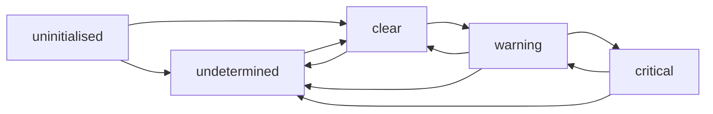

# Operational Health & Insights

**Version:** 1.2.0
**Status:** Stable
**Layer:** concept

## Overview

A continuous observability layer that turns locally-recorded runtime traces into an explainable picture of how well the system is operating: a quantified health score per monitored unit, severity-graded alerts when signals cross thresholds, trend and anomaly detection over rolling windows, and cost/usage accounting. It answers "is the system healthy, and where is it drifting?" without leaving the device.

This is distinct from three neighbours. Telemetry governs the optional, opt-in sharing of anonymized metrics *outward* to improve the product. The self-healing subsystem *repairs* integrity and consistency faults. Practice analytics *coaches the user* on prompting and session hygiene. Operational health only *measures and warns* about the runtime itself — it never shares, never repairs, never coaches.

## Related Specifications

- [l1-telemetry.md](l1-telemetry.md) - Telemetry shares anonymized metrics outward; operational health observes the local runtime and never egresses.
- [l1-doctor.md](l1-doctor.md) - The self-healing subsystem repairs faults; operational health surfaces signals and defers remediation to it (OH-7).
- [l1-practice-analytics.md](l1-practice-analytics.md) - Practice analytics judges the user's working practice; operational health judges the runtime's operating condition.
- [l2-budget-engine.md](l2-budget-engine.md) - Source of cost and token accounting consumed as operational signals (OH-6).
- [l1-storage-model.md](l1-storage-model.md) - Runtime traces (sessions, errors, resource usage) are read from durable state.
- [l1-dashboard.md](l1-dashboard.md) - Primary surface that renders health scores, alerts, and trends.
- [l1-observation-retention.md](l1-observation-retention.md) - [ADDED v1.1.0] The multi-resolution record health signals are retained in and trend windows (OH-4) are computed from; its gap marker (OR-3) is the data-side half of OH-11's un-evaluable-is-not-healthy rule.
- [l1-anomaly-consensus.md](l1-anomaly-consensus.md) - [ADDED v1.1.0] Supplies anomaly marks and rates as signals; that layer never escalates (AC-5), so this layer remains the sole holder of alerting authority.
- [l1-change-attribution.md](l1-change-attribution.md) - [ADDED v1.1.0] Consumes an alert or score drop as the trigger for a window-scoped "what changed" investigation; returns candidates, never causes.
- [l1-declarative-configuration.md](l1-declarative-configuration.md) - [ADDED v1.1.0] Alert rules, their thresholds, and the role→channel mapping (OH-13) are configuration surfaces governed by that contract.
- [l1-fault-lifecycle.md](l1-fault-lifecycle.md) - [ADDED v1.2.0] Owns fault identity and substatus; escalation (FL-8) and regression (FL-7) surface through this layer's rules, and a burst of distinct faults is digested here (OH-14).

## 1. Motivation

A local, long-running agent system accumulates failure modes that no single correctness check catches: gateway memory creeping toward an OOM kill, error rates climbing, a workspace going quiet for days, sessions ballooning in length until context management degrades, model spend drifting past intent. Each is invisible until it becomes an incident.

Correctness checks ("is the state consistent?") and repair ("fix the broken thing") do not answer "is this trending toward trouble?". That requires a measurement layer: aggregate the traces the runtime already writes, score them against named thresholds, detect directional anomalies, and raise graded alerts early — while the operator can still act. Because the data is sensitive operational ground truth, the whole layer stays on-device by construction.

## 2. Constraints & Assumptions

- Health is derived from traces the runtime already records (sessions, messages, errors, resource samples, cost/token counts); this spec does not mandate new instrumentation beyond what those traces expose.
- Observation is strictly read-only and on-device; no signal computation mutates observed state and no data leaves the machine.
- Thresholds and signal weights are configurable; the defaults are a sensible baseline, not a contract.
- A "monitored unit" is the system as a whole and each isolated office/workspace independently — scores and alerts are always attributed to a unit.

## 3. Core Invariants

Rules every Layer 2 implementation MUST NOT violate:

- **OH-1 (On-device, read-only observation):** operational health is computed entirely from locally-recorded traces; computation never mutates observed state and never egresses data (consistent with the local-first, no-exfiltration posture).
- **OH-2 (Explainable health score):** each monitored unit carries a bounded composite health score (a fixed numeric range). Every deduction from full health traces to a named signal and the threshold it crossed; the score is never an opaque number — its breakdown is always reconstructable.
- **OH-3 (Severity-graded alerts):** a signal crossing a declared threshold raises an alert classified `critical | warning | info`, carrying the metric name, current value, threshold, and a human-readable detail. Alerts are deduplicated per unit, per signal, per period so a standing condition does not flood the surface.
- **OH-4 (Trend & anomaly detection):** beyond point thresholds, the layer compares a recent rolling window against a prior window to detect directional anomalies — sharp activity decline, or runaway growth in cost, tokens, or session length — and reports them as anomalies distinct from static threshold breaches.
- **OH-5 (Context-pressure signal):** average interaction length per session is tracked as a leading indicator of context bloat; sustained excess raises a context-management risk before failures occur (consistent with the context-budget tiers).
- **OH-6 (Cost & usage accounting):** token consumption, per-model usage breakdown, and cost are aggregated per unit and per time window as first-class operational signals, feeding both alerts (budget overrun) and the health score.
- **OH-7 (Measure, don't act):** the layer surfaces signals, scores, and risks only. It MUST NOT auto-remediate — repair is owned by the self-healing subsystem, and behavioural coaching by practice analytics. Operational health hands findings to those subsystems; it does not perform their jobs.
- **OH-8 (Inspectable & exportable):** the full health snapshot — scores with their signal breakdowns, active alerts, and trend series — is inspectable by the user and exportable as a self-contained report. No signal is hidden from the operator.
- **OH-9 (Rules bind to classes, not to instances):** [ADDED v1.1.0] an alert rule is declared once against a **class** of monitored things (a signal on a kind of unit), optionally narrowed by a label selector, and **automatically attaches to every matching instance** — including instances that come into existence *after* the rule was written — and detaches when an instance disappears. An instance-specific rule MAY be declared and takes precedence over the class rule of the same name for that instance. Requiring one rule per instance is forbidden: it guarantees that every newly created office, agent, or workspace is born unmonitored, which is exactly when monitoring matters most.
- **OH-10 (Hysteresis and settling — a rule must not flap):** [ADDED v1.1.0] the threshold that **raises** a condition and the threshold that **clears** it are separately expressible, so a value oscillating around a single number does not produce a stream of transitions; and a rule MAY declare a settle delay before a raise and, independently, before a clear. A rule with one symmetric threshold and no settle delay is permitted only where flapping is impossible by construction. Deduplication (OH-3) suppresses *repeats* of a standing condition; hysteresis prevents the condition from *toggling* in the first place — they are different mechanisms and neither substitutes for the other.
- **OH-11 (Un-evaluable is not healthy):** [ADDED v1.1.0] a rule whose inputs were unavailable, or whose evaluation could not produce a value, enters a distinct **undetermined** status — never *clear*. Undetermined is visible in the snapshot, is itself reportable, and contributes **no** "healthy" weight to any score. Treating missing data as passing is forbidden. This is the rule-layer half of a discipline the whole observation stack shares: the record marks a gap rather than a zero (OR-3), the anomaly layer marks *unscored* rather than *normal* (AC-6), and here evaluation failure reads *undetermined* rather than *fine*. Absence is never converted into good news.
- **OH-12 (Silencing is scoped, timed, attributed, and visible):** [ADDED v1.1.0] suppression is a first-class operation carrying a declared scope (unit, rule, or label selector), an **expiry**, an author, and a reason. It suppresses **notification only** — evaluation continues and the underlying condition stays visible in the snapshot (OH-8). Permanent, unattributed, and invisible silencing are each forbidden, and an expired silence lapses automatically without further action. A silenced condition that disappears from the snapshot is a defect, not a feature: it turns an acknowledged problem into a forgotten one.
- **OH-13 (Rules address roles; delivery is a separate mapping):** [ADDED v1.1.0] a rule names the **role** that should learn about the condition (the owner of the unit, the operator on duty, the developer office), never a delivery channel or an address. The role→channel mapping is configured separately as its own declarative surface. Consequence: changing where notifications go never touches a rule, one rule serves every channel, and adding a channel requires no rule edit anywhere.
- **OH-14 (Bursts are digested, never streamed — and a digest drops nothing):** [ADDED v1.2.0] when **several distinct** notifications become due within a short window, they are held and delivered as **one digest** grouped by rule and by unit, rather than as a stream of separate messages. The holding window **extends on each new arrival** up to a declared maximum, so a continuing storm produces one late, complete digest instead of a rapid series of small ones — and the maximum guarantees the digest still arrives while it matters. Two properties are mandatory. A digest **loses nothing**: everything that would have notified appears in it, so digesting is a change of *packaging*, never of *content*. And digesting is **distinct from deduplication and from silencing**: dedup collapses repeats of the *same* signal (OH-3), silencing withholds a *chosen* signal for a stated time (OH-12), and digesting batches *different* signals arriving together. A burst delivered as a stream is the reliable way to make a person stop reading the channel, at which point every later signal — including the one that mattered — is unread by default.

> L2 specs cannot reach RFC status until all invariants here are addressed in their "Invariant Compliance" section.

## 4. Detailed Design

### 4.1 Signal Taxonomy

A *signal* is a named, measurable operational quantity with an optional threshold and weight. Signals fall into families:

| Family | Example signals | Source |
| --- | --- | --- |
| Reliability | error-rate, crash/restart count, stuck-work count | error log, doctor checks |
| Resource | memory pressure, queue depth | runtime resource samples |
| Engagement | sessions/day, messages/session, idle-since | session traces |
| Economy | cost/window, tokens/window, per-model spend | budget engine |
| Trend | activity-window delta, cost-window delta | derived (§4.3) |

### 4.2 Health Score Composition

```text
[REFERENCE]
score := MAX_SCORE
for each signal with a configured penalty:
    if signal.value crosses signal.threshold(tier):
        score := score − signal.weight(tier)
score := clamp(score, MIN_SCORE, MAX_SCORE)
breakdown := list of { signal, observed, threshold, deduction }   // OH-2
```

The breakdown is retained alongside the score so any deduction is explainable. Tiers (e.g. warning vs critical thresholds for the same signal) carry different weights.

### 4.3 Trend & Anomaly Windows

```text
[REFERENCE]
recent := aggregate(metric, window = last N units of time)
prior  := aggregate(metric, window = preceding N units of time)
if prior > 0 and recent / prior < decline_ratio:   anomaly("activity-drop", pct = 1 − recent/prior)
if prior > 0 and recent / prior > growth_ratio:     anomaly("runaway-growth", metric)
```

Anomalies are reported separately from threshold alerts: a metric can be within its absolute bounds yet still be anomalous in its trajectory.

### 4.4 Alert Model

```text
Alert {
  unit_id   : UnitId
  rule      : RuleId        // [MODIFIED v1.1.0] the rule that produced it (OH-9)
  signal    : string
  status    : "undetermined" | "clear" | "warning" | "critical"   // [ADDED v1.1.0] OH-11
  severity  : "critical" | "warning" | "info"
  metric    : string
  current   : number
  threshold : number
  detail    : string        // human-readable
  period    : DateBucket    // dedup key with unit_id + signal (OH-3)
  to_role   : RoleId        // [ADDED v1.1.0] never a channel (OH-13)
  silenced  : SilenceRef?   // [ADDED v1.1.0] present but suppressed (OH-12)
}
```

Alerts are sorted by severity, then recency, for presentation. Risk flags (e.g. `critical_health`, `high_errors`, `resource_pressure`, `low_engagement`) are coarse boolean rollups derived from the same signals for quick scanning.

### 4.6 Rule binding, hysteresis, and the undetermined status

[ADDED v1.1.0]

A **rule** is the declared unit of alerting. It names the class of things it watches, an optional label narrowing, the expressions that raise and clear it, its settle delays, and the role to inform:

```text
[REFERENCE]
Rule {
  name        : RuleId
  binds_to    : SignalClass          // e.g. "error-rate on any office"   (OH-9)
  scope       : LabelSelector?       // narrows to matching instances     (OH-9)
  raise_when  : Expression           // may reference the current status  (OH-10)
  clear_when  : Expression           // separately expressible            (OH-10)
  settle      : { raise: Duration, clear: Duration }                      // (OH-10)
  to_role     : RoleId                                                    // (OH-13)
}
```

Binding is dynamic: the set of instances a rule watches is recomputed as instances appear and disappear, so a rule written today covers an office created tomorrow (OH-9). An instance-specific rule of the same name shadows the class rule for that one instance only.

Hysteresis is expressed by letting the raise/clear expressions read the rule's *current* status, which yields asymmetric thresholds:

```text
[REFERENCE]
raise_when: value > (status ≥ warning ? LOW_MARK : HIGH_MARK)
```

The condition therefore engages at `HIGH_MARK` and only releases below `LOW_MARK`, so a value hovering between the two produces one transition rather than a stream (OH-10).

Status evolves as follows, with `undetermined` reachable from any state whenever evaluation cannot produce a value (OH-11):



A rule removed by a configuration change transitions to a terminal *removed* status rather than vanishing, so its disappearance is observable rather than silent.

Silencing (OH-12) sits strictly between evaluation and notification: the transition still happens, the status still updates, the snapshot still shows the condition — only the outbound notification is withheld, and only until the silence expires.

### 4.5 Snapshot & Export

A health snapshot bundles, per monitored unit: the score with its breakdown, active alerts, risk flags, and trend series for the standard metrics, plus system-wide totals. The snapshot is the single inspectable artifact (OH-8) and the basis for the dashboard surface and any exported report.

## 5. Drawbacks & Alternatives

- **Threshold tuning burden:** static thresholds produce false positives until tuned; mitigated by sensible defaults, severity grading, per-unit dedup (OH-3), and — since v1.1.0 — hysteresis and settle delays (OH-10), which remove the largest single source of alert noise. The learned-baseline complement is now owned by the anomaly layer, whose unanimity gate (AC-2) needs no per-unit tuning at all; this layer keeps only the *escalation* authority (AC-5).
- **Rule/instance binding is a moving target:** [ADDED v1.1.0] a class-bound rule (OH-9) watches a set that changes underneath it, so a mis-specified selector can silently widen or narrow coverage. Mitigated by making the resolved instance set inspectable in the snapshot (OH-8) — a rule that currently matches nothing is a visible fact, not a silent one.
- **Alternative — fold into the self-healing subsystem:** rejected; conflates measurement with repair and violates OH-7's separation. Repair acts on discrete faults; health scores a continuous condition.
- **Alternative — fold into telemetry:** rejected; telemetry is outward-sharing and opt-in, health is local and always-on. Different data ownership and lifecycle.
- **Alternative — fold into practice analytics:** rejected; that subsystem judges the user's practice, this judges the runtime. Different subject, different audience.

## Canonical References

| Alias | Path | Purpose |
| --- | --- | --- |
| `[BUDGET]` | `.design/main/specifications/l2-budget-engine.md` | Authoritative source of cost/token accounting consumed by OH-6. |
| `[DASHBOARD]` | `.design/main/specifications/l1-dashboard.md` | Surface contract that renders the health snapshot (OH-8). |
| `[TELEMETRY]` | `.design/main/specifications/l1-telemetry.md` | Boundary spec — defines what stays local vs. what may be shared, which OH-1 must not cross. |
| `[RETENTION]` | `.design/main/specifications/l1-observation-retention.md` | Multi-resolution record the signals are retained in; gap semantics OH-11 composes. |
| `[ANOMALY]` | `.design/main/specifications/l1-anomaly-consensus.md` | Supplier of anomaly rates as signals; holds no escalation authority (AC-5). |
| `[CONFIG]` | `.design/main/specifications/l1-declarative-configuration.md` | Contract governing rule, threshold, and role→channel surfaces (OH-13). |

## Document History

| Version | Date | Author | Notes |
| --- | --- | --- | --- |
| 1.0.0 | 2026-06-26 | Core Team | Initial spec — operational health layer: explainable health score, severity-graded alerts, trend/anomaly detection, cost/usage accounting, measure-don't-act boundary (OH-1…OH-8). |
| 1.2.0 | 2026-07-23 | Core Team | Added OH-14 — **bursts are digested, never streamed, and a digest drops nothing**: several *distinct* notifications becoming due within a short window are held and delivered as one digest grouped by rule and unit, with the holding window **extending on each new arrival** up to a declared maximum, so a continuing storm produces one late complete digest rather than a rapid series of small ones while the maximum keeps it arriving while it still matters. Mandatory: a digest loses nothing (packaging changes, content never does), and digesting stays distinct from dedup (repeats of the *same* signal, OH-3) and from silencing (a *chosen* signal withheld for a stated time, OH-12). A burst delivered as a stream is the reliable way to make a person stop reading the channel, after which every later signal — including the one that mattered — is unread by default. Related Specifications extended with `l1-fault-lifecycle`. |
| 1.1.0 | 2026-07-23 | Core Team | Alert-discipline amendment (OH-9…OH-13) — rules bind to *classes* with label narrowing and auto-attach to instances created later, instance-specific rules taking precedence (OH-9); separately expressible raise/clear thresholds plus raise/clear settle delays so a rule cannot flap, distinct from OH-3 dedup (OH-10); a distinct **undetermined** status for un-evaluable rules that never reads as clear and contributes no healthy weight, completing the stack-wide absence-is-not-good-news discipline alongside OR-3 gaps and AC-6 unscored (OH-11); silencing as a scoped/expiring/attributed operation that suppresses notification only while evaluation and visibility continue (OH-12); rules address **roles** with role→channel mapping configured separately (OH-13). §4.4 alert model extended with `rule`/`status`/`to_role`/`silenced`; new §4.6 on rule binding, hysteresis, and the status lifecycle. |
