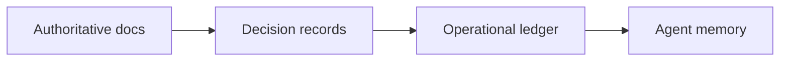

# Operational Knowledge Ledger

**Version:** 1.0.0
**Status:** Stable
**Layer:** concept

## Overview

The operational knowledge ledger is the office's store of **exact operational ground truth** for agent dispatch — the rules, conventions, and hard-won lessons a worker must apply *verbatim* to do a task correctly. It is a third, distinct kind of knowledge alongside the two the office already has:

- **Semantic memory** recalls *probably-relevant* facts by similarity (fuzzy, ranked).
- **The knowledge base** retrieves *document corpora* on demand (RAG).
- **The operational ledger** supplies *exact, citable* operational facts that ground a dispatched brief (precise, addressable, quoted).

Its job is to stop a specific, measurable failure: an orchestrator briefs a worker, the worker applies a rule *from memory* instead of from the source, the paraphrase drifts, and the work violates the rule. The ledger makes operational facts atomic, ID-addressable, and machine-greppable; brief grounding requires that they be quoted verbatim, never paraphrased.

## Related Specifications

- [l1-memory-model.md](l1-memory-model.md) — semantic recall; the ledger is the exact-ground-truth complement, not a recall store (OL-7).
- [l1-knowledge-base.md](l1-knowledge-base.md) — RAG document collections; the ledger is dispatch-time grounding, not a retrieved corpus (OL-7).
- [l1-orchestration.md](l1-orchestration.md) — briefings are where ledger facts are grounded into worker tasks (OL-4, OL-5).
- [l1-office-model.md](l1-office-model.md) — orchestrator that composes briefs and the workers that consume them.
- [l1-quality-standards.md](l1-quality-standards.md) — verbatim-citation and conflict gating are anti-drift quality controls.
- [l1-doctor.md](l1-doctor.md) — ledger integrity (dangling IDs, precedence conflicts) is a health-check surface.
- [l1-facilitation.md](l1-facilitation.md) — the method catalog and this ledger are both data-driven, ID-addressable, layered registries; sibling patterns.
- [l1-security.md](l1-security.md) — ledger content is operational project data; on-device-default, consent-gated egress (OL-10).
- [l1-workflow-language.md](l1-workflow-language.md) — ledger predicates are candidate workflow context (`@ctx`-style) cited verbatim; required-reading maps to selective context loading.

## 1. Motivation

Multi-agent offices dispatch briefs constantly: the orchestrator hands a worker a task plus the context to do it. Two things go wrong with the context half:

1. **Paraphrase drift.** When a brief restates a rule in its own words — "never leave the changelog unchecked" — instead of quoting the authoritative line, workers act on the gist and miss the precise requirement. Observed failure: a paraphrased rule caused a majority of dispatched workers to violate the actual source rule. The fix is structural, not exhortative: the brief must carry the *exact* line and require the worker to read it.

2. **Source ambiguity.** When the same fact appears in several places (a contributing guide, an architecture decision, a notes file, an agent's memory) and they disagree, a worker has no principled way to pick the winner. Without a declared precedence chain, "ground truth" is whatever the worker happened to read last.

A free-form "project notes for the AI" document does not solve either: prose is not addressable, not greppable, and invites paraphrase. What is needed is a *ledger* — atomic facts with stable IDs, a precedence chain that resolves disagreement, and a brief-grounding discipline that quotes rather than summarizes.

## 2. Constraints & Assumptions

- The ledger holds **operational facts**, not narrative: rules, conventions, learnings, and the pointers that resolve them — not design rationale (that lives in specs) nor chat history.
- Facts are **exact**: the ledger is not ranked, embedded, or similarity-searched. Lookup is by ID or class, not by relevance.
- The ledger is **append-and-supersede**, not rewrite: knowledge accretes; superseding a fact is explicit and preserves the old ID's history.
- Brief grounding is **selective**: a task gets the facts and reading it needs, bounded by a context budget — never the whole ledger.
- Content is **project/user operational data**: on-device by default, no egress without consent.

## 3. Core Invariants

Rules any Layer 2 implementation MUST NOT violate:

- **OL-1 Atomic predicate granularity**: each operational fact is a single, self-contained, machine-greppable entry — one fact per entry, not a multi-fact paragraph. Entries are grouped by a declared class (e.g. rule / convention / learning / session-log) so a class can be enumerated wholesale.
- **OL-2 Stable addressable identity**: every entry has a stable identifier; all references cite that identifier. When a fact changes materially it is **superseded** (new or versioned identity) rather than silently mutated under the same id, so existing citations never quietly change meaning.
- **OL-3 Canonical-source precedence**: a precedence chain is declared (most-authoritative source → … → agent memory) and resolves ground truth whenever sources disagree. A lower-precedence source MUST NOT override a higher one; the ledger itself ranks below the authoritative documents it summarizes.
- **OL-4 Verbatim citation, no paraphrase (anti-drift)**: when a dispatched brief applies a ledger fact, it quotes the canonical line **verbatim** and attributes its id/source. Paraphrasing an operational fact from memory into a brief is prohibited — it is the documented cause of drift and violations. (Stylistic prose elsewhere is unaffected; this governs operational facts in briefs.)
- **OL-5 Mandatory required-reading**: a brief MAY carry a required-reading set; the receiving agent MUST load every listed source **before any other action**, and treats it as primary context outranking prior memory. A brief that depends on a source it does not require-to-read is malformed.
- **OL-6 Learnings as provenance-stamped accretion**: new operational knowledge is captured as predicates carrying provenance (the evidence/change/source that established them) and appended. Chronological narrative is confined to an append-only session log, kept separate from the predicate body so the body stays a clean fact set.
- **OL-7 Exact grounding, not recall**: the ledger is distinct from semantic memory and the knowledge base. It is not embedded, ranked, or returned by similarity; it is exact dispatch-time grounding. The three knowledge kinds compose but never substitute for one another.
- **OL-8 Bounded, selected grounding**: brief grounding selects the predicates and reading relevant to the task within a context budget. The full ledger is never dumped into a brief; selection is observable (which ids/sources were grounded).
- **OL-9 Conflict-gated ingestion**: external content entering the ledger or project context passes a severity-gated conflict check — a blocker-level contradiction of a locked decision halts the write entirely; a warning-level overlap requires explicit approval (never auto-merged); informational differences are surfaced for transparency. The check report is rendered to the user verbatim.
- **OL-10 On-device, consent-gated**: the ledger is operational project/user data, stored on-device by default; no entry or excerpt egresses without explicit consent, and no secret value is ever written into a predicate (pointer-not-value for sensitive data).

> An L2 implementation cannot reach RFC until every invariant above is addressed in its Invariant Compliance section.

## 4. Detailed Design

### 4.1 Predicate Model

A ledger entry is an atomic predicate: a class-qualified, id-addressable fact.

```text
[REFERENCE]
<class>.<subkey>[.<subkey>] = <one-line fact, with inline provenance/pointer>
```

| Element | Role |
| --- | --- |
| `class` | Top-level grouping; enumerable wholesale (e.g. RULE, CONVENTION, LEARNING, META, SESSION). |
| `subkey path` | Hierarchical address making the id stable and human-greppable. |
| `fact` | The operational statement, terse and self-contained; carries an inline pointer to its canonical source and, for learnings, its provenance (what established it). |

Representative classes:

- **Rule / convention** — a hard constraint or standing convention a worker must satisfy.
- **Learning** — a lesson captured from observed failure, with provenance (the change/evidence that taught it).
- **Meta-rule** — rules *about how facts are applied*, e.g. the precedence chain (OL-3) and the verbatim-citation discipline (OL-4) themselves.
- **Session log** — append-only chronological narrative, segregated from the fact body (OL-6).

### 4.2 Canonical-Source Precedence (OL-3)



A declared chain orders sources from most to least authoritative. Resolution rule: on disagreement, the highest-precedence source wins; the ledger summarizes the docs above it and is itself outranked by them. This makes "which version is true" a lookup, not a guess.

### 4.3 Brief Grounding (OL-4, OL-5, OL-8)

How an operational fact reaches a worker without drifting:

```text
[REFERENCE]
1. SELECT   — orchestrator picks the predicates + sources this task needs (OL-8)
2. QUOTE    — each applied fact is inserted into the brief verbatim, with its id/source (OL-4)
3. REQUIRE  — sources needing full read are listed as required-reading (OL-5)
4. DISPATCH — worker loads required-reading FIRST, then acts on the quoted facts
5. ATTRIBUTE— worker's output traces decisions to the cited ids (auditable)
```

The discipline is one-directional: briefs quote the ledger; workers never re-summarize a fact back into a new brief from memory.

### 4.4 Learnings Capture & Session Log (OL-6)

New operational knowledge enters by accretion: a learning is written as a provenance-stamped predicate (what failed, what was learned, the evidence id). The fact body stays a clean, greppable set; the running story of *when and why* changes happened lives in a separate append-only session log. This keeps the body small enough to ground briefs cheaply while preserving full history.

### 4.5 Conflict-Gated Ingestion (OL-9)

When external content (an imported doc, a synthesized summary) would enter the ledger or project context, it passes a conflict check before any write:

| Severity | Gate behavior |
| --- | --- |
| Blocker | Contradicts a locked decision / missing prerequisite → **halt the write entirely**. |
| Warning | Ambiguous or partially overlapping → surface and require **explicit approval**; never auto-merge. |
| Info | Benign difference → surface for transparency, no gate. |

The report is plain and rendered verbatim (found / expected / resolving action per finding), so the user judges on the actual text.

### 4.6 Ideas-to-Adopt Mapping

How this concept and the surrounding mined ideas land against existing specs:

| Mined idea | Disposition | Where it lands |
| --- | --- | --- |
| Atomic, id-addressable operational predicates | **New** | OL-1, OL-2; §4.1 |
| Canonical-source precedence chain | **New** | OL-3; §4.2 |
| Verbatim-citation / no-paraphrase brief grounding | **New** | OL-4; §4.3 |
| Mandatory required-reading before action | **New** | OL-5; §4.3 |
| Learnings as provenance-stamped predicates + segregated session log | **New** | OL-6; §4.4 |
| Severity-gated conflict check on ingestion | **New** | OL-9; §4.5 |
| Thinking-models that name the failure mode they counter + per-activity scope + inter-model ordering | **Adopt → amend** | extends the facilitation method catalog (counters/activity-scope/ordering) |
| Named story-splitting heuristic (size-signal triggered, single-axis-per-split) | **Adopt (technique)** | the task-graph decomposition algebra; a catalog-able splitting technique |
| Decimal/in-between phase insertion without renumbering | **Reuse** | additive reversible expansion in the task-graph model |
| Batch grey-area resolution (propose answers, accept/override per area) | **Reuse** | the autonomous clarification protocol in mission execution |
| Artifact "inert unless consumed" principle; consumer-declared artifacts | **Reuse** | artifact dependency graph in the orchestration implementation |
| Standardized agent completion markers for routing | **Reuse** | development-workflow handoff protocol + protocol event taxonomy |
| Validation-gap → failing-test → filled/escalated/skip (anti-soften) | **Reuse** | adversarial review + independent-test guarantee in the quality pipeline |

### 4.7 Nodus Relevance

The ledger maps cleanly onto the workflow DSL, where grounding context is a first-class concern:

- **Predicates as `@ctx` ground truth**: ledger facts are candidate context entries distinct from inputs (`@in`) — exact, cited, not user-supplied. The DSL can carry them as verbatim context rather than interpolated prose.
- **Required-reading as selective loading**: the required-reading set maps to the DSL's selective context/schema loading directive (the upstream parity-gap construct the nodus workspace already tracks), loading only what a step needs before it runs.
- **No-paraphrase as the data-not-instructions guard**: OL-4 is the same principle as the runtime's anti-hallucination guard for injected content (serialize-and-fence data, mark it as data not instructions) — the predicate is the fenced data, quoted verbatim.
- **Conflict gate as a validator**: severity-gated ingestion (OL-9) is expressible as a validator/guard step with blocker/warning/info outcomes.

These are adoption *candidates* recorded at concept level; the concrete language/runtime surface is owned by the nodus specs.

## 5. Implementation Notes

1. Define the predicate format and class set first; everything else reads it.
2. Brief grounding (§4.3) is the payoff — build the select → quote → require → dispatch path early; it is what prevents drift.
3. The precedence chain (OL-3) is a small declared list; resolution is a lookup, not a heuristic.
4. Keep the fact body and the session log in separate surfaces from day one (OL-6) — merging them is the main thing that bloats grounding cost.
5. Conflict-gated ingestion (OL-9) reuses the verbatim-report convention; do not auto-resolve warnings.

## 6. Drawbacks & Alternatives

**Drawback — ledger rot.** A ledger that accretes without superseding becomes stale and contradictory. OL-2 (supersede-don't-mutate) and OL-9 (conflict gate) bound this; periodic integrity checks (doctor surface) catch dangling ids.

**Alternative — one free-form AI-rules document.** Rejected: prose is not addressable or greppable and invites paraphrase, defeating OL-4. The ledger keeps the human-readable rationale in specs and the *operational* facts in citable predicates.

**Alternative — fold operational facts into semantic memory.** Rejected: similarity recall returns *probably-relevant* facts and may miss or rank-bury an exact rule a task must obey. Operational ground truth must be exact and addressable, not recalled (OL-7).

**Alternative — trust workers to read sources themselves.** Rejected: without mandatory required-reading and verbatim quoting, workers act on memory; the observed drift is exactly this failure (OL-4, OL-5).

## Canonical References

| Alias | Path | Purpose |
| --- | --- | --- |
| `[ORCHESTRATION]` | `.design/main/specifications/l1-orchestration.md` | Briefings — where grounding is applied (OL-4/OL-5) |
| `[MEMORY-MODEL]` | `.design/main/specifications/l1-memory-model.md` | Boundary: recall vs exact grounding (OL-7) |
| `[KNOWLEDGE-BASE]` | `.design/main/specifications/l1-knowledge-base.md` | Boundary: RAG corpora vs ledger predicates (OL-7) |
| `[SECURITY]` | `.design/main/specifications/l1-security.md` | On-device-default, pointer-not-value for secrets (OL-10) |

## Document History

| Version | Date | Author | Notes |
| --- | --- | --- | --- |
| 1.0.0 | 2026-06-25 | Core Team | Initial spec — OL-1…OL-10; predicate model, canonical-source precedence, verbatim brief grounding, learnings accretion, conflict-gated ingestion; ideas-to-adopt + nodus-relevance mapping (mined from an external multi-agent development-workflow framework) |
