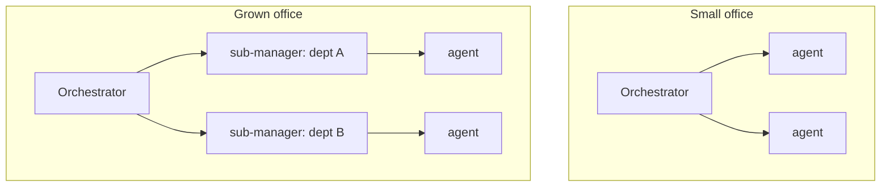
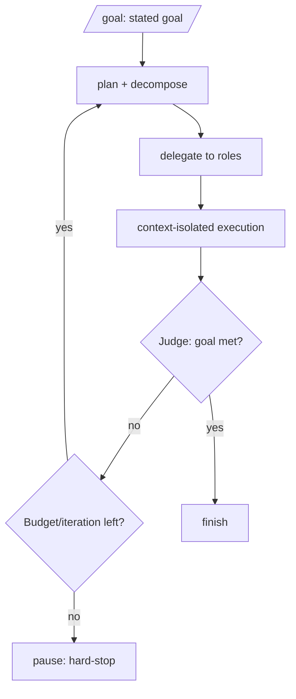

# Orchestration & Autonomy

**Version:** 1.1.0
**Status:** Stable
**Layer:** concept

## Overview

The technology-agnostic protocol by which an office coordinates its agents to turn client intent into finished work — autonomously. It defines how the single office orchestrator delegates, how the management hierarchy adapts to office size, how the office runs unattended toward a goal with a judged stop condition and a budget circuit-breaker, how executors stay context-isolated, and how the office synchronizes itself.

## Related Specifications

- [l1-office-model.md](l1-office-model.md) - Single orchestrator, delegation, adaptive staffing, client interaction (OFF-2/4/5/6/7).
- [l1-kanban-model.md](l1-kanban-model.md) - Plans/tasks land on the board; delegation creates cards.
- [l1-memory-model.md](l1-memory-model.md) - Orchestrator and agents read/write memory.
- [l1-quality-standards.md](l1-quality-standards.md) - `done` requires gates; the orchestrator routes work through them.
- [l2-orchestration.md](l2-orchestration.md) - Concrete delegation, messaging, judge, budget, and `/goal` flow.

## 1. Motivation

Maximum automation means the office must coordinate itself: decompose intent, assign the right specialists, keep work flowing, and know when a goal is actually done — all without the client steering. A rigid org wastes effort on small jobs and a flat org collapses on big ones, so coordination must adapt. Running unattended safely demands both a trustworthy stop signal (a judge) and a hard limit (a budget).

## 2. Constraints & Assumptions

- One orchestrator per office; it coordinates, it does not do specialist work.
- The office may run for a long time unattended and must remain coherent and bounded.
- Executors must not pollute the orchestrator's working context.
- "Done" for an autonomous goal must be judged, not self-declared.

## 3. Core Invariants (Layer 1 only)

Rules every Layer 2 implementation MUST NOT violate:

- **ORC-1 (One orchestrator, coordination-only):** each office has exactly one orchestrator that owns delegation and never performs specialist work itself (reaffirms OFF-2).
- **ORC-2 (Adaptive topology):** the orchestrator manages agents directly while the office is small and introduces sub-managers / departments as it grows. The hierarchy adapts to need and is never required to be fixed up front.
- **ORC-3 (Intent → plan → tasks → board):** the orchestrator translates client intent into a plan, decomposes it into tasks, and places them on the board; delegation is creating an assigned work item for a competent role (consistent with OFF-7 / KAN).
- **ORC-4 (Delegate, monitor, re-delegate):** work is delegated to roles; the orchestrator monitors progress, unblocks, and re-assigns — it does not absorb the work.
- **ORC-5 (Context-isolated execution):** each delegated unit runs in an isolated context and returns a result/summary; the orchestrator's context MUST NOT be polluted by executors' intermediate work.
- **ORC-6 (Judged autonomous termination):** a `/goal` run drives the office autonomously and terminates only when an **independent judge** confirms the goal is met, or a hard-stop fires (ORC-7) — whichever comes first. The orchestrator MUST NOT self-declare a goal done without the judge.
- **ORC-7 (Budget circuit-breaker):** every autonomous run is bounded by a budget / iteration limit that, when reached, safely pauses the run.
- **ORC-8 (Synchronization without duplication):** the orchestrator periodically synchronizes the office (briefings) to keep multi-agent work coherent; synchronization produces shared state, never duplicated work.
- **ORC-9 (Approval gate for high-impact work):** before irreversible or high-impact actions, the orchestrator may require plan approval — from a higher manager or, at escalation gates, the client (consistent with OFF-6 HITL).
- **ORC-10 (Resumable):** orchestration state (plan, delegations, goal progress) persists so an autonomous run resumes after a restart (consistent with OFF-8 / durable state).
- **ORC-11 (Error containment):** errors in delegated work MUST NOT propagate unfiltered to the orchestrator. Each delegation boundary is an error containment point: executor failures are classified (retryable / fatal / escalation-required) before they surface upward. A single worker failure MUST NOT invalidate the orchestrator's plan unless the failed task has no viable alternative path.

> L2 specs cannot reach RFC status until all invariants here are addressed in their "Invariant Compliance" section.

## 4. Detailed Design

### 4.1 Adaptive topology



The office starts flat. When the team or scope crosses a threshold (too many direct reports, diverging domains), the orchestrator promotes/creates sub-managers to own departments (ORC-2).

### 4.2 The `/goal` autonomous loop



The single-prompt autonomy: the client states a goal; the office plans, delegates, executes, and re-plans until the judge confirms completion or the budget circuit-breaker trips (ORC-6/7).

### 4.3 Delegation and synchronization

- **Delegation:** the orchestrator creates assigned work items (board cards) for competent roles; missing roles are hired (WSL-6).
- **Monitoring:** it tracks running/blocked work and re-delegates or unblocks.
- **Briefings:** periodic office/department synchronization keeps shared understanding current (ORC-8), so parallel agents do not diverge or duplicate.

### 4.4 Error Containment Protocol

Each delegation boundary implements a three-step error filter (ORC-11):

```text
[REFERENCE]
Worker completes with error:

Step 1 — CLASSIFY
  retryable       : transient failures (network timeout, rate limit, context overflow)
                    → orchestrator schedules a retry on the same or alternate role
  fatal_isolated  : task-scoped failures (test failure, compilation error, assertion)
                    → card moves to Blocked; orchestrator continues other delegations
  escalation      : decisions requiring human intent (ambiguous spec, conflicting constraints,
                    budget risk above threshold)
                    → HITL gate fires (ORC-9); orchestrator pauses affected delegation path

Step 2 — SCOPE CHECK
  Is the failed task on the critical path (no viable alternative)?
    YES → Propagate: escalate the failure classification to the orchestrator's plan level
    NO  → Contain:  mark task Blocked; other delegations continue undisturbed

Step 3 — LOG
  Append {task_id, error_class, scope, action_taken} to the office error log.
  The doctor and self-improvement subsystems read this log; the orchestrator does not
  expose raw worker errors to the client unless escalation fires.
```

Error accumulation is monotone within a plan: contained failures accrue in the Blocked column. The orchestrator presents a consolidated "N tasks blocked" summary rather than a stream of individual errors.

## 5. Drawbacks & Alternatives

- **Judge cost:** an independent judge per goal-check adds calls; justified — premature "done" is worse. Cadence is tunable.
- **Adaptive-topology thresholds:** when to grow a hierarchy is heuristic. <!-- TBD: thresholds/triggers for promoting sub-managers (team size, domain divergence) -->
- **Alternative — peer negotiation (no central orchestrator):** rejected; it breaks the single-owner clarity (OFF-2) and complicates accountability.

## Canonical References

| Alias | Path | Purpose |
| --- | --- | --- |
| `[OFFICE]` | `.design/main/specifications/l1-office-model.md` | Orchestrator, delegation, client-interaction invariants |
| `[KANBAN]` | `.design/main/specifications/l1-kanban-model.md` | Where plans/tasks become tracked work |
| `[ORCH]` | `.design/main/specifications/l2-orchestration.md` | Concrete coordination mechanics |
