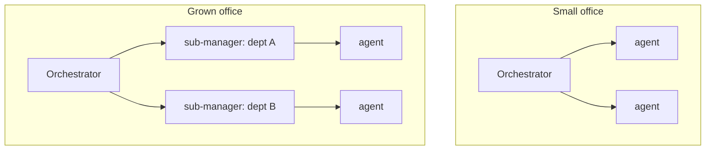
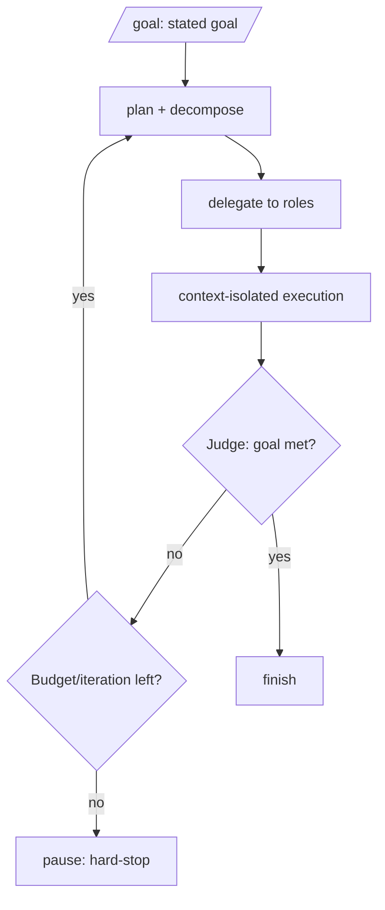

# Orchestration & Autonomy

**Version:** 1.2.0
**Status:** Stable
**Layer:** concept

## Overview

The technology-agnostic protocol by which an office coordinates its agents to turn client intent into finished work — autonomously. It defines how the single office orchestrator delegates, how the management hierarchy adapts to office size, how the office runs unattended toward a goal with a judged stop condition and a budget circuit-breaker, how executors stay context-isolated, and how the office synchronizes itself.

## Related Specifications

- [l1-office-model.md](l1-office-model.md) - Single orchestrator, delegation, adaptive staffing, client interaction (OFF-2/4/5/6/7).
- [l1-kanban-model.md](l1-kanban-model.md) - Plans/tasks land on the board; delegation creates cards.
- [l1-memory-model.md](l1-memory-model.md) - Orchestrator and agents read/write memory.
- [l1-quality-standards.md](l1-quality-standards.md) - `done` requires gates; the orchestrator routes work through them.
- [l2-orchestration.md](l2-orchestration.md) - Concrete delegation, messaging, judge, budget, and `/goal` flow.
- [l1-office-visualization.md](l1-office-visualization.md) - The live projection through which coordination is *observed* (ORC-12 transparency half).
- [l1-acp.md](l1-acp.md) - ACP-10 live steering is the *intervene* mechanism (ORC-12 intervenability half): the human redirects an in-flight turn as a first-class participant.
- [l1-event-mesh.md](l1-event-mesh.md) - EM-8 observable-by-construction routing carries coordination events, so no exchange is off the record (ORC-12).

## 1. Motivation

Maximum automation means the office must coordinate itself: decompose intent, assign the right specialists, keep work flowing, and know when a goal is actually done — all without the client steering. A rigid org wastes effort on small jobs and a flat org collapses on big ones, so coordination must adapt. Running unattended safely demands both a trustworthy stop signal (a judge) and a hard limit (a budget).

## 2. Constraints & Assumptions

- One orchestrator per office; it coordinates, it does not do specialist work.
- The office may run for a long time unattended and must remain coherent and bounded.
- Executors must not pollute the orchestrator's working context.
- "Done" for an autonomous goal must be judged, not self-declared.

## 3. Core Invariants (Layer 1 only)

Rules every Layer 2 implementation MUST NOT violate:

- **ORC-1 (One orchestrator, coordination-only):** each office has exactly one orchestrator that owns delegation and never performs specialist work itself (reaffirms OFF-2).
- **ORC-2 (Adaptive topology):** the orchestrator manages agents directly while the office is small and introduces sub-managers / departments as it grows. The hierarchy adapts to need and is never required to be fixed up front.
- **ORC-3 (Intent → plan → tasks → board):** the orchestrator translates client intent into a plan, decomposes it into tasks, and places them on the board; delegation is creating an assigned work item for a competent role (consistent with OFF-7 / KAN).
- **ORC-4 (Delegate, monitor, re-delegate):** work is delegated to roles; the orchestrator monitors progress, unblocks, and re-assigns — it does not absorb the work.
- **ORC-5 (Context-isolated execution):** each delegated unit runs in an isolated context and returns a result/summary; the orchestrator's context MUST NOT be polluted by executors' intermediate work.
- **ORC-6 (Judged autonomous termination):** a `/goal` run drives the office autonomously and terminates only when an **independent judge** confirms the goal is met, or a hard-stop fires (ORC-7) — whichever comes first. The orchestrator MUST NOT self-declare a goal done without the judge.
- **ORC-7 (Budget circuit-breaker):** every autonomous run is bounded by a budget / iteration limit that, when reached, safely pauses the run.
- **ORC-8 (Synchronization without duplication):** the orchestrator periodically synchronizes the office (briefings) to keep multi-agent work coherent; synchronization produces shared state, never duplicated work.
- **ORC-9 (Approval gate for high-impact work):** before irreversible or high-impact actions, the orchestrator may require plan approval — from a higher manager or, at escalation gates, the client (consistent with OFF-6 HITL).
- **ORC-10 (Resumable):** orchestration state (plan, delegations, goal progress) persists so an autonomous run resumes after a restart (consistent with OFF-8 / durable state).
- **ORC-11 (Error containment):** errors in delegated work MUST NOT propagate unfiltered to the orchestrator. Each delegation boundary is an error containment point: executor failures are classified (retryable / fatal / escalation-required) before they surface upward. A single worker failure MUST NOT invalidate the orchestrator's plan unless the failed task has no viable alternative path.

- **ORC-12 (Transparent, intervenable coordination):** [ADDED v1.2.0] inter-agent coordination — delegation, briefing, hand-off, cross-role messaging — flows through a medium the human can observe and interject into. There are **no hidden agent-to-agent back-channels**: every coordination exchange is **(a) surfaced** — observable through the office's live projection and event stream so the human is never surprised by what agents told one another (composes `l1-office-visualization` and the observable event mesh, EM-8) — and **(b) intervenable** — the human MAY interject into any in-flight coordination or delegated turn at any point, as a first-class participant redirecting or correcting it, not only reviewing it after the fact (composes the live-steering redirect, `l1-acp` ACP-10). This is a **capability** contract, not a mandate to babysit: the office still runs autonomously by default (OFF-5, ORC-6), but autonomy never means *opacity* — the human's ability to see and steer is preserved by construction, never traded for speed. ORC-5 context-isolation (keeping executor detail out of the orchestrator's context) and ORC-11 error-containment (not flooding the client with raw errors) govern *what is summarized upward* — signal management — and MUST NOT be read as license for a coordination path the human cannot observe or reach.

> L2 specs cannot reach RFC status until all invariants here are addressed in their "Invariant Compliance" section.

## 4. Detailed Design

### 4.1 Adaptive topology



The office starts flat. When the team or scope crosses a threshold (too many direct reports, diverging domains), the orchestrator promotes/creates sub-managers to own departments (ORC-2).

### 4.2 The `/goal` autonomous loop



The single-prompt autonomy: the client states a goal; the office plans, delegates, executes, and re-plans until the judge confirms completion or the budget circuit-breaker trips (ORC-6/7).

### 4.3 Delegation and synchronization

- **Delegation:** the orchestrator creates assigned work items (board cards) for competent roles; missing roles are hired (WSL-6).
- **Monitoring:** it tracks running/blocked work and re-delegates or unblocks.
- **Briefings:** periodic office/department synchronization keeps shared understanding current (ORC-8), so parallel agents do not diverge or duplicate.

### 4.4 Error Containment Protocol

Each delegation boundary implements a three-step error filter (ORC-11):

```text
[REFERENCE]
Worker completes with error:

Step 1 — CLASSIFY
  retryable       : transient failures (network timeout, rate limit, context overflow)
                    → orchestrator schedules a retry on the same or alternate role
  fatal_isolated  : task-scoped failures (test failure, compilation error, assertion)
                    → card moves to Blocked; orchestrator continues other delegations
  escalation      : decisions requiring human intent (ambiguous spec, conflicting constraints,
                    budget risk above threshold)
                    → HITL gate fires (ORC-9); orchestrator pauses affected delegation path

Step 2 — SCOPE CHECK
  Is the failed task on the critical path (no viable alternative)?
    YES → Propagate: escalate the failure classification to the orchestrator's plan level
    NO  → Contain:  mark task Blocked; other delegations continue undisturbed

Step 3 — LOG
  Append {task_id, error_class, scope, action_taken} to the office error log.
  The doctor and self-improvement subsystems read this log; the orchestrator does not
  expose raw worker errors to the client unless escalation fires.
```

Error accumulation is monotone within a plan: contained failures accrue in the Blocked column. The orchestrator presents a consolidated "N tasks blocked" summary rather than a stream of individual errors.

### 4.5 Transparent, intervenable coordination [ADDED v1.2.0]

ORC-12 turns two capabilities the office already has — a live projection to *watch*
and a live-steering redirect to *touch* — into a guarantee about coordination itself:
no exchange between agents happens where the human can neither see nor reach it.

```text
[REFERENCE]
coordination exchange (delegate / brief / hand-off / cross-role message):
    emit to the observable event stream          // (a) surfaced — EM-8, office-visualization
    proceed autonomously                         // OFF-5 default — no waiting on the human
    at any point the human MAY:
        observe   the exchange in the projection  // drill from summary → detail on demand
        interject "@role wait, do X instead"       // (b) intervenable — ACP-10 steering redirect
    // there is NO path where agents coordinate off the record or beyond reach
```

**Reconciling with ORC-5 / ORC-11 (isolation & containment are not hiding).** Those two
invariants shape *what the orchestrator carries in its own context and surfaces to the
client by default* — they keep the orchestrator uncluttered and spare the client a flood
of raw errors. ORC-12 draws the line they must not cross: summarizing-by-default is fine;
making a coordination path *unobservable* or *unreachable* is not. The human always has a
route from the consolidated summary down to the underlying exchange, and a route to
interject into it — the default is quiet, never opaque.

| Concern | Owned by | Effect |
| --- | --- | --- |
| What the orchestrator holds in-context | ORC-5 | executor detail stays out; summaries flow up |
| What surfaces to the client by default | ORC-11 | consolidated status, not raw error streams |
| That coordination is *observable + reachable at all* | **ORC-12** | no hidden back-channel; drill-in + interject always available |

## 5. Drawbacks & Alternatives

- **Judge cost:** an independent judge per goal-check adds calls; justified — premature "done" is worse. Cadence is tunable.
- **Adaptive-topology thresholds:** when to grow a hierarchy is heuristic. <!-- TBD: thresholds/triggers for promoting sub-managers (team size, domain divergence) -->
- **Alternative — peer negotiation (no central orchestrator):** rejected; it breaks the single-owner clarity (OFF-2) and complicates accountability.

## Canonical References

| Alias | Path | Purpose |
| --- | --- | --- |
| `[OFFICE]` | `.design/main/specifications/l1-office-model.md` | Orchestrator, delegation, client-interaction invariants |
| `[KANBAN]` | `.design/main/specifications/l1-kanban-model.md` | Where plans/tasks become tracked work |
| `[ORCH]` | `.design/main/specifications/l2-orchestration.md` | Concrete coordination mechanics |
| `[OFFICE-VIZ]` | `.design/main/specifications/l1-office-visualization.md` | The observe surface for ORC-12 transparency |
| `[ACP]` | `.design/main/specifications/l1-acp.md` | ACP-10 live steering — the intervene mechanism for ORC-12 |

## Document History

| Version | Date | Author | Notes |
| --- | --- | --- | --- |
| 1.2.0 | 2026-07-02 | Core Team | Added ORC-12 (transparent, intervenable coordination) + §4.5: inter-agent coordination (delegation/briefing/hand-off/cross-role messaging) flows through a medium the human can observe and interject into — no hidden agent-to-agent back-channels; surfaced (observable via office-visualization + event mesh EM-8) and intervenable (human may redirect any in-flight coordination/turn as a first-class participant, composing l1-acp ACP-10 steering); a capability contract not a babysitting mandate (autonomy stays the default per OFF-5/ORC-6, but never means opacity); reconciles with ORC-5 isolation + ORC-11 containment — those govern what is summarized upward (signal management), never license a coordination path the human cannot observe or reach. No nodus analog (nodus is a single-workflow executor, not multi-agent; step transparency = HO trace + dialog interjection, already owned). |
| 1.1.0 | 2026-06-24 | Core Team | Added ORC-11 (error containment — each delegation boundary classifies retryable/fatal/escalation and contains before propagation) + §4.4 Error Containment Protocol. |
| 1.0.0 | 2026-06-24 | Core Team | Initial spec — ORC-1…ORC-10, adaptive topology, /goal autonomous loop with judge + budget, delegation/monitoring/briefings, context isolation, resumability. |
