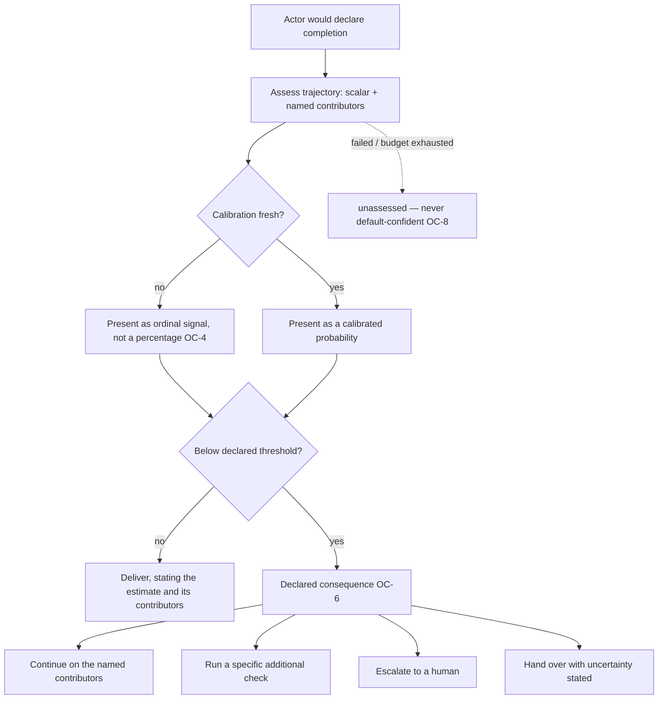

# Outcome Confidence

**Version:** 1.0.0
**Status:** Stable
**Layer:** concept

## Overview

A **calibrated, decomposed estimate of the probability that delivered work actually satisfies what was asked** — computed at the moment an actor would declare completion, from the *whole trajectory* rather than from the final artifact.

It exists to answer a question no check can answer: *what did we not think to check?* Verification proves the claims that were made; outcome confidence estimates the claims that were never made — the test that was never written, the requirement that was silently narrowed, the follow-up the requester will inevitably have to send.

Three consumers, one estimate: it decides **whether to keep working**, **whether to involve a human**, and **what uncertainty to state to the requester**. It never decides *whether the work is done* — that remains the exclusive job of evidence.

## Related Specifications

- [l1-completion-verification.md](l1-completion-verification.md) - Evidence-backed completion claims. Verification decides *done*; confidence decides *how hard to look* (OC-5).
- [l1-iterative-refinement.md](l1-iterative-refinement.md) - Grader-gated revise loops; this layer supplies the first-pass quality signal that justifies entering one (IR-8/IR-9) and names what to revise.
- [l1-claim-verification.md](l1-claim-verification.md) - Grounding of individual assertions; confidence is about the outcome as a whole, not one claim.
- [l1-competitive-execution.md](l1-competitive-execution.md) - Best-of-N selection; comparable estimates are one admissible selector (OC-10).
- [l1-agent-coevaluation.md](l1-agent-coevaluation.md) - Offline, benchmark-scale measurement of agent quality; this is the online, per-outcome signal, and the two must not be confused.
- [l1-human-intervention.md](l1-human-intervention.md) - Where a low estimate escalates to (OC-6).
- [l1-loop-governance.md](l1-loop-governance.md) - Oracle ownership (LG-4) and criteria immutability, which OC-7 independence composes with.
- [l1-quality-standards.md](l1-quality-standards.md) - The mandated checks a confidence estimate may never waive.
- [../../nodus/specifications/l1-nodus-observability.md](../../nodus/specifications/l1-nodus-observability.md) - The recorded trajectory an assessment reads, and the sequence/correlation that makes the assessed span nameable (HO-7).

## 1. Motivation

The most expensive failure mode of an autonomous system is not the visible error. It is **silent incompleteness**: work that ran cleanly, passed every check it chose to run, reported success, and did not do what was asked. The checks were honest; they simply did not cover the part that mattered, because nobody — human or agent — thought to cover it.

Evidence-based verification cannot close this gap by construction. It proves the claims that were made. Silent incompleteness is precisely the region where *no claim was made*, so there is nothing for a check to falsify. Adding more mandated checks helps at the margin and then stops helping, because the failure is a failure of imagination, not of rigour.

What does carry signal is the **shape of the trajectory**. A run that edited three files and never executed anything, a run that attempted the same fix five times with cosmetic variations, a run whose scope quietly shrank between the request and the summary, a run that hit a broken dependency and worked around it without saying so — each is legible in the process even when the artifact looks fine. A cheap assessor reading the trajectory can estimate the probability that this outcome will hold up, and — more usefully — say *which* of those shapes it saw.

Three design commitments make the difference between a useful signal and an ornament.

**A number alone is unactionable.** "68% confident" tells an operator nothing they can do. "68%, and the two contributors are *no test was executed* and *the requester will likely have to ask about error handling*" tells them exactly where to look. The decomposition is the product; the scalar is a summary of it.

**An uncalibrated percentage is worse than no percentage.** A number presented as a probability borrows the authority of measurement. If it has never been checked against what actually happened, it is a confident-sounding guess wearing a lab coat, and it will be trusted more than it deserves. Either measure it or do not dress it as a measurement.

**A signal that only decorates is worse than absent.** If a low estimate produces a slightly hedged sentence and the work ships anyway, the estimate has taught the system nothing and has taught the user to ignore it. A low estimate must *change what happens next*.

## 2. Constraints & Assumptions

- Assessment is **on-device and local-first**: the trajectory it reads is sensitive operational and user data, and no part of it egresses to produce an estimate.
- The assessor is cheap relative to the work it assesses; it is a fast read over a recorded trajectory, never a re-execution of the task.
- The estimate is **advisory to the system and honest to the user**. It has no authority to mark work done and no authority to override a mandated check.
- The contributor vocabulary is a **closed, declared set** — extensible by deliberate amendment, never invented per-run, so estimates stay comparable over time.
- A "trajectory" is the recorded sequence of what was requested, what was done, what was observed, and what was checked, as the observability plane already records it. This spec mandates no new instrumentation.

## 3. Core Invariants

Rules every Layer 2 implementation MUST NOT violate:

- **OC-1 (The object of judgement is the outcome, read from the whole trajectory):** the estimate answers *"will the requester have to come back?"* over the entire span — what was asked, what was done, what was observed, what was checked, and what was left untouched. An estimate computed from the final artifact alone violates this invariant: the evidence of incompleteness overwhelmingly lives in the process, not in the deliverable. Grading one deliverable against a rubric is a different and complementary act, owned by the refinement layer.
- **OC-2 (Decomposed into named contributors — never a bare scalar):** every estimate is accompanied by **named, individually-scored contributing observations** drawn from a closed, declared vocabulary. A bare number MUST NOT be the layer's only output, and MUST NOT be the only thing a surface shows. The contributors are what make the estimate actionable; the scalar is their summary, not their replacement.
- **OC-3 (Anticipated follow-up is a first-class contributor family):** among the contributors the layer explicitly estimates **the specific ways the requester is most likely to have to follow up**. This is the layer's sharpest instrument against silent incompleteness, because it is the only question that reaches past the checks that were run to the ones that were never conceived. It MUST NOT be collapsed into a generic "quality" contributor.
- **OC-4 (Calibration is an obligation; an uncalibrated number is never dressed as a probability):** a value presented as a probability MUST be measured against **realized outcomes** over time, and its calibration MUST be reportable. Where calibration is unknown, stale, or has drifted past a declared bound, the value is presented as an **uncalibrated ordinal signal or withheld entirely** — never as a percentage. Presenting an unmeasured number as a probability is forbidden: it borrows the authority of measurement without having done any.
- **OC-5 (Confidence never substitutes for evidence):** a high estimate MUST NOT satisfy, replace, weaken, waive, or shorten any required verification, review, or gate. Verification answers *is it done*; confidence answers *how hard to look and whom to involve*. Any design in which a sufficiently high score permits a mandated check to be skipped violates this invariant, and does so in the most dangerous possible direction — it removes proof exactly where the system feels safest.
- **OC-6 (A low estimate changes behaviour, not just wording):** an estimate below a declared threshold MUST have a **declared consequence** from a fixed set: continue working on the *named contributors*, run a specific additional check, escalate to a human, or hand over with the uncertainty explicitly stated as part of the deliverable. A confidence signal whose only effect is a hedged sentence is decoration and is forbidden. The consequence is itself **bounded**: it may fire a declared, finite number of times for one outcome, after which the outcome is handed over with its uncertainty stated. A low estimate MUST NOT be able to re-trigger work indefinitely — the budget ceilings that bound a refinement loop and an execution loop are independent of any score and are never extended by one.
- **OC-7 (Independent of the producer; never self-declared):** the estimate is produced by an assessor that does **not** share the producing actor's reasoning state and cannot be steered by it. The producer MUST NOT be able to author, edit, raise, or suppress its own confidence. A self-reported confidence is a *claim* and is treated as one — it may be recorded, but it is never the estimate.
- **OC-8 (Bounded, degradable, and never default-confident):** assessment is bounded in cost and time and MUST NOT gate delivery indefinitely. On failure, timeout, or budget exhaustion the outcome is **unassessed** — an explicit, visible state that is neither a high nor a low number and never reads as confidence. Defaulting an unassessed outcome to "probably fine" is forbidden.
- **OC-9 (Reproducible and attributable):** every estimate records the **exact evidence span** it was computed from, the assessor's identity and version, and every contributor's score. Two runs of the same assessor version over the same recorded evidence produce the same estimate. An estimate whose basis cannot be reconstructed MUST NOT be used to justify stopping work.
- **OC-10 (Comparable across candidates; never a reputation score):** where several candidate trajectories address the same request, their estimates are comparable and MAY be used to select among them. Estimates MUST NOT be aggregated into a standing score of a *worker*, a role, a specialty, or a person. The unit of judgement is one outcome; turning it into a reputation metric both corrupts the metric (it becomes a target) and corrupts the work (it rewards looking confident over being correct).

> L2 specs cannot reach RFC status until all invariants here are addressed in their "Invariant Compliance" section.

## 4. Detailed Design

### 4.1 Where the assessment sits



The gate sits at the **delivery boundary**, not inside the work. It is the last question asked before the outcome leaves the actor, which is exactly where the cost of being wrong is highest and the cost of looking again is lowest.

### 4.2 Contributor families (OC-2/OC-3)

| Family | What it captures | Examples of named contributors |
| --- | --- | --- |
| **Process** | Shapes in how the work was done that predict it will not hold | completion declared without executing anything; repeated near-identical attempts; scope narrowed between request and summary; a required step attempted once and abandoned |
| **Environment** | Conditions outside the work that degraded it | a tool that failed repeatedly and was worked around silently; a dependency never available; an operation that timed out and was not retried |
| **Anticipated follow-up** | The specific ways the requester is likely to have to come back | the error path was never addressed; the change was not exercised against real input; a stated requirement has no corresponding change; the result was described but not demonstrated |

Each contributor carries its own score, so a single strong contributor is visible even when the aggregate looks acceptable — an outcome at 0.7 with *"no test was executed" at 0.9* is a different situation from an outcome at 0.7 with four weak contributors, and the two MUST NOT be presented identically.

### 4.3 Calibration (OC-4)

```text
[REFERENCE]
// Group past estimates by stated-probability bucket; compare to what actually happened.
for each bucket b in [0.0–0.1), [0.1–0.2), … [0.9–1.0]:
    stated_b   := mean stated probability of estimates in b
    realized_b := fraction of those outcomes that actually held up
                  (no corrective follow-up, no reopened work, within the observation window)
    error_b    := |stated_b − realized_b|

calibration_error := weighted mean of error_b
freshness         := age and volume of the realized-outcome sample

present_as :=
    calibrated probability   if calibration_error ≤ bound AND freshness within bound
    ordinal signal           if measured but degraded, or sample too small
    withheld                 if never measured
```

The realized-outcome signal is the one the layer already has for free: **did the requester have to come back?** Reopened work, a corrective follow-up, or a repeat request within the observation window is the negative label; silence is the positive one. It is imperfect — a satisfied requester and an absent one look alike — and that imperfection is itself reported alongside the calibration, rather than being quietly ignored.

### 4.4 Two different questions

| | Verification | Outcome confidence |
| --- | --- | --- |
| Question | "Is this claim true?" | "Will this outcome hold up?" |
| Answer type | Evidence, binary per claim | Probability + named contributors |
| Authority | **Decides done** | Advises; decides *how hard to look* |
| Scope | The claims that were made | Including the claims that were never made |
| Failure it catches | A false claim | Silent incompleteness |
| May the other be skipped because of it? | — | **Never** (OC-5) |

The two are complements, and the invariant that keeps them complementary is OC-5. The moment a confidence score is allowed to shorten a check, the system has traded a proof for a feeling.

### 4.5 Boundary with neighbouring layers

| Concern | Owner |
| --- | --- |
| Proving a completion claim with fresh evidence | Completion verification |
| Grading one artifact against a fixed rubric and revising it | Iterative refinement (this layer supplies its entry signal and its targets) |
| Grounding an individual assertion in a source | Claim verification |
| Choosing among several candidate outcomes | Competitive execution (this layer supplies one admissible selector) |
| Measuring agent quality across a benchmark suite, offline | Agent co-evaluation — a different timescale and a different unit; never conflate a per-outcome estimate with a benchmark result |
| Deciding when a loop must stop | Loop governance (hard ceilings are independent of any estimate) |

## 5. Drawbacks & Alternatives

- **An assessor is another model call at the most latency-sensitive moment.** Bounded by OC-8 and degradable to *unassessed*; the estimate is a fast read over an already-recorded trajectory, not a re-run of the task.
- **The realized-outcome label is noisy** — an absent requester looks like a satisfied one. Accepted and disclosed: §4.3 reports the sample's limitations alongside the calibration, rather than presenting a clean-looking number over a dirty label.
- **Contributors can become a checklist to game.** Mitigated by OC-7 (the producer cannot see or steer its own assessment) and OC-10 (estimates never become a standing score, so there is no reputation to optimize).
- **Alternative — let the agent state its own confidence.** Rejected by OC-7: a self-declared confidence measures how a producer *sounds*, and producers that are wrong most often sound most certain.
- **Alternative — a scalar only.** Rejected by OC-2: unactionable, and it cannot distinguish one severe problem from several trivial ones.
- **Alternative — skip calibration and show the raw score.** Rejected by OC-4: an unmeasured percentage is trusted like a measured one, which makes it actively worse than an honest ordinal.
- **Alternative — let a high score waive a check.** Rejected by OC-5, and it is the most tempting alternative precisely because it pays off almost every time — until the one time it does not, in the case where everything looked fine.
- **Alternative — fold into completion verification.** Rejected: that layer's power comes from being evidential and binary. Mixing a probabilistic signal into it would weaken the proof without strengthening the estimate.

## Canonical References

| Alias | Path | Purpose |
| --- | --- | --- |
| `[VERIFY]` | `.design/main/specifications/l1-completion-verification.md` | The evidential authority OC-5 must never displace. |
| `[REFINE]` | `.design/main/specifications/l1-iterative-refinement.md` | Consumer of the estimate as an entry signal and as revision targets. |
| `[COEVAL]` | `.design/main/specifications/l1-agent-coevaluation.md` | Offline benchmark measurement — the thing this layer must not be confused with. |
| `[OBSERVABILITY]` | `.design/nodus/specifications/l1-nodus-observability.md` | The recorded trajectory an assessment reads and cites (OC-9). |

## Document History

| Version | Date | Author | Notes |
| --- | --- | --- | --- |
| 1.0.0 | 2026-07-23 | Core Team | Initial spec — calibrated, decomposed outcome confidence at the delivery boundary as the instrument against *silent incompleteness*: the object of judgement is the outcome read from the whole trajectory, not the final artifact (OC-1); decomposed into named contributors from a closed vocabulary, never a bare scalar (OC-2); anticipated-follow-up as a first-class contributor family — the only question that reaches past the checks that were run (OC-3); calibration as an obligation with an uncalibrated value presented as an ordinal or withheld, never as a percentage (OC-4); confidence never substitutes for, weakens, or waives evidence (OC-5); a low estimate carries a declared behavioural consequence rather than a hedged sentence (OC-6); producer-independent and never self-declared (OC-7); bounded, degradable, and never default-confident — *unassessed* is a visible state (OC-8); reproducible and attributable to an exact evidence span (OC-9); comparable across candidate outcomes but never aggregated into a reputation score (OC-10). Concept-only. |
