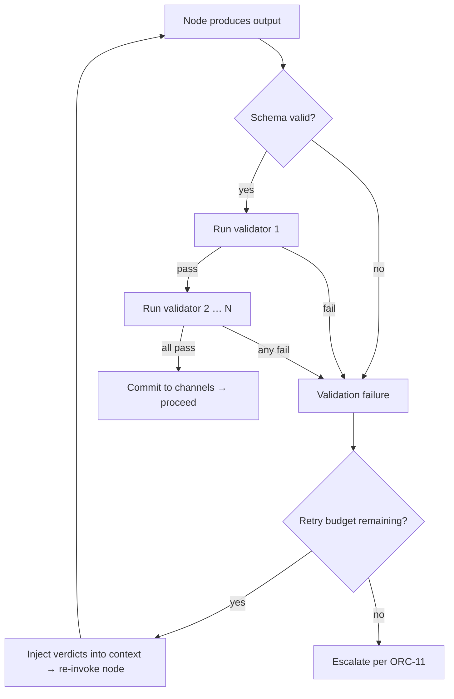

# Output Contracts

**Version:** 1.0.0
**Status:** Stable
**Layer:** concept

## Overview

The model by which a task or node declares a **contract** for its expected output — a typed schema combined with one or more inline **validators** — and by which the executor enforces that contract automatically, retrying the producing node if validation fails. Output contracts sit between the node that produces a result and the node (or channel) that consumes it; they fire during execution, not as a post-task quality gate. This allows structural and semantic constraints to be declared once, close to the work unit, and enforced consistently without burdening downstream nodes.

This spec governs inline output validation only. Post-task toolchain quality gates (linters, test suites, type-checkers) are defined in the quality standards spec. Human-reviewed approval gates are defined in the orchestration spec.

## Related Specifications

- [l1-quality-standards.md](l1-quality-standards.md) — Post-task quality gates (toolchain checks, definition of done). Output contracts are an upstream, inline complement.
- [l1-orchestration.md](l1-orchestration.md) — ORC-11 (error containment): validation failures from output contracts are classified as retryable failures at the delegation boundary.
- [l1-execution-graph.md](l1-execution-graph.md) — Validation fires at the node's output phase; on failure, the node is re-entered within the same graph run.
- [l1-kanban-model.md](l1-kanban-model.md) — A card with an output contract: the contract is recorded on the card and its status updated when validation passes.
- [l2-quality-pipeline.md](l2-quality-pipeline.md) — Concrete quality toolchain; output contracts complement it with schema and semantic checks that run before toolchain gates.

## 1. Motivation

Tasks produce outputs consumed by other tasks. Without a declared contract, the consuming side discovers malformed output at use time — often after significant work has already built on the broken result. Two failure modes are common: (a) structural: the output is missing required fields or has wrong types; (b) semantic: the output is structurally valid but violates a declared invariant (e.g., "summary must be under 500 words", "plan must contain at least one action item").

Post-task gates (linters, tests) catch these failures late, after the artifact is committed. Inline validation catches them immediately, while the producing node is still in context and can retry with the validation feedback. This is analogous to a type error caught at compile time versus a panic at runtime.

## 2. Constraints & Assumptions

- A contract is declared on the producing node/task, not on the consuming channel.
- Contract validation occurs after the node's output is staged, before it is committed to channels and before the next node begins.
- A validation failure does not immediately abort the graph run; it triggers a retry of the producing node within the declared retry budget.
- After the retry budget is exhausted, the failure escalates as a retryable-or-fatal error to the delegation boundary (per ORC-11).
- Validators are side-effect-free: they observe the output and return a verdict; they do not modify channels or external state.
- Contracts are declarative: they are part of the node/task definition, not executable code embedded in the output itself.

## 3. Core Invariants

Rules every Layer 2 implementation MUST NOT violate:

- **OC-1 (Schema contract):** a node may declare a typed output schema. The executor MUST validate that the node's output conforms to the schema before committing it to channels. Schema mismatch is a validation failure and triggers a retry.
- **OC-2 (Callable validator):** a node may declare one or more callable validators. Each callable receives the output and returns a verdict: `(valid: bool, reason: string | None)`. `valid=false` is a validation failure; `reason` is injected into the node's retry context so the producing agent can correct the specific issue.
- **OC-3 (Criteria validator):** a node may declare one or more criteria expressed in natural language. A criteria validator is evaluated against the output using the system's reasoning capability (not a hard-coded rule). `valid=false` with a generated reason triggers a retry identical to a callable validator failure.
- **OC-4 (Retry budget):** each node declares a maximum number of validation retries. On each retry, the executor re-invokes the node with the original input plus all accumulated validation verdicts as additional context. The retry budget is consumed independently of the step budget (EG-8); budget exhaustion escalates the failure.
- **OC-5 (Verdict injection):** on retry, the executor MUST supply the accumulated validation verdicts to the node's context. Verdicts include: which validator failed, the reason string, and the attempt number. This ensures the node can progressively correct its output rather than repeating the same mistake.
- **OC-6 (Escalation on budget exhaustion):** when the retry budget is exhausted without a passing verdict, the failure is classified per ORC-11: retryable (if the cause is transient), fatal-isolated (if the node repeatedly produces invalid output), or escalation (if the criteria cannot be mechanically verified). The executor MUST NOT silently commit a contract-failing output.
- **OC-7 (Non-blocking absence):** if a node declares no output contract, the executor proceeds without validation. Contracts are always opt-in; their absence never blocks execution.

## 4. Detailed Design

### 4.1 Contract Declaration

```plaintext
[REFERENCE]

OutputContract:
  schema      : TypeSchema | None        -- structural shape (OC-1)
  validators  : [Validator]              -- ordered list (OC-2 / OC-3)
  max_retries : int                      -- default 3; 0 disables retry (OC-4)

Validator =
  | CallableValidator { fn: (output) → (bool, string | None) }
  | CriteriaValidator { criteria: string }   -- natural-language criterion
```

Multiple validators are evaluated in declared order. The executor stops at the first failure and triggers a retry; it does not aggregate all failures before retrying (fail-fast per retry attempt).

### 4.2 Validation Lifecycle



### 4.3 Verdict Injection Format

On each retry, the executor prepends accumulated verdicts to the node's context:

```plaintext
[REFERENCE]
ValidationContext:
  attempt       : int             -- current attempt number (1-based)
  verdicts      : [Verdict]       -- one per failed validator, all attempts
  Verdict:
    attempt     : int
    validator   : string          -- name or index of the validator that failed
    reason      : string | None   -- human-readable failure explanation
```

Implementations MUST pass `ValidationContext` to the node so the node's reasoning is informed by exactly what was wrong with previous attempts.

### 4.4 Validator Types Compared

| Type | Evaluation | Strengths | Limitations |
| --- | --- | --- | --- |
| `Schema` | Static type check | Deterministic, zero LLM cost | Structural only; cannot catch semantic errors |
| `Callable` | Deterministic function | Fast, cheap, precise | Requires the constraint to be mechanically expressible |
| `Criteria` | Reasoning evaluation | Handles semantic, nuanced, natural-language constraints | Non-deterministic; higher cost; retry if verdict unclear |

### 4.5 Failure Escalation

When the retry budget is exhausted, the executor classifies the failure (OC-6) and surfaces it to the delegation boundary. The canonical ORC-11 classification applies:

- **Retryable**: validator raised an infrastructure error (e.g., LLM timeout during criteria evaluation) — the delegation boundary may schedule a fresh attempt.
- **Fatal-isolated**: the node consistently produces invalid output — the card moves to Blocked; other delegations continue.
- **Escalation**: the criteria are ambiguous or contradictory and cannot be mechanically resolved — the human-in-the-loop gate fires.

### 4.6 Interaction with Quality Gates

Output contracts and post-task quality gates are complementary, not redundant:

| Dimension | Output Contract | Quality Gate |
| --- | --- | --- |
| **Timing** | During execution (inline) | After task completion |
| **Subject** | The node's immediate output | The accumulated codebase / artifact |
| **Retry scope** | Re-invoke the producing node | Block card from advancing |
| **Focus** | Schema + semantic correctness of one result | Cross-cutting concerns (tests, lint, security) |
| **Cost** | Paid per failing attempt | Paid once per completion |

A task should use an output contract when its correctness can be evaluated from the output alone, without running a test suite or inspecting other files.

## 5. Implementation Notes

1. Evaluate schema first (cheapest check) before callable validators, and callable validators before criteria validators (most expensive).
2. Criteria validators that call an LLM should have their own timeout and a fail-open policy if the evaluator is unavailable — default to `valid=true` with a warning rather than blocking execution.
3. Store retry history with each graph run checkpoint (EG-6) so that on resumption after a crash the retry count is not reset.
4. The `reason` string from a failing callable validator is the primary correction signal; implementations should ensure it is concise and actionable (max ~200 characters).

## 6. Drawbacks & Alternatives

- **Alternative — post-task gate only:** simpler, no retry complexity. Rejected because the cost of re-running an agent from scratch after a gate failure is much higher than an inline retry with targeted feedback; and because post-task gates examine the whole artifact, not just one task's output.
- **Alternative — explicit correction step:** instead of retry-with-feedback, a dedicated "corrector" node refines the output. Valid design but requires an extra node per contract; inline retry is lower overhead for common structural/semantic mismatches.
- **Criteria validator cost:** LLM-evaluated criteria add latency and cost per retry. Implementations should cache criteria verdicts keyed by output hash across runs to avoid redundant evaluation.

## Canonical References

| Alias | Path | Purpose |
| --- | --- | --- |
| `[QS]` | `.design/main/specifications/l1-quality-standards.md` | Post-task quality gates — the downstream complement to output contracts |
| `[ORC]` | `.design/main/specifications/l1-orchestration.md` | ORC-11: how validation failures escalate at delegation boundaries |
| `[EG]` | `.design/main/specifications/l1-execution-graph.md` | Execution graph: where validation fires in the node output phase |

## Document History

| Version | Date | Summary |
| --- | --- | --- |
| 1.0.0 | 2026-06-24 | Initial stable spec — schema + callable + criteria validators, retry budget, verdict injection, escalation model, interaction with quality gates |
