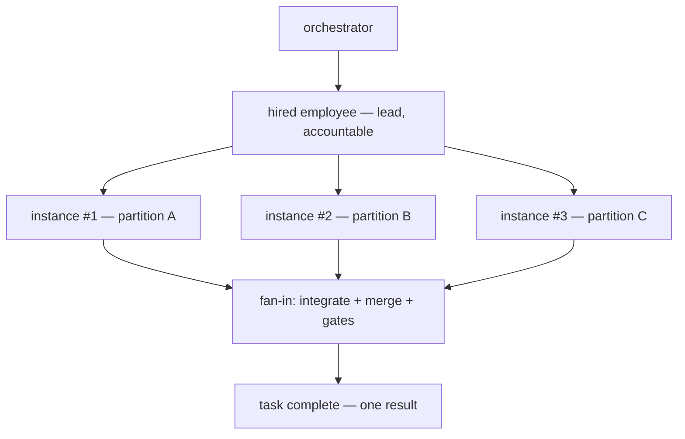

# Parallel Staffing

**Version:** 1.0.0
**Status:** Stable
**Layer:** concept

## Overview

Parallel staffing is the **same-specialty scale-out** contract: when a single task is large enough, the office may put **several workers of the same specialty** on it in parallel — subagent instances of one role splitting the task's decomposed partitions — instead of one specialist grinding through it serially. The hired employee for that specialty remains the single accountable **lead**; the extra capacity comes from **ephemeral instances** of the same role definition that exist for the task's duration, each exclusively owning a disjoint sub-unit, and dissolve when their partition completes.

The contract is deliberately narrow about *how* parallelism is allowed to happen: never two workers on one work unit (WL-1), only decomposition into disjoint sub-units (the task-graph algebra) fanned out exactly once (WL-9); width bounded by budget and policy; sibling contexts isolated with coordination through the observable medium (ORC-5/ORC-12); outputs integrated through the concurrent-change-merge discipline (CM) and gated as one whole; learning consolidated back into the one hired employee's memory scope so scale-out never fragments knowledge.

This is the horizontal complement to the existing coordination stack: adaptive topology (ORC-2) grows the hierarchy *vertically* (managers, departments); deliberation fans out *perspectives* on one question; parallel staffing widens *throughput* on one task with more hands of the same trade.

## Related Specifications

- [l1-orchestration.md](l1-orchestration.md) - Delegation, context isolation (ORC-5), budget circuit-breaker (ORC-7), synchronization without duplication (ORC-8), error containment (ORC-11), transparent coordination (ORC-12); the scaling decision is a delegation decision.
- [l1-office-model.md](l1-office-model.md) - Adaptive staffing (OFF-4) and manager-driven operation (OFF-5); scale-out is the task-scoped, ephemeral form of adapting capacity to need.
- [l1-roles.md](l1-roles.md) - Roles as specialties, working agents as role instances (ROL-1), hire = instantiate (ROL-3), anti-sprawl (ROL-9); parallel instances share one role definition and one hired employee identity.
- [l1-task-graph-model.md](l1-task-graph-model.md) - The decomposition algebra that produces the disjoint sub-units parallel workers claim; complexity scoring informs the scale-out decision.
- [l1-work-liveness.md](l1-work-liveness.md) - Exclusive atomic claim (WL-1), single active run (WL-4), stranded-work reconciliation (WL-5), exact-once fan-out (WL-9); the unit-level mechanics parallel staffing rides on.
- [l1-change-merge.md](l1-change-merge.md) - Reviewable typed-delta merge for shared artifacts; the fan-in discipline when partitions touch the same document.
- [l1-deliberation.md](l1-deliberation.md) - The sibling fan-out: multiple perspectives on the *same* question synthesized into one answer; demarcated from volume partitioning in §4.5.
- [l1-quality-standards.md](l1-quality-standards.md) - The integrated whole — not each partition — is what passes the definition-of-done gates.
- [l2-agent-session.md](l2-agent-session.md) - Concrete subagent spawn semantics and independent per-instance iteration budgets the width policy composes with.

## 1. Motivation

An office with one backend engineer processes a fifty-endpoint migration one endpoint at a time, even though forty of them are independent. Nothing in the existing stack forbids parallelism — the task graph can decompose the work, work liveness can hand out exclusive claims, subagents exist at the session layer — but nothing *owns* it either: there is no contract saying when one task justifies several same-specialty workers, what those extra workers *are* (new hires? clones? anonymous threads?), how wide the office may scale, who integrates the pieces, and where the learning lands afterward.

Left unowned, each implementation would improvise — hiring permanent duplicate employees (staff bloat), letting two workers race one card (double work WL-1 exists to prevent), or fanning out with no width bound until the budget circuit-breaker trips mid-task. Naming the contract once keeps scale-out safe, bounded, and observable: **volume, not habit, justifies width; decomposition, not co-ownership, provides it; the employee, not the ephemeral instances, keeps the knowledge.**

## 2. Constraints & Assumptions

- **Parallelism has overhead.** Every extra instance costs coordination, integration, and money; the decision model assumes diminishing returns and a serial residue (the non-decomposable part of any task stays serial).
- **Sub-units must be genuinely disjoint.** Scale-out quality is bounded by decomposition quality; heavily entangled partitions degrade into merge conflicts and rework.
- **Instances are cheap, hires are not.** Spawning an ephemeral same-role instance is a lightweight runtime act; hiring is an organizational act with memory, hierarchy, and lifecycle weight (ROL-3/ROL-4). Scale-out uses the former.
- **The client sees a team, not threads.** Scale-out is part of the office metaphor: extra workers of a specialty are visible, named, and attributable while they exist (ORC-12), not invisible concurrency.

## 3. Core Invariants

Rules every Layer 2 implementation MUST NOT violate. They are technology-neutral.

- **PS-1 (Volume-justified, recorded scale-out):** one worker per task is the default. Assigning parallel same-specialty workers is an explicit scaling decision made by the coordinating side (orchestrator or lead), justified by task volume signals — decomposition width, estimated size, deadline pressure — and recorded with its rationale. Scale-out is never an unconditional default and never silent.

- **PS-2 (Parallelism only through decomposition):** parallel workers NEVER co-own a work unit. Scale-out is realized exclusively by decomposing the task into **disjoint sub-units** (per the task-graph decomposition algebra), each claimed atomically and exclusively (WL-1) and dispatched exactly once (WL-9). A task (or task part) that does not decompose does not scale out — the serial residue runs serially, and the contract never promises speed-up it cannot deliver.

- **PS-3 (Ephemeral instances under one accountable lead):** scale-out spawns **ephemeral worker instances from the same role definition** as the responsible hired employee, who remains the single accountable lead for the whole task. Instances live for their partition's duration and dissolve at completion. Scale-out MUST NOT hire permanent staff as a side effect (staffing stays manager-owned, ROL-5; the workforce does not bloat, ROL-9) and MUST NOT reassign the task's accountability away from the lead.

- **PS-4 (Bounded width):** parallel width is bounded by explicit policy: configured maximum width, budget headroom (each instance carries its own bounded budget, and the aggregate fits the task/run budget per ORC-7), and a coordination-cost guard (width that decomposition or integration cannot sustain is not granted). When the bound is lower than the partition count, remaining partitions queue — never an unbounded spawn. Width decisions are made only at the lead/orchestrator level: an ephemeral instance MUST NOT itself initiate further scale-out — nested width would silently defeat the bound.

- **PS-5 (Isolated siblings, mediated coordination):** each parallel instance runs in an isolated context (ORC-5); siblings share no mutable working state and do not coordinate over hidden back-channels — cross-instance coordination flows through the lead/orchestrator over the observable medium (ORC-12, ORC-8). Where partitions touch a shared artifact, changes integrate through the concurrent-change-merge discipline, never blind co-editing.

- **PS-6 (Integration is first-class):** the fan-in is a distinct, owned step: the lead (or orchestrator) integrates partition outputs into one coherent result, resolving merges reviewably (CM), and the task completes only when the **integrated whole** passes its quality gates — never merely because the last partition finished.

- **PS-7 (Learning consolidates to the employee):** durable learning produced by ephemeral instances lands in the **one hired employee's** memory scope (the employee level of the storage model), attributed per instance in the record. Ephemeral instances own no durable memory scope of their own; scale-out MUST NOT fragment a specialty's knowledge across throwaway identities.

- **PS-8 (Failure containment and honest salvage):** a failed or stalled instance is contained at its delegation boundary (ORC-11): its partition re-enters the pool through the explicit stranded-work path (reap, then reassign — consistent with WL-5, never a silent second execution), other partitions continue undisturbed, and partial output from the failed instance is salvaged only through the merge discipline — never silently absorbed.

- **PS-9 (Observable, attributed width):** the scaling decision, each live instance, its partition, and its per-instance cost are observable in the office's live projection and event record (ORC-12) and attributed in the work's history — the client can always see that N workers exist, why, and what each contributed.

> L2 specs cannot reach RFC status until all invariants here are addressed in their "Invariant Compliance" section.

## 4. Detailed Design

### 4.1 The scale-out decision

```text
[REFERENCE]
consider_scale_out(task):
    partitions := decompose(task)                    // task-graph algebra; PS-2
    if count(independent(partitions)) < 2:  return serial   // no width without disjoint units
    width := min(count(independent(partitions)),
                 policy.max_width,                    // PS-4 config
                 budget_headroom / per_instance_budget,
                 coordination_guard(partitions))      // integration cost vs gain
    if width < 2:  return serial
    record_decision(task, width, rationale)           // PS-1 — surfaced, ORC-12
    return fan_out(task, width)
```

The decision inputs are the same signals the office already computes: complexity/decomposition from the task graph, budget headroom from the run budget, deadline pressure from the schedule. The output is a recorded decision, not an invisible runtime mood.

### 4.2 Fan-out anatomy



The lead is the hired employee (ROL-3 instance with memory and hierarchy placement). Instances are spawned from the same role definition — same persona, capabilities, and configuration — differing only in identity suffix and partition assignment. They appear in the office projection as distinct, temporary workers at the lead's desk-group (PS-9).

### 4.3 Partition lifecycle

Each partition is an ordinary work unit under the existing contracts: exclusively claimed by its instance (WL-1), single active run (WL-4), liveness-tracked (WL-3), fanned out exactly once per approved decomposition revision (WL-9). Instance death without a terminal state is stranded work: the reconciliation sweep reaps it and the lead reassigns the partition — to a fresh instance or into the serial queue (PS-8).

### 4.4 Fan-in and completion

The lead integrates: disjoint-file outputs assemble directly; shared-artifact changes go through typed-delta merge with conflicts surfaced reviewably (CM); the assembled whole then passes the task's quality gates. Only the integrated, gated result flows upward (ORC-5 — partition detail stays out of the orchestrator's context; a summary plus the attributed record remains reachable per ORC-12).

### 4.5 Demarcation within the coordination family

| Concept | Fans out | Over | Purpose |
| --- | --- | --- | --- |
| **This spec — parallel staffing** | Same-role instances | Disjoint partitions of one task | Throughput on volume |
| l1-deliberation | Perspectives/agents | The *same* question | Answer quality via diversity |
| ORC-2 adaptive topology | Managers/departments | The org hierarchy | Coordination span at scale |
| ROL hire (OFF-4/ROL-5) | Permanent employees | The office's standing needs | Durable capability |
| l1-task-graph-model | Sub-units | A requirement/plan | Decomposition algebra (produces the partitions) |
| l1-work-liveness | Claims/runs | Individual work units | Ownership + liveness mechanics |

None substitutes for another: parallel staffing *consumes* the task graph's partitions, *rides on* work-liveness claims, *merges via* change-merge, and reports through the same observability the office already has.

## 5. Implementation Notes

1. **Width policy first** — configuration surface (max width, per-instance budget share, coordination guard) with sensible defaults; the decision record shape.
2. **Instance spawn path** — reuse the existing subagent spawn semantics and independent per-instance budgets at the session layer; add same-role identity attribution.
3. **Partition claim wiring** — nothing new: task-graph decomposition + existing exclusive claims; verify exact-once dispatch under the approved decomposition revision.
4. **Fan-in step** — lead-owned integration with merge discipline and gate invocation.
5. **Projection & record** — instances visible in office visualization; per-instance cost attribution in the dashboard/budget records; memory consolidation into the employee scope on dissolve.

## 6. Drawbacks & Alternatives

- **Coordination overhead can eat the gain:** integration and merge cost grows with width and entanglement. Mitigated by PS-4's coordination guard and PS-2's serial-residue honesty; width defaults are conservative. <!-- TBD: default max width and the coordination-guard heuristic (e.g. width ≤ ceil(independent_partitions / 2), cap 4) — tune with field data -->
- **Alternative — hire N permanent same-role employees:** rejected as the scale-out mechanism; it bloats standing staff for a transient need, fragments memory across hires, and staffing remains a manager-level organizational act (ROL-5/ROL-9). A manager MAY still hire a second permanent specialist when *standing* demand justifies it — that is OFF-4 staffing, not task-scoped scale-out.
- **Alternative — one worker with a bigger budget:** serial execution avoids merge cost but leaves wall-clock time linear in volume and forfeits the independence the task graph already proved; for genuinely large decomposable tasks the client-visible latency difference is the point of this contract.
- **Alternative — anonymous concurrency (threads, no worker identity):** rejected; it breaks the office metaphor, the attribution record (PS-9), and the human's ability to observe and steer (ORC-12).
- **Memory contention on the employee scope:** N instances consolidating into one scope can conflict; mitigated by attributed, append-style consolidation at dissolve time (PS-7) and the merge discipline for anything richer.

## Document History

| Version | Date | Change |
| --- | --- | --- |
| 1.0.0 | 2026-07-02 | Initial concept: volume-justified same-specialty scale-out — ephemeral same-role instances under one accountable hired lead, parallelism only via disjoint decomposition (WL-1/WL-9), bounded width (budget + coordination guard), isolated siblings with mediated observable coordination, first-class fan-in with merge + gates, learning consolidated to the employee scope, contained failure with honest salvage, fully attributed (PS-1…PS-9). |

## Canonical References

| Alias | Path | Purpose |
| --- | --- | --- |
| `[ORCH]` | `.design/main/specifications/l1-orchestration.md` | Delegation, isolation, budget, containment, transparency contracts scale-out composes |
| `[TASKGRAPH]` | `.design/main/specifications/l1-task-graph-model.md` | Decomposition algebra producing the disjoint partitions |
| `[LIVENESS]` | `.design/main/specifications/l1-work-liveness.md` | Exclusive claim / exact-once fan-out / stranded-work mechanics |
| `[MERGE]` | `.design/main/specifications/l1-change-merge.md` | Fan-in merge discipline for shared artifacts |
| `[ROLES]` | `.design/main/specifications/l1-roles.md` | Role definition, hire semantics, anti-sprawl the instance model respects |
