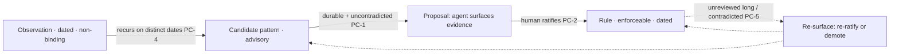

# Pattern Codification

**Version:** 1.0.1
**Status:** Stable
**Layer:** concept

## Overview

An agent that works with someone over time notices patterns: a preference reasserted, a decision repeated, a convention that keeps holding. This spec names the disciplined pathway by which such an observed pattern becomes a **standing, enforceable rule** — and, crucially, the gates that keep that promotion honest. Codification is the memory-to-governance bridge: memory *consolidation* moves raw capture up into durable abstraction but stays inside the memory corpus; **codification promotes a stable abstraction out of memory and into the rule layer that actually governs behavior.**

The load-bearing rule is that promotion is **earned, not automatic**. Repetition alone makes a pattern a *candidate*, never a rule; crossing into an enforceable norm additionally requires **durability** (it holds, uncontradicted, over a meaningful span) and **explicit human ratification**. The agent observes, proposes, and — on the human's "yes" — writes; the human never hand-authors the rule corpus, and the agent never self-promotes a pattern to a binding rule. Rules earned this way are not immortal: each carries its evidence and review provenance, is periodically re-validated, and is demoted when it stops holding. A rule is a standing hypothesis the evidence keeps earning, not a decree.

## Related Specifications

- [l1-memory-consolidation.md](l1-memory-consolidation.md) — MC-4 corroborate/refine detects a recurring abstraction; the consolidated pattern is codification's **input**. Consolidation abstracts *within* memory; codification promotes *out of* memory into governance.
- [l1-security.md](l1-security.md) — SEC-9 (an explicit human "always-allow" becomes a durable allow-rule) is the **permission-specific instance** of this pipeline; codification generalizes it to any behavioral norm. SEC-10 human-rooted authority is why the human ratifies (PC-2/PC-8).
- [l2-agent-constitution.md](l2-agent-constitution.md) — the governance/rule tier a codified rule enters (PC-8); codification *proposes* into it, it *is* the norm.
- [l1-extensions.md](l1-extensions.md) — EXT-7 (distilling repeated patterns into skills) is the **sibling target**: patterns → *capabilities* there, patterns → *rules* here.
- [l1-practice-analytics.md](l1-practice-analytics.md) — analyzes how the user works; the recurring pattern it surfaces is a codification candidate (PC-4).
- [l1-user-model.md](l1-user-model.md) — user preferences that stabilize are prime codification inputs (PC-1).
- [l1-operational-ledger.md](l1-operational-ledger.md) — the auditable record the codification pathway writes to (PC-7).
- [l1-facilitation.md](l1-facilitation.md), [l1-inner-monologue.md](l1-inner-monologue.md) — decide *when* to surface a promotion proposal without interrupting (PC-2).
- [../../nodus/specifications/l1-nodus-dialog.md](../../nodus/specifications/l1-nodus-dialog.md) — DG-10 promotable remembered decision is the nodus-workflow realization: a stably-repeated `+remember` decision surfaced as a host-promotable rule candidate.

- [l1-model-adaptation.md](l1-model-adaptation.md) - [ADDED v1.0.1] The **model-plane** sibling: this codifies experience into inspectable *rules* (context plane); that distils verified experience into a reversible weight *adaptation*, under the same earned-and-ratified discipline (PC-1/PC-2) at higher consequence (MA-5).
## 1. Motivation

Without a codification discipline, an agent handles recurring patterns in one of two bad ways. It ignores them — so the human re-states the same preference every week and the agent never internalizes it. Or it over-reacts — it sees a pattern three times and silently hardens it into a rule, then enforces a "rule" the human never agreed to, on evidence too thin to bear it. The first wastes the relationship's accumulated signal; the second manufactures governance the human did not author, which is both wrong (the pattern may be coincidence) and dangerous (the agent has effectively granted itself a new law).

Codification threads between them. It *notices* recurrence (so signal is not wasted), treats recurrence as a **candidate**, and gates the crossing into an enforceable rule behind **durability plus human ratification** (so a rule is never manufactured from thin evidence or without consent). It keeps the human as the sole author of binding norms — the agent proposes, specifically and with evidence, and writes only on approval. And it keeps rules alive rather than fossilized: each is dated, periodically re-validated, and demoted when contradicted. The result is an agent that *learns the user's norms* over time without ever *inventing* them.

## 2. Constraints & Assumptions

- Promotion to a binding rule is a **judgment gate**, never a purely mechanical count — repetition is necessary but not sufficient (PC-1).
- The human is the **sole author of binding norms**; the agent's role is observe-propose-write-on-ratification (PC-2).
- A rule is a **standing hypothesis**: it can be wrong, can go stale, and must be reversible (PC-5).
- Codification composes existing layers — it reuses memory consolidation as its input and the governance/constitution layer as its output; it invents neither a new memory store nor a new rule engine.
- This is a Layer 1 concept: it names no file format, cadence, or diff mechanism. The concrete promotion ritual and rule store are Layer-2 concerns.

## 3. Core Invariants

Rules every Layer 2 realization MUST NOT violate. They are technology-neutral.

- **PC-1 (Earned, not automatic):** promoting an observed pattern to an enforceable rule is **earned through evidence**, not triggered by mere repetition. Recurrence raises a pattern to a **candidate**; crossing into a binding rule additionally requires **durability** — the pattern holds, uncontradicted, over a meaningful span — **and** explicit human ratification (PC-2). "It happened N times" is a candidate signal, never, by itself, a promotion.

- **PC-2 (Propose → ratify → write):** the agent **observes, proposes, and writes**; the human **ratifies**. A binding rule is authored by the agent **on the human's explicit confirmation** — the human never hand-authors the rule corpus, and the agent never self-promotes a candidate to a binding rule without ratification. The proposal is **specific and evidence-backed** (it cites the concrete occurrences), and the write happens only on approval.

- **PC-3 (Tiered bindingness, rising with evidence):** knowledge occupies tiers of increasing bindingness — a transient **observation** (non-binding), a consolidated **advisory pattern** (informs, does not constrain), and a ratified **rule** (enforceable) — and an item rises a tier only as it accrues evidence and ratification (PC-1/PC-2). **Bindingness is never assigned above the evidence that earned it**: a fresh observation is never treated as a rule, and a candidate is never enforced as if ratified.

- **PC-4 (Recurrence is detectable because observations are time-stamped):** every observation carries a **capture date**, so "did this recur on distinct occasions" is a real query rather than a vibe — recurrence across distinct times is the candidate signal PC-1 requires (composing the bi-temporal record). The date is the load-bearing unit of the promotion query; an undated observation cannot participate in recurrence detection.

- **PC-5 (Re-validated and reversible):** a ratified rule carries its **ratification** and **last-review** provenance. A rule unreviewed for a long span, or **contradicted by new evidence**, is **re-surfaced for re-ratification or demotion** — never silently kept as law. Codification is **reversible**: a norm that stops holding is demoted **non-destructively**, not enforced against the evidence. A rule is a standing hypothesis the evidence keeps earning.

- **PC-6 (Provisional patterns are quarantined from direct promotion):** a pattern observed in an explicitly **provisional / experimental** context does **not** promote directly to a binding rule; it must first be **distilled and graduated** into the durable corpus through an explicit step. Sandbox learning is isolated so a throwaway experiment never crystallizes into law by accident, and the provisional tier has its own shorter lifecycle distinct from the durable one.

- **PC-7 (Auditable pathway):** every promotion records **the evidence** (which observations, on which dates), **who ratified it and when**, and the resulting rule's provenance, so any rule is **traceable back** to the observations and the ratification that produced it (composing the operational ledger and data-lineage). A rule with no traceable evidence-and-ratification chain is a defect, not a rule.

- **PC-8 (Feeds governance without becoming it, and never self-grants):** a codified rule enters the **same governance/constitution tier** that governs the agent's behavior, under the same authority discipline. The codification pipeline is how observed behavior **proposes** a norm; the governance layer **is** the norm. Codification **never grants the agent authority to bind itself** — the human ratifies (composing SEC-10 / the nodus LP-10 human-rooted-authority rule). It is a proposal channel *into* governance, never a self-amendment path *of* it.

> L2 specs cannot reach RFC status until all invariants here are addressed in their "Invariant Compliance" section.

## 4. Detailed Design

### 4.1 The maturation ladder



An item climbs only as it earns each rung (PC-3): recurrence turns an observation into a candidate; durability turns a candidate into a proposal; ratification turns a proposal into a rule. The dashed edges are the reversibility loop (PC-5) — a rule never terminates the ladder, it stays subject to re-validation.

### 4.2 The promotion gate

```text
[REFERENCE]
consider_promotion(pattern):
    if distinct_dates(pattern.observations) < recurrence_floor:   return HOLD    // PC-4/PC-1: not yet a candidate
    if not durable(pattern) or contradicted(pattern):             return HOLD    // PC-1: durability gate
    if pattern.context == provisional:                            return DISTILL // PC-6: graduate first, no direct promotion
    proposal := build_evidence_backed_proposal(pattern)                          // PC-2: specific, cites the dated occurrences
    decision := ask_human_ratify(proposal)                                        // PC-2: propose → ratify
    if decision == yes:
        rule := write_rule(pattern, ratified_by=human, ratified_at=now,           // PC-7: auditable provenance
                           evidence=pattern.observations)
        enter_governance(rule)                                                     // PC-8: into the norm tier, human-authored
```

Every gate must pass; the write is the last step and only on ratification. The rule records who ratified and on what evidence (PC-7), so it is traceable and, later, re-reviewable (PC-5).

### 4.3 Codification vs its neighbours

| Pipeline | Input | Output | Gate |
| --- | --- | --- | --- |
| Memory consolidation | raw/working capture | a consolidated abstraction (still memory) | recurrence + write-safety |
| Skill distillation (EXT-7) | repeated successful runs | a reusable *capability* | reviewable before activation |
| **Pattern codification** | a stable, dated behavioral pattern | an enforceable **rule** (governance) | **durability + human ratification** |

Consolidation deepens memory; distillation grows capability; codification grows governance. The distinguishing gate here is the strongest — a binding norm demands durability *and* explicit human ratification, because a rule constrains future behavior in a way an abstraction or a capability does not.

## 5. Drawbacks & Alternatives

**Alternative: auto-promote on repetition (count-based).** Rejected by PC-1 — repetition is coincidence-prone and thin; a rule manufactured from a count is one the human never agreed to. Recurrence is a candidate signal, not a promotion.

**Alternative: let the agent self-author rules.** Rejected by PC-2/PC-8 — an agent that mints its own binding norms has granted itself authority; the human is the sole author of what will constrain the agent.

**Alternative: rules are permanent once written.** Rejected by PC-5 — norms drift, contexts change; an unreviewed, contradicted rule enforced as law is worse than no rule. Dated, re-validated, reversible.

**Risk: over-proposing (nagging).** A flood of promotion proposals is its own failure. Mitigation: the durability gate (PC-1) plus surfacing discipline (facilitation / inner-monologue) keep proposals rare, specific, and well-timed.

## Canonical References

| Alias | Path | Purpose |
| --- | --- | --- |
| `[CONSOLIDATION]` | `.design/main/specifications/l1-memory-consolidation.md` | The consolidated pattern that is codification's input |
| `[SECURITY]` | `.design/main/specifications/l1-security.md` | SEC-9 permission-promotion sibling; SEC-10 human-rooted authority (PC-2/PC-8) |
| `[CONSTITUTION]` | `.design/main/specifications/l2-agent-constitution.md` | The governance/rule tier a codified rule enters (PC-8) |
| `[NODUS]` | `.design/nodus/specifications/l1-nodus-dialog.md` | The host-neutral realization: DG-10 promotable remembered decision |

## Document History

| Version | Date | Author | Notes |
| --- | --- | --- | --- |
| 1.0.0 | 2026-07-09 | Core Team | Initial stable spec — pattern codification: the disciplined memory-to-governance pathway by which a stable, dated behavioral pattern becomes an enforceable rule. Earned not automatic — recurrence is a candidate, a rule needs durability + human ratification (PC-1); propose → ratify → write, the human the sole author of binding norms (PC-2); tiered bindingness rising only with evidence (PC-3); recurrence detectable because observations are dated (PC-4); rules dated, periodically re-validated, and reversibly demoted (PC-5); provisional/experimental patterns quarantined from direct promotion, graduated first (PC-6); auditable evidence-and-ratification pathway (PC-7); feeds governance without becoming it and never self-grants authority (PC-8). Generalizes SEC-9 (permission promotion) to any behavioral norm; sibling to EXT-7 (patterns → capabilities). Composes l1-memory-consolidation / l1-security / l2-agent-constitution / l1-practice-analytics / l1-operational-ledger. Distilled from an adoption pass over an external agent-memory reference (layered memory with an agent-proposed, human-ratified promotion pipeline observation → rule). |
