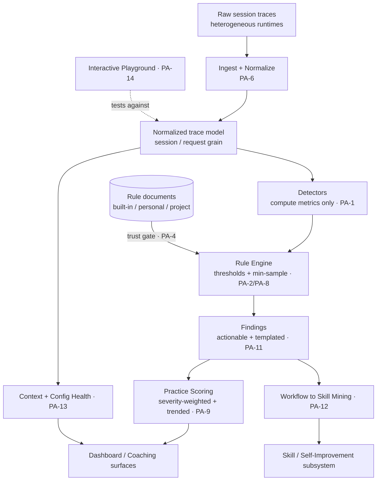
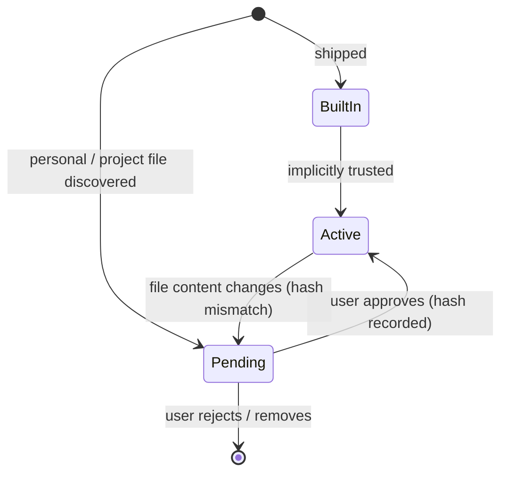
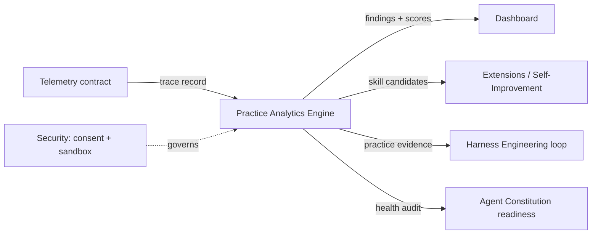

# Practice Analytics & Coaching Engine

**Version:** 1.0.0
**Status:** Stable
**Layer:** concept

## Overview

A diagnostic layer that turns raw agentic-session traces into *actionable coaching
signals*. Where the office runs work and the dashboard projects live statistics,
this engine sits one level above both: it **reads** the session record an office
already produces, **normalizes** it into a runtime-agnostic shape, and runs it
through a **data-driven rule engine** that detects practice anti-patterns, scores
practice quality over time, audits context/configuration health, and mines
repeated work into reusable-skill candidates.

The central design decision is a strict separation between *measuring* and
*judging*. **Detectors** compute metrics and never decide whether anything is
wrong. **Rules** — authored as portable documents with an embedded metric
expression language, not baked into engine code — apply thresholds to those
metrics and emit findings. This makes the whole diagnostic catalog editable,
testable, and extensible by the user without touching the engine, while keeping
detection deterministic and side-effect-free.

This is a *complement*, not a replacement: it consumes the telemetry contract,
feeds the dashboard and the self-improvement loop, and reuses the existing
agentic-readiness checklist rather than re-deriving it. It is technology-neutral
and portable to any session-producing runtime.

## Related Specifications

- [l1-telemetry.md](l1-telemetry.md) - Opt-in, program-data-only, privacy-first observation; the consent boundary this engine inherits (PA-10).
- [l1-dashboard.md](l1-dashboard.md) - Live read-only statistics projection; the primary consumer of practice scores and findings.
- [l1-harness-engineering.md](l1-harness-engineering.md) - Evidence-backed iterative improvement; findings here are one evidence source for harness amendments.
- [l1-evaluations.md](l1-evaluations.md) - Frozen evaluation pipeline; shares the "measure honestly before judging" discipline (PA-7).
- [l1-workflow-language.md](l1-workflow-language.md) - The agent workflow DSL; the metric expression language here is a sibling bounded DSL, distinct in purpose (PA-5).
- [l1-security.md](l1-security.md) - Secret isolation, sandboxing, no exfiltration; the trust and evaluation-safety boundary (PA-4, PA-5).
- [l1-extensions.md](l1-extensions.md) - Skills/plugins lifecycle and default-deny sandboxing; the home for mined-skill candidates (PA-12).
- [l1-roles.md](l1-roles.md) - Roles as specialties; practice groups are scored per the role producing the work.
- [l2-agent-constitution.md](l2-agent-constitution.md) - Owns the agentic-readiness checklist and instruction-quality scoring that PA-13 reuses rather than redefines.
- [l2-self-improvement.md](l2-self-improvement.md) - Skill training/curation; the downstream owner of mined-skill candidates (PA-12).
- [l2-dashboard.md](l2-dashboard.md) - Runtime analytics surfaces; the implementation consumer of this engine's outputs.

## 1. Motivation

An autonomous office accumulates a rich trace of how it works — every request, the
tools it reached for, the files it touched, how much context it burned, where it
cancelled and retried. Today that trace is used for *live status* (dashboard) and
for *targeted self-improvement* (skill/harness eval loops). What is missing is a
**diagnostic layer between the two**: a way to ask, across the whole history,
*"what habits are costing us, and how would we coach this office to work better?"*

Three forces make that layer worth specifying as its own concept:

1. **Habits are invisible in aggregate dashboards.** A single under-specified
   prompt, a session run without a plan, a context window left to saturate — each
   is harmless once and corrosive at scale. Detecting them needs *rules over
   patterns*, not counters.
2. **The catalog of "good practice" is contested and evolving.** What counts as an
   anti-pattern differs by team, stack, and season. If detection logic is
   hard-coded, every disagreement becomes an engineering change. If it is
   *data-driven and user-editable*, the office and its operator can tune, add, and
   disable rules as practice matures — the catalog becomes a living artifact.
3. **Coaching must be honest to be trusted.** A diagnostic that imputes missing
   measurements, fires on tiny samples, or hides its coverage gaps produces
   confident nonsense. The value is entirely in the rigor of *not* over-claiming.

The cost of *not* having this layer is that practice quality stays tribal:
improvement depends on whoever happens to notice a bad habit, with no shared,
testable, trended definition of what "better" means.

## 2. Constraints & Assumptions

- **Read-only over traces.** The engine never mutates the session record it
  analyzes. It is a pure projection.
- **On-device by default.** All ingestion, normalization, detection, scoring, and
  mining run locally. Results are program-data and leave the device only under the
  existing telemetry consent gate.
- **Trace availability varies by runtime.** Some runtimes report per-request token
  data; some only session-level; some none. The engine must degrade gracefully and
  account for the gap rather than fabricate it.
- **No arbitrary code execution.** User-authored rules are data, evaluated by a
  bounded interpreter — never host code, shell, or network access.
- **The agentic-readiness checklist already exists elsewhere.** This spec consumes
  it; it does not redefine its signals or weights.

## 3. Core Invariants (Layer 1 only)

Rules that any Layer 2 implementation MUST NOT violate:

- **PA-1 — Detector/Rule Separation.** Detectors compute metrics only; they never
  decide whether to flag. The decision to emit a finding belongs exclusively to a
  rule evaluating a declared threshold. The two roles are never merged in one unit.
- **PA-2 — Data-Driven Detection.** Detection logic is authored as portable rule
  *documents* (metadata header + a declarative detection block in the metric
  expression language + finding templates + inline test fixtures), not embedded in
  engine code. Adding, editing, or disabling a rule MUST NOT require rebuilding the
  engine.
- **PA-3 — Layered Rule Sources with Precedence.** Rules load from ordered layers
  — shipped (built-in) below user-personal below project-local — and a
  higher-precedence layer overrides a lower one by stable rule id. The active
  catalog is the resolved overlay, not a blind union.
- **PA-4 — Trust-on-First-Use for Local Rules.** Built-in rules are implicitly
  trusted. Any non-built-in rule is content-hashed and withheld from execution
  until explicitly approved; any later edit invalidates the approval and
  re-quarantines the rule. A repository MUST NOT be able to make its own diagnostic
  logic run merely by being opened.
- **PA-5 — Bounded, Side-Effect-Free Evaluation.** The metric expression language
  is pure and total: deterministic, no host/filesystem/network/clock access, and
  no unbounded computation. Pattern matching uses a guarded matcher that rejects
  catastrophic-backtracking constructs. Evaluation cannot escape its sandbox.
- **PA-6 — Normalized Trace Model.** Heterogeneous runtime traces are projected
  into one runtime-agnostic schema at two grains — session and request — carrying
  at minimum: identity and timing, originating runtime (provenance), tool usage,
  files edited/referenced, token accounting with cache tiers, context-management
  events (summarization/compaction, task-list snapshots), a work-type
  classification, and reasoning effort when known. Detection operates only on the
  normalized model, never on raw runtime formats.
- **PA-7 — Honest Data-Gap Accounting.** Absent measurements are typed
  (in-flight / errored / structurally-unrecorded / genuinely-missing), and any
  category that *cannot* carry the measurement is excluded from the relevant
  denominator. The engine MUST NOT impute, zero-fill, or silently average over
  gaps. Coverage is itself a reported quantity.
- **PA-8 — Minimum-Sample Gating.** Every rule declares a minimum sample size.
  Below it the rule abstains; it MUST NOT emit a finding from a sample too small to
  support it.
- **PA-9 — Severity-Weighted, Trended Scoring.** Findings roll up into per-practice
  -group scores via declared severity weights; scores are reported with
  period-over-period deltas, not as a single static number. A rule MAY compute a
  dynamic severity per occurrence; absent that, its declared severity applies.
- **PA-10 — Read-Only & On-Device.** Analysis never writes to the trace it reads;
  all computation is local; results egress only through the existing telemetry
  consent gate. No proprietary phone-home.
- **PA-11 — Findings Are Actionable.** Every finding carries three parts: what was
  observed, a concrete suggestion for improvement, and a bounded set of redacted
  examples — all produced from templates interpolated with the detection result. A
  bare flag with no remedy is not a valid finding.
- **PA-12 — Mining Hands Off, Never Auto-Installs.** Repeated-work clusters are
  surfaced as *candidate* reusable skills with a triage verdict and a draft, then
  handed to the skill/self-improvement subsystem. This engine never installs,
  activates, or executes a mined artifact itself.
- **PA-13 — Health Auditing Reuses Existing Contracts.** Context- and
  configuration-health auditing scores instruction/config artifacts for size,
  structure, and progressive-disclosure quality, and reuses the agentic-readiness
  checklist defined elsewhere rather than re-deriving its signals.
- **PA-14 — Authoring Is Testable Before Activation.** Rules and metrics are
  evaluable interactively against real traces before they go live, and each rule's
  inline test fixtures are checked at load time so a rule that fails its own
  fixtures is rejected rather than silently shipped.

> An L2 spec cannot reach RFC status until all PA invariants are addressed in its
> "Invariant Compliance" section.

## 4. Architecture

The engine is a linear projection pipeline with two authoring side-channels (rule
loading and the interactive playground). Each stage consumes the previous stage's
output and adds nothing the next stage cannot re-derive.



**Stage responsibilities:**

- **Ingest + Normalize** — discover trace sources per runtime via pluggable
  collectors, project each into the normalized model, attach provenance, and type
  every data gap (PA-6, PA-7). Heavy and parallel; isolated so it never blocks the
  interactive surfaces.
- **Detectors** — pure functions from a scoped slice of the model (requests or
  sessions) to a metric emission: a count, a total, a ratio, sample examples, and
  arbitrary extra fields for template interpolation. They decide nothing (PA-1).
- **Rule Engine** — resolves the layered, trust-gated rule catalog (PA-3, PA-4),
  evaluates each rule's threshold expression against its detector's emission under
  its minimum-sample gate (PA-8), and renders findings from templates (PA-11).
- **Practice Scoring** — aggregates findings into group scores with severity
  weights and period deltas (PA-9).
- **Mining** and **Health** — secondary projections that read the model (and
  findings) to produce skill candidates and health audits (PA-12, PA-13).

### 4.1 The Rule Document Model (PA-2)

A rule is a self-contained portable document, not a code change. Its anatomy:

```plaintext
metadata header
  id, name, practice-group, severity, scope (request|session|both),
  version, tags, declared thresholds, named pattern lists
description template      # what was observed  (interpolates detection result)
improvement template      # concrete remedy
example template          # how each surfaced example is rendered
detection block           # declarative: scan -> match -> aggregate -> check
inline test fixtures      # {input} -> triggered | clean
```

The detection block reads as *scan a scope, match rows by an expression, aggregate
into a metric, check the metric against a threshold, render examples*. Thresholds
and pattern lists live in the header so the same logic can be re-tuned without
rewriting the expression. Fixtures (PA-14) pin the rule's intended behavior and are
verified when the rule loads.

### 4.2 The Metric Expression Language (PA-5)

A small, bounded language whose only job is to express *"which rows match"* and
*"what number do they aggregate to."* Surface, by category:

- **Field access** over the normalized model, including array length and nested
  object members.
- **Comparison and logic** — the usual relational and boolean operators.
- **Functions** grouped as string, math, date, array, object, and utility helpers
  (length, contains, regex match, lower/upper/trim/truncate, floor/ceil/round/
  min/max, hour/day-of-week/month/year, includes/some/count/sum/avg/unique,
  has/keys/values, coalesce/conditional, and a few domain aggregates).
- **Aggregations** — count, ratio, sum, avg, min, max, unique-count, percentile.
- **Pipe filters** for display-time shaping of examples.

It is deliberately *not* Turing-complete and has no I/O. Regex is delegated to a
guarded matcher that statically rejects catastrophic-backtracking constructs
before any input is matched (PA-5). The same language powers the rule detection
block, the named reusable metric primitives, and the interactive playground —
one evaluator, three entry points.

### 4.3 Trust Model for Local Rules (PA-4)



Trust is keyed on a content hash, not a path: editing an approved rule re-opens the
gate. A blocked rule is parked in a pending list for the authoring surface to
display, never executed. With no gate configured (e.g. headless test harness), the
loader's documented fallback is "built-in only." This prevents a hostile
repository from shipping a `match`/`check` expression that runs the instant the
office opens it.

## 5. Practice Groups, Findings & Scoring

### 5.1 Practice Groups (PA-9)

Findings are organized into a small fixed set of practice groups so scoring stays
legible. The catalog (illustrative, extensible by PA-2):

| Group | What it watches | Example anti-patterns (plain language) |
| --- | --- | --- |
| Prompt Quality | How well work is specified | under-specified one-liners; no plan/spec to start a session; no file context provided |
| Session Hygiene | How sessions are run | sessions abandoned mid-flight; runaway tool loops on a failing approach; mega-sessions that should have been split |
| Code Review | How AI output is vetted | accepting generated code with no review pause; rubber-stamping large diffs |
| Tool Mastery | Whether the runtime's leverage is used | never reaching for tools or commands; ignoring available skills/slash-commands |
| Context Management | How the context window is spent | letting context saturate before compaction; oversized always-on instruction files; excessive file context per request |

### 5.2 Scoring (PA-9)

Each group's score is computed by penalizing the rate of flagged work, weighted by
finding severity (high/medium/low map to descending penalties). A rule MAY override
its static severity with a dynamic per-occurrence severity (PA-9). Scores are
reported with week-over-week and period-over-period deltas and a per-group weekly
trend, so coaching tracks *direction*, not just level. A finding carries rich
per-occurrence detail (when, where, which model/session, redacted message) and a
weekly histogram, enabling drill-down without re-running detection.

### 5.3 Honest Coverage (PA-7)

Wherever a score depends on a measurement that some runtimes cannot provide (token
counts being the canonical case), the engine reports *coverage* alongside the
score: how many sessions/requests actually carried the data, broken down by runtime
and by time, with the structurally-impossible cases excluded from the denominator.
A score with poor coverage is labelled as such rather than presented as
authoritative.

## 6. Context & Configuration Health (PA-13)

A secondary projection audits the *static* context an office presents to its
agents, complementing the *dynamic* context-window analysis of §5:

- **Instruction/config artifact scan** — locate the project's instruction,
  prompt, agent-profile, skill, and hook-configuration files; score each for size
  verdict (compact / moderate / oversized against documented ceilings) and
  markdown-quality issues (missing headings, non-imperative phrasing, deeply nested
  conditionals, unclosed fences, over-length files).
- **Progressive-disclosure score** — reward a layout that keeps always-on context
  lean and pushes detail into on-demand units (skills, scoped instruction files,
  prompt files) rather than one oversized always-loaded file.
- **Agentic-readiness** — *reuse* the existing checklist (PA-13); surface its
  signals and one-line fixes here, do not re-define them.
- **Optional agent-assisted review** — when explicitly invoked, an LLM pass can
  grade instruction files on clarity, specificity, structure, completeness,
  staleness, redundancy, and actionability, returning a graded report. This is
  opt-in and on-device-model-eligible (PA-10).

## 7. Workflow-to-Skill Mining (PA-12)

The same normalized history reveals *repeated* work: clusters of near-identical
prompts/workflows recurring across sessions and workspaces. The miner surfaces each
cluster with a canonical prompt, occurrence and correction-turn statistics, an
estimate of time saved, and a **draft** of a reusable skill — together with a
triage verdict (strong / maybe / skip) and a reason. The draft is *handed off* to
the extensions/self-improvement subsystem (PA-12); this engine neither installs nor
runs it. Optionally, clusters are matched against an external open catalog of
community skills to suggest an existing artifact instead of authoring a new one.

## 8. Integration Points



- **Telemetry** supplies the trace; this engine never reaches around it for raw
  data (PA-10).
- **Dashboard** renders scores, trends, and findings.
- **Self-improvement / extensions** receive mined-skill candidates.
- **Harness engineering** treats findings as one evidence source for amendments.
- **Agent constitution** owns the readiness checklist this engine surfaces.

## 9. Ideas-to-Adopt Mapping

Mechanics worth importing, in plain language, and where each lands in the project:

| Mined mechanic | Value | Lands in |
| --- | --- | --- |
| Detector/rule split — measure vs. judge as separate units | Deterministic, testable detection; tunable judgment | PA-1; new engine |
| Rules as portable documents with an embedded metric DSL | Living, user-editable diagnostic catalog without engine rebuilds | PA-2, §4.1–4.2 |
| Layered rule precedence (built-in < personal < project) | Team and project overrides without forking the shipped catalog | PA-3 |
| Trust-on-first-use with hash revocation | Safe local extensibility; hostile repos can't auto-run logic | PA-4, §4.3; [l1-security.md](l1-security.md) |
| Guarded regex / bounded pure evaluator | ReDoS-safe, no arbitrary code in user rules | PA-5 |
| Normalized cross-runtime trace model | One analysis surface over heterogeneous offices/runtimes | PA-6; [l1-telemetry.md](l1-telemetry.md) |
| Typed data-gap accounting + reported coverage | Trustworthy metrics that never over-claim | PA-7, §5.3 |
| Minimum-sample gating per rule | No findings fired from noise | PA-8 |
| Severity-weighted, trended practice scores | Coaching tracks direction, not just a number | PA-9; [l1-dashboard.md](l1-dashboard.md) |
| Templated, example-bearing findings | Every flag ships its own remedy | PA-11 |
| Repeated-work clustering to skill drafts | Turns observed habits into reusable leverage | PA-12; [l2-self-improvement.md](l2-self-improvement.md) |
| Instruction/config health + progressive-disclosure score | Audits the static context an office presents | PA-13; [l2-agent-constitution.md](l2-agent-constitution.md) |
| Interactive rule playground + load-time fixtures | Author and regression-guard rules before activation | PA-14 |

## 10. Drawbacks & Alternatives

- **Engine vs. hard-coded checks.** A data-driven engine costs more upfront than a
  handful of hard-coded checks. Justified by PA-2's motivation: the catalog is
  contested and evolving, and turning every disagreement into an engineering change
  does not scale.
- **DSL vs. embedded general-purpose scripting.** A general scripting host would be
  more expressive but reintroduces arbitrary code execution and ReDoS risk. PA-5
  deliberately trades expressiveness for a bounded, safe evaluator; rules needing
  more belong as built-in detectors, not user data.
- **Coaching can feel like surveillance.** Mitigated by PA-10 (on-device,
  consent-gated, read-only) and by scoping findings to *practice* with concrete
  remedies, never to individuals beyond the operator's own office.
- **Coverage honesty reduces apparent completeness.** Reporting "low coverage"
  instead of a confident number is less satisfying but is the entire point (PA-7);
  the alternative is trusted-looking falsehoods.
- **Overlap risk with neighboring specs.** Health auditing and skill mining touch
  the constitution and self-improvement specs. Resolved by reuse-and-handoff
  (PA-12, PA-13) rather than duplication, per the relations rules.

## Canonical References

<!-- L1 concept spec: no implementation exists yet. The authoritative contracts a
     downstream L2 implementer MUST honor are the related concept specs below. -->

| Alias | Path | Purpose |
| --- | --- | --- |
| `[TELEMETRY]` | `.design/main/specifications/l1-telemetry.md` | Consent boundary and program-data-only rule the engine inherits (PA-10). |
| `[READINESS]` | `.design/main/specifications/l2-agent-constitution.md` | Owns the agentic-readiness checklist PA-13 reuses; do not redefine its signals. |
| `[SELF-IMPROVE]` | `.design/main/specifications/l2-self-improvement.md` | Downstream owner of mined-skill candidates (PA-12). |
| `[DASHBOARD]` | `.design/main/specifications/l1-dashboard.md` | Primary consumer surface for scores and findings. |

## Document History

| Version | Date | Change |
| --- | --- | --- |
| 1.0.0 | 2026-06-25 | Initial specification: PA-1…PA-14 invariants; data-driven rule engine (detector/rule split, metric DSL, trust-gated layered sources), normalized cross-runtime trace model with honest data-gap accounting, severity-weighted practice scoring, context/config health auditing, and workflow-to-skill mining. |
