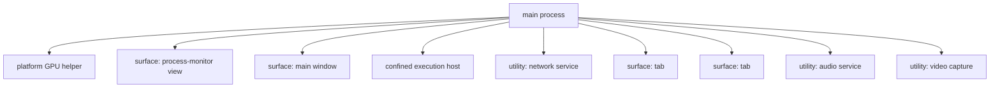

# Process Monitor

**Version:** 1.0.0
**Status:** Stable
**Layer:** concept

## Overview

The technology-agnostic model of the **process monitor**: a live, read-only view of the application's own operating-system process tree — the main process and every child it spawns — with per-process resource metrics (at minimum CPU share and memory footprint) and a stable, human-readable identity for each. It answers "what processes is this application actually running right now, in what parent/child shape, and what is each one costing?" — the product's own task-manager. Like a browser's process view, it presents one root with its helpers nested beneath it, refreshed live, and it is available with parity across all three frontends (CLI, TUI, graphical).

The monitor is *observation only*: it reports the process topology and its costs, it never controls or repairs processes. It is deliberately narrow — the raw, live, per-process listing — and hands anything beyond display (scoring a trend, killing a runaway, restarting a dead surface) to the layers that own those jobs.

## Related Specifications

- [l1-architecture.md](l1-architecture.md) - The sanctioned process boundaries the monitor classifies against — one process per frontend surface, confined agent/plugin execution, hub/spoke (INV-8) — and the command-parity contract (INV-3) that makes the monitor identical across frontends.
- [l1-operational-health.md](l1-operational-health.md) - Scores and alerts over rolling windows of runtime traces (including resource samples); the monitor supplies the *live per-process view*, operational health *scores the aggregate over time* — measure-don't-act (OH-7) is shared, the altitude differs.
- [l1-dashboard.md](l1-dashboard.md) - Sibling read-only projection; the dashboard projects *office/work* statistics, the monitor projects *OS-process* topology — same projection-not-source principle, different domain.
- [l1-doctor.md](l1-doctor.md) - The self-healing subsystem restarts/repairs processes; the monitor observes liveness and hands anomalies to it, never auto-acting.
- [l1-application-shell.md](l1-application-shell.md) - The frontend runtime whose "one process per surface" the monitor makes visible; the monitor's graphical form is itself a render-from-state panel (AS-5).
- [l1-security.md](l1-security.md) - Process names, PIDs, and command lines are local operational data; the monitor keeps secrets out of what it displays and off the device (INV-7, SEC).
- [l1-telemetry.md](l1-telemetry.md) - Any outward sharing of process/resource data follows the telemetry opt-in (TEL-1/2); by default nothing leaves the machine.

## 1. Motivation

A multi-process desktop application — a main/core process, a process per visible surface, confined helper processes for agent and plugin execution, platform utility processes (GPU, network, audio, video capture) — is opaque to its user without a window into itself. When memory climbs toward an out-of-memory kill, when a surface's process wedges, or when the user simply wants to know why the fans spun up, the only honest answer is a direct view of the actual process tree and its live costs.

The product already sanctions exactly which processes may exist (the architecture's process-boundary rules), so it is uniquely able to present its own processes *classified and named*, not as an anonymous PID soup. A generic OS task manager shows `cronus-*` rows with no explanation; the built-in monitor knows that `cronus-renderer-main` is a surface process, `cronus-host-local-1` is a confined execution host, and `cronus-utility-network-service` is a platform helper — and it can present them as one legible tree.

This is a *display* need, not a control or health-scoring need. Scoring resource trends over time and alerting before an incident is the operational-health layer's job; repairing a crashed or runaway process is the self-healing layer's job. The monitor exists to give the user (and support) an immediate, truthful, live picture — the same picture from a terminal command, a TUI panel, or a graphical tab — and nothing more.

## 2. Constraints & Assumptions

- The monitored set is the application's *own* process tree (the main process and its descendants), not every process on the host. The monitor is not a general system task manager.
- Metrics derive from what the operating system already exposes per process (CPU, memory, PID, parentage); the monitor mandates no new instrumentation inside those processes.
- Observation is read-only: sampling process metrics never mutates application state and never controls a process.
- Process control (terminate/restart) and health scoring are explicitly out of scope for the monitor; they belong to the self-healing and operational-health layers respectively.
- Process command lines may embed secrets (tokens, keys); the monitor treats displayed process data as potentially sensitive and scrubs accordingly (INV-7).
- The available metrics may vary by host platform; the monitor degrades gracefully (a metric the OS cannot supply is shown as unavailable, never fabricated).

## 3. Core Invariants (Layer 1 only)

Rules every Layer 2 implementation MUST NOT violate:

- **PM-1 (Read-only observation, no control or repair):** the monitor is a live, read-only projection of the application's process tree. Observing it MUST NOT mutate application state or control any process. The monitor owns no remediation: a liveness or resource anomaly is *handed to* the self-healing subsystem and operational-health, never restarted, killed, or healed by the monitor itself (consistent with OH-7 measure-don't-act, DSH-4 observational).
- **PM-2 (Named identity + live metric set):** every entry carries a stable, human-readable role identity **and** the operating-system PID, plus a defined live metric set — at minimum CPU share and memory footprint. The PID is the OS handle; the role identity classifies the process by its sanctioned kind. A metric the host cannot supply is reported as unavailable, never invented.
- **PM-3 (Hierarchical tree rooted at main):** processes are presented as a parent/child tree rooted at the application's main process, reflecting real spawn parentage; a child process renders nested beneath the process that spawned it. The flat set is always also a tree.
- **PM-4 (Topology fidelity — nothing hidden):** the monitor reflects exactly the processes that actually exist and classifies each against the sanctioned process boundaries (one process per surface, confined agent/plugin execution, platform helper/utility processes; INV-8). A process that does not match a known sanctioned kind is shown as unclassified — the monitor MUST NOT conceal a running process, including its own.
- **PM-5 (Frontend parity):** the monitor is available across CLI, TUI, and graphical frontends and reports equivalent processes and metrics from each; frontends differ only in rendering — a text tree/table for CLI and TUI, an interactive panel for the graphical surface — never in *which* processes or metrics are reported (consistent with INV-3 command parity).
- **PM-6 (Live, refreshable sampling):** metrics reflect near-current state through periodic sampling; the view updates continuously or is explicitly refreshable without restarting the application. The sampling cadence is configurable with a sensible default.
- **PM-7 (Local-first and secret-safe):** process data — role names, PIDs, resource samples, and any surfaced command line — is local operational data. It MUST NOT egress except under the telemetry opt-in, and the monitor MUST NOT surface secrets or sensitive arguments in any frontend (consistent with INV-7, SEC, TEL-1/2).

> L2 specs cannot reach RFC status until all invariants here are addressed in their "Invariant Compliance" section.

## 4. Detailed Design

### 4.1 The process entry

Each row of the monitor is one process, carrying identity and live cost:

| Field | Meaning | Invariant |
| --- | --- | --- |
| Role identity | human-readable name classifying the process by sanctioned kind (e.g. `main`, a surface renderer, a confined host, a utility helper) | PM-2, PM-4 |
| PID | operating-system process handle | PM-2 |
| CPU | live CPU share attributed to the process | PM-2, PM-6 |
| Memory | live resident memory footprint | PM-2, PM-6 |
| Parent | the process that spawned this one (defines tree placement) | PM-3 |

The minimum metric set is CPU + memory; an implementation MAY add more (threads, uptime, network) as long as PM-2's "never fabricate an unavailable metric" holds.

### 4.2 The tree

The monitor roots at the main process and nests children by real spawn parentage (PM-3). An illustrative shape (names illustrative, not a fixed catalog):

Rendered as a flat, indented listing (the CLI/TUI form), the same tree reads:

| # | Process | PID | CPU | Memory |
| --- | --- | --- | --- | --- |
| 1 | main | 16948 | 0.3% | 247 MB |
| 2 | ‑ gpu helper | 19416 | 0.1% | 158 MB |
| 3 | ‑ surface: process-monitor | 19604 | 0.1% | 163 MB |
| 4 | ‑ surface: main window | 1620 | 0.0% | 217 MB |
| 5 | ‑ confined execution host | 8780 | 0.0% | 203 MB |
| 6 | ‑ utility: network service | 18308 | 0.0% | 56.0 MB |
| 7 | ‑ surface: tab | 4060 | 0.0% | 92.9 MB |
| 8 | ‑ utility: audio service | 18024 | 0.0% | 92.9 MB |
| 9 | ‑ utility: video capture | 13520 | 0.0% | 107 MB |

Note row 3: the monitor shows *its own* surface process. Nothing is hidden (PM-4), including the observer.

### 4.3 Process kinds mapped to sanctioned boundaries

The monitor classifies each process against the architecture's sanctioned boundaries (PM-4, INV-8):

| Kind | Sanctioned boundary (INV-8) | Role |
| --- | --- | --- |
| main / core | the hub core process | root of the tree; hosts the domain logic |
| surface | one process per frontend surface (INV-3/INV-8) | a window/tab/view rendering a surface |
| confined execution host | core ↔ sandboxed agent/plugin code (security seam) | runs untrusted agent or plugin code out-of-process |
| platform utility/helper | platform-provided child processes | GPU, network, audio, video-capture and similar helpers |
| unclassified | none matched | surfaced explicitly as unclassified — never hidden |

### 4.4 Cross-frontend surface

The monitor honors command parity (PM-5, INV-3): one capability, three renderings. The library method is the source of truth; the CLI and TUI are thin bindings, the graphical panel a render-from-state surface.

- **CLI** — a verb-first command in the process group (e.g. `cronus process list`), with presentation flags (tree vs flat, sort key, one-shot vs watch). Output is the indented tree/table of §4.2.
- **TUI** — the mirrored slash form (e.g. `/process`) renders the same tree in a live panel.
- **Graphical** — an interactive "Process Monitor" panel (a render-from-state surface per the application shell), sortable and live-updating; it is itself a surface process the tree lists.

All three report the same processes and metrics; only the rendering differs (PM-5).

### 4.5 Boundary with neighbouring layers

The monitor is intentionally the thinnest of a family of observability surfaces:

- **vs operational-health:** the monitor is the *live, raw, per-process* view; operational health *scores* resource samples over rolling windows, raises graded alerts, and detects trends (OH). A runaway-memory *number* is the monitor; a runaway-memory *alert* is operational health.
- **vs dashboard:** the dashboard projects *office and work* statistics (cards, cost, schedules, memory-store); the monitor projects the *OS process* topology. Both are read-only projections, different domains.
- **vs self-healing (doctor):** the monitor never restarts or kills a process; when it observes a dead surface or a wedged host, remediation is the doctor's (PM-1).

## 5. Drawbacks & Alternatives

- **Overlap risk with operational-health:** a naive implementation could re-derive scoring inside the monitor and duplicate OH. Resolved by PM-1: the monitor displays raw live metrics only; scoring, trending, and alerting stay in operational health, which may *consume* the same resource samples.
- **Alternative — rely on the OS task manager:** rejected. A generic task manager cannot classify `cronus-*` processes against sanctioned boundaries (PM-4) and is not available with parity inside the CLI/TUI; the product's own processes deserve a legible, in-product, cross-frontend view.
- **Alternative — fold process display into the dashboard:** rejected. The dashboard's domain is office/work metrics; OS-process topology is a distinct concern with its own tree structure and cross-frontend command. A sibling projection keeps each focused (mirrors the dashboard/office-visualization split).
- **Process control (kill/restart) surface:** deliberately out of scope for v1.0.0 — the monitor observes only. If a user-initiated terminate/restart is later wanted, it must route through an explicitly-authorized control path (owned by the self-healing layer and gated by the security model), never bolted onto the read surface. <!-- TBD: decide whether/how to expose user-initiated process control (terminate/restart) via the doctor + security path in a later version -->
- **Platform metric variance:** the metrics an OS exposes differ across hosts; PM-2's "unavailable, never fabricated" rule keeps the monitor honest at the cost of occasional blank cells. <!-- TBD: baseline metric set guaranteed across all target platforms -->

## Document History

| Version | Date | Change |
| --- | --- | --- |
| 1.0.0 | 2026-07-02 | Initial concept: process monitor as a live, read-only, cross-frontend (CLI/TUI/GUI) view of the application's own process tree with per-process CPU/memory (PM-1…7); classifies processes against sanctioned boundaries (INV-8), observe-only with hand-off to operational-health and self-healing. |

## Canonical References

| Alias | Path | Purpose |
| --- | --- | --- |
| `[ARCH]` | `.design/main/specifications/l1-architecture.md` | Sanctioned process boundaries (INV-8) and command parity (INV-3) the monitor classifies and mirrors against |
| `[OP-HEALTH]` | `.design/main/specifications/l1-operational-health.md` | The scoring/alerting layer the monitor feeds and defers to (OH-7 measure-don't-act) |
| `[SHELL]` | `.design/main/specifications/l1-application-shell.md` | "One process per surface" the monitor renders; the monitor's graphical form as a render-from-state panel |
| `[SECURITY]` | `.design/main/specifications/l1-security.md` | Secret-safe, local-first handling of process data (INV-7, SEC) |
