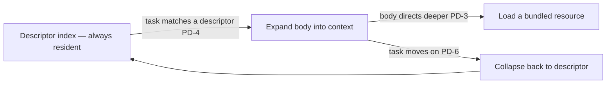

# Progressive Disclosure

**Version:** 1.0.0
**Status:** Stable
**Layer:** concept

## Overview

The context window is a shared, finite resource, and most of what an agent *could* know at any moment it does not *need* right now. Progressive disclosure is the discipline that keeps the always-resident footprint tiny and expands detail only on demand: every disclosable artifact — a skill, a tool, a knowledge document, a schema — exposes a small **descriptor** (a name plus a triggering description) that is the only part kept in context by default, loads its **body** into context when it is actually triggered, and reaches deeper **bundled resources** only when the body directs to them. Breadth of *available* capability costs nothing until it is used.

This is the **lazy-loading** member of the context-economy family, orthogonal to compression. Compression shrinks content already in context (a lossy reduction of what is loaded); disclosure defers loading content at all (a lossless deferral of what to load). Loading everything eagerly to "be safe" is the failure this prevents — it dilutes attention, wastes tokens, and conflates overlapping artifacts (context rot). The cure is not to compress the flood but to never pour it: keep an index of descriptors resident, and expand exactly what the task needs, when it needs it.

## Related Specifications

- [l2-skill-system.md](l2-skill-system.md) — skills are the canonical progressive-disclosure artifact (metadata → body → bundled resources); this L1 names the discipline that implementation embodies.
- [l1-extensions.md](l1-extensions.md) — an extension's manifest/description is its descriptor (PD-1, EXT-9); activation is body expansion.
- [l1-context-compression.md](l1-context-compression.md) — the complementary token-economy member: compression is a lossy transform on *loaded* content, disclosure is lossless deferral of *whether to load*. Different axes; they compose.
- [l1-cache-stable-context.md](l1-cache-stable-context.md) — the always-resident descriptor index belongs in the frozen prefix, so it stays cache-stable across turns (PD-7); an expansion is an addition below the frozen boundary.
- [l1-harness-composition.md](l1-harness-composition.md) — selective loading is anti-bloat on the *load* axis: HC prunes components that shouldn't exist, PD keeps existing-but-irrelevant components out of context (PD-5).
- [l1-tool-composition.md](l1-tool-composition.md) — surfacing only the relevant tools per step is tool-side progressive disclosure (an instance of PD-2/PD-5).
- [l1-routing.md](l1-routing.md), [l1-intent-resolution.md](l1-intent-resolution.md) — matching a task to the descriptors worth expanding is a selection/routing decision (PD-4).
- [../../nodus/specifications/l1-nodus-language.md](../../nodus/specifications/l1-nodus-language.md) — NL-16 `@needs` selective vocabulary disclosure is the nodus-workflow realization: a workflow declares the schema/vocabulary slices it needs, the rest stays deferred.

## 1. Motivation

An agent with many available capabilities faces a dilemma. Load them all into context so nothing is missed, and every request pays for hundreds of skill bodies, tool schemas, and reference docs it will not use — attention spreads thin, the bill inflates, and near-duplicate artifacts blur into each other so the agent picks the wrong one (context rot). Load none and the agent is a generalist blind to the specifics the task needs.

Progressive disclosure resolves the dilemma with a tiered index. The always-resident layer is only the *descriptors* — enough to decide *whether* an artifact is relevant, not the artifact itself. When a descriptor matches the task, its body is expanded into context; when the body needs deeper material, that material is loaded a level further down. So the cost scales with what the task *uses*, not with what is *available*, and a library of a thousand skills costs, at rest, a thousand one-line descriptions — not a thousand full skills. The discipline also states the load-bearing quality property: a descriptor is a *routing contract*, and disclosure is *lossless and reversible* — deferring loses nothing, and an expanded artifact can be collapsed back to its descriptor when the task moves on.

## 2. Constraints & Assumptions

- Disclosure is a **loading policy**, not a knowledge transform: a deferred artifact is fully intact and available; deferral changes *when* it enters context, never *what* it is.
- The always-resident cost is the sum of **descriptors**, which must stay small; a descriptor that carries the body defeats the purpose.
- Correct expansion depends on descriptor quality (PD-4): the system can only expand what its descriptors let it recognize as relevant.
- Progressive disclosure composes with, and does not replace, compression (shrink what is loaded) or caching (reuse what is loaded).
- This is a Layer 1 concept: it names no file format, token budget, or retrieval engine. The concrete skill/tool/knowledge loader is a Layer 2 concern.

## 3. Core Invariants

Rules every Layer 2 realization MUST NOT violate. They are technology-neutral.

- **PD-1 (Minimal always-resident descriptor):** every disclosable artifact exposes a small **descriptor** — a stable name plus a description of *when to use it* — and the descriptor is the **only** part kept in context by default. The always-resident footprint is bounded by the sum of descriptors, never by the sum of bodies. A descriptor that inlines its body is a violation.

- **PD-2 (On-demand body expansion):** an artifact's full body enters context only when it is **triggered** — its descriptor matched the task, or a router/selector chose it — never preemptively for the whole library. Expansion is a deliberate, observable act, not an ambient default. "Load it in case" is exactly the anti-pattern this forbids.

- **PD-3 (Lazy deeper tiers):** an artifact MAY bundle deeper resources (reference docs, scripts, examples, sub-documents) that load only when the body directs to them or the task reaches them — a further tier below the body. Depth is loaded **level by level on demand**, never eagerly flattened into the body's initial load.

- **PD-4 (The descriptor is a routing contract):** correct disclosure depends on the descriptor accurately stating *when the artifact applies*. An over-claiming descriptor causes mis-triggered expansions (rot); an under-claiming one causes missed use. The description is authored for the **decision to expand** — precise about applicability — not as promotional prose; its quality is a first-class correctness property, not cosmetic.

- **PD-5 (Selective loading bounds context rot):** the system loads only the artifacts **relevant to the current task**; the mere availability of an artifact costs nothing until it is expanded. Loading everything dilutes attention, wastes tokens, and conflates overlapping artifacts — so breadth of the catalog is decoupled from resident context cost. This is anti-bloat on the load axis (composing harness-composition and context-compression from the other side).

- **PD-6 (Lossless and reversible):** unlike compression, deferral **loses nothing** — a deferred artifact is fully available the instant it is expanded. And an expanded artifact MAY be **collapsed back** to its descriptor when the task no longer needs it, freeing context, and re-expanded later if needed. Disclosure is a lazy, reversible loading policy, never a destructive reduction.

- **PD-7 (Addressable, stable, cache-friendly tiers):** each tier — descriptor, body, resource — is independently **addressable by a stable reference**, so an expansion is a lookup, not a recomputation, and a re-expansion resolves to the same content. The always-resident descriptor index belongs in the **frozen prefix** (cache-stable-context), so maintaining it does not thrash the prompt cache; an expansion is an append below the frozen boundary, not a rewrite of it.

- **PD-8 (Honest disclosure state):** what is currently **expanded** versus **deferred** is legible to the agent and observable to the system. The agent knows what it has loaded and what remains available-but-unloaded, so "I don't have that in context yet — let me expand it" is an explicit, correct move rather than a hallucinated absence or a silent full-load. A capability the agent has a descriptor for is *available* even when not *loaded*, and the two states are never conflated.

> L2 specs cannot reach RFC status until all invariants here are addressed in their "Invariant Compliance" section.

## 4. Detailed Design

### 4.1 The three tiers

| Tier | Loaded when | Cost | Example (a skill) |
| --- | --- | --- | --- |
| Descriptor | always resident | tiny (one line) | name + "use when…" description (PD-1) |
| Body | on trigger (PD-2) | moderate | the skill's instructions / procedure |
| Resources | on demand from the body (PD-3) | as needed | bundled scripts, reference docs, templates |

The same three-tier shape applies to a tool (name+signature → full schema → linked docs), a knowledge document (title+abstract → section → cited sources), and a schema (vocabulary index → the needed units → their full definitions). Progressive disclosure is the one discipline all of these instantiate.

### 4.2 Expansion and collapse

Expansion adds below the frozen prefix boundary so the resident descriptor index stays cache-stable (PD-7); collapse frees the body's tokens when the task no longer needs it (PD-6), leaving the descriptor behind so the capability remains *available* though not *loaded* (PD-8).

### 4.3 Disclosure vs compression — two axes

| Axis | Question | Mechanism | Lossy? |
| --- | --- | --- | --- |
| Progressive disclosure | *Whether to load it at all* | defer, expand on demand, collapse when done | no (lossless deferral) |
| Compression | *How to shrink what is loaded* | summarize / fold the live zone | yes (bounded loss) |

They compose: disclosure keeps the resident set small by not loading the irrelevant; compression keeps the loaded set small by shrinking the verbose. A well-run context does both — defers what it can, compresses what it must keep.

## 5. Drawbacks & Alternatives

**Alternative: load everything (eager).** Rejected by PD-2/PD-5 — it is exactly context rot: attention dilution, token waste, and artifact confusion. Availability must be decoupled from resident cost.

**Alternative: load nothing (pure generalist).** Rejected by PD-1 — a descriptor index is cheap and is what lets the agent recognize when a specific capability applies; zero disclosure blinds the agent to the specifics it needs.

**Risk: weak descriptors.** The whole scheme rides on descriptor quality (PD-4) — a mis-stated "use when" mis-triggers. The mitigation is to treat the description as a routing contract authored for the expansion decision, and to observe mis-triggers (PD-8) as a signal to fix it.

**Risk: churn from collapse/re-expand.** Aggressive collapsing can thrash. Mitigation: PD-7 keeps expansions addressable and cache-friendly so a re-expansion is a cheap lookup, and collapse is a policy choice, not a mandate.

## Canonical References

| Alias | Path | Purpose |
| --- | --- | --- |
| `[SKILLS]` | `.design/main/specifications/l2-skill-system.md` | The canonical three-tier disclosure artifact this L1 governs |
| `[COMPRESS]` | `.design/main/specifications/l1-context-compression.md` | The complementary token-economy axis (shrink-loaded vs defer-loading) |
| `[STABLE]` | `.design/main/specifications/l1-cache-stable-context.md` | The frozen-prefix home of the resident descriptor index (PD-7) |
| `[NODUS]` | `.design/nodus/specifications/l1-nodus-language.md` | The host-neutral realization: NL-16 `@needs` selective vocabulary disclosure |

## Document History

| Version | Date | Author | Notes |
| --- | --- | --- | --- |
| 1.0.0 | 2026-07-09 | Core Team | Initial stable spec — progressive disclosure (tiered on-demand context loading): a minimal always-resident descriptor as the only default-loaded tier (PD-1), on-demand body expansion never preemptive (PD-2), lazy level-by-level deeper resources (PD-3), the descriptor as a routing contract whose accuracy is a correctness property (PD-4), selective loading that bounds context rot by decoupling catalog breadth from resident cost (PD-5), lossless + reversible deferral with collapse-back (PD-6), addressable stable cache-friendly tiers with the descriptor index in the frozen prefix (PD-7), honest expanded-vs-deferred state so availability ≠ loaded (PD-8). The lazy-loading member of the context-economy family, orthogonal to compression (defer-loading vs shrink-loaded). Composes l2-skill-system / l1-extensions / l1-context-compression / l1-cache-stable-context / l1-harness-composition / l1-tool-composition. Distilled from an adoption pass over an external agent-skills reference (three-level metadata/body/resources disclosure, selective-load anti-rot). |
