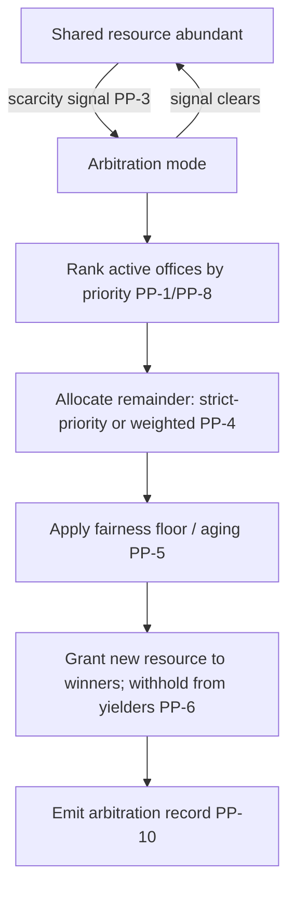

# Project Priority

**Version:** 1.0.0
**Status:** Stable
**Layer:** concept

## Overview

Project priority is the **cross-office resource-arbitration signal**: an explicit, user-set priority on each office (project) that governs how a finite resource shared across offices — most concretely a token/budget pool or an external provider rate/quota limit that every office draws on — is distributed when that resource becomes scarce and more than one office is competing for it. When the shared resource is abundant, priority does nothing and every office runs unconstrained; when it is contended, the building's global orchestrator allocates the remaining resource in priority order, so the work that matters most keeps moving while lower-priority projects yield.

Priority is deliberately an arbitration key, not a throttle: it never lowers a ceiling, never kills work that is already running, and never permanently starves a project without saying so. It rides on top of the budget engine's hard limits (which cap each scope) and the global orchestrator's coordination (which already sees every office's budget and state), adding the one thing neither has: a declared, honest rule for *who wins when there is not enough to go around*.

## Related Specifications

- [l1-global-orchestration.md](l1-global-orchestration.md) — The building-level actor that performs the arbitration (GO-1 single orchestrator, GO-4 unified budget visibility); this spec supplies the priority economics it applies, under GO-2 non-intrusion.
- [l2-budget-engine.md](l2-budget-engine.md) — The hard ceilings arbitration operates *within* (PP-9): the budget engine caps each scope, hard-stops on exhaustion, and explicitly does not redistribute; project priority governs the scarce shared remainder, never the cap.
- [l1-office-control.md](l1-office-control.md) — OfficeState taxonomy: only actively-working offices contend; Paused/Hibernating/Idle offices do not compete for the shared resource (PP-8).
- [l1-workspace-lifecycle.md](l1-workspace-lifecycle.md) — An office is a project/workspace; priority is an office/project attribute maintained over its life.
- [l1-office-model.md](l1-office-model.md) — The office entity that carries the priority attribute; the client does not micromanage allocation (OFF-5).
- [l1-orchestration.md](l1-orchestration.md) — ORC-7 budget circuit-breaker and per-office delegation the arbitration coordinates with.
- [l1-scheduler-model.md](l1-scheduler-model.md) — Demarcation: the scheduler orders tasks *within* one office; project priority arbitrates the shared resource *across* offices.
- [l1-crash-recovery.md](l1-crash-recovery.md) — Graceful yield checkpoints deferred work so a deprioritized office resumes, never loses, its in-flight state (PP-6, CR-5).
- [l1-security.md](l1-security.md) — Priority is not a privilege-escalation path; it never overrides privacy, safety, or hard budget limits (PP-9).

## 1. Motivation

A user often runs more than one office at once — several projects, or an environment split (staging vs prod), each an office in the same building. Those offices are independent in their work but not independent in what they consume: they draw on the same wallet and, very often, the same model-provider account with a single shared rate limit and quota. As long as the shared resource is plentiful this is invisible — everyone runs. The moment it is scarce — the shared budget pool is nearly spent for the period, or the provider is throttling because all offices are calling it at once — something has to give, and the system must decide *which office gives*.

Today two mechanisms touch this but neither answers it. The budget engine caps each scope and hard-stops it at its own limit, but it deliberately does not redistribute a shared remainder — "over-allocation at parent level requires a human decision." The global orchestrator sees every office's budget and routes with "budget availability" in mind, but it has no rule for ranking offices against one another under contention. So under scarcity the outcome is effectively first-come-first-served, or whoever-hits-the-limit-first — the user's most important project can stall while a background experiment burns the last of the shared quota.

Project priority fixes this with the smallest honest mechanism: let the user rank the offices, and have the building allocate the scarce remainder in that rank. The important project keeps its resource; the low-priority one slows down first — visibly, with its work preserved, and only while the scarcity lasts.

## 2. Constraints & Assumptions

- **Priority is user/board-set, not inferred.** The system does not guess which project matters more; the user (or the board role) declares it. A sensible neutral default applies until they do.
- **The contended resource is shared and finite.** Priority is meaningful only for a resource multiple offices actually share — a building-level budget/token pool, or an external provider rate/quota limit all offices call through. Resources already partitioned per office with no shared ceiling create no contention and invoke no arbitration.
- **Arbitration is building-level.** It requires a global orchestrator (a multi-office building). A single-office user has no contention and no arbitration.
- **Priority reallocates within limits, never beyond them.** It cannot raise a hard cap or bypass a safety/privacy constraint; it only decides the split of what remains under those constraints.
- **Honest over silent.** Whenever an office is slowed or deferred by arbitration, the reason is surfaced; the system never silently stalls a project.

## 3. Core Invariants

Rules every Layer 2 implementation MUST NOT violate. They are technology-neutral.

- **PP-1 (Explicit ordered priority per office):** every office/project carries an explicit priority — an ordered/ranked value set by the user or board, with a neutral default until set. Priority is a declared attribute of the office, never inferred from activity, spend, or age. It is the single arbitration key applied under contention.

- **PP-2 (Inert under abundance, active only under scarcity):** priority changes nothing while the shared resource is abundant — every actively-working office runs unconstrained regardless of rank. Priority governs allocation ONLY when a shared finite resource is contended. No office is ever throttled merely for being low-priority while the resource is plentiful.

- **PP-3 (Scarcity is explicit, detected, and evented):** arbitration is entered only on an explicitly detected contention signal on a shared resource — the shared budget/token pool nearing its cap for the period, or provider rate-limit/quota pressure — never on a guess. Entering and leaving arbitration mode is an event visible in the building view; when the resource recovers, arbitration ends and PP-2 abundance resumes.

- **PP-4 (Priority-ordered allocation of the scarce remainder):** under scarcity, the remaining shared resource is allocated across contending offices by their priority — higher priority is served first, or given the larger share. The allocation discipline (strict-priority ordering vs priority-weighted proportional share) is a declared, configurable policy, never a hidden heuristic; whichever is chosen, a higher-priority office is never served worse than a lower-priority one under the same contention.

- **PP-5 (Fairness floor — no silent permanent starvation):** the allocation policy MUST bound starvation of low-priority offices — via a minimum floor, aging, or a comparable mechanism — so a low-priority project is *slowed*, not silently and permanently zeroed. Hard preemption to zero is permitted only as an explicit, user-configured choice, and even then the starved office is surfaced with its cause (PP-10), never left in silent limbo.

- **PP-6 (Graceful yield, not violent kill):** arbitration degrades *new* resource grants first; it does not abruptly terminate an office's in-flight work mid-operation because priority shifted (consistent with GO-2 non-intrusion). A deprioritized office lets running units finish or checkpoints them for resumption (CR-5); any preemption of running work is a bounded, declared, escalation-gated exception — the default is "withhold new grants, preserve running state," never "hard-kill the low-priority office." A priority change takes effect on subsequent allocation, never as a retroactive clawback of resource already granted.

- **PP-7 (Single building-level arbitration point):** priority arbitration is performed once, at the building level, by the global orchestrator (GO-1) — the only actor that sees all offices' budgets and states (GO-4). Offices do not negotiate the shared pool among themselves. Absent a global orchestrator, there is no arbitration.

- **PP-8 (Only active offices contend):** only offices actively drawing on the shared resource compete for it; offices that are Paused, Hibernating, or Idle (OfficeState) consume no share and are not counted in the split. An office re-entering active work rejoins contention at its declared priority.

- **PP-9 (Allocation signal, never a limit override):** priority governs the *distribution of what remains*, never the *ceiling*. A high-priority office cannot exceed a hard budget cap, a rate limit, or a safety/privacy constraint by virtue of its rank; priority reallocates strictly within the envelope the budget engine and security layer define. Priority is not a privilege-escalation path.

- **PP-10 (Visible, evented, auditable arbitration):** every arbitration decision is observable and recorded — which offices contended, their priorities, the scarcity trigger, and what each office was granted or deferred. A user can always see *why* a project slowed (deprioritized under named scarcity), not merely that it did. The metaphor stays honest: the mechanical resource truth is exposed alongside it — a lens, never a curtain.

> L2 specs cannot reach RFC status until all invariants here are addressed in their "Invariant Compliance" section.

## 4. Detailed Design

### 4.1 The priority attribute

```text
OfficePriority {
  office_id      : OfficeId
  rank           : PriorityRank        // ordered; higher = served first under scarcity (PP-1)
  set_by         : UserId | "default"  // declared, never inferred
  updated_at     : Timestamp
}
```

`rank` is an ordered value — a small ordinal band (e.g. critical / high / normal / low / background) or a numeric rank; the concrete representation is an L2 choice. The neutral default places an unranked office in the middle band, so setting priority on *one* office does not implicitly demote every other.

### 4.2 Contention detection

Arbitration is driven by an explicit scarcity signal on a shared resource, not by a schedule:

```text
[REFERENCE]
Shared-resource scarcity signals (any one arms arbitration):
  - shared budget/token pool for the period at/near its cap (budget-engine roll-up)
  - provider rate-limit / quota pressure (throttling / quota-rejection backpressure)
  - a declared global ceiling (building-level token or spend envelope) nearing exhaustion
```

The signal arms arbitration mode; its clearance (pool reset, quota recovery, throttle lifted) disarms it. Both transitions are events on the building bus (PP-3), visible in the unified view (GO-4).

### 4.3 Allocation under scarcity



Under strict-priority, the global orchestrator satisfies offices in descending rank until the remainder is exhausted, subject to the fairness floor (PP-5). Under weighted-proportional, each contending office receives a share of the remainder proportional to its rank weight, again floored. A yielding office is not killed: its running units finish or checkpoint (PP-6), its new resource requests queue with a visible "deferred: lower priority under {scarcity}" reason, and it resumes automatically when arbitration clears.

### 4.4 Interaction with the budget engine

Project priority and the budget engine are orthogonal and composed, not competing:

| Concern | Budget engine | Project priority |
| --- | --- | --- |
| What it sets | A hard ceiling per scope (office/project/agent) | An ordered rank per office |
| When it acts | Always — hard-stop at the cap | Only under shared-resource scarcity |
| What it decides | Whether a scope may spend at all | Who gets the scarce remainder first |
| Redistribution | None (by design) | The arbitration this spec adds |

Priority never lifts a budget cap (PP-9): arbitration allocates only resource that is *within* every relevant cap. If a high-priority office is at its own hard limit, priority does not grant it more — it is capped by the budget engine, and the remainder flows to the next office in rank.

### 4.5 Command surface

Priority is user-adjustable at runtime with frontend parity (CLI/TUI/GUI), following the verb-first command grammar; a change affects subsequent allocation only (PP-6). Illustratively: set an office's priority, list office priorities with the current arbitration state, and show the active arbitration record (contenders, ranks, grants, scarcity cause).

### 4.6 Demarcation

| Spec | Governs | Scope | Acts when |
| --- | --- | --- | --- |
| **This spec** | Which office wins the scarce shared resource | Across offices (building) | Shared-resource scarcity |
| l2-budget-engine | Whether a scope may spend at all | Per scope (office/project/agent) | Always (hard-stop at cap) |
| l1-global-orchestration | Coordination, routing, phase-awareness | Across offices (building) | Always (coordination) |
| l1-scheduler-model | Order of tasks | Within one office | Always (scheduling) |
| l1-office-control | Whether an office is active at all | Per office | State transitions |

## 5. Implementation Notes

1. **Priority attribute first** — add the ordered rank to the office/workspace entity with a neutral default; expose the set/list command surface.
2. **Scarcity detection** — subscribe the global orchestrator to the shared-resource signals (budget roll-up nearing cap, provider throttle/quota pressure, global ceiling) and arm/disarm arbitration as an event.
3. **Allocator** — implement the declared allocation discipline (strict-priority or weighted) with a fairness floor, operating strictly within budget-engine caps.
4. **Graceful yield** — wire yield to checkpoint/queue (never kill); resume on arbitration clearance.
5. **Observability** — surface arbitration state and records in the building's unified view and dashboard.

## 6. Drawbacks & Alternatives

- **No priority — first-come / first-limit-hit:** the status quo; under scarcity the most important project can stall while a background one drains the shared quota. Rejected — the user has no lever over what matters.
- **Priority as a hard-ceiling multiplier instead of an arbitration key:** rejected — it would let priority breach caps and conflate the ceiling (the budget engine's job) with the split (this spec's job); PP-9 keeps them separate.
- **Automatic inferred priority (by spend, recency, or activity):** rejected — inference is opaque and gameable; PP-1 keeps priority an explicit user declaration. <!-- TBD: a future advisory "suggested priority" hint could inform, never set, the rank -->
- **Strict-priority only, no fairness floor:** rejected as the sole option — permanent starvation of a low-priority office is dishonest and usually unintended; PP-5 requires a bounded-starvation mechanism, with hard preemption available only as an explicit opt-in.
- **Per-office hard partitioning of the shared pool up front:** an alternative to runtime arbitration — pre-split the pool by fixed quotas. Rejected as the default: static splits strand headroom (an idle office's slice is wasted) exactly when a busy high-priority office needs it; runtime arbitration reallocates live. Budget-engine caps remain available for users who do want fixed partitions.

## Document History

| Version | Date | Change |
| --- | --- | --- |
| 1.0.0 | 2026-07-03 | Initial concept: explicit per-office priority as the cross-office arbitration key for a scarce shared resource (token/budget pool or provider rate/quota) — inert under abundance, active only under detected scarcity (PP-1…PP-3); priority-ordered/weighted allocation of the remainder with a no-silent-starvation fairness floor (PP-4/PP-5); graceful yield with checkpointing, never violent kill (PP-6); single building-level arbitration point at the global orchestrator over active offices only (PP-7/PP-8); an allocation signal strictly within budget/safety ceilings, never a limit override (PP-9); visible, evented, auditable arbitration (PP-10). Composes with l2-budget-engine (ceilings) and l1-global-orchestration (the arbitrating actor); demarcated in §4.6. |

## Canonical References

| Alias | Path | Purpose |
| --- | --- | --- |
| `[GLOBAL-ORC]` | `.design/main/specifications/l1-global-orchestration.md` | The building-level arbitrating actor (GO-1/GO-4) |
| `[BUDGET]` | `.design/main/specifications/l2-budget-engine.md` | The hard ceilings arbitration operates within (PP-9) |
| `[OFFICE-CTRL]` | `.design/main/specifications/l1-office-control.md` | OfficeState — which offices contend (PP-8) |
| `[CRASH]` | `.design/main/specifications/l1-crash-recovery.md` | Checkpoint for graceful yield/resume (PP-6) |
