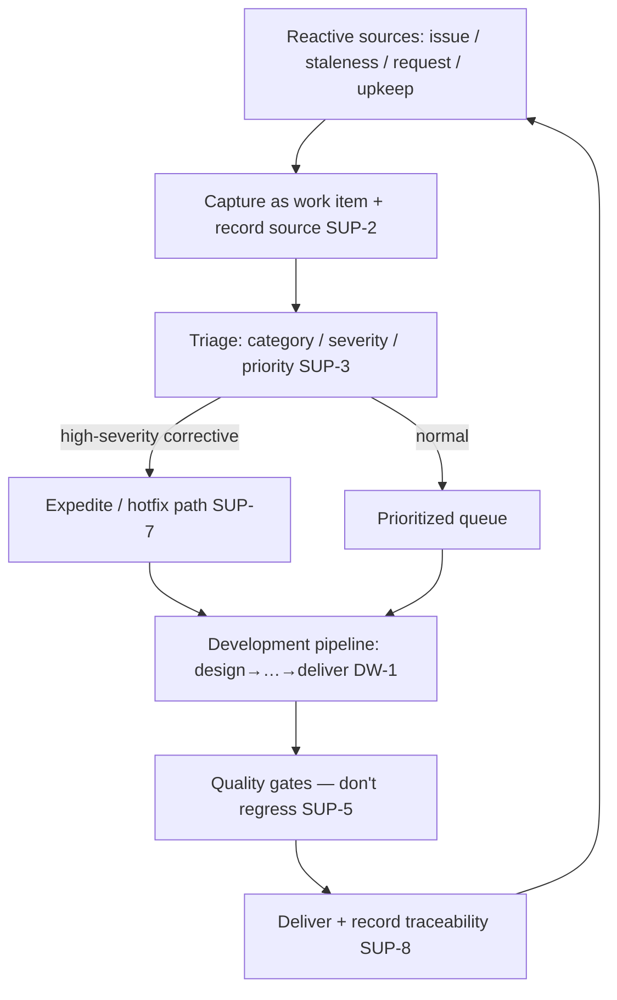

# Project Support

**Version:** 1.0.0
**Status:** Stable
**Layer:** concept

## Overview

Project support is the office's operational posture for a **delivered, live project**: the ongoing upkeep that begins where the initial build ends. Where construction is a bounded push toward first delivery, support is continuous and reactive — work arrives as inbound bug reports, content that has gone stale, requests and improvement ideas, and the steady drip of dependency and security upkeep, rather than as a fixed upfront backlog. The office triages what arrives, works the most important item next, and ships each change through the same quality gates as build work, because the defining risk of maintaining something live is regressing it.

Support is a *mode that sources and prioritizes work*, not a second way of building. Each individual support item — a bug fix, a content refresh, an enhancement — still flows through the normal development pipeline (design → plan → execute → review → deliver) in miniature. What this spec adds is the posture around that pipeline: where the work comes from when a project is live, how it is categorized and prioritized, that it never reaches a terminal "done," and the discipline that keeps a small fix from breaking a shipped product.

## Related Specifications

- [l1-workspace-lifecycle.md](l1-workspace-lifecycle.md) — The office over a project's whole life; support is the posture after first delivery, right-sized by the manager's adaptive hire/release (WSL-6) to a steady maintenance load rather than a one-time build push.
- [l1-development-workflow.md](l1-development-workflow.md) — Each support change still flows through the Design→Plan→Execute→Review→Deliver pipeline (DW-1); support is the mode that *sources and prioritizes* the work the pipeline then executes, never a bypass of it.
- [l1-quality-standards.md](l1-quality-standards.md) — Every support change passes the same mandatory gates (QLY-1/QLY-2/QLY-4); regression is support's central risk (SUP-5), and perfective support is the OFF-9 continuous-improvement discipline in its steady-state form.
- [l1-kanban-model.md](l1-kanban-model.md) — Support items are ordinary work items on the board; high-severity corrective work uses the board's expedite handling (SUP-7).
- [l2-trigger-triage.md](l2-trigger-triage.md) — The concrete inbound intake and triage support reuses (SUP-2/SUP-3) rather than building a parallel intake.
- [l1-issue-reporting.md](l1-issue-reporting.md) — Demarcation: issue reporting is the user-of-Cronus telling *Cronus's makers* about Cronus itself; project support is an *office maintaining a delivered project* and handling that project's own inbound issues. Different direction, different subject.
- [l1-project-priority.md](l1-project-priority.md) — A supported live project and an in-build project contend for shared resources under scarcity; the corrective expedite path (SUP-7) is the in-project analogue of cross-office priority arbitration.
- [l1-office-model.md](l1-office-model.md) — The office that holds the posture; the client does not micromanage the queue (OFF-5), and continuous improvement is a standing office property (OFF-9).

## 1. Motivation

Almost everything an office builds outlives the moment it is delivered. Once a project is live, the work does not stop — it changes shape. Bugs surface that no one caught before release and arrive as issues; content the office produced grows stale and needs refreshing; users ask for the next improvement; dependencies age and security advisories land. None of this is the original build, and none of it fits a build's shape: there is no upfront requirements document, no single "done," and the product being changed is one people are already relying on.

Without a named support posture, this reactive work has no home. It gets treated either as a never-ending build (which never converges, because new items keep arriving) or as ad-hoc interrupts (which get worked in arrival order, so a cosmetic typo can jump ahead of a data-loss bug, and a "quick fix" ships without review and breaks production). Neither is honest about what maintaining a live project actually requires: a steady intake, real triage, a continuous cadence, and — above all — a discipline that treats a change to something live as more dangerous than a change to something not yet shipped.

Project support encodes exactly that. It says where support work comes from, insists it be triaged before it is worked, accepts that it never ends, and holds every support change to the same quality bar as build work so the office can keep a delivered project healthy without breaking it.

## 2. Constraints & Assumptions

- **Support presupposes a delivery.** The posture is meaningful only once a project (or a component of it) is live and relied upon; a greenfield build in progress is not yet in support.
- **Work is reactive and multi-source.** Support work is not a planned backlog; it arrives from issues, staleness, requests, and upkeep signals, and must be captured as it arrives.
- **A live product must not regress.** Changing something in use is riskier than changing something unshipped; the tolerance for a support change breaking the product is lower, not higher.
- **Support reuses, it does not reinvent.** Intake/triage, the work board, the delivery pipeline, and the quality gates already exist; support orchestrates them for the maintenance case rather than duplicating them.
- **Honest over silent.** An open, aging, or deferred support item is visible with its reason; nothing the office was told about is silently dropped or closed.

## 3. Core Invariants (Layer 1 only)

Rules every Layer 2 implementation MUST NOT violate. They are technology-neutral.

- **SUP-1 (Support is a distinct, declared posture):** an office over a project can be in a **support posture** — an explicitly declared operational state, distinct from initial build, typically entered after first delivery. It is declared, not inferred. A project may move between build and support over its life, and may hold both at once (some components live and supported while others are still being built); the posture is tracked per project (and, where relevant, per component).

- **SUP-2 (Reactive, multi-source intake):** in support, work originates from declared reactive sources rather than a fixed upfront backlog — inbound bug reports/issues, content-staleness/freshness signals, user or client requests, dependency & security upkeep signals, and improvement opportunities the office surfaces. Every support item is captured as a normal work item with its originating source recorded; an item the office was told about is never lost.

- **SUP-3 (Triage before work):** every inbound support item is triaged before it is worked — classified by category, severity/impact, and priority — so the office works the most important item next, not the most recently arrived. Triage reuses the office's existing inbound-triage mechanism; support introduces no parallel intake path.

- **SUP-4 (Continuous — no terminal done):** the support posture has no completion state; it is ongoing upkeep for as long as the project is live. Individual support items complete; the posture does not. The office is right-sized for a steady maintenance load (adaptive staffing, WSL-6), scaling with inbound volume rather than a one-time build push.

- **SUP-5 (Every change flows through the quality gates — don't regress the live product):** a support change to a live product is still a change and MUST pass the same mandatory quality gates as build work (tests, review, regression checks per the quality standards) before it ships. Regression is support's defining risk: a fix or content update that breaks something in production is worse than the issue it addressed. No support change bypasses the definition-of-done on the grounds that it is "small."

- **SUP-6 (Typed, closed support categories):** support work is explicitly categorized — **corrective** (defect fixes from issues), **content** (refresh/correction of delivered content), **perfective** (product improvement/enhancement, the steady-state form of OFF-9), and **preventive/adaptive** (dependency, security, and platform upkeep) — each with its own handling emphasis. The category taxonomy is closed; adding or removing a category is a versioned amendment to this specification, not a runtime option.

- **SUP-7 (Severity-driven expedite, without relaxing discipline):** a high-severity defect in a live product may preempt normal prioritization via an expedite/hotfix path (consistent with the board's expedite handling and, across projects, project-priority arbitration). Expedite changes *urgency* only — it never relaxes correctness discipline: an expedited fix still passes the quality gates (SUP-5) and the same authority boundaries (SUP-9). Speed is bought from prioritization, never from skipping verification.

- **SUP-8 (End-to-end traceability, nothing silently closed):** every corrective support item is traceable from the originating issue → the change that addressed it → the verification that confirmed the fix → the delivery that shipped it, so a reporter can be told where it was fixed and a regression can be traced to its origin. A support item is resolved, deferred, or rejected explicitly and visibly — never silently closed.

- **SUP-9 (Same authority and safety boundaries as any work):** support gets no privileged path around human-in-the-loop authority, budget, security, or egress rules. A maintenance change to a live product is subject to the same approval gates for irreversible/destructive actions and the same secret/privacy discipline as build work. "It is just a small fix" is never a reason to skip an approval gate.

- **SUP-10 (Honest, observable support status):** the support posture is observable — open items by category and severity, their age, what is being worked, and what is deferred and why. Aging or stale items are surfaced, not buried; a deferred item is deferred visibly with a reason. The mechanical truth (real backlog, real ages) is always exposed alongside the metaphor — a lens, never a curtain.

> L2 specs cannot reach RFC status until all invariants here are addressed in their "Invariant Compliance" section.

## 4. Detailed Design

### 4.1 The support posture

```text
ProjectSupport {
  project_id     : ProjectId
  posture        : "build" | "support" | "mixed"   // declared, per project (SUP-1)
  since          : Timestamp                         // when support was entered
  components?    : Map<ComponentId, "build" | "support">  // per-component when mixed
}
```

A project (or a component of it) is in support once it is live and relied upon. `mixed` covers the common real case — a shipped v1 under support while v2 features are still in build — so the office can source reactive work for the live parts while continuing planned work on the rest.

### 4.2 Work intake and categorization

```text
[REFERENCE]
Support work sources (SUP-2)            Category (SUP-6)
  inbound issue / bug report      →     corrective
  staleness / freshness signal    →     content
  user / client request           →     perfective (or corrective if it is a defect)
  dependency / security advisory  →     preventive/adaptive
  office-surfaced improvement      →     perfective
```

Every arriving item becomes a work item (kanban card) with its source and category recorded, then enters triage (SUP-3): severity/impact and priority are assigned before the item is eligible to be worked. Triage is the office's existing inbound mechanism — support parameterizes it for the maintenance case, it does not fork it.

### 4.3 The support cycle



The loop is deliberately continuous (SUP-4): shipping one fix returns to the same intake, never to a "project complete" terminal. The pipeline and gates in the middle are the *existing* build machinery (development-workflow, quality-standards); support supplies the reactive front (sources, capture, triage) and the honest back (traceability, status).

### 4.4 Category handling emphasis

| Category | Trigger | Handling emphasis | Gate discipline |
| --- | --- | --- | --- |
| **corrective** | issue / bug report | severity-driven; may expedite (SUP-7) | full gates + regression focus |
| **content** | staleness / correction | freshness-driven; batch where cheap | full gates (content correctness) |
| **perfective** | request / improvement | value-vs-cost prioritized (OFF-9) | full gates |
| **preventive/adaptive** | dependency / security | risk-driven; security = conditional gate | full gates + security review when triggered |

All four share one rule: they pass the definition-of-done (SUP-5). They differ only in what drives their priority and which conditional gates apply.

### 4.5 Demarcation

| Spec | Concern | Relationship to support |
| --- | --- | --- |
| **This spec** | The posture of maintaining a delivered project (sources, triage, continuity, don't-regress) | — |
| l1-development-workflow | The per-change build pipeline (design→…→deliver) | Support routes each item *through* it |
| l1-issue-reporting | User-of-Cronus reporting Cronus itself to its makers | Different direction and subject; not project support |
| l1-workspace-lifecycle | Office creation, staffing, deletion over a project's life | Support is a posture *within* that life |
| l1-kanban-model | The work board and its lanes | Support items are cards; expedite is a lane |
| l1-project-priority | Cross-office scarce-resource arbitration | Expedite (SUP-7) is the in-project analogue |

## 5. Implementation Notes

1. **Posture flag first** — add the per-project (and per-component) build/support/mixed posture with an explicit "enter support" action; default a fresh project to build.
2. **Wire reactive sources** — feed inbound issues, staleness signals, requests, and upkeep advisories into the existing inbound-triage intake, tagging source and category.
3. **Triage parameterization** — extend triage classification with the support category taxonomy and a severity/impact field; add the expedite path for high-severity corrective.
4. **Route through the existing pipeline + gates** — support items are ordinary cards; reuse the development pipeline and quality gates unchanged (no bypass).
5. **Traceability + status surface** — record issue→change→verification→delivery links, and expose the support backlog with categories, severities, ages, and deferral reasons across CLI/TUI/GUI.

## 6. Drawbacks & Alternatives

- **No support posture — treat everything as build:** rejected — a build never converges when reactive items keep arriving, and it has no honest model for a live product's lower regression tolerance or its severity-driven urgency.
- **Ad-hoc interrupt handling (work items in arrival order):** rejected — arrival order lets a cosmetic issue preempt a critical one and invites "quick fixes" that skip review; SUP-3 (triage-first) and SUP-5 (gates always) exist precisely to prevent this.
- **A separate lightweight pipeline for "small" support changes:** rejected — a parallel low-rigor path is exactly how live products get regressed; SUP-5 keeps one definition-of-done, and expedite (SUP-7) buys speed from prioritization, not from dropping gates.
- **Open-ended category set:** rejected — an unbounded taxonomy makes handling emphasis and reporting incoherent; SUP-6 keeps the categories closed and versioned. <!-- TBD: revisit whether "content" warrants splitting from "corrective/perfective" once field data shows how much pure-content maintenance a typical office carries -->
- **Auto-inferred support entry (on first delivery):** tempting but rejected as the default — delivery is not always the moment support should start (staged rollouts, internal pre-release); SUP-1 keeps entry an explicit declaration, leaving a future advisory "looks delivered — enter support?" hint possible without making it automatic.

## Document History

| Version | Date | Change |
| --- | --- | --- |
| 1.0.0 | 2026-07-03 | Initial concept: project support as the office's operational posture for a delivered/live project — a distinct, declared build/support/mixed posture (SUP-1); reactive multi-source intake captured as work items (SUP-2); triage-before-work reusing the existing inbound mechanism (SUP-3); continuous with no terminal done, right-sized by adaptive staffing (SUP-4); every change through the same quality gates, regression as the central risk (SUP-5); a closed typed category taxonomy corrective/content/perfective/preventive-adaptive (SUP-6); severity-driven expedite that changes urgency but never discipline (SUP-7); end-to-end issue→change→verification→delivery traceability with nothing silently closed (SUP-8); the same authority/safety boundaries as any work (SUP-9); honest observable support status with visible aging and deferral (SUP-10). Sources and prioritizes work that flows through the existing development pipeline and quality gates; demarcated from issue-reporting and development-workflow in §4.5. |

## Canonical References

| Alias | Path | Purpose |
| --- | --- | --- |
| `[DEV-WORKFLOW]` | `.design/main/specifications/l1-development-workflow.md` | The per-change pipeline each support item flows through |
| `[QUALITY]` | `.design/main/specifications/l1-quality-standards.md` | The gates every support change must pass (SUP-5) |
| `[TRIAGE]` | `.design/main/specifications/l2-trigger-triage.md` | The inbound intake and triage support reuses (SUP-2/SUP-3) |
| `[LIFECYCLE]` | `.design/main/specifications/l1-workspace-lifecycle.md` | The office life the support posture sits within |
