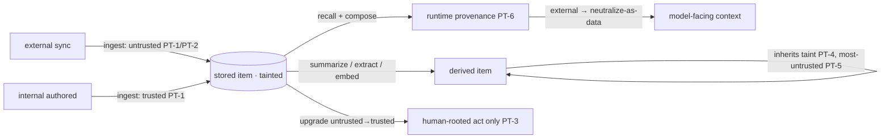

# Provenance Taint

**Version:** 1.0.1
**Status:** Stable
**Layer:** concept

## Overview

Not all remembered data is equally trustworthy. Content the user or the office authored is first-party; content synced in from the outside — an imported email, a fetched document, an external memory feed — is third-party and, from a security standpoint, untrusted. This spec names the discipline that keeps that distinction from being lost the moment data is stored: a persistent, propagating **origin taint** on every stored item, captured at ingest, preserved at rest across sessions, and inherited by every representation derived from it, so that whenever the data is later recalled and used, its origin-trust is known.

This is the **at-rest** complement to runtime trust-composition. The runtime provenance contract labels *values* as trusted or untrusted when they are composed into a model-facing prompt; provenance taint is what tells it the answer for a recalled memory — because that memory has carried its origin taint since the day it entered the store, through every summary, index, and abstraction built over it. The load-bearing rules are that external origin is untrusted by default, that taint **propagates through derivation** (a summary of tainted content is tainted; you cannot launder taint by summarizing), that combination takes the **most-untrusted** taint, and that the store **never silently upgrades** untrusted to trusted — a downgrade is free, an upgrade is a deliberate, human-rooted act.

## Related Specifications

- [l1-context-provenance.md](l1-context-provenance.md) — the **render-side** sibling: it neutralizes untrusted values at prompt composition; PT-6 **feeds** it — a recalled item's taint sets its runtime provenance. Taint is the at-rest half, context-provenance the in-flight half, of one continuous chain.
- [l1-data-lineage.md](l1-data-lineage.md) — taint **propagates along derivation edges** (PT-4/PT-5): a derived item inherits its sources' taint. Lineage answers *what produced this*; taint answers *is its origin trusted* — complementary, and taint rides lineage.
- [l1-component-scanning.md](l1-component-scanning.md) — vets external components/content for embedded threats; PT **taints** external-origin content so the vetting verdict and the untrusted-by-origin label travel together (composed, distinct concerns).
- [l1-memory-intelligence.md](l1-memory-intelligence.md) — MI-6 records a capture-time provenance-kind; this spec elevates the **origin taint** to a persistent, propagating, security-load-bearing contract over the whole memory corpus.
- [l1-security.md](l1-security.md) — SEC-10 human-rooted authority: a taint **upgrade** (untrusted → trusted) is a human-rooted act, never an agent self-grant (PT-3).
- [l1-attestation.md](l1-attestation.md) — **distinct**: attestation answers *is this authentic* (integrity/authorship); taint answers *is its origin trusted*. An authentic external document is still external-tainted.
- [l1-multi-device-sync.md](l1-multi-device-sync.md) — data synced from another device/source enters as external-origin and is tainted accordingly (PT-1/PT-2).
- [../../nodus/specifications/l1-nodus-language.md](../../nodus/specifications/l1-nodus-language.md) — NL-17 origin-taint provenance is the nodus-workflow realization: a value's provenance MAY carry a host-supplied origin taint, never relaxing the untrusted-by-default boundary.
- [l1-confidentiality-flow.md](l1-confidentiality-flow.md) — [ADDED v1.0.1] the confidentiality dual of this integrity-axis taint: CF mirrors PT-4/PT-5 sticky most-untrusted-wins propagation as sticky **most-confidential-wins**, bounding outbound sinks rather than inbound trust.

## 1. Motivation

An agent that syncs in external content — emails, shared documents, an external memory service, another device's corpus — and stores it alongside first-party notes creates a silent trust hazard. Once everything is "in memory," the system forgets which parts came from outside. Later it recalls a memory, composes it into a prompt, and treats it as trusted context — but that "memory" was an attacker-authored email the user synced in last week, and its embedded instruction now steers the agent. The runtime injection defense can only neutralize what it knows is untrusted; if the store has laundered the email's external origin into an anonymous "memory," the defense has nothing to act on.

Provenance taint closes this. External origin is stamped at ingest and is **sticky**: it survives storage, it survives summarization (a digest of ten emails is as untrusted as the emails), it survives entity extraction and embedding, and it is still attached when the item is recalled — so the runtime defense gets the right answer for free. The store cannot quietly upgrade untrusted to trusted; making external content trusted is a deliberate, authorized, human-rooted decision, not a side effect of consolidation. And the taint is inspectable, so a security review can enumerate everything of external origin and everything derived from it. The result: importing the world's content never dilutes the trust boundary.

## 2. Constraints & Assumptions

- Taint is a **security** property, captured at ingest and load-bearing thereafter; it is not a ranking signal and never a convenience field.
- The safe default is **untrusted**: unknown or external origin is untrusted; trust is affirmative, never assumed.
- Taint is **monotone toward untrust** under automatic operations: consolidation, summarization, and derivation may only preserve or raise untrust, never lower it.
- Taint composes the provenance family (lineage, attestation, context-provenance) and is distinct from each; it does not replace any.
- Layer 1: it names no label encoding or store. The concrete taint field and propagation implementation are Layer-2 concerns.

## 3. Core Invariants

Rules every Layer 2 realization MUST NOT violate. They are technology-neutral.

- **PT-1 (Taint captured at ingest, by origin):** every item entering the durable store is stamped **at ingest** with an **origin taint** classifying its source-trust — at minimum **internal-authored** (first-party) versus **external-synced** (third-party). The taint is captured **once, from the ingest path** (which source, which sync channel), not inferred later from content. An item with no recorded origin is treated as external (PT-2), never as internal.

- **PT-2 (External / unknown origin is untrusted by default):** an item of external, synced, or unknown origin is tainted **untrusted** by default. Trust is **affirmative** — presence in the store, similarity to trusted content, or age never confers trust. The default is safe: when in doubt, untrusted.

- **PT-3 (Persistent and immutable-downward — the store never launders taint):** the taint **persists on the stored item across sessions**. A **downgrade** (trusted → untrusted) is always permitted; an **upgrade** (untrusted → trusted) is **never automatic** — it requires an explicit, authorized, **human-rooted** act (composing SEC-10), recorded with who and when. No consolidation, summarization, or maintenance pass may silently turn untrusted content trusted.

- **PT-4 (Propagation through every derived representation):** any artifact **derived** from a stored item — a summary, an extracted entity, an embedding, an index row, a consolidated abstraction — **inherits the taint** of the content it derived from (propagating along the data-lineage edges). A summary of tainted content is tainted; extracting an entity from an untrusted email yields an untrusted entity. **Taint cannot be escaped by transformation.**

- **PT-5 (Most-untrusted-wins on combination):** when a derived item draws from **multiple sources of differing taint**, it takes the **most-untrusted** taint of its sources — a summary that mixes first-party notes with a synced external document is **untrusted**. Combination never averages untrust away, and a single untrusted source taints the whole derivation.

- **PT-6 (Taint sets runtime provenance on recall):** when a tainted item is **recalled and composed** into a model-facing context, its taint **determines its runtime trust-provenance** — an external-tainted memory recalled into a prompt is treated as untrusted and neutralized-as-data by default (feeding, not duplicating, the runtime trusted-composition contract). The at-rest taint and the in-flight provenance are **one continuous chain**: this spec owns capture + persistence + propagation, the render-side contract owns neutralization.

- **PT-7 (Inspectable and auditable):** every item's taint and its origin are **inspectable**, and a security review can **enumerate** all external-tainted content and everything derived from it (composing lineage). Taint is never hidden, and "what untrusted content is in my store, and what did it influence" is an answerable query, not a guess.

- **PT-8 (Composes the provenance family; distinct from integrity):** provenance taint answers **is its origin trusted**, composing component-scanning (was external content vetted) and data-lineage (what produced this), and is **distinct** from attestation (is this authentic — an authentic external document is still external-tainted) and from the render-side neutralization it feeds. The provenance family runs by data-life phase: **origin-trust (this spec) → derivation (lineage) → authenticity (attestation) → render-trust (context-provenance)**; none is conflated with another.

> L2 specs cannot reach RFC status until all invariants here are addressed in their "Invariant Compliance" section.

## 4. Detailed Design

### 4.1 Taint through the data lifecycle

Taint enters at ingest, rides through every derivation unchanged-or-more-untrusted, and re-emerges at recall as the runtime provenance the render-side defense consumes. The only path from untrusted to trusted is the human-rooted upgrade (PT-3); every automatic path preserves or raises untrust.

### 4.2 The two axes: taint vs. lineage

| Question | Owner | Value |
| --- | --- | --- |
| *What produced this?* (derivation) | l1-data-lineage | the source items and the transform |
| *Is its origin trusted?* (this spec) | l1-provenance-taint | internal-authored / external-synced (untrusted) |

They ride the same derivation edges but carry different payloads: lineage records *which* source; taint records *how trusted* that source's origin is. Taint **uses** lineage (PT-4 propagates along lineage edges) but is a distinct label — an item can have perfectly clear lineage and still be untrusted because its origin is external.

### 4.3 Why monotone-toward-untrust

Making taint monotone under automatic operations (PT-3 immutable-downward, PT-4 inherit, PT-5 most-untrusted-wins) is what makes it a *safety* property rather than a hint. If a summary could be "cleaner" than its untrusted inputs, an attacker would launder an injected instruction through a summarization pass; if consolidation could upgrade trust, the corpus would drift trusted over time regardless of origin. Monotonicity forecloses both: the only way content becomes trusted is a deliberate human act that is recorded and reviewable.

## 5. Drawbacks & Alternatives

**Alternative: trust everything in the store.** Rejected by PT-2 — it is exactly the laundering hazard; synced external content would be recalled as trusted context and become an injection vector.

**Alternative: taint only the raw item, not its derivatives.** Rejected by PT-4/PT-5 — summarization and extraction would strip the taint, so the untrusted content's influence survives while its label does not. Taint must ride every derivation.

**Alternative: let consolidation upgrade trust as content proves useful.** Rejected by PT-3 — usefulness is not trust-of-origin; an attacker-authored note can be useful. Upgrade is human-rooted only.

**Risk: over-tainting (everything untrusted).** If most content is external, most is untrusted, which could over-neutralize. Mitigation: the taxonomy is per-origin (PT-1), the human-rooted upgrade path exists (PT-3), and the render-side decides neutralization strength — taint only ensures the render side has the honest answer.

## Canonical References

| Alias | Path | Purpose |
| --- | --- | --- |
| `[RENDER]` | `.design/main/specifications/l1-context-provenance.md` | The render-side contract PT-6 feeds (at-rest taint → in-flight provenance) |
| `[LINEAGE]` | `.design/main/specifications/l1-data-lineage.md` | The derivation edges taint propagates along (PT-4/PT-5) |
| `[SECURITY]` | `.design/main/specifications/l1-security.md` | SEC-10 human-rooted authority governing a taint upgrade (PT-3) |
| `[NODUS]` | `.design/nodus/specifications/l1-nodus-language.md` | The host-neutral realization: NL-17 origin-taint provenance |

## Document History

| Version | Date | Author | Notes |
| --- | --- | --- | --- |
| 1.0.0 | 2026-07-09 | Core Team | Initial stable spec — provenance taint: the at-rest, persistent, propagating origin-trust taint on stored data, complement to render-side trust-composition. Captured at ingest by origin, internal-authored vs external-synced (PT-1); external/unknown untrusted by default, trust affirmative (PT-2); persistent + immutable-downward, the store never launders taint, upgrade is human-rooted only (PT-3); propagates through every derived representation — summary/entity/embedding/index inherit taint (PT-4); most-untrusted-wins on combination (PT-5); sets runtime provenance on recall, feeding the render-side neutralization (PT-6); inspectable + auditable enumeration of external-tainted content and its influence (PT-7); composes component-scanning + data-lineage, distinct from attestation, ordered by data-life phase origin→derivation→authenticity→render (PT-8). Composes l1-context-provenance / l1-data-lineage / l1-component-scanning / l1-memory-intelligence / l1-security. Distilled from an adoption pass over an external memory-engine reference (per-item internal-vs-external-sync security taint with source provenance). |
