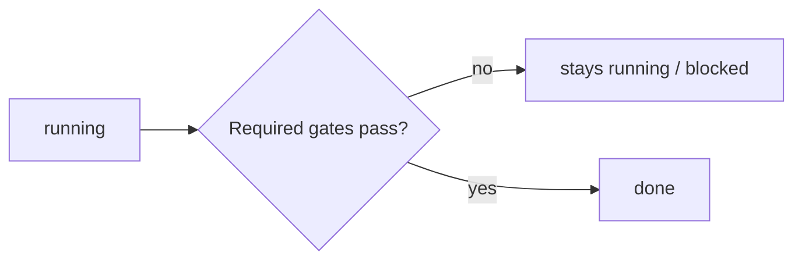

# Quality Standards

**Version:** 1.1.0
**Status:** Stable
**Layer:** concept

## Overview

The technology-agnostic definition of "ideal code" for Cronus: a set of mandatory **quality gates** that any code must pass before its work item is considered done. Gates are tiered (always-on versus conditional), enforced by dedicated quality roles, and applied uniformly to any project the office builds and to Cronus's own codebase (dogfooding).

## Related Specifications

- [l1-kanban-model.md](l1-kanban-model.md) - Gates are the entry condition for the `done` state.
- [l1-office-model.md](l1-office-model.md) - Quality roles (test, review, refactor, performance, security) enforce the gates; continuous improvement (OFF-9).
- [l2-quality-pipeline.md](l2-quality-pipeline.md) - Concrete per-language toolchains, CI/pre-commit gates, and commands.

## 1. Motivation

"Maximum automation" is worthless if the office ships sloppy code. Encoding quality as non-negotiable gates tied to the definition-of-done means correctness, style, performance, and security are guaranteed by the process rather than by hope. Tiering keeps the common path fast (always run cheap, high-value checks) while reserving expensive checks (benchmarks, deep security) for when they matter. Holding Cronus itself to the same bar keeps the product honest.

## 2. Constraints & Assumptions

- The office builds projects in varying languages; gates are expressed as concepts, realized by each project's standard toolchain.
- Gates must be automatable and runnable locally, in CI, and on demand.
- "Mandatory" means blocking: a failed required gate stops completion.
- Quality is continuous, not a one-time pass at the end.

## 3. Core Invariants (Layer 1 only)

Rules every Layer 2 implementation MUST NOT violate:

- **QLY-1 (Gate = definition-of-done):** a work item MUST NOT reach `done` until all of its required quality gates pass.
- **QLY-2 (Always-on gates):** automated **tests**, **static analysis / linting**, and **type & format checks** are mandatory for every code change.
- **QLY-3 (Conditional gates):** **benchmarks** are mandatory for performance-relevant changes; **security review** is mandatory for security-sensitive changes. When their trigger applies, they are not optional.
- **QLY-4 (Review & refactor before done):** code is reviewed and refactored to the project's standards before acceptance; review is a required step.
- **QLY-5 (Role-enforced):** dedicated quality roles own their respective gates (testing, review, refactoring, performance, security); the manager routes work through them.
- **QLY-6 (Universal applicability + dogfooding):** gates apply to ANY code the office produces, using the standards and toolchain appropriate to that project's language; Cronus's own codebase is held to the same bar.
- **QLY-7 (Blocking and traceable):** a failed required gate blocks `done` and records what failed; gate passage is recorded in the work item's history.
- **QLY-8 (Continuous improvement):** refactoring is ongoing and quality is non-decreasing (consistent with OFF-9); quality debt is surfaced, never silently hidden.
- **QLY-9 (Gate-scope completeness):** `[ADDED]` the always-on gates (QLY-2) cover **every shipped deliverable unit** of the product — no library, frontend, or shell is exempt by construction or by build layout. A unit that the default gate runner cannot reach (for example, one built outside the primary build graph) MUST have an equivalent explicit gate lane of its own, and both the exclusion and its lane are recorded where the gates are defined. A shipped unit that no gate covers is a QLY-8 quality-debt finding to surface, never a silent gap: "gates green" MUST mean green for the whole shipped product, not for the subset the default runner happens to see.

> L2 specs cannot reach RFC status until all invariants here are addressed in their "Invariant Compliance" section.

## 4. Detailed Design

### 4.1 Gate tiers

| Tier | Gate | When |
| --- | --- | --- |
| Always | tests | every code change |
| Always | static analysis / lint | every code change |
| Always | type & format check | every code change |
| Conditional | benchmarks | performance-relevant change |
| Conditional | security review | security-sensitive change |
| Before done | review & refactor | every accepted change |

### 4.2 Gate placement in the work pipeline

A card cannot cross into `done` until its required gates are green (QLY-1, QLY-7).

### 4.3 Roles that enforce gates

| Gate | Owning role |
| --- | --- |
| tests | test-writer |
| review | code-reviewer |
| refactor | refactorer |
| benchmarks / performance | performance-optimizer |
| security | security-auditor |
| defect diagnosis | debugger |

### 4.4 Scope

The same gate concepts apply whether the office is building a client's project (gates run with that project's language toolchain) or evolving Cronus itself (gates run with Cronus's toolchain). One standard, applied everywhere (QLY-6).

`[ADDED]` Scope is enumerated, not assumed (QLY-9): the set of shipped deliverable units is listed where the gates are defined, and each unit maps to the gate lane that covers it. When a unit legitimately builds outside the primary build graph, its own lane runs the same always-on gates; the completion claim aggregates **all** lanes.

## 5. Drawbacks & Alternatives

- **Gate latency:** always-on gates add time to every change; mitigated by tiering and by running cheap checks first.
- **Alternative — advisory quality (non-blocking):** rejected; "mandatory" is explicit, and advisory checks erode over time.
- **Alternative — all gates always:** rejected as the default; running benchmarks/deep-security on every trivial change wastes resources. <!-- TBD: precise triggers that mark a change "performance-relevant" or "security-sensitive" -->

## Canonical References

| Alias | Path | Purpose |
| --- | --- | --- |
| `[KANBAN]` | `.design/main/specifications/l1-kanban-model.md` | The `done` state these gates guard |
| `[OFFICE]` | `.design/main/specifications/l1-office-model.md` | Quality roles and continuous improvement |
| `[PIPELINE]` | `.design/main/specifications/l2-quality-pipeline.md` | Concrete toolchains and gate execution |

## Document History

| Version | Date | Author | Notes |
| --- | --- | --- | --- |
| 1.1.0 | 2026-07-16 | Core Team | Added QLY-9 (gate-scope completeness): always-on gates cover every shipped deliverable unit; a unit outside the default gate runner requires an equivalent explicit lane, recorded; an uncovered shipped unit is a surfaced QLY-8 debt finding. §4.4 extended (enumerated scope, aggregated completion claim). History table added with this entry. Audit finding: a shell built outside the primary build graph was invisible to the workspace-wide gates. |
| 1.0.0 | 2026-06-24 | Core Team | Initial stable spec — QLY-1…QLY-8: tiered mandatory gates as definition-of-done, role-enforced, universal + dogfooding. |
