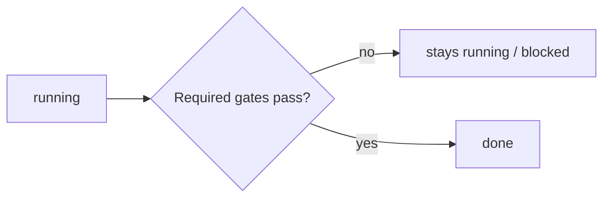

# Quality Standards

**Version:** 1.2.1
**Status:** Stable
**Layer:** concept

## Overview

The technology-agnostic definition of "ideal code" for Cronus: a set of mandatory **quality gates** that any code must pass before its work item is considered done. Gates are tiered (always-on versus conditional), enforced by dedicated quality roles, and applied uniformly to any project the office builds and to Cronus's own codebase (dogfooding).

## Related Specifications

- [l1-kanban-model.md](l1-kanban-model.md) - Gates are the entry condition for the `done` state.
- [l1-office-model.md](l1-office-model.md) - Quality roles (test, review, refactor, performance, security) enforce the gates; continuous improvement (OFF-9).
- [l2-quality-pipeline.md](l2-quality-pipeline.md) - Concrete per-language toolchains, CI/pre-commit gates, and commands.
- [l1-usage-simulation.md](l1-usage-simulation.md) - The free-route discovery instrument the behavioural gate runs: its cheap tier is the always-on gate named by QLY-10 (not QLY-2, whose three items are all mechanical), its broad and exhaustive tiers are conditional under QLY-3, only its obligations decide a gate (USM-3), an unfinished run is undecided rather than passing (USM-9), and a behaviour shipped with no scenario covering it is QLY-8 quality debt (USM-10).
- [l1-whole-system-rehearsal.md](l1-whole-system-rehearsal.md) - The assembly-grain sweep: conditional under QLY-3 on its declared cadence, and deliberately never an always-on gate (WSR-3), since blocking every change on a whole-system run is how the cadence gets suspended and then forgotten.
- [l1-remedy-authority.md](l1-remedy-authority.md) - What may be done about a **discovery** the behavioural gate's scenario run surfaces alongside its verdict (USM-13) — never about the verdict itself. A failed obligation simply fails the gate and is fixed as ordinary development (QLY-1/QLY-7); RA-1's per-class authority and RA-2's pin-as-precondition govern only a route-specific discovery the run reports beside that verdict, exactly as they govern any other usage-simulation discovery. An ordinary QLY-2 test/lint/type failure is untouched by RA — it never carried an IMP-1 class to begin with.

## 1. Motivation

"Maximum automation" is worthless if the office ships sloppy code. Encoding quality as non-negotiable gates tied to the definition-of-done means correctness, style, performance, and security are guaranteed by the process rather than by hope. Tiering keeps the common path fast (always run cheap, high-value checks) while reserving expensive checks (benchmarks, deep security) for when they matter. Holding Cronus itself to the same bar keeps the product honest.

## 2. Constraints & Assumptions

- The office builds projects in varying languages; gates are expressed as concepts, realized by each project's standard toolchain.
- Gates must be automatable and runnable locally, in CI, and on demand.
- "Mandatory" means blocking: a failed required gate stops completion.
- Quality is continuous, not a one-time pass at the end.

## 3. Core Invariants (Layer 1 only)

Rules every Layer 2 implementation MUST NOT violate:

- **QLY-1 (Gate = definition-of-done):** a work item MUST NOT reach `done` until all of its required quality gates pass.
- **QLY-2 (Always-on gates):** automated **tests**, **static analysis / linting**, and **type & format checks** are mandatory for every code change.
- **QLY-3 (Conditional gates):** **benchmarks** are mandatory for performance-relevant changes; **security review** is mandatory for security-sensitive changes. When their trigger applies, they are not optional.
- **QLY-4 (Review & refactor before done):** code is reviewed and refactored to the project's standards before acceptance; review is a required step.
- **QLY-5 (Role-enforced):** dedicated quality roles own their respective gates (testing, review, refactoring, performance, security); the manager routes work through them.
- **QLY-6 (Universal applicability + dogfooding):** gates apply to ANY code the office produces, using the standards and toolchain appropriate to that project's language; Cronus's own codebase is held to the same bar.
- **QLY-7 (Blocking and traceable):** a failed required gate blocks `done` and records what failed; gate passage is recorded in the work item's history.
- **QLY-8 (Continuous improvement):** refactoring is ongoing and quality is non-decreasing (consistent with OFF-9); quality debt is surfaced, never silently hidden.
- **QLY-10 (Behavioural gate — the cheap scenario tier runs beside the mechanical ones):** `[ADDED v1.2.0]` every gate in QLY-2 is **mechanical**: tests, lint, and type/format each judge the code as an artifact, and none of them judges whether a person can still get anything done with it. A change can therefore pass every always-on gate while having made the product unusable, and nothing in the definition-of-done notices. Where a project has a derived scenario corpus, that corpus's **cheap tier is a required gate** for every change to behaviour it covers — run beside the mechanical three and blocking on the same terms (QLY-1/QLY-7). Three limits keep it from destroying itself. Only the **cheap** tier gates; the broad and exhaustive tiers and any whole-system sweep are **conditional** (QLY-3), because blocking the smallest change on the largest run is how the discipline gets suspended and then abandoned. Only **obligations** decide the gate — a route-specific discovery never fails a change, since a gate that fails on findings is flaky and a flaky gate is turned off. And a run that did not finish is **undecided, not passed**: it blocks as an unresolved gate rather than being folded into either outcome. A project whose user-observable behaviour has no corpus to run against is a QLY-8 quality-debt finding to **surface**, never a silent exemption from this gate.

- **QLY-9 (Gate-scope completeness):** `[ADDED]` the always-on gates (QLY-2) cover **every shipped deliverable unit** of the product — no library, frontend, or shell is exempt by construction or by build layout. A unit that the default gate runner cannot reach (for example, one built outside the primary build graph) MUST have an equivalent explicit gate lane of its own, and both the exclusion and its lane are recorded where the gates are defined. A shipped unit that no gate covers is a QLY-8 quality-debt finding to surface, never a silent gap: "gates green" MUST mean green for the whole shipped product, not for the subset the default runner happens to see.

> L2 specs cannot reach RFC status until all invariants here are addressed in their "Invariant Compliance" section.

## 4. Detailed Design

### 4.1 Gate tiers

| Tier | Gate | When |
| --- | --- | --- |
| Always | tests | every code change |
| Always | static analysis / lint | every code change |
| Always | type & format check | every code change |
| Always | cheap scenario tier `[ADDED v1.2.0]` | every change to behaviour the corpus covers (QLY-10) |
| Conditional | benchmarks | performance-relevant change |
| Conditional | security review | security-sensitive change |
| Conditional | broad / exhaustive scenario tiers `[ADDED v1.2.0]` | milestone, release candidate, on demand |
| Conditional | whole-system sweep `[ADDED v1.2.0]` | declared cadence, or on request |
| Before done | review & refactor | every accepted change |

### 4.2 Gate placement in the work pipeline

```mermaid
graph LR
    RUN[running] --> GATES{Required gates pass?}
    GATES -->|no| BACK[stays running / blocked]
    GATES -->|yes| DONE[done]
```

A card cannot cross into `done` until its required gates are green (QLY-1, QLY-7).

### 4.3 Roles that enforce gates

| Gate | Owning role |
| --- | --- |
| tests | test-writer |
| review | code-reviewer |
| refactor | refactorer |
| benchmarks / performance | performance-optimizer |
| security | security-auditor |
| defect diagnosis | debugger |
| behavioural (cheap scenario tier) `[ADDED v1.2.0]` | the scenario-performing actor of `l1-uninformed-actor` — its role-catalog preset is a standing, recorded gap, and until it exists this gate is owned by whoever runs the corpus |

### 4.4 Scope

The same gate concepts apply whether the office is building a client's project (gates run with that project's language toolchain) or evolving Cronus itself (gates run with Cronus's toolchain). One standard, applied everywhere (QLY-6).

`[ADDED]` Scope is enumerated, not assumed (QLY-9): the set of shipped deliverable units is listed where the gates are defined, and each unit maps to the gate lane that covers it. When a unit legitimately builds outside the primary build graph, its own lane runs the same always-on gates; the completion claim aggregates **all** lanes.

## 5. Drawbacks & Alternatives

- **Gate latency:** always-on gates add time to every change; mitigated by tiering and by running cheap checks first.
- **Alternative — advisory quality (non-blocking):** rejected; "mandatory" is explicit, and advisory checks erode over time.
- **Alternative — all gates always:** rejected as the default; running benchmarks/deep-security on every trivial change wastes resources. <!-- TBD: precise triggers that mark a change "performance-relevant" or "security-sensitive" -->

## Canonical References

| Alias | Path | Purpose |
| --- | --- | --- |
| `[KANBAN]` | `.design/main/specifications/l1-kanban-model.md` | The `done` state these gates guard |
| `[OFFICE]` | `.design/main/specifications/l1-office-model.md` | Quality roles and continuous improvement |
| `[PIPELINE]` | `.design/main/specifications/l2-quality-pipeline.md` | Concrete toolchains and gate execution |

## Document History

| Version | Date | Author | Notes |
| --- | --- | --- | --- |
| 1.2.1 | 2026-09-13 | Core Team | Patch — **second review: `RFC → Stable`.** A genuinely independent second pass found one real overreach in v1.2.0's own Related Specifications line: it described `l1-remedy-authority` in terms broad enough to read as "every failed gate is a finding governed by RA's classification ceremony" — literally, that an ordinary failing `cargo test` would need an IMP-1 class and a rung before anyone could fix it. That was never RA's intent; its own scope (checked against the full spec, not memory) is remedies to **classified discoveries** a simulation/rehearsal instrument surfaces, not to the deterministic pass/fail verdict a gate already produces. Corrected: the line now scopes RA to the route-specific *discovery* a behavioural-gate scenario run reports beside its verdict — the same discovery a usage-simulation run would report under identical terms — and states explicitly that an ordinary QLY-2 failure and a QLY-10 obligation failure are both untouched by RA, fixed as ordinary development under QLY-1/QLY-7 exactly as before RA existed. No other lens (Layer Purity, Ecosystem/Extensibility, Execution/Testability, Zero-Context Usability) surfaced a blocking finding — the QLY-9/QLY-10 Pending rows in `l2-quality-pipeline` were independently checked against that file's actual §4.11 content and found accurate. `[DR]` Promoted to Stable on this pass rather than held for a third review, matching this project's own established bar (a genuine second, independent look that finds and fixes exactly one real defect) — holding further would be process for its own sake. `l2-quality-pipeline` follows via C12's upward reversal (`spec.md`'s own authority, never `task.md`'s): its own §3 QLY-9/QLY-10 rows stay honestly **Pending**, reconciled at the next `/magic.task main`. |
| 1.2.0 | 2026-09-13 | Core Team | Added **QLY-10 (behavioural gate)** and corrected a cross-reference that had been asserting it for a version. v1.1.1's Related Specifications line claimed the cheap scenario tier "joins the always-on gates (QLY-2)" — but QLY-2's own normative text lists exactly three items, all mechanical, and simulation is not among them. The cross-reference promised a gate the invariant did not encode, so a reader following the link found nothing and a reader trusting the summary believed behaviour was gated when it was not. QLY-10 makes the claim true rather than retracting it: where a derived scenario corpus exists, its **cheap tier** is a required always-on gate for every change to behaviour it covers, blocking on QLY-1/QLY-7's terms, and bounded by three limits — only the cheap tier gates (broad, exhaustive, and whole-system runs stay conditional under QLY-3, since blocking the smallest change on the largest run is how a discipline gets suspended and then abandoned), only **obligations** decide it (a route-specific discovery never fails a change, or the gate is flaky and a flaky gate is switched off), and an unfinished run is **undecided rather than passed**. A project whose user-observable behaviour has no corpus is a surfaced QLY-8 debt finding, never a silent exemption. §4.1 gains the always-on cheap-tier row plus conditional rows for the broad/exhaustive tiers and the whole-system sweep; §4.3 gains the owning role, recorded honestly as pending its catalog preset. Related Specifications additionally cross-reference `l1-whole-system-rehearsal` (the cadence-driven assembly sweep, conditional by construction per WSR-3) and `l1-remedy-authority` (a failed gate is a finding; failing does not itself license repair). Status reverts `Stable → RFC` per the amendment rule pending Post-Update Review; `l2-quality-pipeline` is quarantined in the same act (C12 downward cascade). |
| 1.1.1 | 2026-09-11 | Core Team | Patch — cross-reference to `l1-usage-simulation`: the free-route discovery instrument that sits beside these gates, with its cheap tier joining QLY-2, its exhaustive sweep conditional under QLY-3, and a behaviour shipped with no covering scenario recorded as QLY-8 quality debt. Documentation linkage only; no invariant added or changed. |
| 1.1.0 | 2026-07-16 | Core Team | Added QLY-9 (gate-scope completeness): always-on gates cover every shipped deliverable unit; a unit outside the default gate runner requires an equivalent explicit lane, recorded; an uncovered shipped unit is a surfaced QLY-8 debt finding. §4.4 extended (enumerated scope, aggregated completion claim). History table added with this entry. Audit finding: a shell built outside the primary build graph was invisible to the workspace-wide gates. |
| 1.0.0 | 2026-06-24 | Core Team | Initial stable spec — QLY-1…QLY-8: tiered mandatory gates as definition-of-done, role-enforced, universal + dogfooding. |
