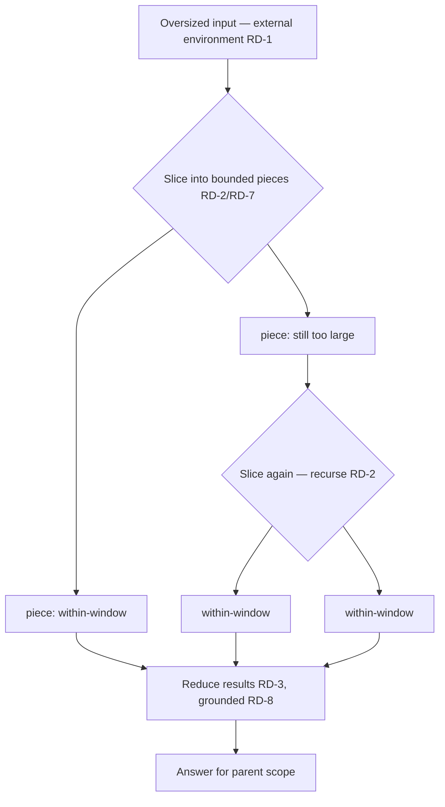

# Recursive Decomposition

**Version:** 1.0.0
**Status:** Stable
**Layer:** concept

## Overview

Some inputs are simply too large to fit a model's effective window — a multi-megabyte log, a whole codebase, a long corpus of documents. The usual responses are to **shrink** the input (compression) or to **defer loading** parts of it (progressive disclosure). This spec names a third, orthogonal stance: **process it in place, recursively, in bounded pieces**. The oversized input is treated not as a payload to squeeze into the window but as an **external, addressable environment**: the model examines and slices it, applies itself (or a sub-model) recursively over each within-window piece, and combines the pieces' results back up — so the *effective* context processed can exceed the raw window without ever holding the whole input at once.

The load-bearing properties are that decomposition is **map-then-reduce** (per-piece processing then a bounded combination, never a re-concatenation into an over-window blob), that the recursion is **bounded by construction** in depth and breadth (a finite, fail-safe call tree), that the tree is **observable and cost-rolled-up** (every recursive child is a first-class run whose usage and cost roll up to its parent), and that the reduction is **grounded** — the combined answer synthesizes only what the pieces returned and never fabricates coverage the decomposition did not actually perform.

## Related Specifications

- [l1-context-compression.md](l1-context-compression.md) — the **shrink** stance on an over-window input; recursive decomposition is the third stance (RD-6), orthogonal — it neither shrinks nor loads, it processes in place.
- [l1-progressive-disclosure.md](l1-progressive-disclosure.md) — the **defer-loading** stance; distinct from decomposition (RD-6): PD lazily loads catalog tiers it has descriptors for, RD recursively processes pieces of one oversized input.
- [l1-orchestration.md](l1-orchestration.md) — the sub-call / delegation and context-isolation machinery a recursive child runs on (ORC-5); the recursion depth bound composes the delegation-depth bound (HC-6).
- [l1-loop-governance.md](l1-loop-governance.md) — the bounded-execution discipline RD-4 extends from loops to recursion (a mandatory bound, fail-safe on exceed).
- [l1-generation-budget.md](l1-generation-budget.md) — the cost the decomposition tree rolls up (RD-5); a decomposition's total spend must be accountable.
- [l1-data-lineage.md](l1-data-lineage.md) — a reduced result traces to the pieces it was combined from (RD-7); decomposition rides lineage.
- [l1-claim-verification.md](l1-claim-verification.md) — the grounding contract RD-8 composes: the reduction invents nothing absent from the pieces.
- [l1-deep-research.md](l1-deep-research.md) — the sibling that gathers from **external open-ended sources**; recursive decomposition processes a **given, bounded oversized input**.
- [../../nodus/specifications/l1-nodus-language.md](../../nodus/specifications/l1-nodus-language.md) — NL-18 bounded recursive decomposition is the nodus-workflow realization: a recursive `RUN` with a mandatory depth bound, map-reduce over pieces.

## 1. Motivation

The default way to handle an input larger than the window is to jam it in and hope — truncate the tail, or summarize aggressively, and accept that whatever fell out is gone. Both degrade badly at scale: a 10-million-token codebase does not summarize into a window without losing exactly the detail the task needed, and truncation is arbitrary. Compression and progressive disclosure help, but they still assume the goal is to *get the content into the window*. For a genuinely oversized, heterogeneous input, that assumption is the problem.

Recursive decomposition drops the assumption. The input stays where it is — an external environment the model navigates programmatically. The model slices it into within-window pieces, processes each piece with a fresh bounded call (recursing again on any piece still too big), and combines the results. Each individual call sees only a manageable slice, so no call ever fights the window; yet the decomposition as a whole covers the entire input. The cost is real (many calls), so the tree is bounded and its spend rolls up to be accountable; the risk is silent gaps (a piece skipped), so unexamined regions are declared rather than glossed and the reduction is grounded strictly in what was actually processed. The result: effective context that scales past the window, honestly and boundedly.

## 2. Constraints & Assumptions

- Decomposition trades **more calls** for **coverage past the window**; it is applied when an input genuinely exceeds what compression/disclosure can bring in, not reflexively.
- Every actual model call operates on a **within-window** slice — the point is that no single call ever carries the whole input.
- The call tree must be **finite and bounded by construction** — depth and breadth caps are mandatory, not advisory.
- Decomposition composes the sub-call/orchestration, budget, lineage, and grounding contracts; it does not reinvent delegation, accounting, or verification.
- Layer 1: it names no window size, chunker, or model. The slicing strategy and thresholds are Layer-2 / policy.

## 3. Core Invariants

Rules every Layer 2 realization MUST NOT violate. They are technology-neutral.

- **RD-1 (Over-window input is an environment, not a payload):** an input too large for the effective window is **not ingested whole**; it is treated as an **external, addressable environment** the model **examines, slices, and navigates programmatically** rather than swallowing. The whole input never has to occupy the window at once.

- **RD-2 (Recursive processing over bounded pieces):** the input is processed by **decomposing it into bounded pieces** and applying the model — itself or a sub-model — **recursively** over each; a piece still too large is **decomposed again**, so **every actual model call operates on a within-window slice**. The effective processed context thereby **exceeds the raw window**.

- **RD-3 (Combine, don't concatenate):** per-piece results are **combined** (reduced / synthesized) into the parent scope's answer, recursively up the tree — a decomposition is **map-then-reduce**, never a re-concatenation of raw pieces back into an over-window blob. A reduction over too many child results is **itself decomposed** (a bounded reduce), so the combine step never re-creates the window problem.

- **RD-4 (Bounded by construction, fail-safe):** recursion declares an explicit **depth bound** and a per-level **breadth bound**; the call tree is **finite by construction**. Exceeding a bound is a **fail-fast, surfaced error** — never a silent unbounded blow-up — and when a piece cannot be bounded to a within-window slice the safe default is to **halt and surface**, never to force the over-window piece through.

- **RD-5 (Observable, cost-rolled-up tree):** every recursive child is a **first-class run with a parent/root correlation**, and its events, token usage, and cost **roll up to its parent** so the **total cost of a decomposition is accountable** and the whole tree is inspectable (composing observability and the generation budget). A recursive call whose cost is not attributed up the tree is a defect.

- **RD-6 (A third stance, distinct from shrink and defer):** recursive decomposition is orthogonal to **compression** (shrink the input) and **progressive disclosure** (defer loading catalog tiers): it **neither reduces nor loads** the input — it **processes it in place, recursively, in bounded pieces**. Which stance to take is a **policy decision by input shape**: a large redundant-structured input compresses; a large catalog discloses on demand; a large heterogeneous corpus the task must actually cover **decomposes**.

- **RD-7 (Deterministic slicing):** for a given input and decomposition policy, the way the input is **sliced into pieces is deterministic and reproducible** (same input + same policy → same piece boundaries), so a decomposition is **replayable** and each combined result is **attributable to the specific slices** it was reduced from (composing data-lineage). Nondeterministic slicing that makes a result unattributable to its sources is forbidden.

- **RD-8 (Grounded reduction — coverage may be lost, never faked):** the combined result is **grounded strictly in the pieces' results** — the reduction synthesizes what the pieces returned and MUST NOT invent content absent from them (composing the grounding contract). A decomposition MAY lose **coverage** (a piece not examined, a bound reached), but it MUST NOT **fabricate** coverage it did not perform: **unexamined regions are declared, not glossed**, so a partial decomposition is honest about what it did and did not process.

> L2 specs cannot reach RFC status until all invariants here are addressed in their "Invariant Compliance" section.

## 4. Detailed Design

### 4.1 The decomposition tree



Each leaf is a within-window model call (RD-2); internal nodes reduce their children (RD-3); depth and breadth are capped (RD-4); every node is a correlated run whose cost rolls up (RD-5); and the reduction at each level is grounded in its children (RD-8).

### 4.2 Choosing the stance (RD-6)

```text
[REFERENCE]
handle_oversized(input, task):
    if dominated_by_redundant_structure(input):   return compress(input)          // l1-context-compression
    if a_catalog_browsed_on_demand(input):         return disclose_progressively(input) // l1-progressive-disclosure
    if task_must_cover_a_large_heterogeneous_whole(input):
                                                   return decompose_recursively(input)  // this spec
```

The three stances are complementary, not competing — a realization picks by input shape, and may compose them (decompose a corpus, compressing each oversized piece before its within-window call).

## 5. Drawbacks & Alternatives

**Alternative: truncate or aggressively summarize to fit.** Rejected — truncation is arbitrary and summarization loses the detail the task needed; decomposition covers the whole input at within-window granularity.

**Alternative: unbounded recursion until done.** Rejected by RD-4 — an oversized input with no depth/breadth cap is an unbounded (and unbudgeted) blow-up; the tree must be finite by construction.

**Alternative: concatenate piece results back.** Rejected by RD-3 — re-concatenation recreates the over-window problem at the combine step; the reduce must itself stay bounded.

**Risk: silent coverage gaps.** A bound reached or a piece skipped loses coverage. Mitigation: RD-8 forbids faking coverage — unexamined regions are declared, so a partial result is honest, and RD-5 makes the cost/coverage trade visible.

## Canonical References

| Alias | Path | Purpose |
| --- | --- | --- |
| `[COMPRESS]` | `.design/main/specifications/l1-context-compression.md` | The shrink stance recursive decomposition is orthogonal to (RD-6) |
| `[ORCH]` | `.design/main/specifications/l1-orchestration.md` | The sub-call/isolation machinery a recursive child runs on; delegation-depth bound (RD-4) |
| `[BUDGET]` | `.design/main/specifications/l1-generation-budget.md` | The spend the decomposition tree rolls up (RD-5) |
| `[NODUS]` | `.design/nodus/specifications/l1-nodus-language.md` | The host-neutral realization: NL-18 bounded recursive decomposition |

## Document History

| Version | Date | Author | Notes |
| --- | --- | --- | --- |
| 1.0.0 | 2026-07-09 | Core Team | Initial stable spec — recursive decomposition: the third stance on an over-window input beside compression (shrink) and progressive disclosure (defer), processing it in place by bounded recursive self/sub-calls over pieces so effective context exceeds the raw window. Over-window input is an addressable environment not a payload (RD-1); recursive processing over bounded within-window pieces (RD-2); combine map-then-reduce never re-concatenate, the reduce itself bounded (RD-3); bounded depth + breadth by construction, fail-safe on exceed (RD-4); observable cost-rolled-up correlated tree (RD-5); a third orthogonal stance chosen by input shape (RD-6); deterministic replayable slicing attributable to pieces (RD-7); grounded reduction — coverage may be lost but never faked, unexamined regions declared (RD-8). Composes l1-context-compression / l1-progressive-disclosure / l1-orchestration / l1-loop-governance / l1-generation-budget / l1-data-lineage / l1-claim-verification. Distilled from an adoption pass over an external recursive-language-model harness reference (context-as-environment, recursive snippet processing). |
