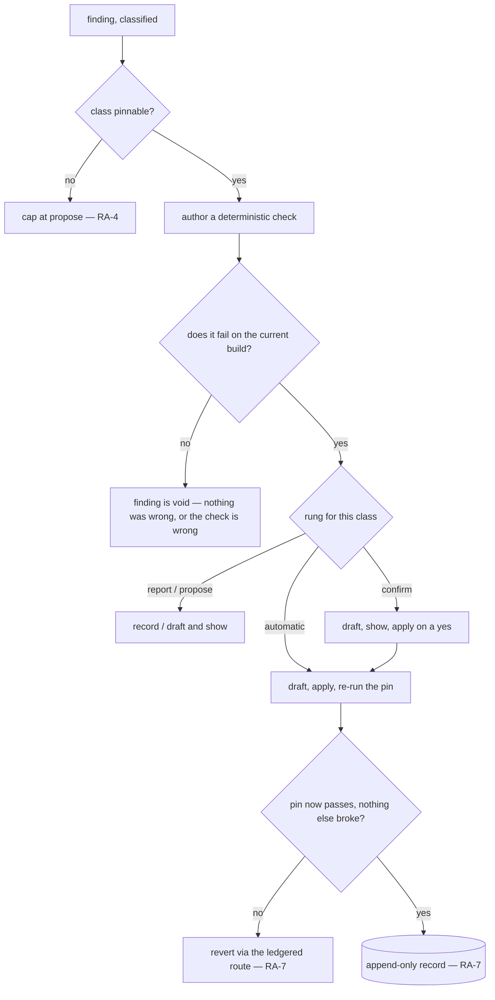

# Remedy Authority

**Version:** 1.0.0
**Status:** Stable
**Layer:** concept

## Overview

A finding is an observation. A remedy is a change. This spec governs the passage between
them: **given a finding of a known class, what is the system permitted to do about it on
its own authority, and what must it prove before doing it.**

The project already answers four adjacent questions and none of this one. Action gating
decides how much friction a single act deserves. Consent binding decides what a grant
covers and when it lapses. Loop governance decides what a loop may mutate between its own
iterations. The improvement loop decides whether a finding may *leave the device*. What
nothing decides is whether a finding may **change the product where it was found** — so
the decision gets made ad hoc, per subsystem, by whoever is writing that subsystem's
autonomy setting that week.

The contract has three moves. Authority is granted **per finding class**, never as one
blanket permission, because the classes differ in the one property that matters: whether
a remedy can be *verified*. A remedy for a class that can be pinned by a failing check is
applied only **after** that pin exists and fails — which converts the old blanket
prohibition on self-repair into a precondition, preserving the evidence it protected. And
the thing that judged the finding is **outside the reach** of the act that remedies it,
because an actor that can edit its own judge will.

## Related Specifications

- [l1-usage-simulation.md](l1-usage-simulation.md) — the instrument whose USM-12 this spec supersedes in kind: USM-12 kept the *run* from repairing, which remains true; this spec names who may repair afterwards and under what proof. USM-7's pinning requirement becomes RA-2's precondition, and USM-13's classification is the input RA-1 grants against.
- [l1-improvement-loop.md](l1-improvement-loop.md) — IMP-1 supplies the class taxonomy this spec grants against; IMP-3's off/confirm/automatic is the same ladder shape applied to *submission*. §5 of that spec explicitly deferred self-application of accepted changes as "a separate, future contract with its own authority model" — this is that contract.
- [l1-loop-governance.md](l1-loop-governance.md) — LG-3 criteria immutability is the spine RA-3 applies at the finding grain; LG-4 oracle ownership is why RA-8 refuses a remedy that authored its own check; LG-8's append-only mutation ledger is the record RA-7 requires.
- [l1-consent-binding.md](l1-consent-binding.md) — a standing rung is a grant and takes CB's identity and lifetime in full: CB-3 lapse-on-change, CB-10 auditable scope, and above all CB-11, which is why RA-9 forbids self-escalation.
- [l1-action-gating.md](l1-action-gating.md) — the sibling that decides an act's friction tier from its consequence; this decides whether a finding produces an act to be tiered at all.
- [l1-acceptance-oracle.md](l1-acceptance-oracle.md) — AO-1: criteria precede the work. The pin RA-2 demands is an acceptance criterion authored before its remedy, which is what keeps a remedy from being judged by a standard written to fit it.
- [l1-security.md](l1-security.md) — SEC-9/SEC-10: authority is human-rooted and never self-granted; a rung record lives on the human-write-only authority plane.
- [l1-development-workflow.md](l1-development-workflow.md) — DW-8's human checkpoints are the ceiling RA-6 stops beneath: a chain grant never reaches merge, push, or discard.
- [l1-scenario-derivation.md](l1-scenario-derivation.md) — SD-4: a scenario revised after implementation exists is a disclosed plan change. RA-3 is why a remedy may never be that revision.
- [l1-plan-rehearsal.md](l1-plan-rehearsal.md) — a rehearsal finding is a finding, and its remedy passes this contract like any other; PR-6 is the plan-grain restatement of "the instrument does not repair".
- [l1-whole-system-rehearsal.md](l1-whole-system-rehearsal.md) — the cadence that produces findings in volume, and therefore the surface where an over-granted rung does the most damage.

## 1. Motivation

**The blanket prohibition was right about the hazard and wrong about the remedy.** The
rule that a discovery instrument must not repair what it finds exists because a repairing
run destroys its own evidence: the defect is gone, the baseline is unknowable, and a
measurement has silently become an unreviewed change. That reasoning is sound and it
argues for a *precondition*, not a prohibition. Once the defect is pinned by a check that
fails on the current build, the evidence is no longer perishable — it is a durable,
independently-runnable artifact. Repair after pinning destroys nothing. Forbidding it
anyway costs a fix on every defect the system is perfectly capable of closing, and the
discipline that costs the most for the least is the discipline that gets switched off.

**The classes are not alike, and treating them alike is the actual error.** A defect
failed a stated contract, so a check can be written that fails now and passes later. A
friction finding, an inefficiency, an optimization opportunity, an improvement idea —
none of these failed anything. There is no check to write, so there is nothing for a
remedy to be verified against. An automatic change with no oracle is an unverifiable edit
dressed as a fix, and it is worse than no change at all because it looks like progress.
This is not a policy preference about caution; it is a structural property of the class,
and a contract that does not encode it will eventually be asked to auto-apply an idea.

**Self-granted authority is the failure that ends the whole arrangement.** An agent that
observes its own remedies succeeding has every local reason to conclude it should be
trusted with more. Recurrence looks like evidence. It is evidence — *for a human*. A
system in which the actor can widen its own reach has no authority model, only a
starting position, and the audit trail records each widening as legitimate.

**"Full trust" is a real mode and it needs a shape.** An owner who genuinely wants the
system to carry findings through to implementation without being asked is not making a
mistake, and refusing to specify that mode does not prevent it — it produces the same
behaviour built ad hoc, without a ceiling, a ledger, or a stopping point. Specified, it
is a bounded pass with a declared scope that halts before anything irreversible.

## 2. Constraints & Assumptions

- **A finding carries a class, or it is not eligible for anything above report.** The
  taxonomy is IMP-1's, not a second one invented here.
- **Verifiability, not severity, decides the ceiling.** A trivial defect is closer to
  automatic than a critical-sounding improvement idea, because one can be pinned and the
  other cannot.
- **Authority records are human-written.** The agent reads its rung; it never writes it.
- **The remedy path is local.** This contract governs changes to the product under work;
  submission of findings to anyone else remains IMP-3's question and is unaffected.
- **Reversal must be cheap.** Every rung above report assumes the change can be undone
  without reconstruction, or the rung is not available.
- **The contract is silent about correctness.** It says who may act and what they must
  prove first; whether the remedy is *good* is the reviewer's and the oracle's question.

## 3. Core Invariants

Rules every Layer 2 implementation MUST NOT violate:

- **RA-1 (Authority is granted per finding class, never globally):** the permission to act
  on a finding is recorded **per class** from the IMP-1 taxonomy (defect, friction,
  inefficiency, optimization opportunity, improvement idea). *"The agent may fix things"*
  is not a grant; it is a sentence. A class carrying no recorded authority sits at
  **report** (RA-10), and a grant over one class never implies a grant over any other.

- **RA-2 (Evidence is pinned before a remedy is applied, never after):** a remedy for a
  finding is applied only once the finding is pinned by a **deterministic check that fails
  against the current build** — the failing pin *is* the evidence, made durable. A remedy
  applied with no failing pin is **void and reverted**, because nothing afterwards can
  distinguish a defect that was fixed from a defect that was never real. This is the
  precondition form of the older prohibition on self-repair: the concern was perishable
  evidence, and a pin is evidence that does not perish.
  A finding whose subject **has not been built** — a defect in a plan, a decomposition, or
  any artifact that describes work rather than performs it — has no current build to fail
  against, so this precondition cannot be met and the finding is capped at **propose**
  outside a chain grant, exactly as RA-4 caps the classes that can pin nothing. Such a
  finding is resolved by the act that owns its subject: a plan defect is corrected by the
  planning act, which changes the plan and re-derives whatever depended on it. Treating an
  unbuilt subject as a merely *missing* pin would licence an automatic edit whose success
  nothing could report.

- **RA-3 (Whatever judged the finding is outside the remedy's reach):** the scenario,
  obligation, oracle, pin, or test that produced or pins a finding is **immutable to the
  act that remedies it** — LG-3's criteria-immutability spine applied at the finding
  grain. An actor permitted to edit the thing that judged it will edit the thing that
  judged it, and the result is indistinguishable from a fix. Where a scenario genuinely
  was wrong, correcting it is a **disclosed plan change** under SD-4, decided by the
  planning act that owns it, never by the act it just failed.

- **RA-4 (A class that can pin nothing never reaches automatic):** only a class whose
  findings can be pinned by a failing check (RA-2) is eligible for the **automatic** rung.
  The four non-defect classes name something that violated no stated contract, so no check
  can fail for them, so no remedy for them can be verified — and an unverifiable change
  applied without asking is not a fix but an unreviewed edit that reads as one. These
  classes are capped at **propose** (RA-5) outside a chain grant, and the cap is
  structural, not a severity judgement.

- **RA-5 (The ladder is a closed, ordered rung set):** authority takes exactly one of five
  values per class, each strictly containing the one below — **report** (record only),
  **propose** (a remedy is drafted and shown, never applied), **confirm** (drafted and
  applied on a per-instance human decision), **automatic** (drafted, verified against the
  pin, applied without asking), **chain** (RA-6). No sixth rung, no half-rung, and no
  per-instance improvisation above the recorded value: a rung is the ceiling for its
  class, and acting above it is a violation rather than a judgement call.

- **RA-6 (The chain grant authorizes bounded work, never standing power):** the top rung
  permits a finding set to be carried through planning, decomposition, and implementation
  in one pass — and binds four things: a **declared finding set** it covers, a **ceiling**
  (work, time, spend) enforced independently of the actor (LG-6), a **stop before anything
  irreversible** (DW-8 — never merge, push, release, or discard), and a **lapse** on any
  change to what it was granted over (CB-3). A chain grant is a bounded pass with a
  scope, not a change in what the system is.

- **RA-7 (Every applied remedy is reversible and ledgered):** each application appends an
  immutable record — the finding and its class, the rung that permitted it, the pin and
  its failing state, what changed, the verification result, and the route back. Prior
  states are never overwritten (LG-8). A remedy whose reversal route cannot be stated was
  not eligible for any rung above propose.

- **RA-8 (A remedy is never verified by a check it authored):** the check that declares a
  remedy successful is the pin that existed and failed **before** it (RA-2) — never one
  written, widened, or relaxed by the remedying act. Where actor and verifier share a
  lineage the outcome is recorded **reduced-confidence** (LG-4) rather than silently
  trusted, and a remedy that can only be verified by its own author does not advance past
  propose.

- **RA-9 (Authority never widens itself; escalation is a human act):** an actor may
  **request** a higher rung and may present its record as argument; it may never grant,
  extend, renew, infer, or re-scope one, for itself or for any process on its behalf
  (CB-11, SEC-9/SEC-10). Recurrence of a finding class is evidence **for a human** and is
  never itself an escalation trigger — a system that promotes itself on its own track
  record has no authority model, only a starting position.

- **RA-10 (Report is the floor, and silence is never consent):** absent a recorded grant —
  a missing setting, an unreadable record, a class the taxonomy gained after the grant was
  written, an ambiguous scope, or a finding **carrying no class at all**, which classification
  being optional makes an ordinary case rather than an error — the finding sits at **report**. Nothing is inferred from
  absence, from a neighbouring class's rung, or from a prior session's behaviour. A
  finding is always *recorded*: there is no rung below report, because suppressing the
  observation is a different decision belonging to whoever decided to run the instrument
  at all.

> L2 specs cannot reach RFC status until all invariants here are addressed in their
> "Invariant Compliance" section.

## 4. Detailed Design

### 4.1 The ladder (RA-5)

```text
[REFERENCE]
rung        what happens to the finding                        who decides each instance
────────────────────────────────────────────────────────────────────────────────────────
report      recorded, nothing drafted                          nobody — the floor (RA-10)
propose     a remedy is drafted and shown, not applied         nobody acts; a human reads
confirm     a remedy is drafted; applied on a per-instance yes a human, every time
automatic   drafted, pin-verified, applied silently            nobody — the grant stands
chain       findings carried plan -> tasks -> implementation   a human, once, per pass

eligibility ceiling by class (RA-4):
  defect                    -> chain        (pinnable, so verifiable at every rung)
  friction                  -> propose      (nothing failed, so nothing can verify a fix)
  inefficiency              -> propose
  optimization opportunity  -> propose
  improvement idea          -> propose

  the four capped classes reach implementation only inside a chain grant (RA-6),
  where a human has named the finding set and a plan supplies the missing oracle.

the same cap, reached by a different route (RA-2):
  any finding whose SUBJECT IS NOT BUILT  -> propose
  a plan, a decomposition, a design — an artifact that describes work rather
  than performs it — offers no current build for a pin to fail against, so the
  precondition is unmeetable rather than merely unmet. resolution belongs to the
  act that owns the subject: a plan defect is fixed by the planning act.
```

The asymmetry in the table is the whole design. It is tempting to read it as caution
about ideas and confidence about bugs; it is neither. It is a statement about what can be
checked. A defect comes with a contract it violated, and a violated contract can be
written down as a check that fails. The other four arrive with nothing that failed, and a
change made against nothing that failed has no way to report whether it worked.

### 4.2 The pin as precondition (RA-2)



The `no` branch out of the failure check is the one that earns its place. A pin that does
not fail means one of two things — the finding was not real, or the check does not
actually express it — and both are information. Applying a remedy anyway would produce a
green check that was green before anything changed, which is the exact shape of a fix that
fixed nothing.

### 4.3 Why the criteria stay out of reach (RA-3)

The finding arrives because something judged the work and the work fell short. That judge
— a scenario obligation, a pinned check, an acceptance criterion — is the only reason the
finding exists. Hand the remedying actor write access to it and the cheapest available
remedy is always the same one: adjust the judge. It requires less reasoning than the fix,
it always succeeds, and it is invisible in a summary that reports only that the finding
closed.

This is loop governance's criteria-drift failure arriving through a different door, so it
takes the same structural answer rather than a new one. The judge is not in the mutable
set. Where the judge really was wrong — and it sometimes is — that is a plan change, made
by the planning act, disclosed as a revision, and confirmed by a human who can see that
the standard moved.

### 4.4 The chain grant (RA-6)

```text
[REFERENCE]
ChainGrant {
  findings:   an enumerated set, fixed at grant time — not "findings of class X"
  ceiling:    work / time / spend, enforced by the runner, not the actor  (LG-6)
  stops_at:   the last reversible step — never merge, push, release, discard  (DW-8)
  lapses_on:  any change to the finding set, the product baseline, or the scope  (CB-3)
  ledger:     every step appended, every change reversible  (RA-7)
}
```

Two properties keep this from becoming a standing power. The finding set is **enumerated**
rather than described: a grant over "the defects found this week" is a grant over whatever
next week produces, which is the category-grant failure consent binding already rejects.
And it **stops while everything is still reversible** — the pass ends with work a human
can read and discard in one action, which is what makes granting it a smaller decision
than it sounds.

### 4.5 Demarcation

| Neighbour | It owns | This spec owns |
| --- | --- | --- |
| l1-action-gating | how much friction one act deserves | whether a finding yields an act at all |
| l1-consent-binding | what a grant covers, when it lapses | what a grant *over a finding class* means |
| l1-loop-governance | what a loop may mutate between iterations | what a finding may authorize outside any loop |
| l1-improvement-loop (IMP-3) | whether a finding leaves the device | whether a finding changes the product here |
| l1-usage-simulation (USM-12) | that the *run* does not repair | who repairs afterwards, and on what proof |
| l1-acceptance-oracle | whether the criterion is worth obeying | that the criterion existed *before* the remedy |

The six compose in one direction and each is silent about the others' questions. The pair
most easily conflated is the fourth and fifth row: telling the maintainers about a
finding and changing the product because of it are different acts with different blast
radii, and a single "autonomy" setting covering both is a setting nobody can reason about.

## 5. Drawbacks & Alternatives

- **The pin requirement makes cheap fixes less cheap.** A one-character defect now costs a
  check as well. Accepted, and it is the trade the whole contract is built on: the check
  is what makes the fix re-verifiable by anyone later, and a defect worth fixing silently
  is a defect worth rediscovering.
- **Capping four classes at propose will feel over-cautious.** Some friction findings have
  obvious, safe remedies. The cap still holds, because "obvious" is a judgement made by
  the actor proposing it, and RA-4's line is drawn where verification is possible rather
  than where confidence is high. The chain grant (RA-6) is the named route for exactly
  these cases.
- **Alternative — one global autonomy setting.** Rejected (RA-1): it necessarily takes the
  value the most dangerous class deserves, which means the safest class never gets acted
  on, or it takes the value the safest class deserves and the most dangerous one is
  applied unverified. There is no single value that is right for both ends.
- **Alternative — keep the blanket prohibition on self-repair.** Rejected: it protects
  perishable evidence with a rule that stays in force after the evidence has been made
  durable, and it is enforced nowhere at the moment the fix actually happens — the defect
  gets fixed in the next task with nothing pinned, which is the worse outcome dressed as
  the disciplined one.
- **Alternative — let recurrence auto-escalate a class's rung.** Rejected (RA-9): it is
  precisely the mechanism by which a system grants itself authority, and it is most
  persuasive exactly when the actor has been performing well, which is when the argument
  is least examinable.
- **Reversibility is assumed, not proven.** RA-7 requires a stated reversal route and
  cannot guarantee the route works in every environment. <!-- TBD: whether a rung above confirm should require a demonstrated revert on a throwaway copy before its first real application -->

## Canonical References

| Alias | Path | Purpose |
| --- | --- | --- |
| `[TAXONOMY]` | `.design/main/specifications/l1-improvement-loop.md` | IMP-1's five classes this spec grants against; §5's deferred self-application contract. |
| `[LOOP]` | `.design/main/specifications/l1-loop-governance.md` | LG-3 criteria immutability, LG-4 oracle ownership, LG-6 independent ceiling, LG-8 ledger. |
| `[CONSENT]` | `.design/main/specifications/l1-consent-binding.md` | CB-3 lapse, CB-10 auditability, CB-11 non-self-widening — the grant semantics a rung inherits. |
| `[INSTRUMENT]` | `.design/main/specifications/l1-usage-simulation.md` | USM-7 pinning (RA-2's precondition) and USM-12, whose prohibition this converts. |
| `[ORACLE]` | `.design/main/specifications/l1-acceptance-oracle.md` | AO-1 criteria-precede-work, which the pin makes structural for remedies. |

## Document History

| Version | Date | Author | Notes |
| --- | --- | --- | --- |
| 1.0.0 | 2026-09-13 | Core Team | Initial spec — the unclaimed passage from a finding to a change, and the contract `l1-improvement-loop` §5 deferred as "a separate, future contract with its own authority model". Authority is recorded per IMP-1 class and never globally (RA-1); a remedy is applied only after the finding is pinned by a check that fails on the current build, converting the older blanket self-repair prohibition into a precondition because a pin is evidence that does not perish (RA-2); whatever judged the finding is immutable to the act remedying it, LG-3's spine at the finding grain, with a genuinely wrong scenario corrected as a disclosed plan change under SD-4 (RA-3); a class that can pin nothing never reaches automatic, since the four non-defect classes violated no contract and therefore no check can fail for them (RA-4); the ladder is a closed ordered rung set report/propose/confirm/automatic/chain (RA-5); the chain grant authorizes an enumerated finding set under an independently-enforced ceiling, stopping before anything irreversible and lapsing on change (RA-6); every applied remedy is reversible and ledgered append-only (RA-7); a remedy is never verified by a check it authored, with shared lineage recorded reduced-confidence (RA-8); authority never widens itself and recurrence is evidence for a human, never an escalation trigger (RA-9); report is the floor and silence is never consent (RA-10). Post-Update Review (Spec Council, 5 lenses) found and fixed two defects in the draft before promotion. **Safety & Boundary:** RA-2's "fails against the current build" was silently **unmeetable** for a finding whose subject has not been built — a plan or decomposition defect, which `l1-plan-rehearsal` produces by design — turning an intended precondition into an accidental dead end that a reader would resolve by ignoring it. Corrected: an unbuilt subject caps the finding at *propose* by the same logic RA-4 uses for the unpinnable classes, and its resolution belongs to the act that owns the subject. **Zero-Context Usability:** RA-10 enumerated four ways a grant can be absent and omitted the most ordinary one — a finding carrying **no class at all**, which USM-13 makes optional and therefore common; added explicitly rather than left to inference from §2. `[DR]` Promoted `Draft → Stable` in the authoring pass under Trust Mode: MVC satisfied, no RULES conflict, no hard-dependency cycle, and the Council pass was genuinely adversarial — it changed two invariants. The amendment rule's separate-re-review discipline governs a *Stable spec receiving new requirements*, which this is not. |
